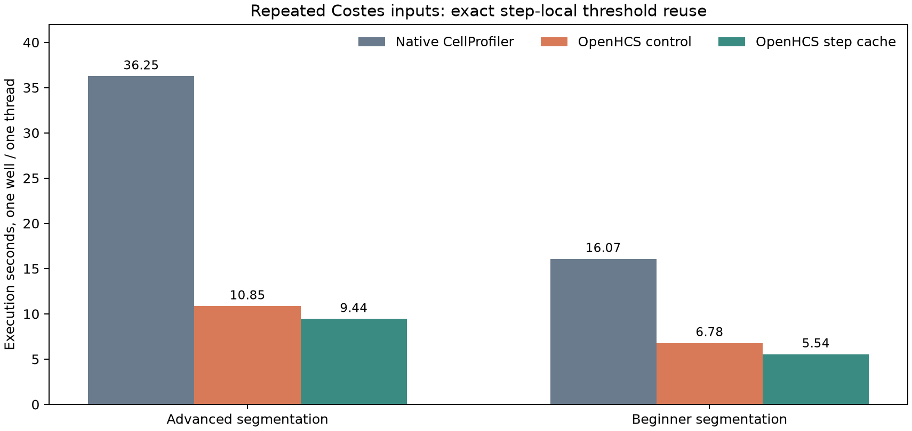
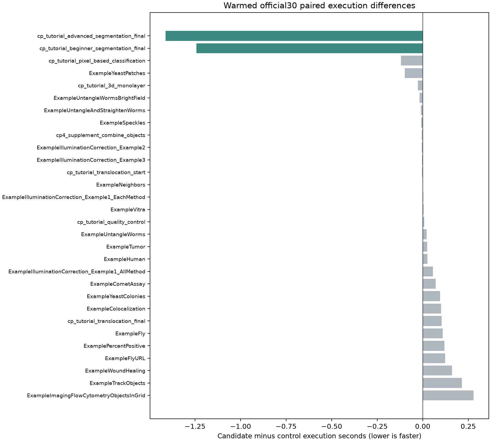

# Step-scoped Costes threshold reuse: official30 1w_1t (2026-09-29)

This report accompanies [issue #185](https://github.com/OpenHCSDev/openhcs/issues/185). It compares the same CPU-only integration code with and without a step-scoped Costes threshold cache. The control is commit `30e1e905c`, including the faster completion polling from [PR #183](https://github.com/OpenHCSDev/openhcs/pull/183). Each benchmark observation owns a fresh ZMQ execution server and uses one well and one OpenHCS thread with the `fork` start method. `total_seconds` includes server startup, compilation, execution, and shutdown; `execute_seconds` is the server execution job and can include first-use JIT work. The native CellProfiler 4.2.8.1 reference is retained in the [native summary](../perf_lazy_catalog_20260929/native_cp_summary.csv).

An instrumentation-only probe on the two segmentation tutorials found **180 object-colocalization calls but only 40 distinct selected image-pair pixel inputs**: 20 pairs repeated five times and 20 repeated four times across object sets. The image payloads are reconstructed between sets, so object identity cannot establish reuse. The candidate fingerprints the exact selected pixels and keeps method, scale, and backend selection in its key. The cache lives only for one FunctionStep invocation.

An interleaved control/candidate/candidate/control experiment measured the two affected pipelines. The first control had a cold compilation run and is retained as raw data but excluded from the warmed comparison. The later control and the mean of both candidates give:

| Pipeline | Control execution (s) | Candidate execution (s) | Execution saved (s) | Control total (s) | Candidate total (s) |
| --- | ---: | ---: | ---: | ---: | ---: |
| Advanced segmentation | 10.815 | 9.384 | 1.431 | 18.642 | 17.286 |
| Beginner segmentation | 6.778 | 5.607 | 1.171 | 13.362 | 12.060 |
| **Both** | **17.593** | **14.991** | **2.602** | **32.004** | **29.347** |

All 15 produced result files in both candidate runs matched the control byte-for-byte. A separate instrumented run confirmed the mechanism: `coloc_object_costes_thresholds` fell from **3.999 to 1.400 seconds** over 180 calls, and `coloc_object_total` fell from **5.217 to 2.620 seconds**. These are phase sums from separate profiled runs, not additional time to subtract from the benchmark.



The full official30 sweeps showed material run-order variation, including in cases this cache cannot affect. All 30 cases succeeded in every sweep; the two warmed sweeps produced the same 110 result paths with byte-identical contents.

| Sweep order | Compile sum (s) | Execution sum (s) | Total sum (s) |
| --- | ---: | ---: | ---: |
| First candidate | 84.079 | 97.248 | 270.468 |
| First control, cold checkout | 99.153 | 100.178 | 288.514 |
| Warmed control | 83.701 | 89.286 | 261.691 |
| Warmed candidate | 84.095 | 87.857 | 260.928 |

The warmed candidate saved **1.429 seconds in summed execution** and **0.763 seconds in summed total** against the immediately preceding warmed control. The two affected tutorials saved 2.654 seconds in that full-suite comparison; unrelated cases varied in the other direction. The pair-specific improvement and its profiled mechanism are reproducible. The small full-suite net difference is not a stable estimate of a global speedup. It is also much smaller than the remaining end-to-end startup and compilation terms, so this cache is a targeted improvement, not the dominant route to faster official30 total time.



The warmed full-sweep native execution ratios for the affected tutorials are 3.34× to 3.84× for advanced segmentation and 2.37× to 2.90× for beginner segmentation. These use the saved native execution reference and OpenHCS's `execute_seconds`; they do not include either system's total startup boundary.

The retained CSVs are `abba_*.csv`, `full_first_*.csv`, and `full_warm_*.csv`. `plot.py` regenerates both figures. Raw result trees and profiling events are under `/home/ts/code/projects/openhcs-benchmark-runs/perf-coloc-step-cache-*20260929`. Validation also included 624 focused unit tests and byte parity in the full sweep. The separate [batch executor metadata issue #176](https://github.com/OpenHCSDev/openhcs/issues/176) remains open; this cache does not restore those declarations.

Reproduce the fresh-server sweep with the native reference:

```bash
OPENHCS_CPU_ONLY=true .venv/bin/python scripts/benchmark_cppipe_well_throughput.py \
  --manifest benchmark/manifests/official30_portable_axis1.json \
  --output-dir /path/to/output \
  --native-summary-csv benchmark/results/perf_lazy_catalog_20260929/native_cp_summary.csv \
  --mode 1w_1t
```
