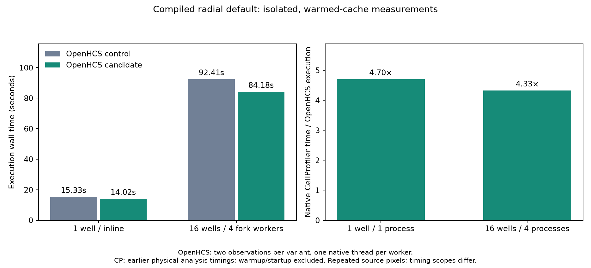

# Compiled radial reductions through the existing backend family

Issue [#258](https://github.com/OpenHCSDev/openhcs/issues/258). The existing Numba radial backend becomes the NumPy default, its batch geometry-index loop is compiled, and both accelerated accumulation paths use one normalization method on that backend. Request construction and array validation share the existing request owner. Explicit native selection remains available as the independent sparse/masked-array reference.

A production probe measured 1.252s in native radial reductions per ImagingFlow well. Six actual 1650×1650 FP32 requests replay 10–20× faster through the existing accelerated path, making about one second of whole-pipeline improvement plausible. This route follows the dominant measured cost; the faster dense-center prototype was deferred because its entire measured ceiling was only 0.517s per well.

Before promotion, broader dtype checks exposed integer fractions truncated into integer zeros and duplicate normalization implementations. The final shared normalizer emits real-valued fractions, preserves native histogram dtype/sum behavior, uses centered two-pass wedge variance, and fills undefined CV values with zero. Old private reducer names and the duplicate scalar CV helper are removed. The existing preparation declaration reaches index, accumulation and normalization kernels through its public scalar/batch consumers for FP32 and FP64; no separate kernel roster or cache registry is added. See [the ownership decision](architecture.md) and source-checked [recipes](recipes).

## Isolated ordinary-run measurements

Common revision 32d070c26, candidate production commit fad480831, current shared environment/dependencies, Python 3.12.14 / NumPy 2.5.3 / Numba 0.67.0, ZMQRuntime 0f9e840a9. The control substitutes only this module's original 32d070c26 source; the candidate uses the final proposed module. ImagingFlow pipeline, two image sets per synthetic well, one native thread per worker. One well executes inline; 16 wells use four fork workers. No AST scans, tests, other benchmarks, runtime profiling or compilation work overlap timed benchmark subprocesses. Existing user/background processes remain running.

Each mode uses control, candidate, candidate, control order, two observations per variant. Source edits invalidate module cache stamps, so public radial-family preparation precedes each fresh-server timed invocation. Preparation costs are separate: about 4.17s for controls, 6.67s for the one-well candidate and 6.83–7.58s for 16-well candidates, including Python invocation and the source-invalidated compilation of both floating signatures. These are warmed-cache timings, not a first-ever cold-install or full-prewarming total.

| Mode | Metric | Control median | Candidate median | Reduction |
| --- | --- | ---: | ---: | ---: |
| 1 well / inline | Execution | 15.328s | 14.018s | 1.310s / 8.55% |
| 1 well / inline | Total | 21.381s | 20.051s | 1.329s / 6.22% |
| 1 well / inline | Compile | 3.175s | 3.175s | approximately unchanged |
| 16 wells / four fork workers | Execution | 92.409s | 84.176s | 8.233s / 8.91% |
| 16 wells / four fork workers | Total | 105.650s | 97.445s | 8.205s / 7.77% |
| 16 wells / four fork workers | Compile | 10.149s | 10.219s | 0.069s increase |

Actual one-well execution observations: controls 15.072/15.585s, candidates 13.981/14.055s. Sixteen-well controls 95.143/89.675s, candidates 83.490/84.862s. Two observations are a small sample, not a confidence interval. Absolute historical one-well times on this host differed; only contemporaneous paired gains are attributed to this experiment.

Radial-step medians fall from 3.572 to 2.274s at one well and from 47.729 to 20.873s summed across 16 wells/workers. Other processing excluding radial/export is 9.860→9.873s at one well and 202.578→198.952s aggregated at 16 wells. Export stays 1.455→1.458s and 24.286→24.262s respectively. Parallel step sums cannot be added directly to wall time. Some non-target variation remains, so the entire 16-well wall gain is not assigned to the radial algorithm alone. The prior audit-contaminated “other” rise is documented separately in [the isolated investigation](../perf_scaling_rise_investigation_20260929/README.md).

Every timed run records zero new/modified radial cache files. A separate physical spawn test populates the final source cache, then starts two new interpreters. Both load geometry-index and both FP32/FP64 normalization signatures with zero compiled-data saves; public family preparation takes 0.238/0.242s, joint process startup/preparation 1.961s. Integer dtype signatures are correctness-tested but not included in the declared floating preparation fixture. This establishes final floating-kernel disk reuse across spawn, not universal zero-cost Python startup.

## Correctness and scaling

782 local tests pass: 180 focused processing/preparation/intensity-distribution tests plus 602 module-execution, conditional-image and runtime-equivalence consumer tests. Coverage includes uint8/uint16/int16/FP32/FP64, scaled and overflow bins, missing object rows, zero/constant/near-constant/signed/nonfinite input, noncontiguous images, malformed geometry and every batched image. No discrete/identity tolerance changes. The user explicitly authorized the existing CP rtol=atol=1e-6 for floating comparisons.

All seven saved requests pass; one is the small preparation fixture and six are production inputs. Production fractions and mean fractions match the native reference exactly; radial-CV differences are at most 2.220446049250313e-16. All discrete outputs and input array digests match. Ordinary full exports contain 1,801/28,801 parsed rows including headers, with header, ordering, dimensions and nonnumeric cells exact. Each paired one-well export has 5,624 nonidentical numeric cells, and each 16-well export 89,984, all bounded by 2.220446049250313e-16. These are full-export checks, not selected-column samples. All 12 original source TIFF digest entries are rechecked unchanged. Shared-environment `pip check` reports no broken requirements.



The updated figure combines these fresh OpenHCS measurements with the already completed physical native CP measurements: 65.924s at one well and 364.230s at 16 wells. Ratios are 4.70× and 4.33×. Native is CP 4.2.8.1 / Python 3.9.25 / JDK 11, one/four processes and one native thread per worker. This change does not rerun native CP. Native scope excludes Python/Java startup, full-batch warmup and final shutdown. OpenHCS execution includes result transport and plate export; total includes fresh server/compile/lifecycle, while source staging and explicit kernel warming precede total. The recovered original 16-well native controller return code remains unobserved; original workers reported Complete and correct image counts. See [native provenance and timing limitations](../perf_fused_haralick_scaling_20260929/README.md). Repeated source pixels can benefit caches and do not establish distinct-biological-image scaling.

## Retained evidence and reproduction

`observations_*.jsonl`, `scope_*.json`, `runs/`, cache logs, export parity, request replays, input digests, test logs and census summary retain the actual gates. Full multi-megabyte exports and large captured arrays remain under the recorded external benchmark output paths; their comparisons are reproducible there. The NRA census retains 5,075 original classes, 5,063 projected and 12 OPEN rows before/after, with no new authority. Exact patch recipes are authored source/syntax checks, not semantic or all-detector proofs.

Regenerate analysis and figures without running benchmarks:

```sh
python benchmark/results/perf_compiled_radial_20260929/analyze.py
MPLBACKEND=Agg python benchmark/results/perf_compiled_radial_20260929/plot.py
```

Use the shared environment and prepared production cache, check out the recorded candidate, and run the paired driver with a new output directory. It checks the candidate source digest before substitution, uses the recorded immutable control, retains warming separately and restores source in `finally`:

```sh
NUMBA_CACHE_DIR=/tmp/openhcs-registry-kernel-prewarm-production-20260929-c2 \
python benchmark/results/perf_compiled_radial_20260929/run_pairs.py \
  --wells 1 --output-dir /tmp/radial-pairs-new-1w
```

Run 16 wells separately with `--wells 16`; never overlap timed runs with tests, scans or other compilation/benchmark work. `check_export_parity.py` accepts `--control`, `--candidate`, `--output`; `replay_saved_requests.py` accepts `--input-dir`, `--output`. The local source corpus and prepared dependencies must exist. The three NRA recipes require their original intermediate states, in order with formatting between stages; they are not intended to apply to an already migrated module.
