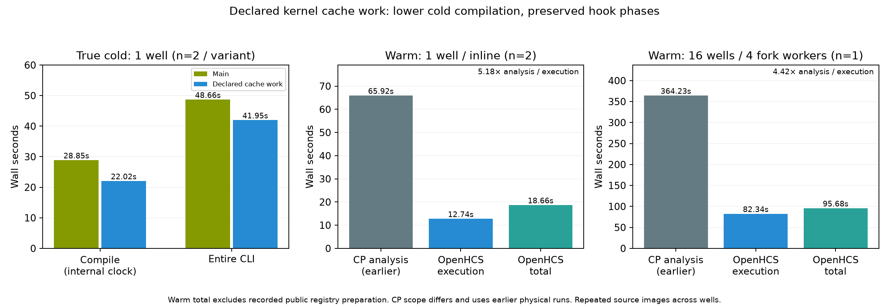

# Declared CellProfiler kernels in the existing cache batch

Fixes [#281](https://github.com/OpenHCSDev/openhcs/issues/281); advances [#162](https://github.com/OpenHCSDev/openhcs/issues/162). Four callable warmups previously compiled their kernels serially in the parent after the parallel registry batch. Declaring their mathematical work through the existing compiler family lets that same batch populate their persistent caches. Compilation averages **28.852 → 22.023s**, saving **6.829s (23.7%)**. Entire CLI wall time averages **48.662 → 41.953s**, saving **6.709s (13.8%)**. Cold compilation remains far above the requested few seconds; this does not complete the performance goal.

## Actual source and workload

Control: current main `65b2ed1017f36db193b6f48b8f9b46495cc915aa`. Candidate: `100f40c69ce1d2a957935d05856ecab8fdfb60b8`, a normal merge of that main into the implementation branch. Both use main's arraybridge `409b1e083`, ZMQRuntime `0f9e840a9` and the same remaining six recorded gitlinks. All eight pins, interpreter/package versions, installed wheel hash and actual module paths are in [the installed provenance](validation/perf-declared-kernel-integrated-installed-provenance-20260930.json). Python 3.12.14, NumPy 2.5.3, SciPy 1.18.1, Numba 0.67.0; the shared dependency installation and `pip check` pass. Benchmark source imports resolve to the performance checkout; wheel acceptance imports all eight changed modules from the installed target, with matching hashes.

The production diagnostic and architecture investigation started on main `4a9c9b3e1`. They measured 12.75s of parallel cache preparation followed by 13.83s of outer dispatcher work in parent hooks. A bounded external prototype established a roughly seven-second end-to-end payoff before the production abstraction was implemented. Those diagnostic events include nested calls and cannot be summed as disjoint phases. The final results below are fresh observations after integrating the newer main and its dependencies, rather than relabelled prototype measurements.

The ordinary benchmark is `ExampleImagingFlowCytometryObjectsInGrid` from `official30_portable_axis1.json`. One well runs inline with one native thread. Sixteen wells use four fork workers with one native thread each. Each observation starts a fresh server. No AST audits, tests, builds, other benchmarks or runtime profilers overlap timing, including outside preparation. Existing user/background processes remain running. Source variants change only the eight recorded Python files; common upstream code and dependencies stay fixed.

## Before and after

| Scope | Main compile | Candidate compile | Main execution | Candidate execution | Main ordinary total | Candidate ordinary total |
| --- | ---: | ---: | ---: | ---: | ---: | ---: |
| Initially empty cache, 1 well, n=2 each | 28.852s | 22.023s | 12.594s | 12.870s | 44.345s | 37.638s |
| Warm cache, 1 well, n=2 each | 3.232s | 3.196s | 12.822s | 12.736s | 18.862s | 18.664s |
| Warm cache, 16 wells, n=1 each | 10.213s | 10.255s | 86.006s | 82.336s | 99.244s | 95.679s |

Cold and warm one-well comparisons use control/candidate/candidate/control order. Every cold observation owns a separate initially absent `NUMBA_CACHE_DIR`, with no outside preparation. Cold compile observations are 28.931/28.773s for main and 21.952/22.094s for the candidate. Whole CLI observations are 48.837/48.488s and 41.629/42.278s respectively. The internal ordinary total excludes some CLI imports/conversion/catalog work; the whole CLI clock includes them.

Warm observations perform full public `RegistryService.prepare_in_current_process()` before each timed invocation. This preparation is recorded separately and excluded from ordinary total and CLI timing. Its first control costs 40.325s on the initially empty warm-cache directory; subsequent preparation costs approximately 16.94–17.09s. These unlike cache states are not a preparation speedup comparison. Every warm observation records zero new or modified Numba cache indexes. Warm execution improvements are **not attributed to this patch**: two one-well repetitions and one sixteen-well pair are small samples, and the change moves compilation rather than numerical execution. The sixteen-well compile clock still includes pipeline preparation beyond kernel generation.

Independent installed-wheel acceptance runs the actual public benchmark from `/tmp`, with an initially absent cache and no outside preparation: **22.029s compile, 13.137s execution, 37.931s ordinary total, 42.929s CLI**, exit zero. [The exact command and scope](installed_scope.json) and [ordinary receipt](installed_throughput.csv) are retained.

## Correctness and ownership gates

All **11 complete CSV exports** (four cold, four warm one-well, two warm sixteen-well and installed acceptance) are byte-identical within well-count scope. Parsed counts are 1,801 and 28,801 rows. One-well SHA256: `517057a4b018195cc4c57e8503be63a378a8306eb2ecc303d4a025b6eab6dd1c`; sixteen-well: `da017d79eaeeae997ee5e385cb8aafae08a40a8d907eb7d3c77640c64537d566`. The twelve original TIFF digests are rechecked in [input_digest_checks.json](input_digest_checks.json). Existing CellProfiler tolerances remain `rtol=atol=1e-6`; this cache-only change needs no tolerance to pass those exports.

**925 tests pass, 11 existing warnings, 31.90s**, on source `100f40c69`: declared kernel preparation, processing preparation, fork compiler preparation, existing CellProfiler kernel/module/backend/library behavior, runtime equivalence, experimental analysis engine, and the newly merged memory diagnostic/durable decorated history consumers. The new regressions cover real fork children with the parent's readiness lock held, child cache effects without parent readiness, retry after failure, CPU admission before lazy provider discovery, fixture capture mode, late module capture effects on the real shape hook, and two new declarations discovered without scheduler/target-list edits. Original early candidates fail the held-lock and capture-order counterexamples; those failures are retained separately from the final passing gate.

The packaged R0 ratchet passes for all eight changed production paths; scripts and benchmark have no changed Python paths. R1 records **no increase**: the pre-existing `CallableContract` redundant-type finding and shape record-shape finding each remain at one. This is scoped evidence, not a global zero-debt claim. Full ratchet receipts and the two global original-class census receipts are compressed in `validation/`. The integrated census covers 700/701 modules and 5,089/5,095 original classes; both retain 12 explicitly unprojected OPEN classes. NRA source/syntax transaction diffs record the chosen moves and their bindings; they do not prove arbitrary global semantic equivalence. Numerical, effects, physical fork lifecycle, installed consumers and runtime are separate gates.

Actual consumer command, with `PYTHONPATH` set to the performance checkout and `OPENHCS_CPU_ONLY=true`, `QT_QPA_PLATFORM=offscreen`:

```sh
/home/ts/code/projects/openhcs/.venv/bin/python -m pytest -q \
  tests/unit/test_cellprofiler_callable_kernel_preparation.py \
  tests/unit/test_processing_preparation.py \
  tests/unit/test_fork_compiler_preparation.py \
  tests/unit/test_cellprofiler_kernel_preparation.py \
  tests/unit/test_cellprofiler_module_execution.py \
  tests/unit/test_cellprofiler_processing_backend.py \
  tests/unit/test_cellprofiler_library_loading.py \
  tests/unit/test_runtime_equivalence.py \
  tests/unit/test_experimental_analysis_engine.py \
  tests/unit/test_mcp_memory_diagnostic.py \
  tests/unit/pyqt_gui/test_durable_decorated_history.py
```

R0 uses packaged ratchet revision `3b03785f45df2ef5dc62ba6aed99294192ecbb01`, Python 3.14, `--base 65b2ed101 --head 100f40c69`, roots `openhcs`, `scripts`, `benchmark`. R1 uses NRA revision `0844525ec`, `python -m scripts.check_refactor_r1 --base 65b2ed101 --head 100f40c69 --budget-seconds 160`. Actual logs and full receipts are adjacent in `validation/`. Source/test `git diff --check` passes. No hosted CI result is claimed.

## Maintenance closure and numerical scaling

172 old source lines are replaced/deleted in the scoped implementation diff. The four mathematical warmup bodies now belong to concrete declarations; their private standalone hooks are removed. The two existing exported preparation functions consume those declarations. CPU/cache admission has one shared mixin; module discovery derives concrete physical cache operations through the existing family contract. Children call those operations directly, avoiding inherited readiness locks; parent readiness remains parent-owned. Generic callable hooks retain their original effect/completion phase, including capture enabled by a module hook. Side-effectful fixture capture defers these operations to the ordinary hooks.

No new scheduler, callable allowlist, metadata flag, duplicate registry authority, fallback import or persisted format is introduced. Numerical code, processing names, pipelines, user configuration and result formats remain intact. Applicable NRA cookbook patterns are §2 (ABC/shared algorithm), §3 (declaration-derived registration) and §4 (meaningful multiple inheritance). [The architecture decision](architecture.md) includes alternatives and the new-case maintenance experiment.



The native comparison reuses the **earlier physical CP 4.2.8.1 / Python 3.9.25 / JDK11 runs**, not a new native rerun for this compilation-only patch: 65.924s analysis at one well and 364.230s at sixteen wells, one/four processes and one native thread each. Native analysis includes CSV close but excludes startup/full warmup/shutdown; OpenHCS execution includes result transport and plate export, ordinary total includes fresh-server compilation/lifecycle. These clocks differ. Ratios of those native analysis clocks to current warm OpenHCS execution are 5.18× and 4.42×, descriptive rather than matched-scope speedup claims. The original sixteen-well native controller exit remains unobserved despite recovered completed worker reports. Native provenance is retained in [the earlier report](../perf_fused_haralick_scaling_20260929/README.md). Repeated source pixels across wells do not establish biological scaling for distinct images.

## Reproduction and evidence

`analysis.json` derives from the retained observations, scope/source hashes, ordinary receipts, steps and lanes in `runs/`. Cold/warm `*_scope.json` binds the exact control/candidate sources and changed-file digests. Full original exports remain at the observation output paths; their hashes and equality checks are retained in the analysis. Use a new output and explicit cache directory for each independent cold observation. The actual ordinary invocation is:

```sh
OPENHCS_CPU_ONLY=true NUMBA_CACHE_DIR=/tmp/new-empty-cache \
  /home/ts/code/projects/openhcs/.venv/bin/python \
  scripts/benchmark_cppipe_well_throughput.py \
  --manifest benchmark/manifests/official30_portable_axis1.json \
  --output-dir /tmp/new-observation --mode 1w_1t \
  --case ExampleImagingFlowCytometryObjectsInGrid
```

Set `PYTHONPATH` to the intended source checkout or installed target and invoke from `/tmp` with absolute script/manifest paths, as in the recorded scopes. Use `--mode 16w_4c` for the sixteen-well acceptance. To reproduce warm observations, time full public registry preparation separately before the ordinary invocation. Complete every timed process before running analysis, tests, installation, compilation or audits. Retain unfavorable/failed observations with their actual source and scope rather than removing them from the record.
