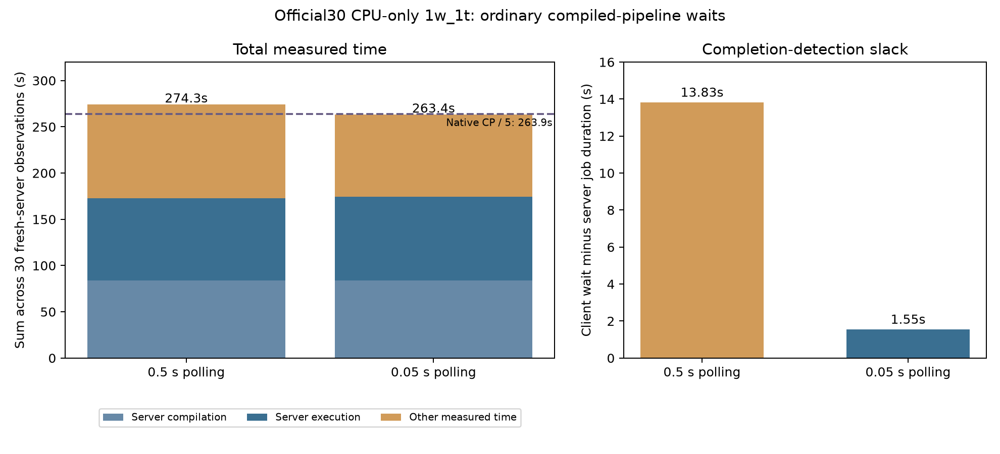

# Compiled-pipeline completion polling: official30 1w_1t (2026-09-29)

This report accompanies [OpenHCS issue #182](https://github.com/OpenHCSDev/openhcs/issues/182). It compares the [lazy-catalog fresh-server run](../perf_lazy_catalog_20260929/README.md) with the same CPU-only integration checkout and a 0.05-second polling interval for the two ordinary compile/execute completion waits. The control uses the inherited 0.5-second interval. Each observation starts and stops its own ZMQ server; `total_seconds` includes that lifecycle. The 1w_1t mode uses one well and one OpenHCS thread.

All 30 cases succeeded. Twenty-six had a lower total, with a paired median saving of 0.354 seconds. All 110 files under the produced `results` directories were byte-identical to the control.

| Sum over 30 observations (seconds) | 0.5-second control | 0.05-second candidate | Difference |
| --- | ---: | ---: | ---: |
| Server compilation jobs | 83.759 | 83.733 | -0.026 |
| Server execution jobs | 89.219 | 90.693 | +1.474 |
| Other measured time (`total - compile - execute`) | 101.289 | 88.948 | -12.341 |
| Per-observation total | 274.266 | 263.374 | **-10.892** |
| Client wait minus server-job time, from retained receipts | 13.827 | 1.554 | **-12.273** |

The remaining `total_seconds` gain is consistent with faster detection of completed jobs. The +1.474-second server-execution difference could be workload variation or extra status-request contention, so it is reported separately and is not an execution-only gain. The full CLI wall time was 296.684 seconds for the control and 285.686 seconds for the candidate; this includes source preparation outside per-observation timers. The native CP total-phase reference sums to 1,319.357 seconds, and its 5× line is 263.871 seconds. The candidate per-observation sum is 0.497 seconds below that line. CP and OpenHCS total timers have different preparation boundaries, so this is an indicative reference, not a directly equivalent ratio.



The `wait_breakdown.csv` derives each case's `WAIT_OPENHCS` and server-job durations from its retained measured-run receipt. `plot.py` regenerates the figure from that CSV, the candidate CSV, and the existing control and native summary. The raw candidate run is in `/home/ts/code/projects/openhcs-benchmark-runs/perf-fast-poll-full-20260929`; the prior control run is in `/home/ts/code/projects/openhcs-benchmark-runs/perf-lazy-catalog-full-20260929`.

Validation: 80 focused unit and integration tests passed on the patched path. The measured run used the ordinary ZMQ outcome and progress evidence path. The experiment changes only completion polling latency; it does not claim a faster pipeline execution algorithm. An event-driven completion signal in `zmqruntime` could remove residual wait slack and status requests, but the measured remaining direct payoff is only about 1.55 seconds across official30.

Fresh benchmark command:

```bash
OPENHCS_CPU_ONLY=true .venv/bin/python scripts/benchmark_cppipe_well_throughput.py \
  --manifest benchmark/manifests/official30_portable_axis1.json \
  --output-dir /path/to/output \
  --native-summary-csv benchmark/results/perf_lazy_catalog_20260929/native_cp_summary.csv \
  --mode 1w_1t
```
