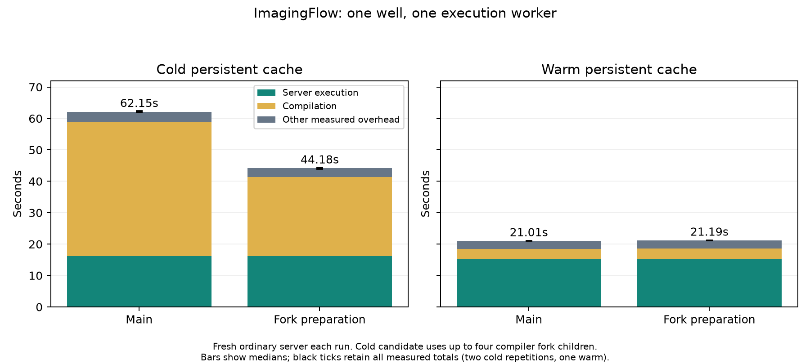

# Cold CPU compiler preparation (2026-09-29)

This report supports [issue #220](https://github.com/OpenHCSDev/openhcs/issues/220). On main `de23449a42f89a9aaa13218090ef3fb8c26d46a1`, cold backend preparation dominates the one-well ImagingFlow run: compilation takes roughly 43 seconds, compared with 16 seconds of execution. Warm compilation takes roughly three seconds. Previous preparation profiling found shape and object intensity alone consuming roughly 20 cold seconds serially; concurrent compilation can therefore materially reduce the total first-run gap. The optimization applies to pipelines selecting multiple eligible CPU backend families, using their existing declarations rather than an ImagingFlow-specific roster.

A fresh-interpreter probe running from a worker thread measured the two dominant preparation methods at **19.898 seconds serial**, versus **10.872 seconds using fork children plus parent loading**. With populated disk caches, the same approach regressed **0.338 → 0.704 seconds**, rejecting unconditional fork preparation. [All four probe observations](method_probe/) are retained. These are preparation-method timings, not end-to-end benchmark results.

The production change gives the existing `CompilerPreparedAutoRegisterFamily` a default-disabled child-preparation capability. The CellProfiler owner enables it only for CPU-only execution, a family requiring explicit backend preparation, and an **empty explicitly configured persistent Numba cache**. The compiled-context preparation consumer derives modules from canonical callable projections and derives unique families through the existing registry-discovery owner. At least two eligible families are needed; up to four fork children populate their caches. Normal parent preparation then executes every original hook and loads machine code into the process inherited by execution workers. Child errors propagate. No internal import fallback, duplicate provider roster, or replacement preparation authority is introduced.

An existing `.nbi` index anywhere in the explicit cache disables child preparation, including a partial or stale cache. An implicit cache, non-CPU-only process, or platform without fork also keeps ordinary parent preparation. This is a deliberately narrow performance policy; normal parent preparation remains responsible for actual kernel validity and readiness. It does not accelerate every cold or edited-source configuration.

Every observation below uses a **fresh ordinary ZMQ execution server**, one replicated well, one fork execution worker, and benchmark CPU thread limits. The candidate uses up to four **compiler** children during cold preparation; this is compilation parallelism, not a faster single-thread kernel algorithm.

| Cache | Repetition | Version | Compilation | Server execution | Total |
| --- | ---: | --- | ---: | ---: | ---: |
| Cold | 1 | Main | 42.776 s | 16.400 s | 62.429 s |
| Cold | 1 | Fork preparation | 25.112 s | 16.460 s | 44.388 s |
| Cold | 2 | Main | 42.787 s | 15.884 s | 61.874 s |
| Cold | 2 | Fork preparation | 25.182 s | 15.982 s | 43.978 s |
| Warm | 1 | Main | 3.124 s | 15.336 s | 21.013 s |
| Warm | 1 | Fork preparation | 3.156 s | 15.370 s | 21.187 s |

The two cold pairs save **17.66/17.61 seconds of compilation** and **18.04/17.90 seconds total**. Median compilation decreases **41.2%**, and median total decreases **28.9%**. Execution has no established improvement. The warm pair is effectively unchanged within run variation; one warm pair is not a statistical non-regression proof. The host retained its existing user background processes, and brief unit suites overlapped two cold preparations; repeated compilation values nevertheless agree closely. Peak RSS is retained but this report makes no general memory-improvement claim.



[Raw observations](observations.csv), [provenance](provenance.json), and [output checks](output_parity.csv) retain all six runs. Every spreadsheet is exactly **11,550,064 bytes**, SHA-256 `3e00436ae1500047fd2605021ae055492b17dbe0b4aa4ddbe2f62af6f8e073be`, matching main and the preceding wide-output report. Cold directories were absent before launch. Warm observations reuse the populated first cold cache from the same checkout. Execution includes fork workers, result transport, and plate export. Total also includes fresh-server startup, compilation, outcome retrieval, teardown, and progress diagnostics; source staging precedes that timer. No newly measured native CP run is claimed here; the retained [native scaling report](../perf_native_synthetic_scaling_20260929/README.md) and [wide-output scaling figure](../perf_wide_intensity_distribution_20260929/README.md) remain separate.

Local validation passes **286 tests** across callable preparation, backend declarations, source projection, image-carrier compilation, output coalescing, runtime validation, and CellProfiler adapters. New tests exercise actual fork processes, failure propagation, shared-registry deduplication, warm/implicit/GPU cache admission, unsupported-fork behavior, and the compiled-context consumer's parent hook ordering. Changed production files retain the parent's 47 Ruff diagnostics with **zero additions**; the new tests and plot pass Ruff, and all changed Python files pass Black. These are focused source and ordinary-runtime checks, not a complete architectural proof or installed-package acceptance.

The ownership review follows the recent PR discussions: call existing public admission operations rather than reinterpreting fields ([#208](https://github.com/OpenHCSDev/openhcs/pull/208#issuecomment-5897134270)); preserve declaration membership and identity ([#207](https://github.com/OpenHCSDev/openhcs/pull/207#issuecomment-5897134579)); retain shared behavior at its actual owner and test the consumer path ([#159](https://github.com/OpenHCSDev/openhcs/pull/159#issuecomment-5897075892)). Registry identity remains the existing preparation unit; shared registries are submitted once. The backend owner decides child eligibility; the generic compiler consumer calls that capability. Parent preparation remains the process-local authority. Issue #162 stays open because lazy JIT execution accounting has a separate scope.

Reproduce from each checkout with a new output directory and a new cache path that does not yet exist:

```bash
OPENHCS_CPU_ONLY=true NUMBA_CACHE_DIR=/new/empty/cache \
  /path/to/venv/bin/python scripts/benchmark_cppipe_well_throughput.py \
  --manifest benchmark/manifests/official30_portable_axis1.json \
  --output-dir /new/output/directory --mode 1w_1t \
  --case ExampleImagingFlowCytometryObjectsInGrid
```

Repeat with the same cache and a new output directory for the warm observation. Rebuild the figure with `MPLBACKEND=Agg /path/to/venv/bin/python benchmark/results/perf_fork_compiler_prewarm_20260929/plot.py`.
