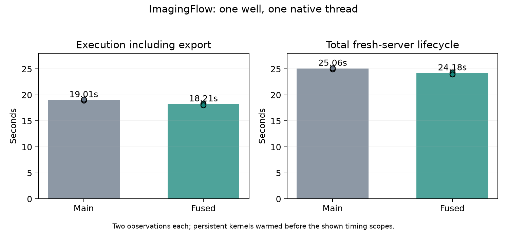

# Fused default Haralick feature arithmetic (#245)

The default NumPy/Numba texture backend now computes all thirteen default mahotas features inside its existing compiled provider. Its existing preparation hook reaches the new cached kernel, so registry warming prepares it without a new kernel list. Explicit native/mahotas selection remains the comparison provider. No fastmath is enabled.

Saved real-input replay covers 2,325 calls (2 warmup, 2,323 production). All satisfy the existing strict CP absolute/relative tolerance of 1e-6, explicitly authorized by the user. The maximum production-input difference is 1.317e-13; maximum including large warmup matrices is 7.276e-11. The inputs remain unchanged. Four alternating full saved replays reduce median feature arithmetic from about .709s to .00505s. This is kernel evidence, not an end-to-end claim.

Two fresh-server ordinary 1w_1t runs per version, after existing backend family warming, yield:

| Median | Control | Fused |
|---|---:|---:|
| Compilation | 3.163s | 3.172s |
| Execution including export | 19.010s | 18.215s |
| Total fresh-server lifecycle | 25.062s | 24.178s |

Execution improves .795s (4.2%) and total .884s (3.5%) in this small sample. These are measured production paths, not a statistical confidence interval. Initial three alternating source-switch runs are retained separately: rewriting the source invalidated Numba caches and increased fused compilation by about .9s. Those runs demonstrate why execution gains must not be presented as a cold-total improvement. Explicit family-warming process wall time was 3.49/3.52s for fused versus 2.41/2.41s for control and precedes the displayed total, just as registry warming preceded the existing warm benchmark baseline. First-ever cold warming is not eliminated or included in that total. One-well execution is inline in the server, one native thread; it does not launch a fork execution child.

The initial three production runs show median texture step 1.579s -> .704s. Full output checks cover all 1,800 data rows each: only floating-point numeric cells differ (16,428 cells), maximum 3.053e-14; headers, nonnumeric cells, shape and order remain exact. This checks candidate against the previously validated main output. Direct mahotas provider parity is tested across scales 1/2/3, 2/16/256 gray levels, constants, checkerboards, random and strided inputs; empty ignored matrices retain the reference exception and small-plane zero behavior is preserved.

213 tests pass across the full CellProfiler library-loading suite and new arithmetic cases. The first new checkerboard fixture included zero-only co-occurrence directions and correctly failed at the native reference; the fixture was corrected to contain positive gray levels, with explicit ignored-empty failure tests retained. Original failed evidence remains. Changed production/library-test Ruff diagnostics are unchanged (14 and 22); new tests pass Ruff. Source-census coverage and authored NRA transaction are structural evidence, distinct from runtime/numerical validation. Main CI is not a merge gate per user authorization.

Global class census: 699 modules, 5,075 original classes, 5,063 projected and 12 explicitly unprojected OPEN, before and after. No new class authority is introduced.

Before merge, integrated main 86a99f33c and its ZMQRuntime commit 0f9e840a9 into both worktrees, reinstalled the shared editable dependency and passed pip check. 330 combined library/arithmetic/orchestrator/profiling tests passed against that dependency. Performance observations above were taken at main 5976f8547 with the preceding dependency pin; this newer annotation correction is covered by integration tests rather than relabeling old observations.
