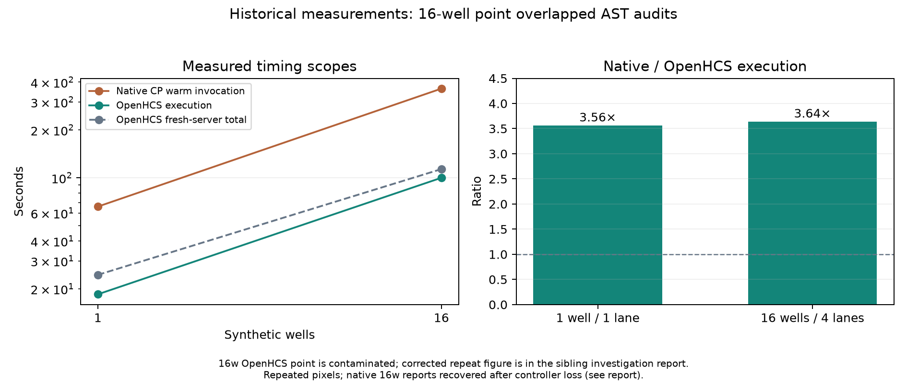

# Fresh ImagingFlow scaling relative to native CellProfiler

**Superseded for performance attribution:** the 16-well OpenHCS point below overlapped two full AST audits. See [the controlled investigation and corrected figure](../perf_scaling_rise_investigation_20260929/README.md). These historical observations remain intact.

All points are newly measured on September 29; no single-well multiplication or historical native estimate is used. Native CP is 4.2.8.1 / Python 3.9.25, one native thread per process, one process at one well and four independent processes at 16 wells. OpenHCS is main 87b992c38 including fused texture and native tabular export, latest main ZMQRuntime pin 0f9e840a9 / Python 3.12.14; one-well execution is inline, 16 wells use four fork workers, one native thread each.

| Wells | OpenHCS execution | OpenHCS total | Native warm invocation | Native/OpenHCS execution |
|---|---:|---:|---:|---:|
| 1 | 18.505s | 24.527s | 65.924s | 3.56× |
| 16 | 100.074s | 113.513s | 364.230s | 3.64× |

Timing scopes differ deliberately and are shown separately: OpenHCS execution includes worker/result transport and plate export; total includes fresh server lifecycle, compilation and outcome retrieval. Persistent registry/kernel warming and source staging precede that total. Native timing begins at a warmed pipeline invocation and includes analysis/export/measurement close; Python/Java startup and full-batch warmup (66.570s one well, 398.875s 16 wells) are excluded. Final Java shutdown is excluded. Native one-process startup is not treated as OpenHCS compilation or charged against its execution.

There is one observation per scaling point, so these are workload-specific measured ratios, not confidence intervals. Each well is a byte-identical replication of the same six images/two image sets; content caches can benefit this synthetic workload. This does not establish scaling on distinct biological images. Source hashes match between both engines at each well count, and both OpenHCS success receipts cover every requested well.

The 16-well native controller disappeared while the original workers remained active. Its original four stdout/stderr pipes were drained and recovered without restarting analysis. Each emitted report followed native pipeline EXIT_STATUS Complete and exact image-set-count checks; output CSVs and pipe EOF were observed. The original controller return code was not observed. The reports/monotonic timings, original provenance and explicit recovery status are retained; this limitation is not silently converted into a clean driver-exit claim. Issue #246 fixes file-backed reporting/logs for future runs.

Compared with the preceding integrated export baseline at main 3032958ac, this latest 16-well execution is slower (100.074s versus 94.884s). Its aggregate texture step drops 24.049s -> 15.917s, while other steps rise, especially ExpandOrShrinkObjects (19.621s -> 28.379s across workers). Different integrated main/dependency revisions, host state and one sample do not identify a cause. This report claims fresh relative scaling, not a proven overall 16-well optimization. Separate alternating single-thread evidence in ../perf_fused_haralick_20260929 records the measured execution/total improvement with comparable warmed variants.

Raw native summaries/provenance, OpenHCS receipts/step/worker timings, input checks and plotted ratios are adjacent to this report. Regenerate PNG/SVG with MPLBACKEND=Agg python plot.py.
