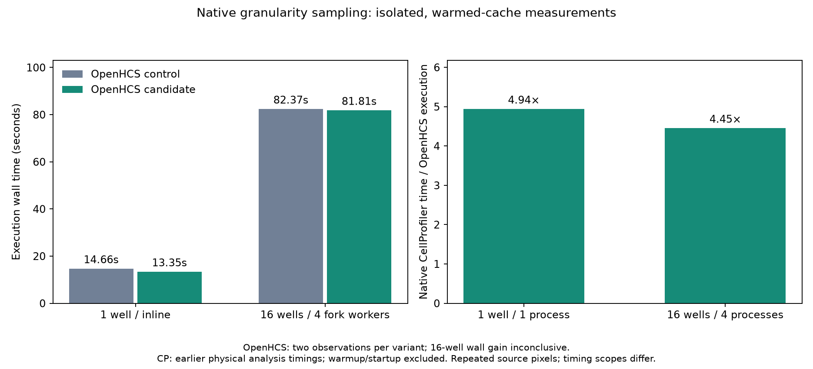

# Native granularity sampling without dense coordinate planes

Issue [#261](https://github.com/OpenHCSDev/openhcs/issues/261). Saved production inputs identified coordinate-plane construction and generic interpolation as a 1.381s/well granularity cost. A native replay reduced complete background correction from about 103ms to 21ms, making about one second of end-to-end improvement plausible. This is the dominant measured resampling term; tiny inter-step bookkeeping routes were rejected.

GranularitySamplingGrid now owns CP logical extents, ceil-sized array shapes, subsampling and endpoint coordinates. Image series and sparse label consumers carry that owner. Dense sampling shares a typed native algorithm in the existing stable-ABI extension; sparse point sampling derives its scales from the same owner. A shared native buffer lease handles acquisition/validation/release for reconstruction and sampling. The obsolete standalone resampling helpers and new_shape field are removed. background_corrected_pixels now returns pixels plus the nominal grid rather than pixels plus a bare shape array. See [the ownership decision](architecture.md).

The sampling kernel is compiled when building the extension; it adds no JIT kernel or manual warming roster. Existing declared public callable preparation still exercises reconstruction and the floating granularity consumers. This does not eliminate the existing preparation cost or Python process imports.

## Isolated ordinary pipeline measurements

Common revision fb5fea4f1, production commit 49d9920d2, current shared dependencies, Python 3.12.14 / NumPy 2.5.3 / SciPy 1.18.1 / Numba 0.67.0. ImagingFlow pipeline, two image sets per synthetic well, one native thread per worker. Both variants use the same current-main code except this granularity module and its old/new native extension. Each mode uses control/candidate/candidate/control order, two observations per variant and a fresh ZMQ server per invocation. No audits, tests, profiling, other benchmarks or extension compilation overlap timings. Existing user/background processes remain running.

| Mode | Metric | Control median | Candidate median | Reduction |
| --- | --- | ---: | ---: | ---: |
| 1 well / inline | Execution | 14.658s | 13.348s | 1.310s |
| 1 well / inline | Total | 20.618s | 19.218s | 1.401s |
| 1 well / inline | Compile | 3.173s | 3.176s | -0.003s |
| 16 wells / four fork workers | Execution | 82.366s | 81.811s | 0.554s |
| 16 wells / four fork workers | Total | 95.532s | 95.123s | 0.409s |
| 16 wells / four fork workers | Compile | 10.204s | 10.242s | -0.038s |

One-well granularity-step medians fall from 4.252s to 3.056s. At 16 wells, the summed step falls from 29.831 to 22.691 worker-seconds. Non-target processing excluding granularity/export is 8.524→8.419s at one well and 184.198→188.521 worker-seconds at 16 wells. Export is 1.464→1.464s and 24.196→24.228s respectively. These parallel sums cannot be added directly to wall time. Export and all non-target steps remain in analysis.json so variation outside the optimization is visible. Two observations are a small sample, not a confidence interval.

Source staging and declared callable warming precede the ordinary total. Warm invocation costs 4.22–4.82s, including Python imports and public preparation; every timed observation records zero new/modified granularity cache files. An earlier initial dbf1c7a8b control paid 7.824s compilation versus approximately 3.2s afterward. That initial result and a separate dbf paired rerun are retained under earlier_observations, not included in the final fb5 paired table. This is warmed-cache performance, not a first-ever installation/prewarming total.

The single-thread execution reduction is 8.94%, and total reduction 6.79%. The 16-well wall reduction is only 0.67% execution / 0.43% total and is inconclusive at this sample size. Granularity improves locally, but unrelated step variation offsets much of it. The existing image-series cache is keyed by pixel content and settings, so repeated synthetic wells can reuse background correction; multiplying the one-well saving by 16 is not justified.

## Physical and numerical gates

Four actual 1650×1650 FP32 inputs replay with every pixel and logical extent exact; input array digests are unchanged. All 366 final native dtype/shape/scale/extrema fixtures match installed SciPy exactly. Tests additionally cover bool, signed/unsigned integers, FP32/FP64, complex64/128, strided/read-only/non-native-endian inputs, singleton/constant borders, zero-weight NaN/Inf neighbors, malformed buffers and reference-release failures. No discrete or error tolerance is weakened. Full ordinary exports compare every cell: 1,801 rows at one well and 28,801 at 16 wells, with header, dimensions, ordering, nonnumeric and numeric cells exact. All 12 original TIFF digest entries remain unchanged.

890 consumer checks passed before the last main integration; 608 targeted checks passed after PR #259, and 793 targeted checks passed after PR #205. These suites overlap and are not 2,291 distinct tests. The tightened granularity boundary suite has 180 passing tests. validation_manifest.json retains the test invocations; logs retain results and the rejected first nonfinite prototype. Shared-environment pip check passes.

The installed cp311-abi3 wheel physically runs reconstruction and FP32/FP64 sampling on Python 3.12.14 and 3.14.5. Its only native entries are tabular and the renamed granularity extension; the obsolete reconstruction-only library is absent. The first wheel harness was source-shadowed by checkout metadata; isolated working directories, no PYTHONPATH and forced wheel installation fix that test setup. Packaged validation logs normalize trailing whitespace; original logs remain under the external benchmark paths. Numerical integer extrema are verified against this installed SciPy/compiler combination, not proved portable across arbitrary compilers. A Numba sampling prototype was rejected because its uint64 overflow cast disagreed with SciPy. Exact coefficient evaluation and mirrored spline footprints at in-range final cells are required even with constant-zero out-of-range coordinates.



The figure uses fresh OpenHCS measurements and the earlier physical native CP 4.2.8.1 / Python 3.9.25 / JDK 11 runs: 65.924s for one well and 364.230s for 16 wells. Ratios are 4.94× and 4.45×. Native was not rerun for this change. Its scope excludes Python/Java startup, full-batch warmup and final shutdown. OpenHCS execution includes result transport and plate export; total includes fresh-server/compile/lifecycle. The original recovered 16-well CP controller exit remains unobserved although workers reported Complete with correct image counts. Repeated source pixels do not establish distinct-biological-image scaling. See [native provenance](../perf_fused_haralick_scaling_20260929/README.md).

The earlier increase in “other” was largely caused by two full source audits overlapping a benchmark. Isolated and deliberately overlapped runs are retained in [that investigation](../perf_scaling_rise_investigation_20260929/README.md); neither that contaminated number nor historical timing drift is attributed to this algorithm.

## Reproduction

Regenerate retained analysis/figures without running benchmarks:

```sh
python benchmark/results/perf_granularity_native_sampling_20260930/analyze.py
MPLBACKEND=Agg python benchmark/results/perf_granularity_native_sampling_20260930/plot.py
```

Build/install the candidate wheel through setup.py's declared extension policy. Build the immutable fb5fea4f1 reconstruction-only source separately, outside the package, for the control binary. Use the recorded candidate checkout, prepared shared environment/source corpus and cache:

```sh
NUMBA_CACHE_DIR=/tmp/openhcs-registry-kernel-prewarm-production-20260929-c2 \
python benchmark/results/perf_granularity_native_sampling_20260930/run_pairs.py \
  --wells 1 --output-dir /tmp/granularity-pairs-new-1w \
  --control-native /tmp/control-native/_granularity_reconstruct.abi3.so
```

Run --wells 16 separately. The driver checks the candidate source digest, stages the original control source/binary, records preparation separately and restores source/binary in finally. Native binary hashes are recorded per run rather than assuming arbitrary builds are byte-identical. check_export_parity.py compares complete exports; replay_saved_inputs.py accepts --input-dir and --output and extracts only the unchanged helper bodies from the immutable control through AST, without importing another registry family. saved_input_replay.json records actual pickle sources and input/output hashes. Large captured arrays/full exports stay under recorded external paths. The exact NRA source/syntax recipes require their original intermediate states and are not intended for already migrated source. Census projections and compiler class inventories are source-ownership evidence, not semantic or all-detector proof.
