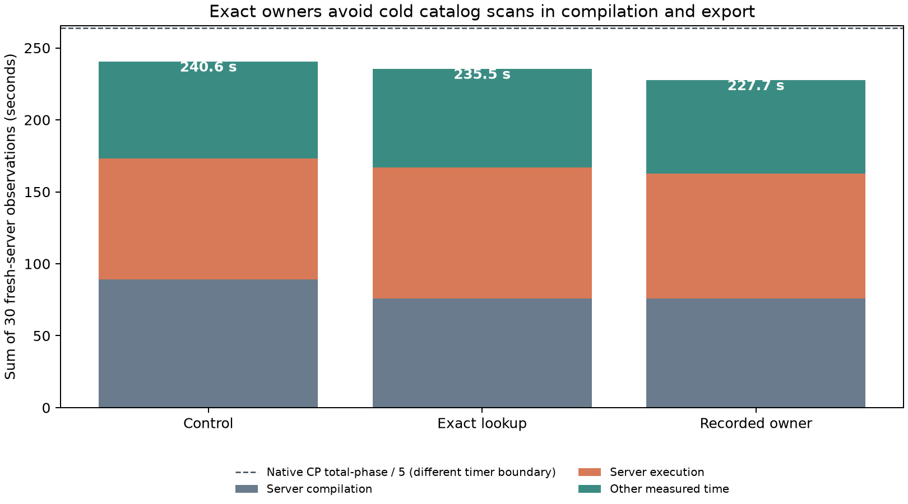
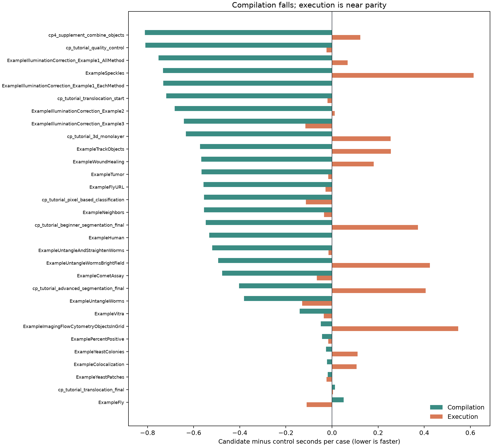

# Exact CellProfiler owners: fresh-server official30 1w_1t (2026-09-29)

This report accompanies [OpenHCS issue #188](https://github.com/OpenHCSDev/openhcs/issues/188) and [draft PR #189](https://github.com/OpenHCSDev/openhcs/pull/189). The control is integration commit `d18dbc877`, including lazy PolyStore NGFF imports at submodule commit `11269ed`. The candidate adds exact CellProfiler callable lookup, compiler preparation limited to registered preparation families, and experiment-measurement dispatch through the owner already recorded on each table. Each observation uses one well, one OpenHCS thread, a `fork` worker, and a fresh client-owned ZMQ server.

The control profile attributed **24.87 of 89.31 compilation seconds** to CellProfiler invocation-contract provider calls across 30 cases. The first provider pass accounted for 22.58 seconds. On the three-step CombineObjects case, its first exact contract lookup triggered full lazy discovery of the CellProfiler module catalog and took 1.014 seconds. Resolving the exact callable module avoids discovery there; skipping registries without compiler preparation hooks prevents the same work from moving into callable preparation.

An intermediate exact-lookup-only run improved compilation but moved some catalog discovery into timed execution. Profiling its WoundHealing spreadsheet export traced **0.77 seconds** to `derive_experiment_measurement_tables`: that method searched the full registry to find a class already stored in each `MeasurementTable.measurement_feature_owner`. Dispatching directly through the registered owner lowered the WoundHealing export step **0.555 → 0.004 seconds** and the quality-control database export step **0.872 → 0.066 seconds** in the retained runs. Explicit catalog/discovery APIs still discover the full registry.

| Sum of 30 fresh-server observations (seconds) | Control | Lookup only | Recorded owner | Final minus control |
| --- | ---: | ---: | ---: | ---: |
| Server compilation jobs | 89.271 | 75.909 | 75.797 | **-13.474** |
| Server execution jobs | 84.018 | 91.049 | 86.747 | +2.729 |
| Other measured time | 67.294 | 68.564 | 65.146 | -2.148 |
| Per-observation total | 240.582 | 235.522 | 227.690 | **-12.892** |

All 30 final cases succeeded. Compilation fell in 28 cases (paired median **-0.551 seconds**) and total time fell in 23 cases (paired median **-0.582 seconds**). Execution's paired median changed by less than 0.001 seconds; its aggregate was 2.729 seconds higher, so this is a total-time improvement rather than an execution-only win. The 110 result files have identical paths and bytes on control and final candidate. The intermediate lookup-only run also achieved 110/110 byte parity.

A warmed control/candidate/candidate/control comparison on the short CombineObjects case used the exact parent commit in a separate worktree. For the lookup-only candidate, mean compilation changed **2.151 → 1.309 seconds**, execution **0.158 → 0.283 seconds**, and measured total **4.487 → 3.424 seconds**. Those timings establish the short-case gain and the reason for the recorded-owner follow-up. The first colocalization run in a newly created control worktree incurred unrelated cold JIT work and was excluded from the paired claim.

A remaining `RelateObjects` path still requests full global measurement-dialect declarations during its first timed call (about 0.7 seconds in a representative profile). It is not changed here because the global dialect must retain its complete semantics; a future scoped projection needs separate parity evidence. The native CP 4.2.8.1 total-phase 5× reference is **263.871 seconds** for these cases. Its timer has a different preparation boundary, so the figure shows it as context rather than a strict end-to-end ratio.





`control.csv`, `lookup_only.csv`, `candidate.csv`, and `abba.csv` retain the measurements; `plot.py` regenerates both figures. Raw full-run trees and receipts are under `/home/ts/code/projects/openhcs-benchmark-runs/perf-lazy-ome-zarr-full-candidate-20260929`, `/home/ts/code/projects/openhcs-benchmark-runs/perf-lazy-cp-registry-full-20260929`, and `/home/ts/code/projects/openhcs-benchmark-runs/perf-lazy-cp-owner-full-20260929`. The warmed short-case runs are under `/home/ts/code/projects/openhcs-benchmark-runs/perf-lazy-cp-registry-abba-3-20260929`.

All 831 focused ownership, export, and compilation tests passed. Fresh-process regression tests confirm that exact callable ownership, callable preparation, and experiment-measurement dispatch leave unrelated CellProfiler modules unimported. The full candidate run used the ordinary ZMQ completion path and achieved 110/110 byte parity. Black, selected Ruff checks, and whitespace checks passed.

Reproduce the full run with:

```bash
OPENHCS_CPU_ONLY=true \
OPENHCS_REFERENCE_EXPORT_PIPELINES_ROOT=/absolute/path/to/benchmark/reference_exports/official30_value_completion_20260914 \
.venv/bin/python scripts/benchmark_cppipe_well_throughput.py \
  --manifest benchmark/manifests/official30_portable_axis1.json \
  --output-dir /path/to/output \
  --native-summary-csv benchmark/results/perf_lazy_catalog_20260929/native_cp_summary.csv \
  --mode 1w_1t
```
