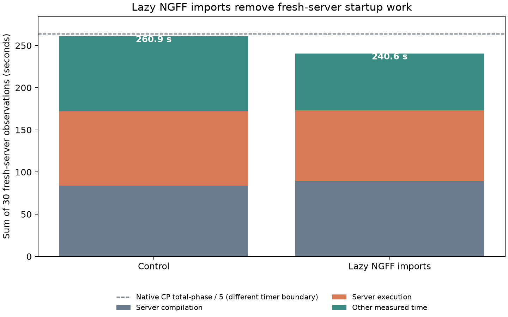
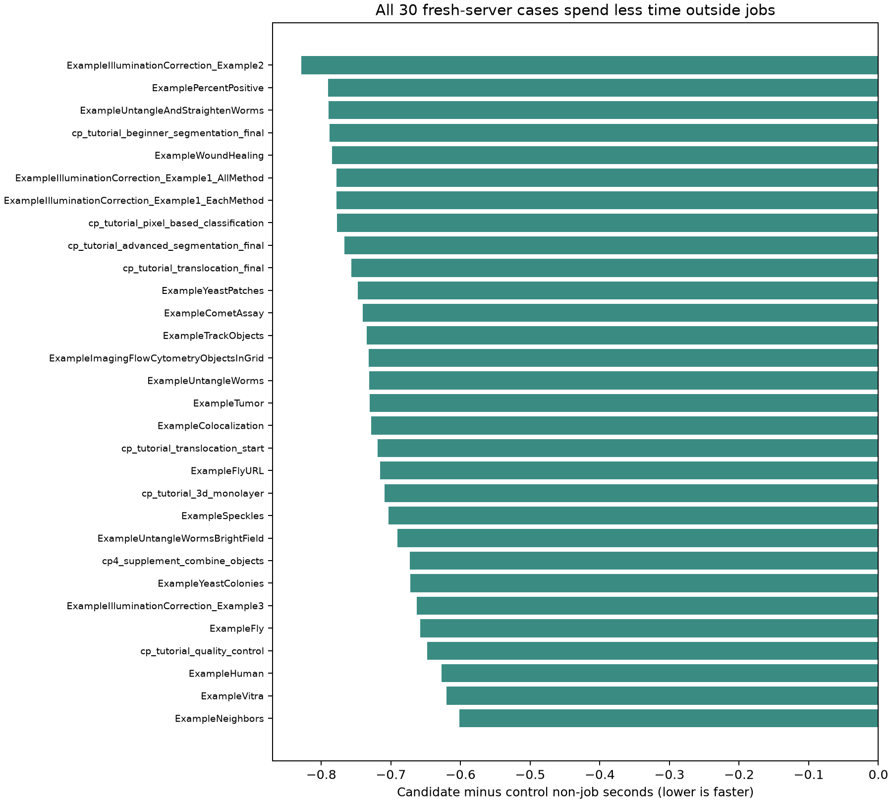

# Lazy NGFF imports: official30 fresh-server 1w_1t (2026-09-29)

This report accompanies [PolyStore issue #14](https://github.com/OpenHCSDev/PolyStore/issues/14) and [PR #15](https://github.com/OpenHCSDev/PolyStore/pull/15). The OpenHCS integration code is the same on both sides of the comparison: commit `503686d1b`, including the step-scoped Costes cache. Only the PolyStore submodule changes, from `0efe67f` to `11269ed`. Each observation uses one well, one OpenHCS thread, the `fork` worker start method, and a fresh client-owned ZMQ server. `total_seconds` includes connection, server startup and shutdown, compilation, and execution. Source workspace preparation before the observation timer is included only in the separately measured full CLI wall time.

Importing the Zarr backend class eagerly loaded OME-Zarr and Dask even when the benchmark selected disk materialization. Moving NGFF imports to their consuming reads and writes lowered the cold `openhcs.runtime.zmq_execution_server` module import from **1.523 to 0.900 seconds**. In three fresh endpoint trials, connection fell from approximately **1.81 to 1.17 seconds**. These import and connection timings identify the mechanism; the full production-path sweep measures its transfer.

All 30 cases succeeded on both sides. Every case spent less time outside the two server jobs; the paired median saving was **0.731 seconds**, with a range of **0.601 to 0.828 seconds**. All 110 produced result files had identical paths and bytes.

| Sum over 30 observations (seconds) | Control | Lazy NGFF imports | Difference |
| --- | ---: | ---: | ---: |
| Server compilation jobs | 84.095 | 89.271 | +5.176 |
| Server execution jobs | 87.857 | 84.018 | -3.839 |
| Other measured time (`total - compile - execute`) | 88.976 | 67.294 | **-21.682** |
| Per-observation total | 260.928 | 240.582 | **-20.346** |
| Full CLI wall time | 283.613 | 263.415 | **-20.198** |

The change targets import/startup work. The compilation and execution differences are run variation, not claimed effects of lazy NGFF loading. The native CellProfiler 4.2.8.1 total-phase reference sums to 1,319.357 seconds, and its 5× reference line is 263.871 seconds. The candidate's OpenHCS per-observation sum is 23.289 seconds below that line. Native CP and OpenHCS total timers have different preparation boundaries, so the line is indicative rather than a like-for-like end-to-end ratio. Native execution data and the full four-mode scaling run remain in the existing benchmark artifacts; this startup-only change does not alter native CP or OpenHCS image-processing numerics.





`control.csv` and `candidate.csv` retain all per-case measurements. `plot.py` regenerates the figures using those CSVs and the [native CP summary](../perf_lazy_catalog_20260929/native_cp_summary.csv). Raw result trees and receipts are under `/home/ts/code/projects/openhcs-benchmark-runs/perf-coloc-step-cache-warm-candidate-full-20260929` and `/home/ts/code/projects/openhcs-benchmark-runs/perf-lazy-ome-zarr-full-candidate-20260929`.

Validation: 142 PolyStore Zarr/NGFF/FileManager tests passed; 43 OpenHCS Zarr-path unit/integration tests passed with two skipped. The full benchmark used the ordinary ZMQ completion path and achieved 110/110 byte parity. Ruff E9/F63/F7 and whitespace checks passed for the PolyStore change.

Fresh benchmark command:

```bash
OPENHCS_CPU_ONLY=true .venv/bin/python scripts/benchmark_cppipe_well_throughput.py \
  --manifest benchmark/manifests/official30_portable_axis1.json \
  --output-dir /path/to/output \
  --native-summary-csv benchmark/results/perf_lazy_catalog_20260929/native_cp_summary.csv \
  --mode 1w_1t
```
