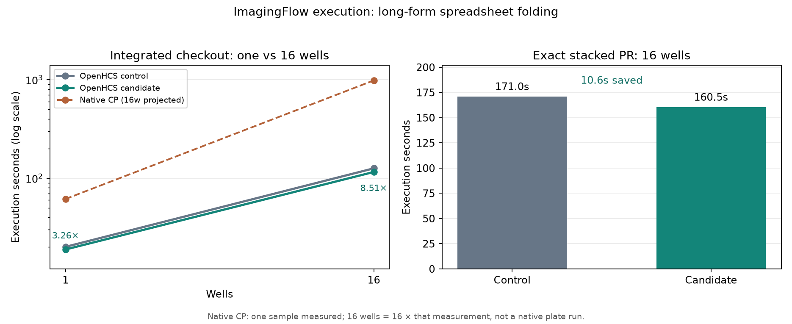

# Faster long-form spreadsheet folding (2026-09-29)

This report supports [issue #194](https://github.com/OpenHCSDev/openhcs/issues/194) and [draft PR #195](https://github.com/OpenHCSDev/openhcs/pull/195), stacked on [plate-input transport PR #193](https://github.com/OpenHCSDev/openhcs/pull/193). The only code change is inside `WideMeasurementRowAccumulator`: when a long-form columnar table declares fixed object scope, one image identity, one object ID, and no additional wide feature columns, it folds the cells without repeatedly deriving ownership and subject maps. All other row shapes use the existing loop. Duplicate-value conflict checks, feature projection, output ordering, and the accumulator's nominal authority remain in place.

The saved contract-selected ImagingFlow eight-well `RuntimeArtifactBatch` renders a 92,194,901-byte spreadsheet. Its replay took about **25.1 → 20.2 seconds**, with identical SHA-256 `87b68418e19a69f20b57cf7c9bda4d1ed4f4b73d4b22507d84c61accc4a9bbca`. The original accumulator spent about 8.7 seconds folding 3.1 million long-form `BF_cells_on_grid` and `SSC` cells in that batch; the candidate spent about 3.8 seconds. The full benchmark confirms that this local gain transfers to the plate execution interval.

All runs below use the ordinary ZMQ route, a fresh client-owned server per observation, `fork` workers, and one native thread per worker. Each checkout was warmed once before its timed comparison. Compilation and server startup contribute to total time; execution includes workers, result transfer, and plate export. Values are seconds.

| Checkout and workload | Control execution | Candidate execution | Control total | Candidate total |
| --- | ---: | ---: | ---: | ---: |
| Integrated, ImagingFlow 1 well / 1 worker | 20.107 | **18.915** | 25.945 | **24.847** |
| Integrated, ImagingFlow 16 wells / 4 workers | 126.078 | **115.808** | 139.305 | **128.913** |
| Exact stacked PR, ImagingFlow 16 wells / 4 workers | 171.049 | **160.498** | 184.284 | **173.733** |
| Integrated, official30 one-well total | 80.329 | **79.350** | 214.708 | **213.524** |

The integrated control includes pending changes from PRs #157, #170, #175, #191, and #193; the candidate adds only this accumulator change. The exact stacked PR branches from #193 and lacks the separate #170/#175 changes, so it has a different absolute runtime and CSV from the integrated checkout. Its parent and candidate were compared only against each other. Both 16-well pairs saved about **10.5 seconds** of execution and total time. All **30/30** official one-well cases succeeded and **110/110** generated result files matched by relative path and bytes. The exact stacked 16-well CSV also matched its parent byte for byte. These checks establish output parity within each branch pair; they do not claim parity between branches with different pending code.

The separately measured native CellProfiler 4.2.8.1 single-sample execution is **61.602 seconds** for ImagingFlow. Multiplying by 16 gives a **985.625-second projection**, not a measured native 16-well plate. The integrated candidate's execution is 3.26× faster at one well and 8.51× faster than that projection at 16 wells. The exact stacked candidate is 6.14× faster than the 16-well projection. Native CP execution is compared only to OpenHCS execution, not OpenHCS total time.



`observations.csv` and `official30_totals.csv` contain the recorded phase times and raw-run directory names; `plot.py` regenerates the figure. The native measurement comes from `benchmark/results/perf_lazy_catalog_20260929/native_cp_summary.csv`. The source batch was saved at `/home/ts/code/projects/openhcs-benchmark-runs/perf-spreadsheet-batch-imaging-8w-20260929.pkl`, and its original output is in `perf-spreadsheet-batch-capture-20260929`. Raw benchmark runs are under `/home/ts/code/projects/openhcs-benchmark-runs` with the directory names in the CSV files.

Seventy-two focused measurement, spreadsheet, and analyst-export unit tests passed on the exact stacked PR branch. Black and the changed-line Ruff checks passed. Reproduce a 16-well observation with:

```bash
OPENHCS_CPU_ONLY=true \
OPENHCS_REFERENCE_EXPORT_PIPELINES_ROOT=/absolute/path/to/benchmark/reference_exports/official30_value_completion_20260914 \
.venv/bin/python scripts/benchmark_cppipe_well_throughput.py \
  --manifest benchmark/manifests/official30_portable_axis1.json \
  --output-dir /path/to/output \
  --native-summary-csv benchmark/results/perf_lazy_catalog_20260929/native_cp_summary.csv \
  --mode 16w_4c --case ExampleImagingFlowCytometryObjectsInGrid
```
