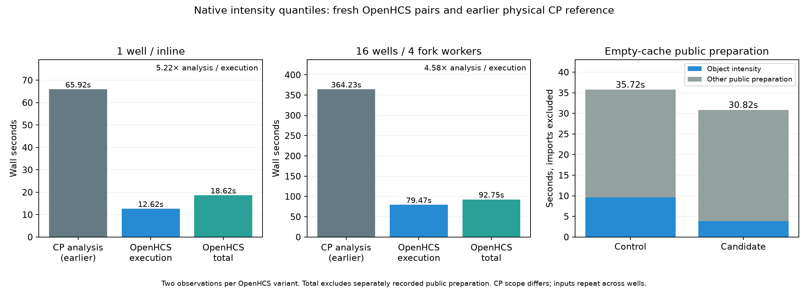

# Native quantile route: retained negative cold-path evidence

**Not promoted or merged.** The actual empty-cache pipeline invalidates the premise that removing the largest standalone dispatcher materially reduces its cold critical path. The full CLI falls only 55.70s→54.40s; internal compilation 35.55s→34.75s. Those are one observation per version, with no external preparation and separate empty Numba caches. This does not establish a substantial cold-start improvement.

The standalone four-hook experiment instead falls 35.72s→30.82s, and object-intensity preparation 9.63s→3.90s. That gain is real for its sequential scope, but it is not the pipeline's parallel critical path. The actual cold diagnostic shows four-worker waves: shape remains the slow first-wave worker while the improved intensity worker finishes earlier. Following waves wait for that whole wave. Optimizing the fixed-wave scheduler is the stronger structural route.

The implementation is numerically valid: 552 production-extension fixtures, eight real saved inputs, 1210 consumer tests, 10 current-main projection tests and 26 latest guardrail tests pass. All four paired complete exports, the installed pipeline export and the prior-main export are byte-identical. Package builds from the source archive with its shared header, and the installed extension also loads under Python 3.14. Packaged ratchet and NRA/R1 pass, including setup.py via the packaged measurement API and the repository policy consumer respectively. One pre-existing unmodeled-record finding is unchanged, not absent. These correctness/structural gates do not establish a useful dominant-cost optimization.

The small execution gain transfers: saved production quantiles 0.248s→0.155s, one-well pipeline execution 12.724s→12.622s and total 18.755s→18.623s. At 16 wells/four fork workers, intensity falls 1.67 summed worker-seconds; whole execution 81.018s→79.474s and total 94.347s→92.747s also contain unrelated movement. Two observations per variant cannot attribute that entire wall reduction to selection. Ordinary totals exclude separately recorded public preparation. The installed fresh-path journey compiles for 17.17s after those four hooks, so it is not claimed fully warmed.

The physical CP analysis references are earlier runs, not reruns for this patch: 65.924s(one well) and 364.230s(16 wells/four jobs), with CSV close included and Python/Java startup/full warmup/shutdown excluded. The original 16-well controller exit remains unobserved; recovered worker/export evidence is unchanged. Candidate execution ratios 5.22×/4.58× have different timing scopes. Synthetic repeated images are not biological scaling evidence. All 12 source TIFF hashes remain unchanged.

Production source cad1c8838 is integrated with main 642821c3c at 13d055130 and with main cd047c4cf at 412f31f86. All seven changed production/new-test sources are byte-identical across the latter merge; source bindings, all observations and scoped receipts are retained. The new nominal ownership/census/source transaction is described in architecture.md. No persisted formats change. The branch remains available for review, but issue 271 is closed as a rejected route rather than opening a misleading performance PR.
