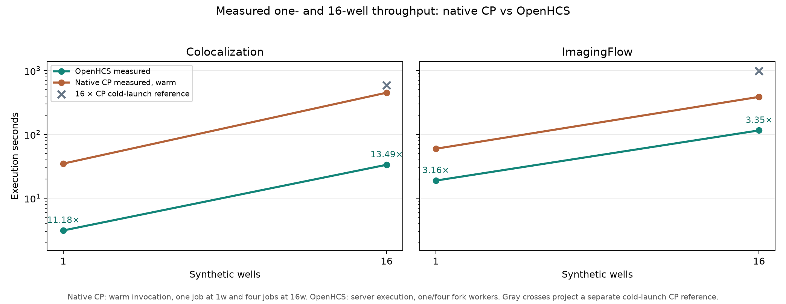

# Measured native CellProfiler well scaling (2026-09-29)

This report addresses [issue #196](https://github.com/OpenHCSDev/openhcs/issues/196). The existing well-throughput figures multiply a measured one-well native CellProfiler timer by 16. Here, native CellProfiler 4.2.8.1 actually processes the same synthetic 16-well workload used by the OpenHCS `16w_4c` benchmark, with four independent native processes and four wells per process. The prior multiplication remains a separately labeled reference in the figure.

Both source examples declare only one genuine well. `benchmark/native_synthetic_well_scaling.py` reads the imported source-binding plane mappings, hashes each original image, and stages symlinks under `W001` through `W016`; it never edits source pixels. The existing native batch worker reads a deterministic file list, validates the image-set count during an untimed full-batch warm-up, and coordinates the four timed jobs through a start barrier. The corresponding one-well observations use one process and the same worker boundary. Every report records CellProfiler/Python/NumPy/SciPy versions, warm-up, measured invocation and first-module timings, job ranges, source hashes, and clean Git provenance. The raw per-job CSVs remain in the run directories named below.

| Case | Workload | Native warm-up | Native measured invocation | OpenHCS server execution | Measured native / OpenHCS |
| --- | --- | ---: | ---: | ---: | ---: |
| Colocalization | 1 well, 1 process / worker | 36.473 s | **34.954 s** | 3.127 s | **11.18×** |
| Colocalization | 16 wells, 4 processes / workers | 455.101 s | **451.878 s** | 33.491 s | **13.49×** |
| ImagingFlow | 1 well, 1 process / worker | 59.921 s | **59.680 s** | 18.915 s | **3.16×** |
| ImagingFlow | 16 wells, 4 processes / workers | 398.907 s | **388.431 s** | 115.808 s | **3.35×** |

The native numbers are the makespan across the declared jobs, not the sum of their individual times. The 16-well timed start skew was **0.0075 s** for Colocalization and **0.0048 s** for ImagingFlow. All four jobs overlapped through analysis. ImagingFlow was also piloted before committing the driver: its 16-well timed makespan was **378.195 s**, within 2.7% of the clean run. The plotted values and ratios use the clean runs. In the clean ImagingFlow 16-well OpenHCS observation, plate spreadsheet export alone took **41.836 s** after the four worker lanes completed in **66–69 s**. Reaching a 5× native ratio against 388.431 s would require OpenHCS execution below **77.686 s**, a **38.122-second** reduction from 115.808 s; the export is therefore the dominant next target.

These ratios describe **byte-identical replicated wells**. OpenHCS has content-keyed granularity and label-geometry caches, so the repeated source pixels can make later wells cheaper than distinct biological images. A follow-up on the same integrated checkout ran ImagingFlow three times on one live server with the same pixels and byte-identical CSV output: execution fell from **19.060 s** to **11.493 s** and **11.392 s**. The Granularity step fell from **4.667 s** to **0.356–0.358 s** and Intensity Distribution from **4.773 s** to **1.688–1.693 s**. On that same warm-server route, shifting each of the six input images to give them distinct content restored **18.849 s** execution, including **5.080 s** Granularity and **4.366 s** Intensity Distribution. The 16-well ratios must therefore not be extrapolated to distinct-input plates; that workload needs its own matched native and OpenHCS measurement. The follow-up probes are diagnostic and are not substituted for the clean plotted runs.



The native **warm invocation** starts after Python import, Java startup, pipeline loading, and a complete warm-up batch. It includes per-batch preparation, analysis modules, and output export. OpenHCS **server execution** includes its fork workers, result transfer, and plate export, but excludes the fresh execution-server connection and pipeline compilation. The older official30 native one-well `EXECUTE_NATIVE_CP` timer instead wraps a fresh CellProfiler subprocess; multiplying that number by 16 repeats its launch cost and assumes serial scaling. Consequently, the gray projection crosses in the figure are historical references, not measured native plate times or matched warm-execution ratios.

The committed `*_summary.json` files contain all worker timing reports, while `*_provenance.json` records the original source hashes and exact benchmark-source identities. `openhcs_observations.csv` snapshots the matching OpenHCS observations from [PR #193](https://github.com/OpenHCSDev/openhcs/pull/193) (Colocalization) and [PR #195](https://github.com/OpenHCSDev/openhcs/pull/195) (ImagingFlow). `plot.py` recomputes the plotted native durations from the worker reports. The prior native one-well reference values come from `benchmark/results/perf_lazy_catalog_20260929/native_cp_summary.csv` in the OpenHCS performance PR stack.

Each clean 16-well worker reported exactly **8 image sets**, for **32** total in each case. The four ImagingFlow timed CSVs covered image numbers 1–8, 9–16, 17–24, and 25–32; the first **1,800** object rows from the one-well and first 16-well shard were byte-identical. The four Colocalization timed CSVs contained eight image rows each. Across all 32 Colocalization rows, **83** stable biological columns matched repeated one-well rows exactly; the excluded columns were execution times, group/image-set bookkeeping, and staged file locations. The one- and 16-well reports for each case contain identical original source-file SHA-256 values. Every native worker completed with CellProfiler's `Complete` exit status, and the source worktrees were clean at run start.

Raw output roots retained on the benchmark host are `perf-native-synthetic-imaging-1w1j-clean-20260929`, `perf-native-synthetic-imaging-16w4j-clean-20260929`, `perf-native-synthetic-coloc-1w1j-clean-20260929`, and `perf-native-synthetic-coloc-16w4j-clean-20260929` under `/home/ts/code/projects/openhcs-benchmark-runs`. The large ImagingFlow CSVs are not copied into Git; the committed reports and provenance identify the exact inputs, jobs, and timings needed to reproduce them.

Reproduce either case with the OpenHCS Python environment, the CellProfiler 4.2.8.1 Python 3.9 environment, and JDK 11 available. Use a new output directory for every run:

```bash
env OPENHCS_CPU_ONLY=true JAVA_HOME=/path/to/jdk-11 \
  PATH=/path/to/jdk-11/bin:$PATH \
  OMP_NUM_THREADS=1 OPENBLAS_NUM_THREADS=1 MKL_NUM_THREADS=1 \
  NUMEXPR_NUM_THREADS=1 \
  .venv/bin/python benchmark/native_synthetic_well_scaling.py \
  --manifest benchmark/manifests/official30_portable_axis1.json \
  --case ExampleImagingFlowCytometryObjectsInGrid \
  --output-dir /new/output/directory \
  --native-python .venv-cellprofiler39/bin/python \
  --wells 16 --native-jobs 4 --image-sets-per-well 2
```

Use `--wells 1 --native-jobs 1` for the warmed one-well point and `--case ExampleColocalization` for the second example. The source-root manifest loader acquires or resolves the official images before the native timer starts. The four-job run retains separate warm-up and timed output folders for every shard; the summary rejects missing or non-overlapping timed work.
