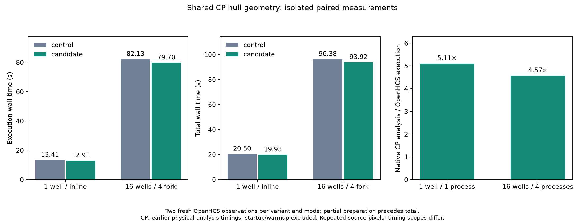

# Shared CP ordered hulls without full-frame compaction

Delete 130 existing lines, including requested-label frame compaction, the standalone Python hull walk, and the duplicate raw-label outline grouping loop. CellProfilerLabelHull now owns exact CP envelope ordering for enclosing circles and illumination. Raw-label/Feret and CP ordinal consumers derive their sorting/output-position projections for one shared numeric grouping primitive. No old-helper alias, new provider roster, persisted cache authority or external format is added. See [the ownership decision](architecture.md).

Issues [#268](https://github.com/OpenHCSDev/openhcs/issues/268) and [#269](https://github.com/OpenHCSDev/openhcs/issues/269). The latter is an unchanged-main test-fixture failure: explicit component metadata omitted the extension its complete output assertion expected. Both fixture inputs now declare `.tif`; the assertion remains unchanged. The failed candidate and unchanged-main receipts remain separate. This does not reopen the completed production materialization work in #264 or infer facts from filenames.

## Why this route

A fresh production boundary capture found full-frame label compaction and the interpreted hull walk in enclosing-circle construction. Five unique real 1650x1650 requests cover six calls per well, with one repeated request. Before editing production, exact replay projected about 0.49s/well of execution savings. The final production replay against immutable main preserves all hull vertices/counts and byte-identical circle outputs, saving about 0.47s across the weighted six-call frontier. Another 480 empty, singleton, thin, random, sparse-ID, reordered, duplicate, missing and nonpositive-ID fixtures remain exact. The grouping representation scales with requested objects and outline pixels, not the largest sparse label ID.

A reconstruction index-queue/flags prototype was exact but had weaker measured payoff and was deferred. Tiny wrapper, provenance, GC and inter-step routes do not justify replacing this measured frontier. Replay and profiles establish a local cost and plausible ceiling; the ordinary pipeline comparison below establishes actual end-to-end value.

## Timing scope

Common main 295e0ee81; final production source b856ae561. Shared Python 3.12.14, NumPy 2.5.3, SciPy 1.18.1 and Numba 0.67.0. Existing native binaries/dependency gitlinks are unchanged by this patch. The existing throughput tool runs the ImagingFlow pipeline with two image sets per synthetic well, one native thread per worker, inline execution at one well and four fork workers at 16 wells. Each mode uses control/candidate/candidate/control order, two observations per variant, and a fresh ZMQ server for each observation. Both changed production modules are staged together for the control; candidate sources restore in finally.

No audits, tests, other benchmarks, profiling or native builds overlap timed observations. Existing user/background processes remain running. Earlier pre-consolidation observations are retained at their external paths but are not included in the final table. Two observations are a small sample, not a confidence interval; summed worker step time is not wall time.

Before each observation, declared public shape, intensity-distribution and illumination preparation exercises both hull domains. This source-staged preparation occurs outside ordinary total and is recorded separately. Its mode medians are about 10.6s for control and 11.9–12.4s for candidate, including imports and source-invalidated kernel preparation. The unchanged quicksort/heapsort leaf acquires additional signatures during ordinary catalog compilation on both variants; their cache receipts remain visible. No new hull/grouping signature appears inside the timed observations. This is partial-preparation, warmed-source-cache evidence, not first-install or complete-prewarming performance, and is not a compilation-speedup claim.

Execution includes worker/result transport and complete plate export. Total additionally includes fresh-server lifecycle and compilation. See analysis.json, observations_1w.jsonl, observations_16w.jsonl and the retained ordinary CSVs for all observations and per-step sums.

| Mode | Metric | Control median | Candidate median | Reduction |
| --- | --- | ---: | ---: | ---: |
| 1 well / inline | Execution | 13.412s | 12.907s | 0.505s / 3.77% |
| 1 well / inline | Total | 20.501s | 19.928s | 0.573s / 2.79% |
| 1 well / inline | Compile | 4.341s | 4.333s | 0.008s |
| 16 wells / four fork workers | Execution | 82.126s | 79.703s | 2.423s / 2.95% |
| 16 wells / four fork workers | Total | 96.375s | 93.917s | 2.459s / 2.55% |
| 16 wells / four fork workers | Compile | 11.151s | 11.192s | -0.041s |

At one well, shape and intensity-distribution sums fall from 3.216s to 2.361s. Texture rises 0.857→1.060s and object intensity 1.264→1.390s; unrelated movement offsets part of the local gain. At 16 wells, those two target stages fall 35.483→27.567 worker-seconds, while texture falls 13.563→13.435 and object intensity rises 25.754→26.512. Remaining processing excluding target geometry/export falls 176.575→175.561 worker-seconds. This does not show a consistent cross-mode regression in the remaining work; its causes are not attributed from two observations. Historical “other” excluded granularity/export, a different grouping; the analysis preserves both definitions instead of silently changing the category. None of these worker sums can be added directly to parallel wall time.



Native analysis / candidate OpenHCS execution ratios are 5.11× at one well and 4.57× at 16 wells, subject to the timing-scope and repeated-image limitations below.

## Validation

At production source b856ae561, 918 tests pass across label hull, processing backend, library loading, module execution, conditional analysis and runtime equivalence. Existing floating comparisons retain their declared tolerances; discrete hull ordering, counts, identities and errors remain exact. The new tests cover contiguous, strided and read-only inputs, constant/thin planes, empty requests, sparse IDs and duplicate/nonpositive/missing requests. Complete ordinary exports are compared with the existing checker at CP rtol=atol=1e-6 and also hashed; headers, row dimensions/order and nonnumeric cells remain exact.

The packaged agent-comms ratchet at 3b03785f45df2ef5dc62ba6aed99294192ecbb01 passes for openhcs, scripts and benchmark, comparing 295e0ee81 to b856ae561 with no increased measures. No new benchmark Python utility is added. Full receipts are compressed alongside concise summaries. NRA's changed-file R1 uses the repository's policy consumer, NRA0844525e and every recorded dependency gitlink as context; both numeric files have no before/after findings or increases. This is scoped structural evidence, not all-detector/global semantic proof.

The cp311-abi3 wheel is built through the existing setup policy, installed into an isolated target and imported outside the checkout. Its actual module paths come from that target; all three public preparations and all five saved production circle requests pass, with byte-identical circles against immutable main. Wheel SHA256 e967bce9445c4a8286d8cd4191cf7ba71cb2fabe6d7064a542bb4a9e2592d6a3; the archive has only the tabular and current granularity extensions. Source shadowing is explicitly excluded. Shared editable-source synchronization follows merge and is accepted separately.

The source-checked NRA migrations and full original-class census are retained separately. Before: 699 modules, 5,083 original classes, 5,071 projected, 12 OPEN. After owner introduction at 37b79f048: 5,084 original, 5,072 projected, the same 12 OPEN. The final shared-leaf consolidation changes no class declarations. Persisted formats, registered callable names, user pipeline/config contracts and third-party semantics are unchanged; the removed helpers were internal and reset at cutover.

## Reproduction and retained artifacts

Use the recorded shared environment/cache and the same source revisions. Stage both label_geometry.py and illumination.py from immutable 295e0ee81 for each control, or the final candidate for each candidate. Keep source restoration in a finally block. Invoke the three declared public preparation hooks before each measurement, retain their duration and geometry-cache receipts, then run the existing command:

```sh
OPENHCS_CPU_ONLY=true OPENHCS_SUBPROCESS_NO_GPU=1 POLYSTORE_SUBPROCESS_NO_GPU=1 \
NUMBA_CACHE_DIR=/tmp/openhcs-registry-kernel-prewarm-production-20260929-c2 \
python scripts/benchmark_cppipe_well_throughput.py \
  --manifest benchmark/manifests/official30_portable_axis1.json \
  --output-dir /tmp/owned-hull-observation \
  --mode 1w_1t --case ExampleImagingFlowCytometryObjectsInGrid
```

Run 16w_4c separately. Full timing-driver and replay commands are recorded in validation_manifest.json. The driver, saved arrays, full exports, original logs and earlier observations remain under /home/ts/code/projects/openhcs-benchmark-runs; they are not additional production tools. The immutable reference module is loaded outside the package and has no competing registered family. Source transaction diffs document exact intermediate migrations and are archival evidence rather than patches for already migrated code.

Native CP comparison reuses the earlier physical CP4.2.8.1/Python3.9.25/JDK11 analysis times: 65.924s for one well, 364.230s for 16 wells. Native is not rerun for this hull-only change. Its scope excludes Python/Java startup, complete warmup and final shutdown; the original recovered 16-well controller exit remains unobserved although workers reported Complete with the right counts. Repeated source pixels do not establish distinct biological workload scaling. See [native provenance](../perf_fused_haralick_scaling_20260929/README.md) and [the earlier rise in other](../perf_scaling_rise_investigation_20260929/README.md).
