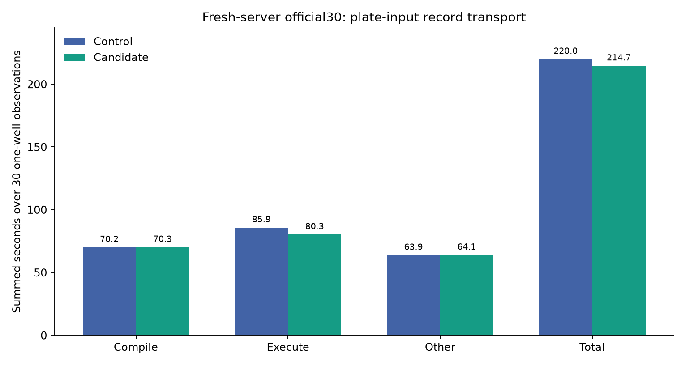
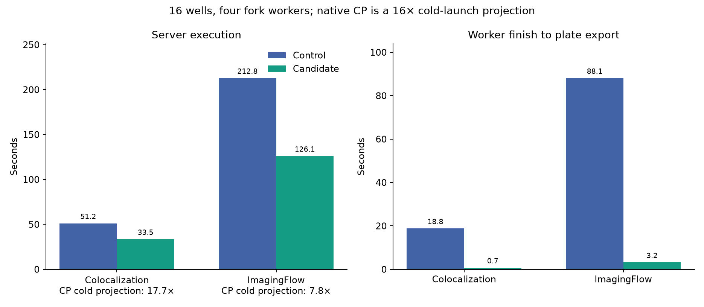

# Transfer only declared plate inputs from worker lanes (2026-09-29)

This report supports [OpenHCS issue #192](https://github.com/OpenHCSDev/openhcs/issues/192) and [draft PR #193](https://github.com/OpenHCSDev/openhcs/pull/193). The control is integrated commit `cc0615a9f`, which contains the single-axis compilation fix in [draft PR #191](https://github.com/OpenHCSDev/openhcs/pull/191) and separate pending performance changes from PRs #157, #170, and #175. The candidate adds only the plate-input transport change to that integration checkout. The review branch includes #157 as a prerequisite because #191 is not based on it. Four-worker observations use `fork`, 16 wells, one native thread per worker, and a fresh client-owned execution server. One-well observations also use a fresh server. The change affects execution and total time; it does not change compilation.

`ExampleColocalization` exposed a **18.8–25.6-second gap** between the last worker completing and the plate spreadsheet starting. Instrumenting the worker pipe showed sequential result serialization and receipt. One four-well lane sent about **1.54 GB** of pickled runtime records: 1.11 GB object labels, 382 MB images, 41 MB measurements, and less than 1 MB relationships. The spreadsheet's compiled artifact inputs require measurements and relationships. The new `MERGE_PLATE_INPUTS` observation mode derives retained artifact types from those compiled inputs. Explicit full-value observation and analysis consolidation still retain every record. Runtime export paths are found before filtering.

| Fresh-server official30, one well per case (summed seconds) | Control | Candidate | Change |
| --- | ---: | ---: | ---: |
| Server compilation jobs | 70.193 | 70.310 | +0.117 |
| Server execution jobs | 85.869 | 80.329 | **-5.539** |
| Other measured time | 63.944 | 64.069 | +0.125 |
| Per-observation total | 220.006 | 214.708 | **-5.298** |

All **30/30** cases succeeded; **110/110** generated result files matched by relative path and bytes. Execution improved in 21 cases, with the largest reductions in ImagingFlow (-2.512 seconds), TrackObjects (-0.820 seconds), and Colocalization (-0.530 seconds). The full sweep followed a candidate warmup through the same corpus so cold JIT compilation was outside the paired measurement.



| 16 wells, four fork workers | Control execution | Candidate execution | Control total | Candidate total | Post-worker gap |
| --- | ---: | ---: | ---: | ---: | ---: |
| Colocalization | 51.177 s | **33.491 s** | 61.983 s | **43.263 s** | 18.804 → 0.726 s |
| ImagingFlow | 212.827 s | **126.078 s** | 227.382 s | **139.305 s** | 88.090 → 3.171 s |

The plate-level export remained near 15 seconds for Colocalization and 52 seconds for ImagingFlow; the gain comes from worker-result transfer. Both 16-well plate exports matched the control byte for byte. The ImagingFlow candidate's measured process-tree peak memory was slightly higher (14.14 versus 13.72 GB), so this result does not establish a memory reduction.

The native CellProfiler 4.2.8.1 reference is a separately measured **single-sample execution** baseline, projected to 16 wells by multiplication. Its projected 16-well execution is 592.570 seconds for Colocalization and 985.625 seconds for ImagingFlow. Relative to that projection, the candidate execution is 17.69× and 7.82× faster, respectively. These are projections, not native 16-well measurements; the OpenHCS total timer includes server startup and compilation and is not divided by the native execution timer.



`official30_control.csv`, `official30_candidate.csv`, `multiwell.csv`, and `transport_payload.csv` retain the observations; `plot.py` regenerates the figures. The raw runs are under `/home/ts/code/projects/openhcs-benchmark-runs/perf-single-axis-full-candidate-20260929`, `perf-plate-transport-full-candidate-20260929`, `perf-single-axis-multiwell-candidate-20260929`, `perf-plate-transport-candidate-16w-repeat-20260929`, and `perf-plate-transport-imaging-{control,candidate}-20260929`. The saved native CP reference is `benchmark/results/perf_lazy_catalog_20260929/native_cp_summary.csv`.

Seventy-six focused unit tests passed on the exact stacked review branch, including full-observation and plate-input retention policies. A real ZMQ full-value export and an analysis-consolidation integration test passed there too. A warmed 16-well Colocalization run on that exact branch measured 7.539 seconds compilation, 33.217 seconds execution, and 43.172 seconds total; its plate CSV matched the integration candidate byte for byte. The official30 and paired 16-well cases used the ordinary ZMQ benchmark route on the integration checkout.

Reproduce an observation with:

```bash
OPENHCS_CPU_ONLY=true \
OPENHCS_REFERENCE_EXPORT_PIPELINES_ROOT=/absolute/path/to/benchmark/reference_exports/official30_value_completion_20260914 \
.venv/bin/python scripts/benchmark_cppipe_well_throughput.py \
  --manifest benchmark/manifests/official30_portable_axis1.json \
  --output-dir /path/to/output \
  --native-summary-csv benchmark/results/perf_lazy_catalog_20260929/native_cp_summary.csv \
  --mode 16w_4c --case ExampleColocalization
```
