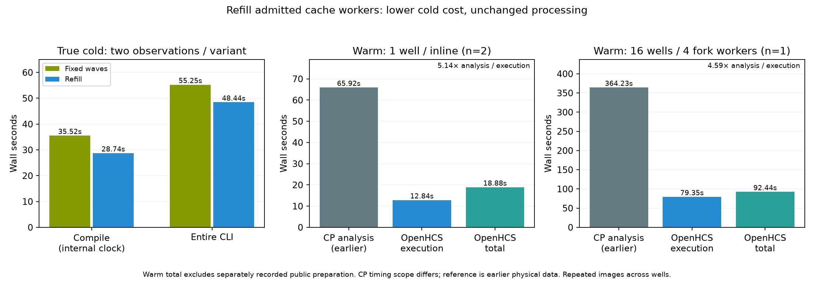

# Refill cold preparation workers

Issue [#278](https://github.com/OpenHCSDev/openhcs/issues/278), related to [#162](https://github.com/OpenHCSDev/openhcs/issues/162). PreparationCacheBatch waited for an entire group of four kernel-cache workers before starting the next group. A long shape worker left completed slots idle. The batch now retires completed workers and immediately fills available slots, keeping its existing four-child limit and fork admission contract. PreparationCacheWorker owns idempotent process/channel release. Parent readiness still belongs to PreparationOperation.

The saved actual-cold job frontier projected a possible 7.36s saving from removing the barriers. This is a duration/launch-order proxy, not a proved bound. The following isolated production observations establish the actual payoff. The previous native intensity quantile route was rejected because its standalone compilation saving did not transfer to the cold critical path; its negative evidence remains on the separate experimental branch.

| Scope | Fixed waves | Refill | Observations per variant |
| --- | ---: | ---: | ---: |
| True-cold entire CLI process | 55.246s | 48.437s | 2 |
| True-cold internal compilation | 35.525s | 28.745s | 2 |
| True-cold internal total | 51.117s | 44.270s | 2 |
| True-cold execution | 12.619s | 12.557s | 2 |
| Warm 1-well compilation | 3.181s | 3.205s | 2 |
| Warm 1-well execution | 12.673s | 12.836s | 2 |
| Warm 1-well total | 18.678s | 18.884s | 2 |
| Warm 16-well execution, four fork workers | 84.765s | 79.349s | 1 |
| Warm 16-well total | 98.270s | 92.442s | 1 |

Cold compilation saves 6.780s (19.1%); the entire CLI saves 6.809s (12.3%). Each cold observation uses a separate initially empty Numba cache and no external preparation. Control/candidate/candidate/control order changes only processing_preparation.py against common main c50f42c46; candidate source is 82303175b33426c811f3ee9a35155342849e01f0. Entire CLI includes interpreter/import/conversion/catalog/server lifecycle; internal total starts later. One well uses the existing inline execution route, with forked cache preparation children. These are small samples, not confidence intervals. Cold compilation at 28.745s remains far from the requested few-second target; the long performance goal is still active.

Warm observations run the four existing public preparation hooks before the ordinary fresh-server benchmark. Those costs are recorded separately and excluded from ordinary total. The first control preparation cost was 11.834s; subsequent costs range 2.668–3.525s. All warm observations retain 390 cache indexes with no new or modified indexes during timing. Populated caches reject these child-safe warming jobs before the changed scheduling loop. There is no claimed warm execution improvement: the small 1-well increase and the unrelated movement in the single 16-well pair are retained. Tests, audits, builds, profilers and other benchmarks did not overlap timings; existing user/background processes remained running.

The earlier rise in “other” has its own [controlled investigation](../perf_scaling_rise_investigation_20260929/README.md). Its definition excludes texture/export. The aggregate retained here called historical_other_excluding_granularity_export uses a different grouping and is explicitly named; do not compare those categories as though they were identical. Worker step sums are not parallel wall time.



The figure reuses the earlier physical native CP4.2.8.1/Python3.9.25/JDK11 analyses: 65.924s at one well and 364.230s at 16 wells. Native was not rerun for this scheduler-only change. Native excludes interpreter/JVM startup, full warmup and shutdown, while including CSV close; OpenHCS execution includes transport/export. The original 16-well controller exit remains unobserved despite completed original workers and correct image counts. Repeated images do not establish distinct biological scaling. See [native provenance](../perf_fused_haralick_scaling_20260929/README.md).

## Independent correctness and ownership gates

All eleven full CSV exports (four cold, four warm single-well, two warm 16-well and one installed cold journey) are byte-identical within each mode: 1,801 and 28,801 parsed rows. All twelve original TIFF digests were rechecked. No numerical tolerances change; scheduler source changes no image-processing mathematics.

At source 82303175b: 904 consumer tests pass with 11 existing warnings. The final focused suite has 18 passes, including real held-worker slot refill, capacity, error propagation, cancellation/cleanup and parent readiness. The original fixed-wave source fails the slot-refill regression; its failure is retained. An intermediate candidate failed refilled-job error propagation before the completion loop was unified; only the corrected source was timed.

The packaged debt ratchet at tool commit 3b03785f45df2ef5dc62ba6aed99294192ecbb01 passes for openhcs, scripts and benchmark. Scoped R1 passes against c50f42c46, including all recorded dependency gitlinks: before [], after [], increased []. The original AST/ClassDef census before and after has 698 modules, 5,080 original classes, 5,068 projected classes and 12 explicitly OPEN declarations. This patch adds no class or authority. Full census and ratchet inputs are retained compressed under validation/. NRA exact-source transactions are source/syntax checks, not semantic or global architectural proof; see [ownership and maintenance analysis](architecture.md).

An actual isolated-build wheel was installed outside the checkout. Imported module and runtime authority paths resolve to the installed target, with the original tabular/granularity extensions. Wheel SHA256: 2461662a9ff9fb58ab6be3d4d4329fc1aa262e7228310b1e3236236b330c3724. Its public ordinary 1-well pipeline starts with an empty cache, succeeds, compiles in 28.737s, executes in 12.272s and totals 43.944s; its complete CSV is byte-identical. This is installed acceptance, not an extra paired performance observation.

Main was subsequently merged normally at e16c0be41e386d5a37a10c5e7c54f49817e5e9ee (base 7d0ce5e68). Upstream adds the separate Centrosome watershed provider; preparation source and all dependency pins remain identical to the measured candidate. Measurements and the installed wheel remain bound to 82303175b rather than being relabeled as timings of later main. Post-sync preparation/provider tests pass (24 tests, 9.24s) and scoped R1 remains before [], after [], increased []; adjacent receipts qualify integration.

## Actual validation commands

Commands ran in the performance checkout with the shared Python 3.12 environment and explicit PYTHONPATH pointing to that checkout. Timing drivers remain external diagnostic scripts; adjacent observation files retain invocations, output paths and scope/source bindings.

```sh
python -m pytest -q tests/unit/test_processing_preparation.py tests/unit/test_fork_compiler_preparation.py tests/unit/test_cellprofiler_kernel_preparation.py tests/unit/test_cellprofiler_module_execution.py tests/unit/test_cellprofiler_processing_backend.py tests/unit/test_cellprofiler_library_loading.py tests/unit/test_runtime_equivalence.py tests/unit/test_experimental_analysis_engine.py
python -m scripts.check_refactor_r1 --base c50f42c46 --head 82303175b --scratch-root /tmp/openhcs-refill-preparation-r1-20260930 --budget-seconds 160
python3.14 -m agent_comms.debt_ratchet --root openhcs --base c50f42c46 --head 82303175b
python3.14 -m agent_comms.debt_ratchet --root scripts --base c50f42c46 --head 82303175b
python3.14 -m agent_comms.debt_ratchet --root benchmark --base c50f42c46 --head 82303175b
python -m pip wheel --no-deps --wheel-dir /tmp/openhcs-refill-preparation-wheel-20260930 .
python scripts/benchmark_cppipe_well_throughput.py --manifest benchmark/manifests/official30_portable_axis1.json --output-dir <fresh-output-directory> --mode 1w_1t --case ExampleImagingFlowCytometryObjectsInGrid
```

Use a new empty NUMBA_CACHE_DIR and omit prior preparation for a true-cold observation. Use the existing shape/intensity/distribution/illumination public callable preparation hooks for a warm observation, recording their cost separately. Run observations serially and finish them before launching analysis or validation work. Persisted formats: none change. Adding another admitted cache operation requires no scheduler roster; the five-job held-worker experiment demonstrates the inherited scheduling contract.
