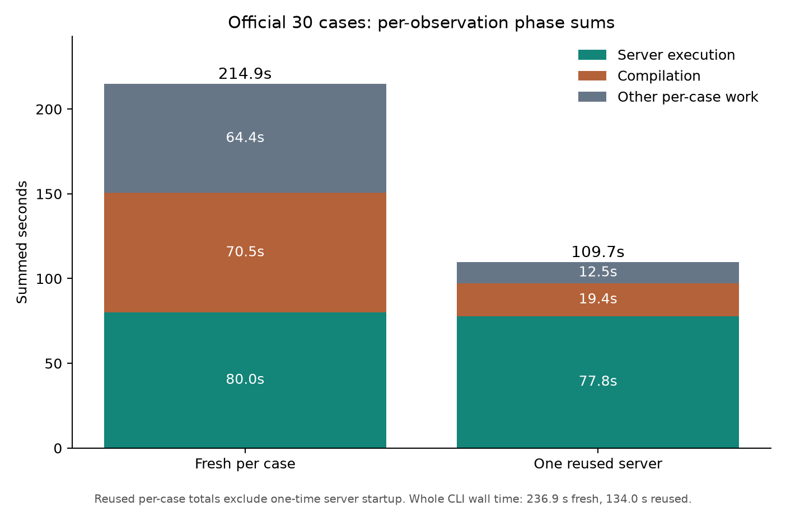

# Current-code fresh versus reused server sweep

The official 30-pipeline, one-well, one-worker suite completed all 30 cases with
both server lifecycles on the integrated performance checkout
`ad00919e162ce48cb12fba381e5fee47360a3425`. The case order,
manifest, CPU-only configuration, native baseline, and result values match. The
only benchmark option changed between sweeps is `--reuse-execution-server`.

| Sum over 30 observations | Fresh server for each case | One reused server |
| --- | ---: | ---: |
| Server execution | 80.043 s | 77.827 s |
| Server compilation | 70.467 s | 19.350 s |
| Other work inside each observation | 64.353 s | 12.503 s |
| Per-observation total | 214.862 s | 109.680 s |
| **Whole-command wall time** | **236.933 s** | **133.952 s** |



All 30 reused per-observation totals are lower. The median reduction is 3.434 s
per case (range 1.961–4.724 s). The whole command is **102.981 s faster**
(43.5%), including the reused server's one-time launch. Execution itself is
nearly unchanged. The
large difference between `total_seconds` and `execute_seconds` in fresh mode
comes chiefly from compilation and repeated server lifecycle overhead. Reuse
keeps imports and compilation-related process state warm across distinct
pipelines; that is the likely reason the compilation sum falls despite still
compiling each pipeline. The measurement does not separately attribute that
change to individual caches.

The timer for `total_seconds` begins after source workspace preparation and
pipeline import. It includes the call to the ordinary OpenHCS measured
execution path, compilation, server job, and client/server lifecycle work. The
`execute_seconds` timer measures the completed server pipeline job. In reused
mode, the one-time server startup and shutdown occur outside all per-case
timers; therefore the 105.182 s difference between the summed totals is **not**
the whole-command wall-time saving. The difference between whole-command and
summed observation time is 22.071 s fresh and 24.272 s reused. These include
preparation and other suite-level work, plus the reused server's one-time
lifecycle. The exact wall times are in [wall_times.csv](wall_times.csv).

Both sweeps produced the same 110 result files by relative path and SHA-256.
These files are the generated files beneath each case's `results` directory;
progress logs and timestamped evidence paths are excluded. The observations
have the same source-input lineage; the lifecycle flag intentionally changes
the run-input fingerprint so incompatible rows cannot be resumed together.

Source CSVs are [fresh.csv](fresh.csv) and [reused.csv](reused.csv). Regenerate
the chart with `python benchmark/results/perf_reused_server_current_20260929/plot.py`.
The raw run roots were
`openhcs-benchmark-runs/perf-fresh-current-full30-20260929` and
`openhcs-benchmark-runs/perf-reused-current-full30-repeat-20260929`. Run the latter
from the integrated performance checkout with:

```bash
OPENHCS_CPU_ONLY=true \
OPENHCS_REFERENCE_EXPORT_PIPELINES_ROOT=benchmark/reference_exports/official30_value_completion_20260914 \
.venv/bin/python scripts/benchmark_cppipe_well_throughput.py \
  --manifest benchmark/manifests/official30_portable_axis1.json \
  --output-dir /path/to/perf-reused-current-full30-repeat-20260929 \
  --native-summary-csv benchmark/results/perf_lazy_catalog_20260929/native_cp_summary.csv \
  --mode 1w_1t --reuse-execution-server
```

The fresh sweep omits `--reuse-execution-server` and uses a different empty
output directory. `--start-method` defaults to `fork` for these runs.
