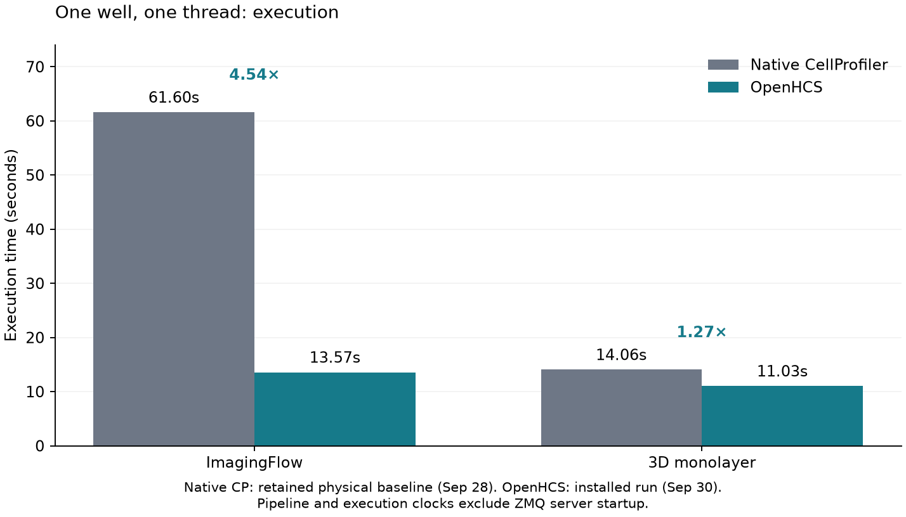

# Restore declared image arguments for SaveImages

The public 3D monolayer benchmark on main failed because callable argument binding admitted only stored artifacts. SaveImages requires `image_to_save`, but its selected image comes from the current main flow. Bind parameter-bearing artifacts from their exact compiled origin through the existing source projection authority. Unparameterized source identities remain context-only; adapters retain their owned input binding. Wrong-source and ambiguous-origin rejection remain intact.

The existing invocation scope fields and input methods now belong to `FunctionInvocationArtifactScope`, inherited by `FunctionCoreExecutor`. Every migrated method is deleted from the concrete class, preserving dataclass constructor field order/slots and shared behavior. `ArtifactSpec` answers whether it declares an argument; compiled input edges own storage/binding admission. The existing `RuntimeValue` factory derives transient input records and stored output records from authoritative specifications, preserving type-owned composition and exact runtime scope. No guessed SaveImages input, fallback alias, extra store/readiness flag or handwritten dispatch roster.

Source `399820539a659f0d485f6d5088fc87b9dd7508ca`, current main `616be7c8` and all eight recorded dependency pins. Actual installed wheel imports all four changed production modules outside the checkout with matching source hashes. Public benchmark commands use a ready retained server; pipeline totals exclude ZMQ startup/shutdown. Input-workspace preparation is outside that scope. No timed run overlaps audits/builds/tests/other benchmarks/profilers.

| Installed ordinary 1w_1t | Compilation | Execution | Pipeline total | Native execution ratio |
|---|---:|---:|---:|---:|
| ImagingFlow | 1.368s | 13.572s | 15.570s | 4.54× |
| 3D monolayer | 1.065s | 11.033s | 12.741s | 1.27× |

These are a refreshed frontier and a correctness repair, not an attributed execution speedup. The previous current-main 3D observation failed; its zero timing is never a performance comparison. The native column uses clearly labelled earlier physical CP execution observations (61.602s and14.059s), not a new native rerun for this nonnumerical binding change. Only one-well timings are measured here; no multiwell scaling claim.

Installed scientific validation: **all six complete 3D measurement CSVs are byte identical** to saved successful outputs; **all120 saved label images have identical pixels, dtype, shape and names**. No CSV fields are ignored. ImagingFlow's complete CSV is byte identical to the pre-fix main acceptance (SHA256 `517057a4b018195cc4c57e8503be63a378a8306eb2ecc303d4a025b6eab6dd1c`). [Exact parity hashes](validation/perf-saveimages-installed-scientific-parity-20260930.json) and [installed provenance](validation/perf-saveimages-binding-installed-provenance-20260930.json) are retained.

**934 focused artifact, source/execution scope, debugger, public converted pipeline, SaveImages/export, runtime value store, function pattern, CP processing and numerical equivalence checks pass.** New checks cover main-flow keyword binding, exact source-bound keyword selection and wrong-source rejection. Broader supplemental checks retain **267 passed/6 failed**; every failure independently reproduces on unmodified main (four pre-existing runtime value/provenance expectations, two source-projection fixtures). Baseline and candidate failure logs are retained without skipped tests or weakened assertions. These are not represented as passing gates.

Scoped R0 has zero positive deltas over all four changed production paths; R1 has no increases. Global original-class census covers701 modules/5099 classes,5087 projected and12 OPEN. [Structural receipt](validation/structural_checks.json) records original artifact paths/hashes. Four NRA source/syntax transactions preserve the original unsuccessful stages and migration closure; authored source replay and scoped structural guards do not prove full semantic equivalence. [Ownership decision](architecture.md) records the existing determining authorities and alternative provider roles.

[Ordinary observations](observations/) include original main failure, successful source prototype, both installed physical receipts and step timings. Full source outputs/cache/logs remain under `/home/ts/code/projects/openhcs-benchmark-runs/perf-saveimages-binding-*`. Reproduce with the installed `openhcs-benchmark run-well-throughput` command using `official30_portable_axis1.json`, `--preset 1w_1t` and the two selected cases; endpoint warming occurs before the pipeline clock. The 3D case remains the weakest relative frontier and is the next execution profiling target.

Fixes #287. Refs #162. Performance goal remains active.
