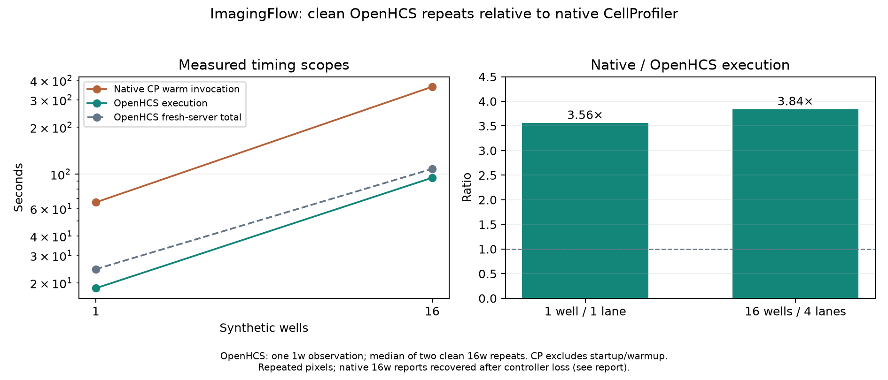

# Why the 16-well “other” time rose

Issue [#252](https://github.com/OpenHCSDev/openhcs/issues/252). Two repository-wide AST audits overlapped the previously published 100.074s execution observation. This was a measurement scheduling mistake. Clean alternating texture variants on the same current code/dependencies bring the inflated expansion cost back down; deliberately repeating the audits reproduces much of the slowdown. The full original 100.074s is not reproduced, so the evidence identifies a material confound rather than assigning every extra second to it.

| Observation | Execution wall time | Texture step sum | Expansion step sum | Other processing step sum |
| --- | ---: | ---: | ---: | ---: |
| Earlier integrated main 3032958ac | 94.884s | 24.049s | 19.621s | 236.721s |
| Published fused run, overlapped audits | 100.074s | 15.917s | 28.379s | 266.296s |
| Current control, median of two clean runs | 96.424s | 24.810s | 20.022s | 243.631s |
| Current fused, median of two clean runs | 94.845s | 14.260s | 20.149s | 244.152s |
| Current fused, deliberate audit overlap | 97.505s | 14.880s | 26.585s | 255.577s |

Step sums aggregate four parallel workers and cannot be added directly to execution wall time. “Other” here excludes texture and plate export. Export stays around 24.1–24.3s in the contemporary runs. Current control/fused other-processing medians differ by only 0.521s across all workers, while the contaminated observation exceeds the clean fused median by 22.144s. No repeatable broad algorithmic regression is demonstrated by these observations.

The original final four wells show the clearest signature: their combined expansion time rose from 5.310s to 12.935s. The deliberate overlap gives 9.824s for that wave. Original audit output completion timestamps fall inside execution: the first completed at epoch 1790730999.281035 and the second at 1790731031.827170; execution began at 1790730973.906967. The corresponding audit script modification times are only approximate launch evidence, not measured process starts. Launch observations, report emissions and sampled process lifetimes are retained for the deliberate reproduction. Report emission precedes process exit: large AST graphs still have to be released, so audit work can continue after the output file appears.

Each reproduced audit processes 728 source modules and consumes about 32–33 sampled CPU seconds, with about 735–740 MiB peak RSS. This host has a Ryzen 5 5500 (six physical cores) and 16 GB RAM. Available memory reaches about 1.1 GiB and host-wide memory PSI records 8.748s of stalls during the reproduction. PSI is global and clean-run PSI was not captured; this does not prove that every stall was caused by an audit or isolate cache contention from reclaim. Process CPU/RSS, core frequencies and pressure samples are retained. Existing user/background processes were left running.

## Controlled comparison and correctness

Common production revision be75ad88d, ZMQRuntime 0f9e840a9, shared Python 3.12.14 / NumPy 2.5.3 / Numba 0.67.0. Control changes only `texture.py` to its pre-fusion 5976f8547 version; all other current code and dependencies stay fixed. Order: control, fused, fused, control. Four fork workers, one native thread each, 16 synthetic wells, byte-identical source pixels, fresh server per observation. Worker/runtime profiling is unset. Lightweight one-second resource sampling runs in every comparison.

Source edits invalidate Numba module-source cache stamps, so the existing Haralick and object-texture family preparation hooks run before each timed invocation. Explicit warmup costs are retained separately (control about 2.57s; fused about 3.62–3.67s). Compile, execution and total receipts keep their ordinary scopes; these are warmed-cache comparisons, not first-ever cold-start measurements.

Individual execution times: control 96.527/96.321s; fused 96.576/93.114s. Fused median execution improves by 1.579s (1.6%); median total improves from 109.590s to 108.179s. Two repetitions per variant are a small sample, not a confidence interval. The earlier integrated-main point uses different revisions and host state and is retained as historical context.

Both paired full exports have 28,801 parsed rows. All headers, shape, ordering and nonnumeric fields match. Each pair has 262,848 nonidentical numeric cells, maximum absolute difference 3.0525929006763874e-14, passing the existing CP rtol=atol=1e-6. No tolerance was weakened. The production source was restored after comparison and no scientific algorithm changes are part of this report.

## Corrected native scaling



One well uses the earlier clean 18.505s OpenHCS execution / 24.527s total observation. The 16-well point uses the two clean fused medians above. Native measurements remain the previously completed physical runs: 65.924s at one well and 364.230s at 16 wells, giving execution ratios 3.56× and 3.84×. Native is CP 4.2.8.1 / Python 3.9.25, one/four processes with one native thread each. Native startup and full-batch warmup are excluded; OpenHCS execution includes result transport and plate export, total includes fresh server/compile/lifecycle. OpenHCS 16 wells use fork. Persistent kernel warming and source staging precede OpenHCS total.

The native 16-well reports were recovered after original controller loss; each original worker reported Complete and the required image count, but the controller return code was not observed. This investigation does not rerun native CP. Original native provenance, input digests and this limitation remain in [the previous report](../perf_fused_haralick_scaling_20260929/README.md). Repeated pixels can benefit content caches; these results do not establish scaling for distinct biological images.

## Evidence and reproduction

Raw per-run observations, steps, lanes, receipts, resource samples, original/reproduced audit timings and export checks are adjacent. `analysis.json` and `resource_summary.json` derive from those retained inputs. Regenerate analysis and PNG/SVG with the shared Python:

```sh
python benchmark/results/perf_scaling_rise_investigation_20260929/analyze.py
MPLBACKEND=Agg python benchmark/results/perf_scaling_rise_investigation_20260929/plot.py
```

`run_clean_pairs.py` and `reproduce_audit_overlap.py` record the experiment recipes. They derive the checkout from their own location and use the invoking Python. Source datasets, shared environments and historical Git objects must exist. Set `OPENHCS_NRA_PYTHON` to the NRA environment Python before the deliberate overlap reproduction; its child audit receives the checkout through `OPENHCS_AUDIT_SOURCE_ROOT`. Use new output directories before repeating; the ordinary benchmark refuses occupied directories. Complete the clean-pair driver before the deliberate overlap driver. These scripts retain the actual preparation/benchmark commands, sampling and source restoration. `check_export_parity.py` checks the saved full exports. The audit templates preserve the same analyses and write separate artifacts.

Timed benchmarks must run separately from AST audits, tests, other benchmarks and compilation work. Development analysis can resume after the timed subprocess completes. Mark previously overlapped measurements as contaminated and retain them instead of silently deleting an unfavorable sample.
