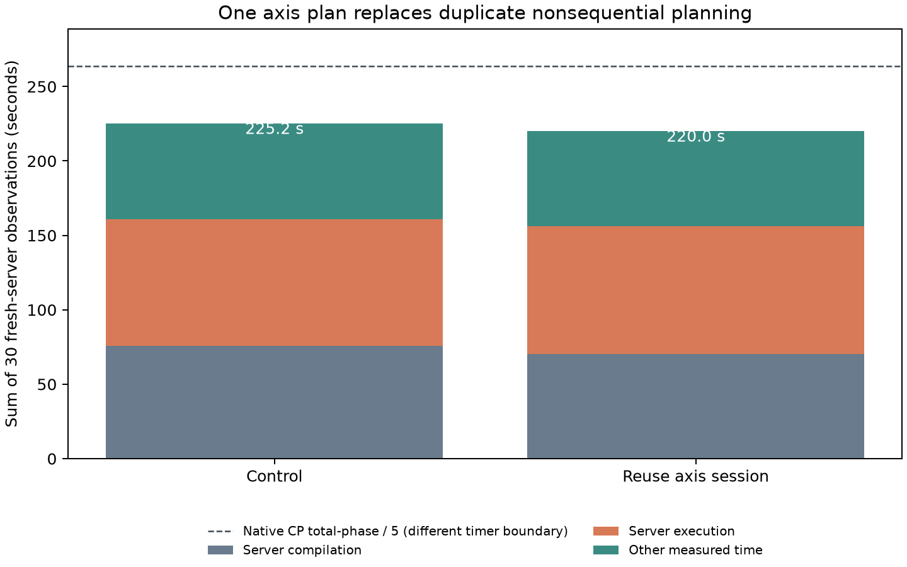
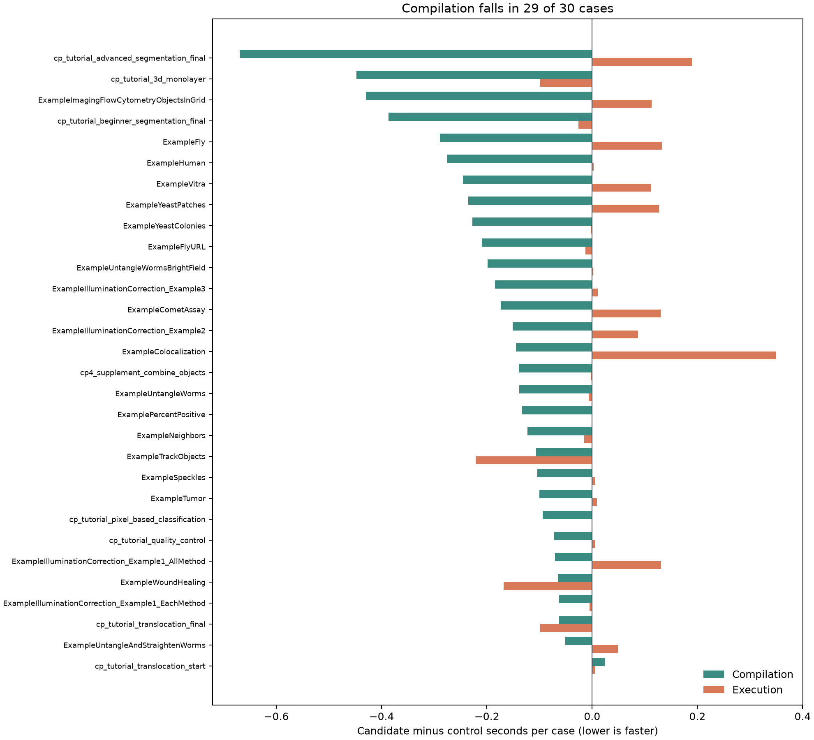

# One validated session per nonsequential axis (2026-09-29)

This report supports [OpenHCS issue #190](https://github.com/OpenHCSDev/openhcs/issues/190). The control is integration commit `65bc344b8`, including the exact CellProfiler owner and scoped-lookup work in draft PR #189. Each official30 observation uses one well, one OpenHCS thread, `fork`, and a fresh client-owned ZMQ server. The candidate finishes a nonsequential context from the initial `CompilationSession` used to check sequential mode. Sequential pipelines retain their separate session per combination.

An advanced-segmentation compiler profile attributed **3.83 of 6.61 profiled seconds** to the two `build_initialize_axis_session` calls. The second call repeats the resolved axis plan. Its removal affects compilation; no runtime algorithm changes.

| Sum of 30 fresh-server observations (seconds) | Control | Candidate | Change |
| --- | ---: | ---: | ---: |
| Server compilation jobs | 75.759 | 70.193 | **-5.566** |
| Server execution jobs | 85.067 | 85.869 | +0.801 |
| Other measured time | 64.329 | 63.945 | -0.384 |
| Per-observation total | 225.156 | 220.006 | **-5.149** |

All 30 cases succeeded. Compilation improved in **29 of 30** cases (paired median **-0.142 seconds**) and total time improved in **28 of 30** (paired median **-0.144 seconds**). Execution improved in 13 cases, but its aggregate rose by 0.801 seconds; this patch establishes a compilation and total-time gain, not an execution-only gain. The **110 result files have identical relative paths and bytes** in the control and candidate runs.

The duplicate plan occurs once per axis. In a fresh-server **16w_4c ExampleColocalization** pair, the warmed control compiled in **11.388 seconds** and the candidate in **7.391 seconds**, a **3.997-second** reduction. Execution was **51.542 vs 51.177 seconds** and total was **66.269 vs 61.983 seconds**. The plate export matched byte for byte. An initial control run took 105.262 execution seconds while its repeat and the candidate were both near 51 seconds; that initial execution result is excluded from the paired claim. The native CP 4.2.8.1 single-sample execution reference projects **592.570 seconds** for 16 wells, but multiplying a single-sample timer is a comparison reference rather than a native 16-well measurement.

The native CP total-phase 5× reference is **263.871 seconds** for the official30 corpus. Its timer has a different preparation boundary, so the figure shows it as context rather than a strict end-to-end ratio.





`control.csv` and `candidate.csv` retain the 30 paired observations; `multiwell_control_initial.csv`, `multiwell_control.csv`, and `multiwell_candidate.csv` retain the 16-well observations. `plot.py` regenerates the figures. The raw run trees are under `/home/ts/code/projects/openhcs-benchmark-runs/perf-relate-owner-full-20260929`, `/home/ts/code/projects/openhcs-benchmark-runs/perf-single-axis-full-candidate-20260929`, and `/home/ts/code/projects/openhcs-benchmark-runs/perf-single-axis-multiwell-*-20260929`.

The candidate checkout was warmed on the same official30 corpus before the timed fresh-server run; the first cold checkout pass generated new Numba caches and was not used as performance evidence. Forty-three focused compiler and materialization tests passed, as did one direct integration run with pipeline-sequential processing enabled. Black and whitespace checks passed. The full run used the ordinary ZMQ outcomes route.

Reproduce the one-well sweep with:

```bash
OPENHCS_CPU_ONLY=true \
OPENHCS_REFERENCE_EXPORT_PIPELINES_ROOT=/absolute/path/to/benchmark/reference_exports/official30_value_completion_20260914 \
.venv/bin/python scripts/benchmark_cppipe_well_throughput.py \
  --manifest benchmark/manifests/official30_portable_axis1.json \
  --output-dir /path/to/output \
  --native-summary-csv benchmark/results/perf_lazy_catalog_20260929/native_cp_summary.csv \
  --mode 1w_1t
```
