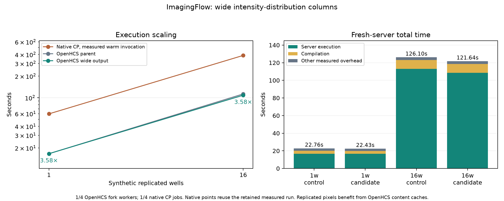

# Wide intensity-distribution output (2026-09-29)

This report supports [issue #216](https://github.com/OpenHCSDev/openhcs/issues/216). The parent already contains the long-form folding fix (#195), fast radial geometry (#203), and compiled granularity backend (#210). It still expands radial and Zernike matrices into long object/feature/value tables. This change emits named columns directly and joins the two aligned matrices into one object table for the existing spreadsheet, analyst, and runtime-query consumers.

The saved eight-well batch supplied the first payoff estimate: 24 intensity-distribution records contained **3,110,400 long rows**, versus **43,200 object rows**. A projection prototype reduced rendering from **20.337 to 15.454 seconds** and serialized batch size from **249,234,664 to 115,165,543 bytes**, with identical CSV bytes. Approximately ten seconds of avoidable export work at 16 wells made this a material route against the parent's roughly 42-second plate export. The prototype pivot is outside its timer; production constructs the columns directly from the measured matrices. [Probe measurements](saved_batch_probe.json) and [replay code](replay_saved_batch.py) retain this experiment.

The most recent parent/candidate observations, with warm Numba disk caches and a fresh ordinary execution server for each run, are:

| Workload | Version | Compilation | Server execution | Plate export, within execution | Total |
| --- | --- | ---: | ---: | ---: | ---: |
| 1 well, 1 fork worker | Parent | 3.464 s | 16.636 s | 2.554 s | 22.757 s |
| 1 well, 1 fork worker | Wide output | 3.235 s | 16.656 s | 1.943 s | 22.434 s |
| 16 wells, 4 fork workers | Parent | 10.029 s | 112.969 s | 41.677 s | 126.103 s |
| 16 wells, 4 fork workers | Wide output | 10.109 s | 108.541 s | 33.828 s | 121.644 s |

The final plate pair saves **4.427 seconds of execution** and **4.459 seconds of total time**; export saves **7.848 seconds (18.8%)**. An earlier matched plate pair measured **117.944 → 109.009 seconds execution**, **131.093 → 122.125 seconds total**, and **41.593 → 32.002 seconds export**. This establishes a repeatable export gain and a smaller, variable end-to-end plate gain. The one-well export reduction is consistent, but its execution gain is not established: the final pair is essentially flat, while earlier observations drifted between roughly 17 and 18 seconds. All observations are retained rather than selecting only the fastest pair. Process-tree RSS also varied substantially, so this report makes no end-to-end memory improvement claim from the smaller serialized payload.

Every captured CSV matches by bytes: **11,550,064 bytes** at one well, SHA-256 `3e00436ae1500047fd2605021ae055492b17dbe0b4aa4ddbe2f62af6f8e073be`; **184,367,629 bytes** at 16 wells, SHA-256 `a89d63b958d02ed86b49a11992c6018589852b2d939032e9b6685d913e260826`. [Output checks](output_parity.csv), [raw observations](observations.csv), and [step timings](step_timings.csv) include both repeats and the separate integration check after rebasing onto current remote main. That integration run succeeded with identical bytes at 14.398 seconds execution and 20.177 seconds total; it has no contemporary rebased-parent control and is not substituted for the plotted comparison.

The control commit is `a0263e82a1b3296f34f8c5cdd50ffae5c33ef7dd`. The performance source was rebased onto remote main `283b21275553c54261cf9aeedb7374c113d07f2b` as `2bfbeb88c272456c47d0f9205c24eddb100112bc`. The intervening main commits change agent guidance and MCP compile inspection and do not overlap the performance files. [Provenance](provenance.json) records the source identities, cache condition, runtime route, CPU, and retained run directories. The original raw observations contain explicitly named cold-native projection columns; this report and its figure use the separately measured native makespans.



Native CellProfiler points come from the retained same-day [measured scaling run](../perf_native_synthetic_scaling_20260929/README.md): **59.680 seconds** for one well/one job and **388.431 seconds** for 16 wells/four jobs. These are actual warm invocations, including analysis and export. Native Python import, Java startup, pipeline loading, and full-batch warm-up precede that timer. The plotted candidate ratios are approximately **3.58×** at both workloads. These wells replicate the same source pixels; OpenHCS content caches can make later wells cheaper than distinct biological inputs. The ratios therefore describe this synthetic workload.

OpenHCS server execution includes fork workers, worker result transfer, and plate export. Total also includes execution-server startup, pipeline compilation, client outcome retrieval and teardown, and writing the progress diagnostics; source-workspace staging precedes its timer. This patch does not reduce compilation. An earlier empty-cache probe measured approximately 43 seconds of compilation, with backend prewarming the dominant term. Cold compilation remains a separate optimization target. At the prior report's 5× measured-native execution target of 77.686 seconds, the current plate still has a **30.855-second gap**; the remaining roughly 34-second export is substantial.

The correctness changes preserve declared label domains, missing-object radial CV values, phase NaNs/zeros, source identity, and slice identity. Nominal long and wide row bases keep iteration behavior explicit. Registered radial-bin and Zernike declarations supply indexed suffix ownership to the lookup dialect; an ordinary source name such as `BF_image_1of2` is preserved rather than treated as a bin. The radial renderer reuses the existing qualifier authority. Focused local validation after rebasing passed **463 tests**, covering measurement rows and schemas, native/backend numerical parity, spreadsheet and analyst export, runtime queries, equivalence, shape, granularity, and declared MCP compile inspection. Ruff reported no new diagnostics in the changed production/test files relative to the parent; the report scripts pass Ruff.

Reproduce ordinary observations from each checkout with a fresh output directory:

```bash
OPENHCS_CPU_ONLY=true .venv/bin/python scripts/benchmark_cppipe_well_throughput.py \
  --manifest benchmark/manifests/official30_portable_axis1.json \
  --output-dir /new/output/directory \
  --case ExampleImagingFlowCytometryObjectsInGrid \
  --mode 1w_1t --mode 16w_4c
```

Warm the Numba disk cache before comparing warm observations. Rebuild the figures with `MPLBACKEND=Agg .venv/bin/python benchmark/results/perf_wide_intensity_distribution_20260929/plot.py`. The replay script accepts the retained eight-well batch pickle path as its first argument and asserts exact output equality.
