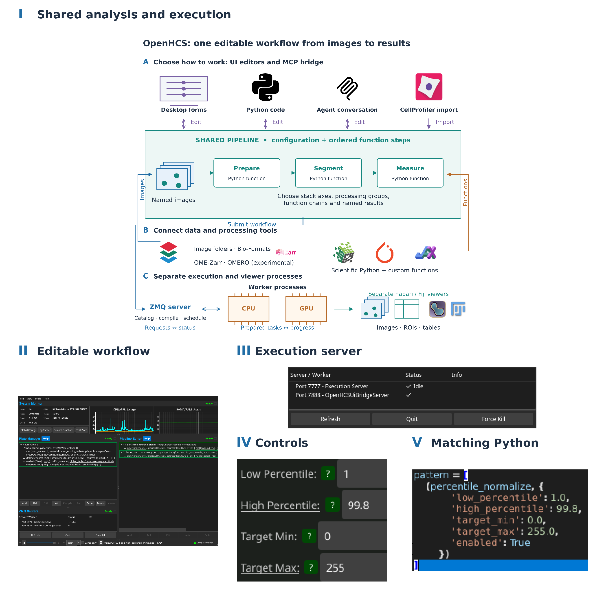
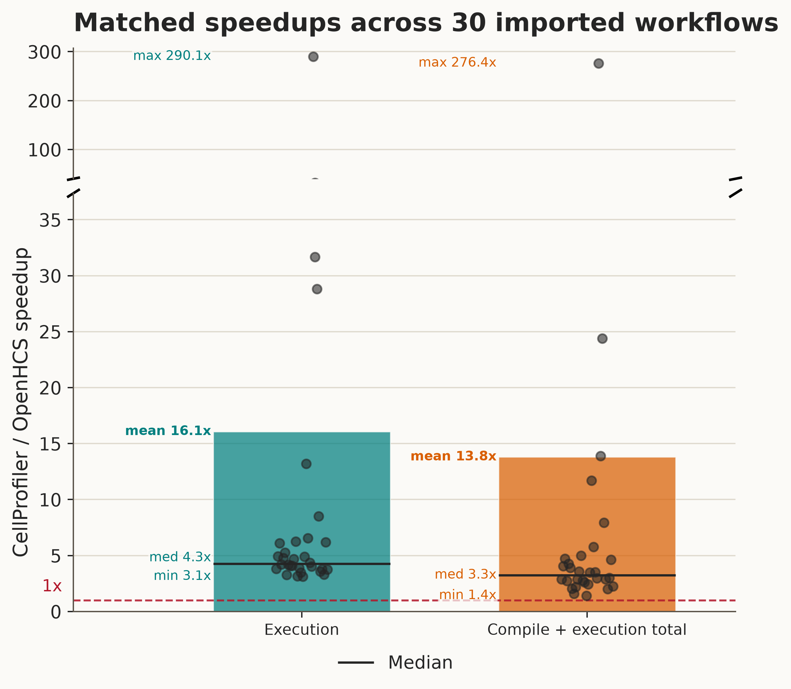
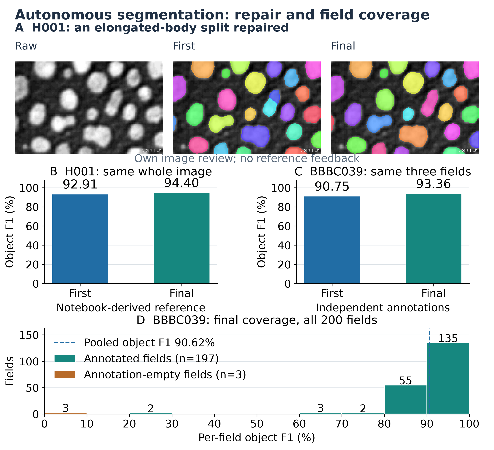
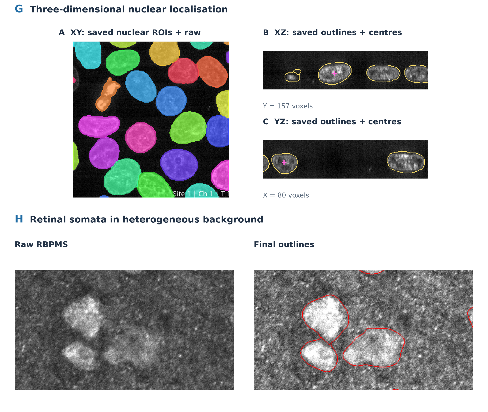
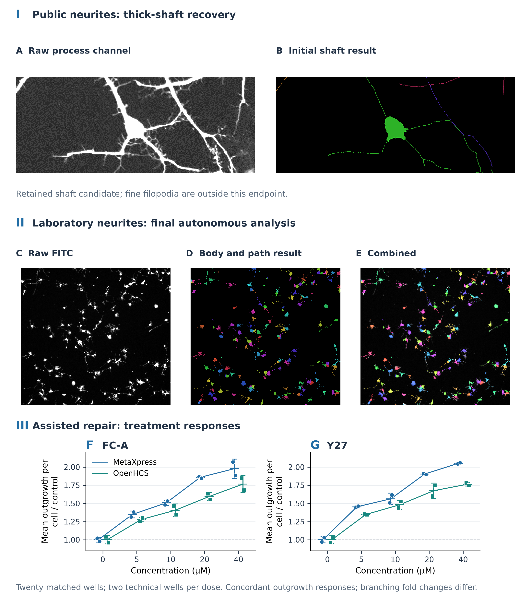

# OpenHCS: autonomous, auditable image analysis for self-driving microscopy laboratories

**Authors:** Tristan Simas, Jathav Puvirajan, and Alyson Fournier

**Affiliation:** McGill University, Montreal, Quebec, Canada

**Correspondence:** Tristan Simas, <tristan.simas@mail.mcgill.ca>

**Short title:** OpenHCS: autonomous microscopy analysis

**Keywords:** microscopy; image analysis; self-driving laboratory; autonomous analysis; agentic AI; high-content screening

## Abstract

Closed-loop microscopy laboratories need image analysis that an agent can perform and a scientist can audit. We developed OpenHCS, an open-source platform in which scientists and agents edit the same pipeline through graphical controls, Python or the Model Context Protocol (MCP). Established CellProfiler workflows and custom Python functions can be combined, with images, segmentation masks and measurements available for inspection in napari and Fiji. All 30 imported CellProfiler workflows passed selected reference-output comparisons, including five supplemented with image or object-label exports. We evaluated autonomy with blind task-only trials: agents constructed and repaired analyses using MCP and packaged guidance, with pipelines frozen before reference comparison and no reference-score feedback. Independent nuclear analyses reached pooled object F1 of 0.898–0.906 across 200 annotated fields, including development fields. A completed 96-well translocation analysis yielded control Z-prime values of 0.849 and 0.726 for two drugs among cells with measurable compartments. Image review showed recovery of retinal cell bodies and principal neurite shafts, with uncertain cell boundaries and unresolved assignment at neurite crossings. Matched single-thread measurements across [pending]{.benchmark-claim key=case_count} workflows showed a minimum execution speedup of [pending]{.benchmark-claim key=execution_min}-fold over native CellProfiler and a median of [pending]{.benchmark-claim key=execution_median}-fold, with no declared-output differences. OpenHCS allows scientists to delegate analysis construction and execution while retaining access to the processing choices and biological results.

## Introduction

Self-driving microscopy laboratories need to turn acquired images into measurements before choosing the next experiment. Identifying the relevant channels, separating cells and neurites from background, and checking the analysis across samples remain difficult to automate. A segmentation that executes successfully can still miss dim structures or divide a cell incorrectly. An agent needs access to images and intermediate results to detect and repair these errors, while a scientist needs to audit the processing choices and the resulting measurements.

OpenHCS addresses the analysis step of this loop, not experiment design or instrument execution. It lets scientists and agents develop, inspect and revise the same pipeline. The analysis remains reusable without reconstructing its settings from the agent's conversation, and its intermediate images and measurements remain available for scientific review.

Laboratory automation already uses shared declarations to connect instruments and software. SiLA 2 standardizes device communication, and the Tecan SiLA2 SDK generates server and client interfaces from annotated software declarations [@Hinkel2023]. Lange and colleagues demonstrated modular SiLA-based infrastructure linking device control and data management, while Courtney and colleagues integrated cell-culture instruments into an out-of-hours autopilot [@Lange2026; @Courtney2025]. Related work has connected liquid handlers to workflow orchestration and linked laboratory assets through shared information models [@Thieme2024; @Rihm2024].

We developed OpenHCS to let scientists and agents build and revise the same microscopy analysis (Figure 1). A pipeline records its processing functions and settings as editable Python, with matching graphical controls. The controls and descriptions available to agents are generated from the functions' parameter definitions. A scientist can therefore open an agent-authored pipeline, change a setting in a control or in code, and run the revised analysis. Established CellProfiler workflows and custom Python functions can be used in the same way.

Fiji/ImageJ, CellProfiler, Icy and BioImageIT provide established processing workflows, while napari supports multidimensional inspection [@Schneider2012; @Schindelin2012; @Carpenter2006; @McQuin2018; @deChaumont2012; @Prigent2022; @Napari]. OpenHCS connects processing and viewing through an editable pipeline that keeps image identities, settings and intermediate results together.

MCMICRO combines interchangeable processing modules for multiplexed tissue imaging [@Schapiro2022]. AI assistants also support executable bioimage analysis: BioImage.IO Chatbot connects community resources with analysis extensions, Omega generates and runs Python within napari, and Agentic-J generates scripts and coordinates Fiji tools with debugging and quality-assurance agents [@Lei2024; @Royer2024; @Johanns2026]. OpenHCS exposes a shared workflow object for agent operation: submitted pipeline documents are validated before analysis execution and remain editable through the scientist's controls and Python interface.

CellProfiler import provides a direct test of workflow preservation: comparing translated `.cppipe` workflows against native CellProfiler tests whether they retain the selected measurements and images.

We evaluated OpenHCS using established CellProfiler workflows and agent-authored analyses of nuclei, cell bodies, neurites and protein translocation. Comparisons with native CellProfiler tested whether imported workflows preserved their selected outputs. Autonomous trials tested whether agents could construct an analysis, inspect its results and correct segmentation errors without access to reference scores. We assessed frozen analyses using annotations, well-level assay responses and matched image review. Separate experiments compared execution and total time across the 30 imported workflows.

### Figure 1. A shared, editable analysis connects agents, scientists and execution

{width=6in}

(I) Forms, Python and MCP act on one workflow; CellProfiler imports and custom functions enter the same definition. The execution server prepares the catalog, compiles pipelines and coordinates workers, with results streamed to separate viewers. CPU/GPU support depends on the selected functions; OMERO support is experimental. (II) Native workflow editor. (III) The real ZeroMQ server browser, captured in OpenHCS 0.8.7. (IV, V) Native controls and Python show matching normalization settings after MCP edits in an OpenHCS 0.8.5 session. The complete editing record and capture provenance are retained in the supplementary package.

### Workflow definition and image sources

An OpenHCS pipeline is an ordered sequence of analysis steps with shared settings. For example, a pipeline can select the nuclear channel, segment nuclei, pass the resulting labels to a measurement step, and display the labeled image alongside its measurements. Each step specifies a Python function or a sequence of functions with their parameters. A step uses shared defaults unless it supplies its own values, called overrides.

Before a run, OpenHCS identifies each step's source images and earlier results, checks their compatibility and prepares the function calls, array conversions and output destinations. This preparation is called compilation. It resolves shared defaults and step overrides into the values needed for execution. Execution units, called workers, receive the prepared plan (Supplementary Figure 2).

The parameter names, types and defaults declared by a Python function form its signature. OpenHCS combines this information with the workflow's current settings to generate on-screen controls and editable Python. Each function also declares which array library it expects, allowing images to pass between compatible CPU, GPU and deep-learning libraries. Volumetric analysis uses functions that support three-dimensional inputs, while two-dimensional functions operate on image planes.

Users can register custom Python functions for use in ordinary pipeline steps. The registered function appears in the editor's function list; its signature and documentation supply parameter controls and the searchable descriptions available through MCP (Supplementary Figure 4).

In the nuclear-segmentation example, a source mapping selects the nuclear channel at each site. Step settings choose Z stacks or individual planes and divide images into processing groups. Grouping by channel lets nuclear and neuronal images use different function chains. Later steps inherit source choices or select different inputs; measurements remain linked to their source images and metadata. Sample, site, channel, plane and time coordinates are recorded separately from storage locations, preserving image identity through stacking and later processing.

Microscope handlers interpret acquisition-specific layouts and metadata. Bio-Formats-backed discovery provides image-plane records from microscopy containers. The OME-Zarr source reads declared axes, channels, pixel scale and image or plate structure. Explicit source mappings assign roles where acquisition metadata are insufficient. Experimental OMERO support supplies managed images and metadata through the same source model.

### Execution, intermediate results and viewers

Each result keeps its connection to the images and processing step that produced it. Steps produce named images, labels, measurements, object relationships and files. For example, a measurement can remain associated with the segmented nucleus it describes. Each function declares its required inputs and available outputs; the compiler connects later operations to the source images or earlier results they need. Named results retain their producing step, source coordinates and processing group. Saving a result and sending it to a viewer are independent choices (Supplementary Figure 3).

napari and Fiji receive selected outputs together with their source coordinates and producing step. The streaming service checks that each viewer is ready and waits for pending display updates to finish. Viewer sessions remain available for inspection after execution. Local files, in-memory data, Zarr-backed stores and OMERO provide storage routes; the OME-Zarr array source is read-only.

The execution server coordinates analysis runs and remains available between requests. Within a run, each worker processes its assigned samples using the prepared plan and reuses loaded libraries and initialized array backends. Worker resources are released when that execution finishes. Worker count controls how many samples can be processed concurrently. Workers normally run in separate processes; a configuration option selects threads instead.

### Agent access through MCP

Through MCP, an AI client requests defined operations for discovering functions, editing and validating pipelines, running analyses, and inspecting progress and results [@MCP]. Each operation's declaration specifies its request and result types, implementation, changes it can make, data access and security requirements. The MCP interface is generated from these declarations, which also govern execution.

Function-discovery operations return descriptions derived from registered processing functions. An agent uses those descriptions to select functions and edit the shared workflow. Registering an additional function makes it available through the existing catalog and workflow operations without requiring a function-specific MCP tool.

Deployment profiles determine which operations are available. Desktop operations edit and run workflows in the live application; headless operations run without the graphical interface in a separate execution context. Local clients communicate with the MCP server through standard input and output. Desktop access uses an authenticated connection, and revision checks detect edits based on an outdated workflow state. Filesystem reads and writes are restricted to permitted locations. The hosted HTTP service provides a selected read-only subset in isolated server-side workspaces.

### Reusable workflow infrastructure

The mechanisms that turn declarations into interfaces and coordinate execution are packaged for reuse independently of the microscopy functions (Supplementary Table 1). Eight libraries discover implementations, read function definitions, track settings, generate controls and Python, convert arrays, route stored results and coordinate processes. OpenHCS supplies the microscopy functions, configurations, source handlers and viewer integrations. New processing functions use these shared mechanisms when they enter the workflow.

### Agent-operated analysis

The recorded run used Codex 0.146.0 with gpt-5.6-sol on Linux, connected by local stdio MCP to the desktop profile of OpenHCS 0.7.13 in a source-checkout virtual environment. The input was field 1 from the public NeuronCyto II dataset [@NeuronCytoII], comprising two 800 x 800-pixel, unsigned 8-bit TIFF images. Both were assigned to one biological image, with separate neuronal/neurite and soma/nuclear channels. Supplementary Data 4 identifies the software revision, input checksums and exact task prompt.

The prompt requested normalization, dim-neurite enhancement, segmentation and per-neuron morphology measurements, with saved images, regions of interest (ROIs), graph paths, SWC neuron-morphology files, tables and a reviewable napari presentation. It authorized changes to a dedicated desktop session and writes under the stated output directory, and instructed the agent not to use shell commands or inspect the repository. The client's approval checks and operating-system sandbox were disabled for this run. Compliance with the MCP-only instruction was assessed from the tool trace: no non-MCP calls or subsequent human interventions were recorded.

The event trace was used to count attempted calls, returned errors and subsequent corrections (Supplementary Data 4). Agent wall time was measured from the recorded start and end timestamps; pipeline execution time was reported separately. Checks covered completed execution, saved files, editable pipeline source, and delivered viewer outputs and coordinates. Subsequent review examined the saved object outlines and the published NeuronCyto II manual-tracing measurements for image 1 [@NeuronCytoII]. Supplementary Data 4 records these reference values separately from the agent's execution checks; object-level segmentation and tracing accuracy remain to be scored.

### Prospective agent-authored assay evaluation

Three public BBBC assays were prepared before separate pipeline-authoring trials. A fresh gpt-5.6-sol agent received a bounded development partition, the biological task, channel identities, the OpenHCS desktop and MCP endpoints, and a result directory. Reference annotations, treatment metadata, held-out images, evaluation code, prior trial pipelines and repository source were withheld. The agent used registered functions through the connected desktop. Its scientific functions and parameters were frozen before the held-out path was disclosed; the held-out run changed only the input and result roots. These are single prospective attempts rather than repeated estimates of agent reliability. The corpus manifest binds the original archives, converted inputs, partition assignments and evaluation artifacts (Supplementary Data 7).

BBBC039 supplied four development and 50 held-out fields with independent nuclear instance annotations. One-to-one matching used an intersection-over-union threshold of 0.5; reported measures include object precision, recall and F1, foreground Dice, signed count error, and explicitly defined split and merge diagnostics. BBBC007 supplied four development and 12 held-out DNA/actin fields with manual outlines. Its directed boundary measure reports the fraction of predicted adjacent-cell boundary pixels within two pixels of the manual-outline union. The outlines do not provide exhaustive object correspondence, so this score is not an instance-accuracy estimate.

BBBC013 supplied four development and 92 held-out wells from a two-drug FKHR-GFP translocation assay. The frozen endpoint was the per-well mean of cell-level mean nuclear GFP divided by mean cytoplasmic GFP. Each cell required the same retained object identity in the nuclear and cytoplasmic measurements. Z-prime used sample standard deviations across the four positive and four negative control wells for each drug; cells were not treated as independent replicates. BBBC013 provides treatment truth rather than manual segmentation truth. Prediction bytes were frozen before the evaluator opened held-out annotations or treatment metadata. The exact pipelines, typed score receipts, limitations and infrastructure repairs are retained in Supplementary Data 7.

### CellProfiler import and reference-output comparison

CellProfiler `.cppipe` files are parsed into modules and settings. Setup modules define image sources; registered processing and export modules become editable OpenHCS steps. Each module declaration specifies the images, objects, measurements and relationships its function needs, together with whether it runs per image group or across the plate. The same function is exposed in the GUI, Python and MCP.

Named images and objects connect imported measurements to their inputs, as illustrated by the Comet Assay (Supplementary Figure 13). For the advanced segmentation and 3D monolayer tutorials, reloading generated Python checked preservation of function identities and parameters [@CellProfilerTutorials]. Supplementary Data 5 provides their step sequences and source records.

Comparisons use absolute and relative tolerances of `1e-6` for numerical values and image pixels, with no out-of-tolerance pixels; identifiers and categorical values are compared exactly after documented CellProfiler-compatible normalizations. Object-label images are compared exactly after singleton-axis normalization. For five workflows lacking exports, terminal image or object-label exports supplied reference artifacts without changing their processing settings. Supplementary Data 1 records export definitions, output inventories, software versions and historical release-CI results; Supplementary Data 2 documents the imported corpus and setting coverage.

### Task-only authoring and independent repair

The primary outcome is the author's final frozen result after its own inspection
and repairs. Self-directed iteration remains autonomous when the author receives
no external scientific corrections or reference feedback. First-attempt results
describe initial method selection and the extent of repair, not the criterion
for autonomous success. Continuations receiving external scientific corrections
provide assisted-development evidence and are reported separately.

Separate trials evaluated whether a fresh gpt-6.1-sol agent could choose and revise an analysis using the task brief, packaged OpenHCS skill and MCP. The skill describes function discovery, image measurements, preprocessing and visual review; it does not supply the evaluated images' reference labels or accepted settings. Authors inspected their own inputs and intermediate results, retaining pipeline attempts, tool calls and matched image-only, result-only and combined views. The coordinator evaluated frozen predictions after authoring ended, without returning reference scores to the authors. These trials are distinct from the earlier three-assay held-out evaluation (Supplementary Data 8).

We compared first completed scientific settings with the final settings on exactly the same inputs. Technical corrections needed to submit or execute a pipeline remain part of the record; the first completed prediction is not necessarily the first tool call. H001 used a single notebook-derived bright-object image and its predeclared computational label reference. BBBC039 used independent nuclear annotations, with a paired first/final comparison on three fields and a separate final evaluation across all 200 fields. Some of those fields were inspected during development, so the 200-field result measures reference agreement rather than unseen generalization. Existing instance scorers used one-to-one matching at intersection over union at least 0.5.

For BBBC039, we also scored the frozen final predictions on fields whose images
were not opened by the analysis agents. Original image-delivery records excluded
25 fields opened by at least one of the three agents, leaving a common 175-field
comparison. This retrospective subset is distinct from the prospectively
withheld images above. Supplementary Data 8 records the exclusions, frozen
predictions and each trial's wall time, model and software versions. We report
recorded input, cached-input and output tokens as computational usage. For
selected independent trials, the supplement also estimates API-dollar and
Codex-credit equivalents at published rates observed on 6 October 2026.
These rate scenarios are not actual subscription charges; billing amounts
were not recorded.

### Performance measurements and reproducibility

The matched single-sample evaluation used CPU execution with one worker and one numerical thread on one physical core. OpenHCS revision [pending]{.benchmark-claim key=source_revision} ran with Python 3.12; native CellProfiler 4.2.8.1 ran with Python 3.9 in its separate environment. Each workflow used one selected source well or sample, which can contain multiple image sets, with unchanged processing settings and the declared comparison outputs. A warmup preceded three measured repetitions. Complete retained native observations were reused only after the workload, inputs, outputs, software environment and hardware checks passed; OpenHCS observations were acquired on the same clean source revision across all 30 workflows.

Execution timing covers the native pipeline call, including preparation of the run and groups, module processing and post-run work; OpenHCS timing covers the complete server execution job, including ordinary output publication and plate exports. Process, JVM and execution-server startup, function-library readiness, warmup and scientific comparison are excluded. The separate total metric compares the prepared native invocation with the sum of disjoint OpenHCS client compilation and execution submission/wait phases. Nested server and worker durations are not added again. Each workflow's speedup is the ratio of the two engines' independently calculated median durations; the reported cohort median is the median of those 30 ratios. Original reports, summaries, source checksums and figure provenance are retained with the matched benchmark record.

Historical performance protocols and their different timing and output policies are retained in the supplement. They are not combined with the matched execution and total-time comparisons.

## Results

### Scientists and agents can revise the same analysis

The desktop interface, generated Python and MCP operations read and modify the same workflow definition (Figure 1). A pipeline created by an agent can be opened in the editor, revised by a scientist and run again. Source mappings connect folders, Bio-Formats containers and managed images to named inputs. Intermediate images and measurements retain their source coordinates and producing step, allowing a displayed result to be traced back to its processing choices.

A recorded authoring check demonstrates this connection directly (Figure 1). An MCP request applied edited Python to the normalization step, changing its high percentile from 99.8 to 99.6; the control then showed 99.6. A subsequent MCP field-edit request restored 99.8, and regenerated Python contained that value. The full application view, parameter controls and function-code window were captured in the same session, using the source commit released as OpenHCS 0.8.5. Forms show the values that will be used, including shared defaults; clearing a step's override restores its shared setting.

The UI submits work to a separate execution server using ZeroMQ messaging. The server prepares the function catalog, compiles the workflow and coordinates workers. Workers execute the prepared steps and stream selected results to separate napari or Fiji processes, while progress returns through the server to the UI (Figure 1I).

Scientists can inspect streamed images and objects in Fiji or napari (Supplementary Figure 14). napari also exposes layer and ROI information to agents; selected objects remain linked to their measurements (Supplementary Figure 3).

### Prospective held-out assay analyses

The earlier prospective trials recovered nuclear foreground and translocation responses but over-segmented nuclear instances and left uncertain actin-defined boundaries. On held-out fields, BBBC039 pooled object F1 was 0.746 and foreground Dice was 0.935; BBBC007's directed boundary fraction was 0.671. Across 92 BBBC013 held-out wells, control Z-prime was 0.751 for Wortmannin and 0.554 for LY294002. These single-attempt trials are distinct from the later self-repair evaluations below. Supplementary Figure 6 and Supplementary Data 7 provide counts, scoring definitions and treatment summaries.

### Imported CellProfiler workflows match the compared reference outputs

All 30 workflows passed selected reference-output comparisons in one unified current-source run, with zero reported differences. The selected reference profiles comprised 21 with CSV measurements, three with SQLite measurements and CellProfiler Analyst properties, and six containing only retained images or arrays. The five supplemented workflows contributed five object-label images and three numerical images. All five label images matched exactly after singleton-axis normalization, and all three numerical images passed with zero out-of-tolerance pixels. Supplementary Data 1 identifies every selected output and preserves the unified observations and source identity.

Image comparison executed for seven workflows: six image- or array-only profiles and the completed translocation example, whose overlay was compared alongside its SQLite measurements. Supplementary Figure 13 shows how named images, objects and operations are retained in the imported Comet Assay.

The assays include DNA-damage measurement, human and Drosophila cell morphology, tumor morphology, Cell Painting morphology and quality control, protein translocation, wound healing, time-lapse tracking, imaging flow cytometry, colocalization, positive-cell classification, yeast screening, and *C. elegans* phenotyping. Supplementary Data 1-2 identify the workflows and imported settings.

The archived coverage tables list 58 distinct module names and 7,158 setting rows. They record whether a setting supplies a function parameter, an input/output requirement, an infrastructure option, or is intentionally ignored. Coverage describes how configurations are imported; the comparison results assess their outputs. Database export remains an ordinary terminal workflow step, using the same measurements and source identities as preceding steps.

The advanced segmentation and 3D monolayer imports retain their named structures, measurements and processing sequences in editable Python (Supplementary Data 5).

### Matched execution and total time across 30 workflows

The matched single-sample evaluation used [pending]{.benchmark-claim key=case_count} workflows from record [pending]{.benchmark-claim key=record_name}, production revision [pending]{.benchmark-claim key=source_revision}. Its publication status is [pending]{.benchmark-claim key=status}. Declared-output comparisons passed in the warmup and three measured repetitions (Figure 2A). The minimum execution speedup over native CellProfiler was [pending]{.benchmark-claim key=execution_min}-fold and the median was [pending]{.benchmark-claim key=execution_median}-fold (Figure 2B).

Compile-plus-run total speedup had a minimum of [pending]{.benchmark-claim key=total_min}-fold and a median of [pending]{.benchmark-claim key=total_median}-fold (Figure 2C). This comparison includes OpenHCS compilation and client coordination, separately from execution. Exact per-workflow times and the clock definitions accompany the same record.

Measured multi-worker efficiencies and single-core amortization are reported separately in Supplementary Figures 16–17.

### Figure 2. Matched single-sample speedup over native CellProfiler

{width=6in}

\(A) Declared-output comparisons passed for [pending]{.benchmark-claim key=case_count} workflows; this is workflow parity, not biological segmentation accuracy. (B) Execution and (C) total speedup use one selected source sample, one worker and one numerical thread. Curves show the fraction at or above each threshold on a logarithmic axis; dashed lines denote twofold execution speedup and total-time parity. Ratios use independent engine medians from three repetitions after warmup. Minimum and median execution speedups are [pending]{.benchmark-claim key=execution_min}-fold and [pending]{.benchmark-claim key=execution_median}-fold; corresponding total speedups are [pending]{.benchmark-claim key=total_min}-fold and [pending]{.benchmark-claim key=total_median}-fold. Record [pending]{.benchmark-claim key=record_name}, revision [pending]{.benchmark-claim key=source_revision}, status [pending]{.benchmark-claim key=status}, supplies all panels and manuscript claims. Timing definitions and provenance are retained with that record.

### Autonomous analysis across distinct biological tasks

Agents used only a task brief, the packaged skill and MCP to select parameters,
inspect matched raw and result views, and repair their own pipelines. The final
pipeline was frozen before reference evaluation. The examples below distinguish
instance detection, localisation, cell-body support and assay measurements;
these endpoints should not be combined into a single accuracy percentage.

For bright-object segmentation, the H001 author matched 59 of 64
notebook-reference objects while reducing excess predictions from four to two,
raising object F1 from 0.929 to 0.944 (Figure 3). The reference is computational,
not a manual cell census. Independent BBBC039 authors achieved final pooled
object F1 of 0.898–0.906 over the same 200 annotated fields. On the common
175 fields opened by none of the three agents, final F1 was 0.906–0.910.
The lower-scoring
fields show that useful overall agreement does not imply uniform accuracy.

In three dimensions, a measurement-first author recovered all 15 annotated
centres within the predeclared 30-voxel matching distance, with mean matched
error of 4.80 voxels (Figure 4). All 15 also matched within 20 voxels.
Eleven further predictions were unmatched to annotations of unestablished
coverage. Native orthogonal views reveal supported body locations and remaining
lobed-body ambiguity; a separate author repaired an internal partition without
merging the neighbouring body (Supplementary Figure 9).

Paired DNA/actin analysis separates nuclear detection from supported cell-body
growth (Supplementary Figure 11). A completed autonomous field analysis
recovered 56 nuclei and retained 54 actin-supported cells after removing two
seed-only candidates. Every retained cell contains all pixels of its associated
nucleus. This is a geometric consistency check, not proof of biological identity
or complete cell boundaries. Local controls include recovered crowded nuclei
and unsupported body candidates.

In the noisy retinal images, agents detected bright RBPMS-positive cell bodies
against heterogeneous background. Supplementary Figure 10 shows an agent
repairing a divided cell body while keeping a neighbouring pair separate;
its final segmentation contained 102 objects. A separate completed analysis
retained 136 candidates, including ten touching the image border
(Supplementary Data 8). Diffuse rings and crowded outlines remained uncertain
(Supplementary Figure 10). No exhaustive manual count was available, so retinal
performance was assessed by comparing the detections with the underlying
signal in several regions rather than assigning an accuracy percentage.

For public neurite images, autonomous analysis recovered principal shafts and
raw-supported junctions (Supplementary Figure 12). Main-shaft coverage is the
relevant illustrative endpoint: exhaustive filopodial tracing is not required.
Additional threshold lowering can add uncertain short twigs without improving
that endpoint. Crossings remain a limitation for assigning length to individual
neurons. The representative shaft result is not presented as a manual-trace
accuracy measurement. Its inputs matched the published NeuronCyto II image-1
field, but the manual-reference tables did not specify length units and the
available reference lacked spatial traces for matching (Supplementary Data 8).

A separate autonomous author analysed all nine fields of the laboratory neurite
dataset using only its task brief, MCP and packaged guidance. During image
review, it detected that its initial settings excluded thin processes and
adjusted neurite admission while retaining the same cell-body labels in the
reviewed field. The final analysis recovered many raw-visible paths in sampled
sparse and dense regions, although some fine branches and cell assignments at
crossings remained uncertain. Fields were analysed separately; overlapping
positions were not deduplicated, so their counts do not represent unique
neurons. The frozen pipeline, outputs and independent image review are linked
in Supplementary Data 8. This trial used development images rather than an
unseen test set.

Supplementary Data 8 separately reports an assisted stitched-mosaic analysis of the laboratory dataset.

The public BBBC013 translocation analysis completed all 96 wells. It retained
14,631 of 17,320 detected nuclei with eligible cytoplasmic compartments (84.5%).
The agent selected each well's median eligible-cell log2 nuclear-to-cytoplasmic
GFP ratio; the task brief did not prescribe this summary. All 96 wells include
the four development wells. Four wells contribute to each treatment group. Control Z-prime was
0.849 for the LY294002 block and 0.726 for the Wortmannin block (Figure 4).
Eligibility varies with treatment, so the response describes contributing cells,
not an unbiased estimate for every detected cell. Supplementary Figure 6 shows complementary
compartment-level inspection from assisted development. Frozen records and
individual unsuccessful attempts remain in Supplementary Data 8 rather than
being treated as additional experiments.

| Input and task | Evaluation evidence | Supported result and limit |
|---|---|---|
| H001 bright objects | Pinned notebook labels; 64 objects | First/final object F1 0.929/0.944 in the Figure 3 trial; computational, not manual biological truth |
| BBBC039 nuclei | Independent instance annotations; 200 fields and common 175 image-uninspected fields | Three agents' final pooled F1 0.898–0.906 on all fields and 0.906–0.910 on the retrospective uninspected subset |
| BBBC007 DNA/actin | Manual-outline union; 16 fields per author | Two final authors' directed boundary fractions 0.740–0.743 within two pixels; not boundary recall or exhaustive instance accuracy |
| H002 3-D centres | 15 manual centres; Figure 4 trial | 15/15 matched within the primary 30-voxel distance, mean error 4.80 voxels; annotations not established as exhaustive |
| R0010 retinal somata | Distributed matched raw/result review | Autonomous repair retained neighbours and reduced nuisance masks; manual-reference accuracy unmeasured |
| H004 public neurites | Matched raw shafts and nuisance controls | Principal-shaft and junction recovery; fine protrusions and per-neuron crossing ownership unresolved |
| Laboratory neurites, nine fields | Matched raw/path review in three sampled fields | Autonomous completion and recovery of thin paths after self-directed repair; overlapping fields not stitched or deduplicated, per-neuron ownership unresolved |
| BBBC013 translocation | Well-level control and dose summaries; 96 wells | Assay responses recovered in contributing cohorts; compartment coverage varied and whole-cell accuracy unmeasured |

Table 2. Results and evaluation methods for autonomous image analysis.
Rows summarize the reported trials, not a newly pooled benchmark or a ranking
of assays. Reference comparisons followed pipeline freezing and were not
returned to authors. Visual-review rows do not supply a numerical accuracy
estimate. First/final comparisons and independent repeats remain distinct;
Supplementary Data 8 retains their exact inputs, predictions and evaluations.

Table 2 summarizes each task's endpoint and scope; Supplementary Data 8 retains frozen attempts and independent evaluations.

### Figure 3. Autonomous image review improves nuclear segmentation

{width=6in}

\(A) Matched H001 raw images and initial/final overlays show correction of a split elongated nucleus without reference feedback. (B) Whole-image agreement with a notebook-derived reference: excess predictions fall from four to two, while 59 of 64 reference objects remain matched and five remain missed. (C) BBBC039 pooled object F1 on three development fields against independent annotations. (D) Final scores across all 200 fields, including three annotation-empty fields and the low-score tail. The dashed line denotes pooled F1 rather than the mean of field scores; matching requires intersection over union of at least 0.5. Initial results precede the author's self-directed revisions. Colours do not identify objects across attempts. Wider views and capture records are retained in Supplementary Figure 8. These development comparisons do not establish held-out generalization or isolate the contribution of the skill.

The independent full-200 repeat reached pooled F1 0.898 versus 0.906 for the
run plotted above: 61 fields improved, 123 decreased and 16 were unchanged
(Supplementary Figure 15). This repeat retains useful agreement but shows that
within-run repair does not guarantee a better result from the next fresh author.

### Figure 4. Autonomous analysis recovers an assay response and three-dimensional nuclear positions

{width=6in}

(I) BBBC013 dose-response panels show mean and sample standard deviation across four well-level median eligible-cell log2 nuclear-to-cytoplasmic GFP ratios per dose; dots represent wells. Concentration units differ between drugs. All 96 wells include the development wells; treatment-dependent compartment eligibility is shown in Supplementary Figure 6. (II) Native XY nuclear extents and XZ/YZ centre views, with independent matching to 15 manually annotated centres after freezing. Fourteen centres matched within 10 voxels and all 15 within the predeclared 30-voxel distance; mean error was 4.80 voxels. Eleven predictions remained unmatched to annotations of unestablished coverage. This supports localisation, not validated cell boundaries. Physical calibration is unverified. Supplementary Figure 9 retains the complete matching panel; Supplementary Data 8 identifies the distinct trials, captures and score receipts.

### Figure 5. Autonomous neurite analysis on public and laboratory images

{width=6in}

(I, A–C) Matched NeuronCyto II process-channel view and the H004 author's first and final results [@NeuronCytoII]. Lowering the admission threshold retained principal shafts but added uncertain short twigs; colours represent assigned identities, not independently established ownership at crossings. The first result is a predecessor, not a substituted final endpoint. (II, D–F) Byte-identical native captures from the final P001 autonomous analysis show raw FITC, body/path output and their combination at matched site-1 coordinates. The run completed all nine fields without stitching or overlap deduplication. These views illustrate recovery and remaining ambiguity, not a manual-reference accuracy score. Supplementary Data 8 retains the distinct frozen pipelines and wider review; the assisted mosaic is confined to Supplementary Figure 12.

## Discussion

OpenHCS supplies an autonomous, auditable analysis component for imaging-based self-driving laboratories. It connects agent-authored processing choices to the images and measurements a scientist needs to evaluate, while keeping the pipeline editable as the biological sample or experimental question changes. Experiment selection and instrument control remain the responsibility of the surrounding laboratory system.

Workflow reuse can reduce the setup required for a new experiment. A laboratory can import a CellProfiler analysis, adjust its source mapping and parameters, add an assay-specific Python function, and inspect the resulting masks in Fiji or napari before processing further samples. Pipelines can also be authored directly in OpenHCS. Keeping the processing choices explicit provides a basis for review as analysis methods and experimental conditions change.

The evaluations show preservation of selected CellProfiler outputs and useful agent-authored analyses of nuclei, neurite shafts and translocation. Agents repaired errors through image review without reference-score feedback, but the remaining errors differed by task: over-segmentation, uncertain boundaries and incorrect assignment at crossings. Agreement across the 200-field nuclear corpus was useful but uneven. Retinal repair also showed that correcting one region can merge neighbours elsewhere. Distributed inspection and task-specific endpoints are therefore important even when a pipeline executes and recovers the expected structures.

The appropriate endpoint also depends on the experiment. Principal neurite shafts can be recovered without tracing every fine protrusion, whereas assigning length to individual neurons requires resolving crossings. For translocation, the completed 96-well analysis recovered control separation and dose-dependent response among cells with measurable nuclear and cytoplasmic compartments. Treatment-dependent compartment eligibility limits interpretation of the entire cell population. Retinal images lacked exhaustive manual annotations, and their heterogeneous background left some cell outlines uncertain. These distinctions prevent a useful result for one measurement from being treated as evidence for every aspect of segmentation.

Repeated trials with additional models, assays and expert-reviewed images will be needed to estimate how often an agent produces an acceptable analysis on a new experiment. The present trials do not isolate the effect of the packaged guidance or establish uniform performance across images. Further comparisons can extend CellProfiler import testing to additional settings and assess throughput with matched outputs. Channel selection, processing parameters and intermediate results remain available for review when a pipeline is transferred to new samples.

Scientists can therefore delegate pipeline construction and execution while retaining the ability to inspect results in familiar viewers and revise the analysis through graphical controls or Python.

## Supplementary Data

The supplementary package indexes retained files and describes their fields and interpretation. Archive DOI: [pending Zenodo publication].

1. **CellProfiler workflow comparison:** unified 30-workflow current-source observations, reference inventory and exact run provenance; historical OpenHCS 0.8.5 release-CI evidence; the five-workflow export definitions and per-artifact audit; and separate historical timing records.
2. **CellProfiler coverage:** module-to-workflow associations, individual setting handling, and archived processing-registration coverage.
3. **Worker and memory measurements:** measured execution and memory by workflow, worker count and repeated-image assignment count, including completion status.
4. **Recorded agent workflow:** evaluated client, model and software versions; input checksums; exact prompt; tool trace and error counts; original outputs; and separately identified later corrections.
5. **Complex CellProfiler workflows:** source-derived step sequences, function-call counts and editable Python for advanced segmentation and 3D monolayer analysis.
6. **Workflow regression tests:** representative configuration, generated-Python and compiler-validation checks, with source and CI-job references.
7. **Prospective agent-authored assays:** frozen pipelines and held-out score receipts for BBBC039, BBBC007 and BBBC013, with quantitative results and operational findings.
8. **Task-only authoring and independent repair:** first/final reference agreement on the same inputs, full-corpus BBBC039 coverage, computational versus biological reference definitions, and retained post-freeze evaluation receipts.

## Code and Data Availability

OpenHCS source code: <https://github.com/OpenHCSDev/OpenHCS>.

OpenHCS documentation: <https://openhcs.readthedocs.io/>.

The supplementary archive contains the figure inputs and generation scripts, frozen analysis pipelines, scoring records and benchmark evidence. Archive DOI: [pending Zenodo publication]. Repository copies are available at <https://github.com/OpenHCSDev/openhcs/tree/main/paper/supplementary> and <https://github.com/OpenHCSDev/openhcs/tree/main/benchmark/results>.

The benchmark uses biological images and pipelines distributed by the CellProfiler project rather than OpenHCS-authored benchmark data. Original sources:

- official CellProfiler example pipelines and images: <https://github.com/CellProfiler/examples> [@CellProfilerExamples]
- official CellProfiler tutorial pipelines and images: <https://github.com/CellProfiler/tutorials> [@CellProfilerTutorials]
- CellProfiler 4 benchmark supplement: <https://github.com/carpenterlab/2021_Stirling_BMCBioInformatics> [@Stirling2021]

The benchmark manifest pins the source collections. The selected matched record, [pending]{.benchmark-claim key=record_name}, retains the measured repetitions, original reports and figure inputs. Earlier unified comparisons and OpenHCS 0.8.5 release-CI evidence remain separately identified in the supplementary archive; they are not combined with the final matched timing record.

Supplementary Table 1 links the source repositories for the eight reusable libraries.

## Acknowledgements

We thank the CellProfiler project, its contributors, and the authors of the underlying biological datasets for making the example, tutorial, and benchmark materials available.

## Author Contributions

[To be confirmed by the authors: assign contributions to the final author list.]

## Funding

[To be confirmed by the authors: list applicable funding bodies, grants and fellowships, or confirm that no specific funding supported this work.]

## Declaration of Competing Interests

[To be confirmed by the authors: disclose relevant financial or personal relationships, or confirm that there are no competing interests to declare.]

## Declaration of generative AI and AI-assisted technologies in the manuscript preparation process

OpenAI Codex was used to assist with manuscript organization, prose revision and reproducible figure-assembly code under the corresponding author's direction. The autonomous analyses evaluated in this study are described separately in Materials and Methods. [Before submission, the authors must confirm their review of the text, citations and figures and their responsibility for the final manuscript.]
