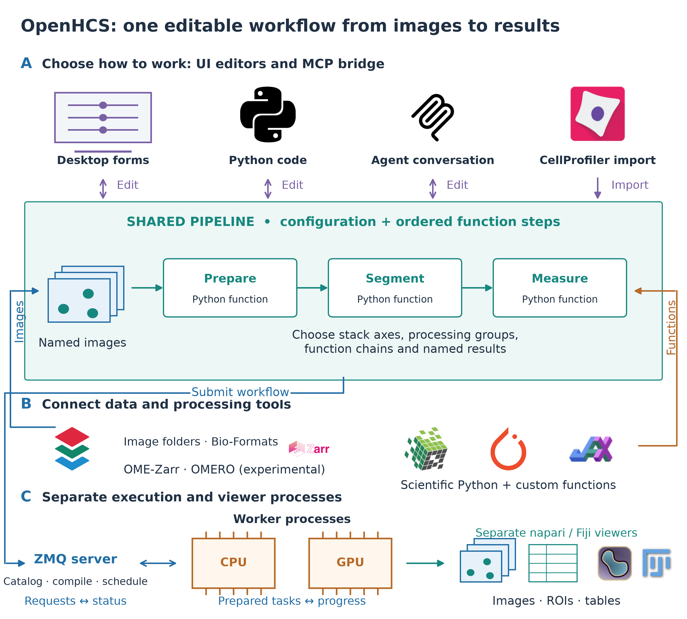
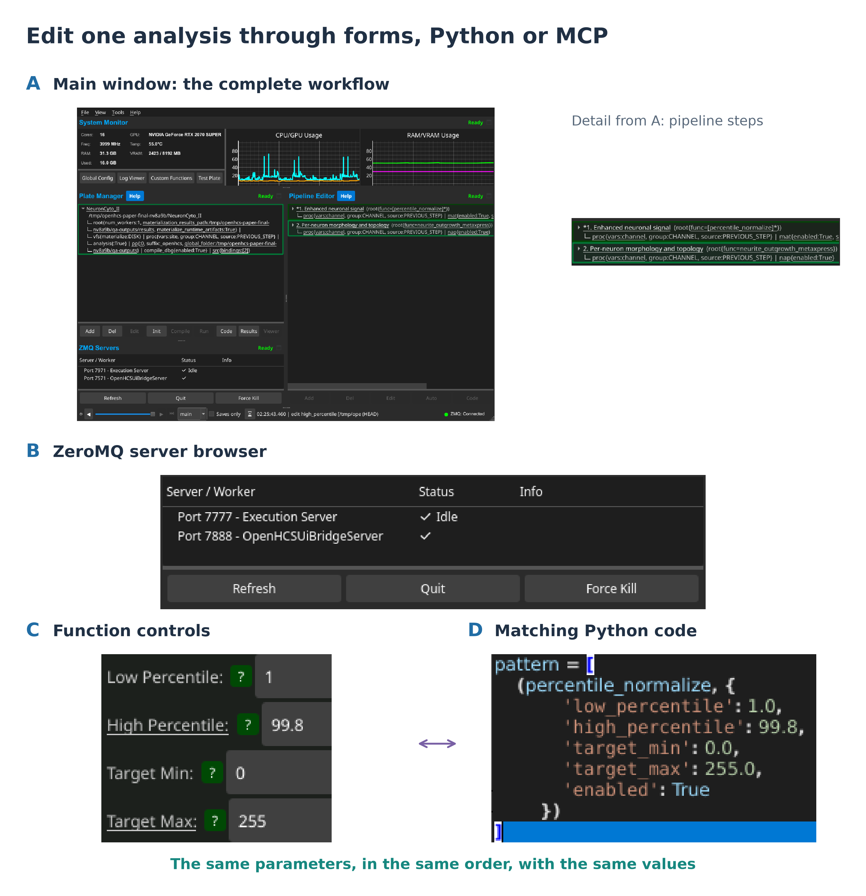
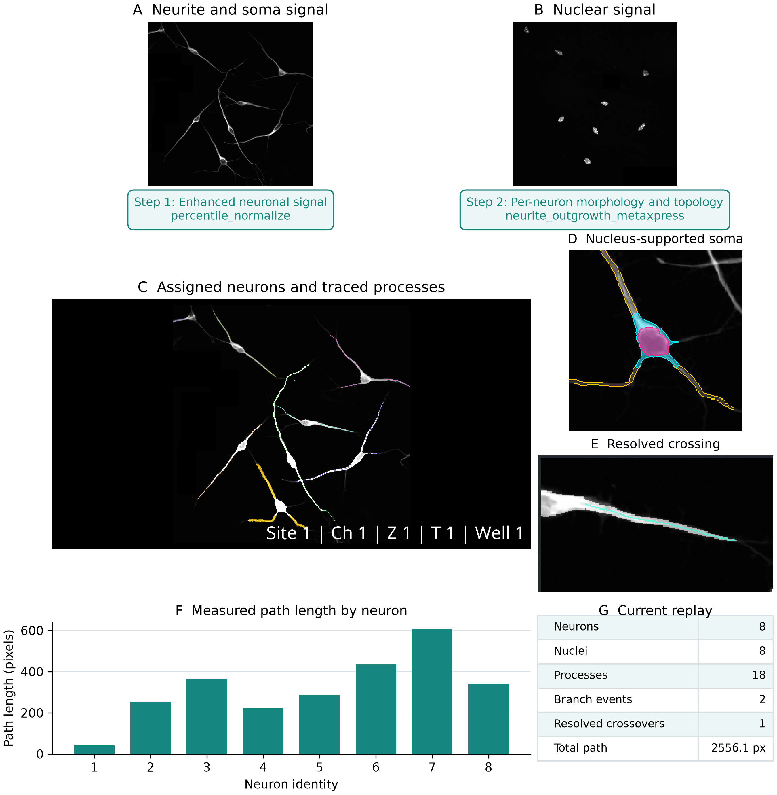
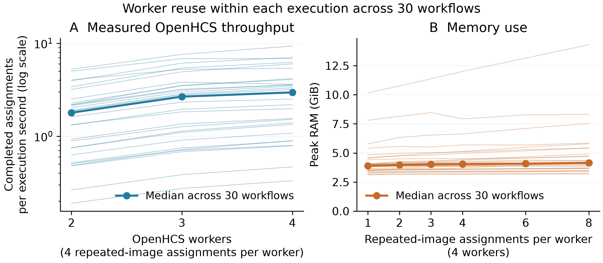
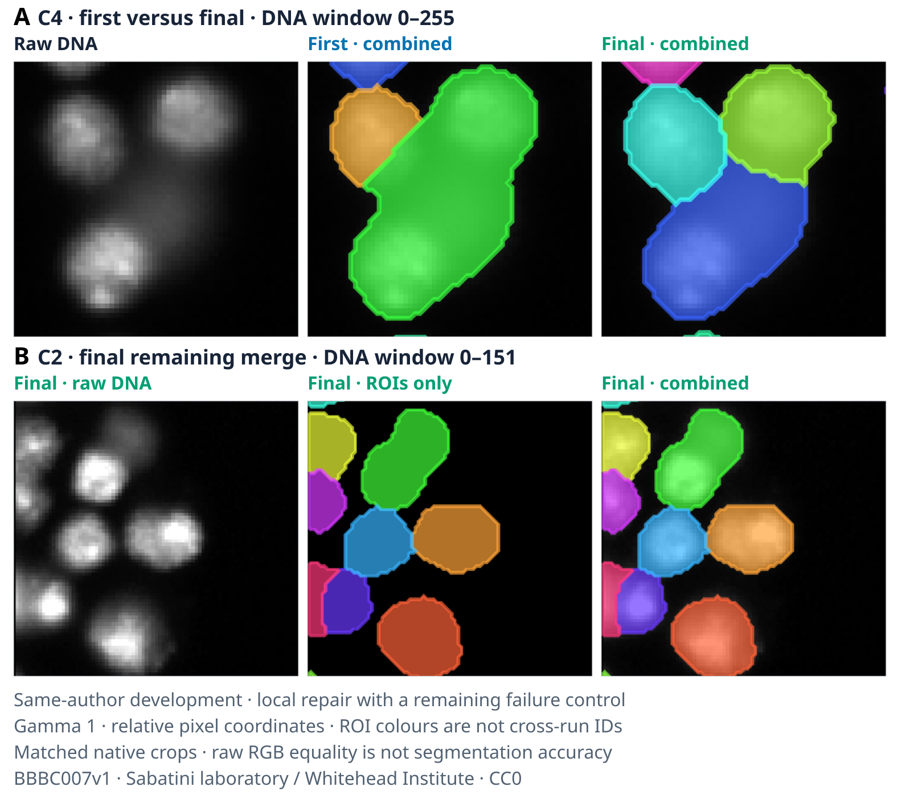
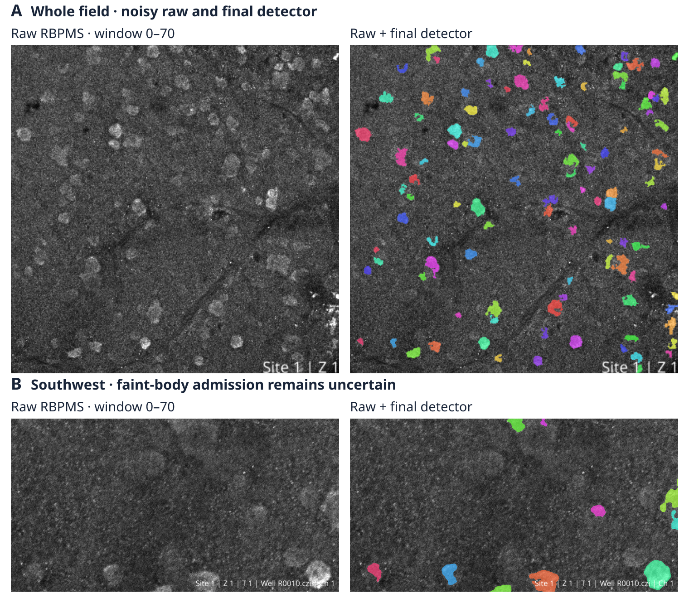
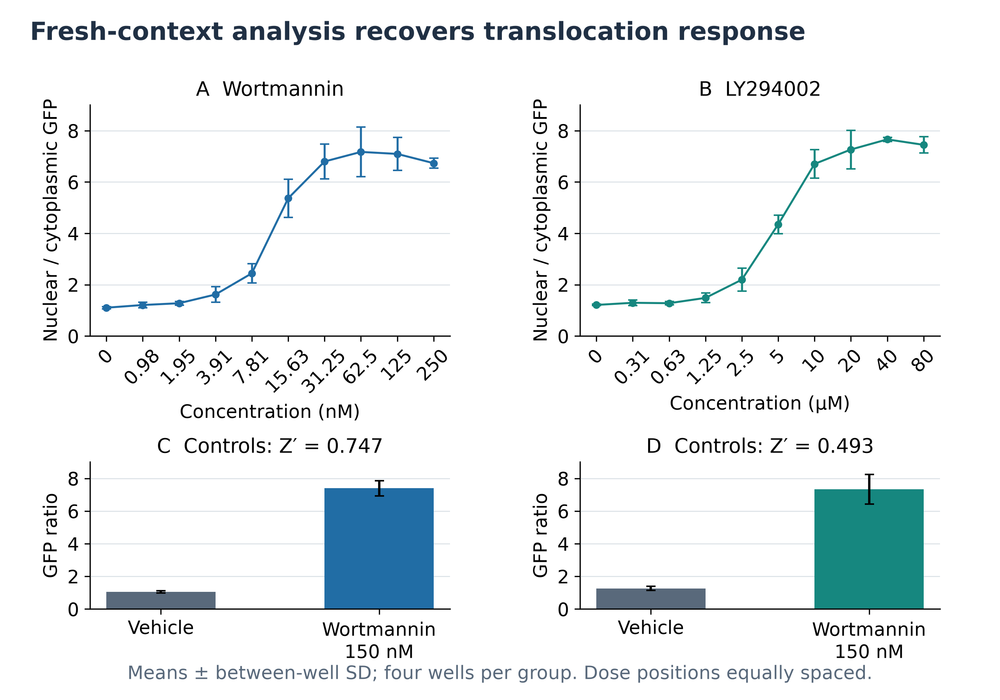
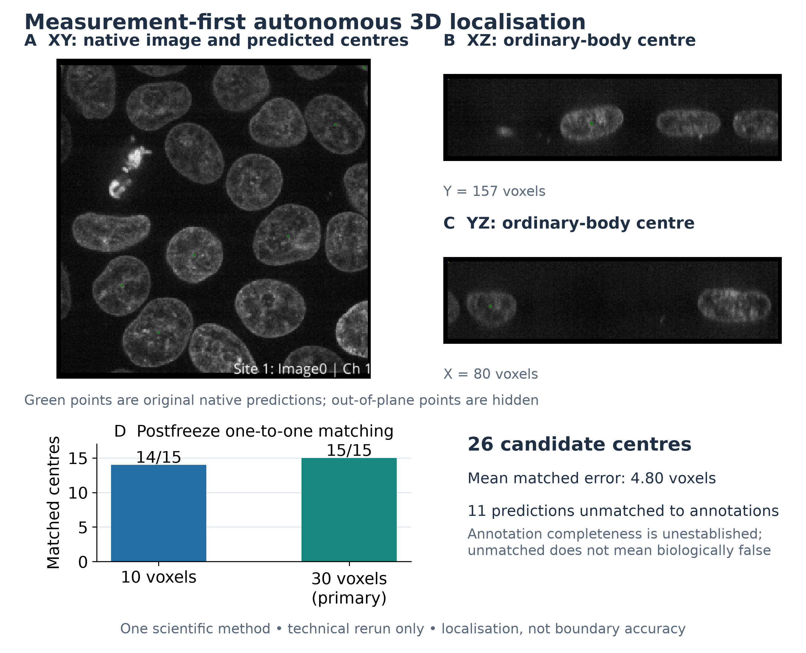

# OpenHCS: shared microscopy workflows for scientists and AI agents

**Authors:** Tristan Simas, Jathav Puvirajan, and Alyson Fournier

**Affiliation:** McGill University, Montreal, Quebec, Canada

**Correspondence:** Tristan Simas, <tristan.simas@mail.mcgill.ca>

**Short title:** OpenHCS: shared microscopy workflows

**Keywords:** microscopy; image analysis; laboratory automation; agentic AI; interoperability; high-content screening

## Abstract

Scientists need to inspect and revise image analyses built by AI agents. OpenHCS is an open-source platform in which scientists and agents edit the same microscopy pipeline through graphical controls, Python or the Model Context Protocol (MCP), which lets an AI client request analysis operations. Each registered processing function supplies the parameter names, types and defaults used to generate its controls and describe it to agents. The selected functions and settings remain editable as Python. Before execution, OpenHCS connects the selected images and intermediate results to each step and checks their compatibility. Established CellProfiler pipelines and custom Python functions use this model, with images, regions of interest and measurements available for inspection in napari and Fiji. All 30 imported CellProfiler workflows passed selected reference-output comparisons, including five supplemented with exports of computed images or object labels. A public neurite-outgrowth example documented an agent constructing, executing and inspecting an analysis without further human input after a detailed prompt. Validation rejected invalid pipeline documents before execution; subsequent visual review identified a tracing error that output checks had missed. Three prospective agent-authored workflows were frozen before held-out scoring: nuclear segmentation reached object F1 0.746, cell-boundary agreement was 0.671 within two pixels, and a translocation assay yielded Z-prime values of 0.751 and 0.554 for two drugs. Separate repeated-input runs measured throughput and memory across all 30 workflows. OpenHCS connects established analysis methods to agent-guided laboratory workflows while keeping processing choices and results available for scientific review.

## Introduction

Automated microscopy supports screening, time-course experiments, and quantitative studies of cells and tissues. Turning the resulting images into useful measurements requires an analysis workflow: identifying the image channels and dimensions, selecting processing functions, inspecting segmentation, and repeating the analysis across samples. Scientists often revise these choices after reviewing intermediate images. AI-guided laboratories need access to these same operations so that analysis can respond to experimental goals and scientist feedback.

An agent-operated analysis must also remain usable by the scientist. Researchers need to see which images were selected, how parameters were chosen, and whether the resulting masks match the structures of interest. They need to revise the pipeline directly and rerun it on another experiment. These requirements connect agent access to existing image-analysis tools, viewers, data stores, and execution systems.

Laboratory automation already uses shared declarations to connect instruments and software. SiLA 2 standardizes device communication, and the Tecan SiLA2 SDK generates server and client interfaces from annotated software declarations [@Hinkel2023]. Lange and colleagues demonstrated modular SiLA-based infrastructure linking device control and data management, while Courtney and colleagues integrated cell-culture instruments into an out-of-hours autopilot [@Lange2026; @Courtney2025]. Related work has connected liquid handlers to workflow orchestration and linked laboratory assets through shared information models [@Thieme2024; @Rihm2024].

Microscopy analysis requires a corresponding connection between processing functions, scientist-facing controls and agent access. OpenHCS applies declaration-driven interface generation to this analysis stage (Figure 1). A registered function supplies the parameter names, types, defaults and documentation used to build its controls and searchable catalog description. The shared workflow records selected functions and configured values as editable Python. A scientist can therefore open an agent-authored pipeline, change a parameter in a control or in code, and run the revised analysis. Imported CellProfiler workflows and custom Python functions use the same model.

Fiji/ImageJ, CellProfiler, Icy and BioImageIT support image processing and workflow construction [@Schneider2012; @Schindelin2012; @Carpenter2006; @McQuin2018; @deChaumont2012; @Prigent2022]. napari provides interactive multidimensional viewing, while OMERO, OME-NGFF and Bio-Formats support image management and access [@Napari; @Allan2012; @Moore2021; @BioFormats]. Scientific Python and GPU libraries supply additional algorithms [@vanDerWalt2014; @Haase2020], and workflow systems organize reproducible computation [@Koster2012; @DiTommaso2017; @Galaxy2020; @Galaxy2024]. Combining these resources requires keeping image identities, parameter choices and intermediate results consistent as an analysis moves between tools.

MCMICRO combines interchangeable processing modules for multiplexed tissue imaging [@Schapiro2022]. AI assistants also support executable bioimage analysis: BioImage.IO Chatbot connects community resources with analysis extensions, Omega generates and runs Python within napari, and Agentic-J generates scripts and coordinates Fiji tools with debugging and quality-assurance agents [@Lei2024; @Royer2024; @Johanns2026]. OpenHCS exposes a shared workflow object for agent operation: submitted pipeline documents are validated before analysis execution and remain editable through the scientist's controls and Python interface.

Before execution, OpenHCS prepares the workflow (compilation) by combining function requirements with configuration and image-source mappings. It resolves the selected images, checks the inputs and outputs of each step, and prepares work for execution processes. Scientists and agents receive feedback on setup errors before running the analysis, and can inspect selected intermediate results in napari or Fiji.

CellProfiler import provides a direct test of workflow preservation. A `.cppipe` file contains image-loading rules, module settings, image names, object names, measurement expectations, display choices, and output behavior. OpenHCS translates these files into editable workflows. Comparing their outputs against native CellProfiler tests whether the imported analyses retain the expected measurements and images.

We evaluate whether this shared workflow preserves established analyses and supports agent-authored analyses that scientists can inspect. Graphical controls and Python retain the same configured analysis through an editing round trip, and all 30 imported CellProfiler workflows pass selected reference-output comparisons. An agent constructed and executed a neurite-outgrowth workflow through MCP; later visual review identified a tracing error despite successful output checks. Prospective assays test frozen agent-authored workflows on held-out images or treatment groups. Separate task-only trials measure first-to-final segmentation changes and show agents detecting and repairing errors through their own image review (Figures 5–7). Repeated-input experiments measure throughput and memory as worker count and queue depth change (Figure 4).

### Figure 1. Scientists and agents operate a shared microscopy workflow

{width=6in}

\(A) Desktop, Python and MCP operations act on a shared pipeline; CellProfiler import supplies an editable analysis in that model. The processing sequence is illustrative, with functions chosen for each assay. (B) Image-source bindings and established or custom functions connect to the same definition. OMERO is experimental. (C) Compilation resolves inputs, dependencies and array requirements before worker processes execute the analysis. Selected intermediate results can be inspected in napari or Fiji, and retained images, ROIs and measurements support review and subsequent edits. CPU/GPU support depends on the selected functions; performance measurements are presented separately in Figure 4.

## Materials and Methods

### Workflow definition and image sources

An OpenHCS pipeline is an ordered sequence of analysis steps with shared settings. For example, a pipeline can select the nuclear channel, segment nuclei, pass the resulting labels to a measurement step, and display the labeled image alongside its measurements. Each step specifies a Python function or a sequence of functions with their parameters. A step uses shared defaults unless it supplies its own values, called overrides.

Before a run, OpenHCS identifies each step's source images and earlier results, checks their compatibility and prepares the function calls, array conversions and output destinations. This preparation is called compilation. It resolves shared defaults and step overrides into the values needed for execution. Execution units, called workers, receive the prepared plan (Supplementary Figure 3).

The parameter names, types and defaults declared by a Python function form its signature. OpenHCS combines this information with the workflow's current settings to generate on-screen controls and editable Python. Each function also declares which array library it expects, allowing images to pass between compatible CPU, GPU and deep-learning libraries. Volumetric analysis uses functions that support three-dimensional inputs, while two-dimensional functions operate on image planes.

Users can register custom Python functions for use in ordinary pipeline steps. The registered function appears in the editor's function list; its signature and documentation supply parameter controls and the searchable descriptions available through MCP (Supplementary Figure 5).

In the nuclear-segmentation example, a source mapping selects the nuclear channel at each site. Step settings choose Z stacks or individual planes and divide images into processing groups. Grouping by channel lets nuclear and neuronal images use different function chains. Later steps inherit source choices or select different inputs; measurements remain linked to their source images and metadata. Sample, site, channel, plane and time coordinates are recorded separately from storage locations, preserving image identity through stacking and later processing.

Microscope handlers interpret acquisition-specific layouts and metadata. Bio-Formats-backed discovery provides image-plane records from microscopy containers. The OME-Zarr source reads declared axes, channels, pixel scale and image or plate structure. Explicit source mappings assign roles where acquisition metadata are insufficient. Experimental OMERO support supplies managed images and metadata through the same source model.

### Execution, intermediate results and viewers

Each result keeps its connection to the images and processing step that produced it. Steps produce named images, labels, measurements, object relationships and files. For example, a measurement can remain associated with the segmented nucleus it describes. Each function declares its required inputs and available outputs; the compiler connects later operations to the source images or earlier results they need. Named results retain their producing step, source coordinates and processing group. Saving a result and sending it to a viewer are independent choices (Supplementary Figure 4).

napari and Fiji receive selected outputs together with their source coordinates and producing step. The streaming service checks that each viewer is ready and waits for pending display updates to finish. Viewer sessions remain available for inspection after execution. Local files, in-memory data, Zarr-backed stores and OMERO provide storage routes; the OME-Zarr array source is read-only.

The execution server coordinates analysis runs and remains available between requests. Within a run, each worker processes its assigned samples using the prepared plan and reuses loaded libraries and initialized array backends. Worker resources are released when that execution finishes. Worker count controls how many samples can be processed concurrently. Workers normally run in separate processes; a configuration option selects threads instead.

### Agent access through MCP

Through MCP, an AI client requests defined operations for discovering functions, editing and validating pipelines, running analyses, and inspecting progress and results [@MCP]. Each operation's declaration specifies its request and result types, implementation, changes it can make, data access and security requirements. The MCP interface is generated from these declarations, which also govern execution.

Function-discovery operations return descriptions derived from registered processing functions. An agent uses those descriptions to select functions and edit the shared workflow. Registering an additional function makes it available through the existing catalog and workflow operations without requiring a function-specific MCP tool.

Deployment profiles determine which operations are available. Desktop operations edit and run workflows in the live application; headless operations run without the graphical interface in a separate execution context. Local clients communicate with the MCP server through standard input and output. Desktop access uses an authenticated connection, and revision checks detect edits based on an outdated workflow state. Filesystem reads and writes are restricted to permitted locations. The hosted HTTP service provides a selected read-only subset in isolated server-side workspaces.

### Reusable workflow infrastructure

The mechanisms that turn declarations into interfaces and coordinate execution are packaged for reuse independently of the microscopy functions (Supplementary Table 1). Eight libraries discover implementations, read function definitions, track settings, generate controls and Python, convert arrays, route stored results and coordinate processes. OpenHCS supplies the microscopy functions, configurations, source handlers and viewer integrations. New processing functions use these shared mechanisms when they enter the workflow.

### Agent-operated analysis

The recorded run used Codex 0.146.0 with gpt-5.6-sol on Linux, connected by local stdio MCP to the desktop profile of OpenHCS 0.7.13 in a source-checkout virtual environment. The input was field 1 from the public NeuronCyto II dataset [@NeuronCytoII], comprising two 800 x 800-pixel, unsigned 8-bit TIFF images. Both were assigned to one biological image, with separate neuronal/neurite and soma/nuclear channels. Supplementary Data 4 identifies the software revision, input checksums and exact task prompt.

The prompt requested normalization, dim-neurite enhancement, segmentation and per-neuron morphology measurements, with saved images, regions of interest (ROIs), graph paths, SWC neuron-morphology files, tables and a reviewable napari presentation. It authorized changes to a dedicated desktop session and writes under the stated output directory, and instructed the agent not to use shell commands or inspect the repository. The client's approval checks and operating-system sandbox were disabled for this run. Compliance with the MCP-only instruction was assessed from the tool trace: no non-MCP calls or subsequent human interventions were recorded.

The event trace was used to count attempted calls, returned errors and subsequent corrections (Supplementary Data 4). Agent wall time was measured from the recorded start and end timestamps; pipeline execution time was reported separately. Checks covered completed execution, saved files, editable pipeline source, and delivered viewer outputs and coordinates. Subsequent review examined the saved object outlines and the published NeuronCyto II manual-tracing measurements for image 1 [@NeuronCytoII]. Supplementary Data 4 records these reference values separately from the agent's execution checks; object-level segmentation and tracing accuracy remain to be scored.

### Prospective agent-authored assay evaluation

Three public BBBC assays were prepared before separate pipeline-authoring trials. A fresh gpt-5.6-sol agent received a bounded development partition, the biological task, channel identities, the OpenHCS desktop and MCP endpoints, and a result directory. Reference annotations, treatment metadata, held-out images, evaluation code, prior trial pipelines and repository source were withheld. The agent used registered functions through the connected desktop. Its scientific functions and parameters were frozen before the held-out path was disclosed; the held-out run changed only the input and result roots. These are single prospective attempts rather than repeated estimates of agent reliability. The corpus manifest binds the original archives, converted inputs, partition assignments and evaluation artifacts (Supplementary Data 7).

BBBC039 supplied four development and 50 held-out fields with independent nuclear instance annotations. One-to-one matching used an intersection-over-union threshold of 0.5; reported measures include object precision, recall and F1, foreground Dice, signed count error, and explicitly defined split and merge diagnostics. BBBC007 supplied four development and 12 held-out DNA/actin fields with manual outlines. Its directed boundary measure reports the fraction of predicted adjacent-cell boundary pixels within two pixels of the manual-outline union. The outlines do not provide exhaustive object correspondence, so this score is not an instance-accuracy estimate.

BBBC013 supplied four development and 92 held-out wells from a two-drug FKHR-GFP translocation assay. The frozen endpoint was the per-well mean of cell-level mean nuclear GFP divided by mean cytoplasmic GFP. Each cell required the same retained object identity in the nuclear and cytoplasmic measurements. Z-prime used sample standard deviations across the four positive and four negative control wells for each drug; cells were not treated as independent replicates. BBBC013 provides treatment truth rather than manual segmentation truth. Prediction bytes were frozen before the evaluator opened held-out annotations or treatment metadata. The exact pipelines, typed score receipts, limitations and infrastructure repairs are retained in Supplementary Data 7.

### CellProfiler import and reference-output comparison

CellProfiler `.cppipe` files are parsed into modules and settings. Setup modules define image sources; registered processing and export modules become editable OpenHCS steps. Each module declaration specifies the images, objects, measurements and relationships its function needs, together with whether it runs per image group or across the plate. The same function is exposed in the GUI, Python and MCP.

The imported ExampleCometAssay illustrates this mapping. Its 16 modules become image-source configuration and 12 processing steps containing 16 function calls. One step measures the size and shape of three named object sets: Comet, CometHead and CometTail. Another defines CometTail by masking the comet with the inverted head mask. These names connect each measurement to the object set it describes.

Two additional workflows illustrate larger imports: the advanced segmentation tutorial and the 3D monolayer tutorial [@CellProfilerTutorials]. Enabled modules were parsed from the benchmark pipeline files, translated using the importer, and counted alongside their generated function steps and individual calls. The imported Python documents were reloaded to check preservation of function identities and parameters. Supplementary Data 5 provides the complete step sequences and source records; output comparisons are reported separately below.

Imported `ExportToDatabase` modules run once per plate after image-group processing. They collect the selected images, objects, measurements, relationships, thumbnails and grouping information into CellProfiler Analyst tables [@Jones2008]. The export produces a self-contained SQLite database and matching `.properties` files. Non-SQLite databases, custom filter rows, `.workspace` generation and some historical aggregation settings remain unsupported; unsupported requests fail or are identified in the compatibility documentation.

Automated testing for the OpenHCS 0.8.5 release checked execution of all 30 imported workflows and compared selected outputs for the 25 with retained CellProfiler-produced reference values. The continuous-integration (CI) job built installable packages from the release source and its dependencies on Linux with Python 3.12. It acquired the workflows and image sets at the revisions specified in the benchmark manifest, then compiled and executed each imported workflow through the execution server. Every OpenHCS analysis ran afresh. The historical release test required 30 successful execution records and no differences in its selected comparisons. Supplementary Data 1 preserves the per-workflow observations, run metadata and tested revision.

The manifest selects exported values for comparison. CSV tables and CellProfiler Analyst SQLite tables and `.properties` values are checked. Image comparison selects files, including NumPy arrays, from native reference-output directories that contain images and no CSV files. This includes the NPY-only illumination workflow and the completed translocation tutorial's overlay alongside its SQLite measurements. Images accompanying CSV measurements in 14 profiles remain outside image comparison. Absolute and relative tolerances are `1e-6` for numeric values and image pixels, with no pixels allowed outside tolerance; identifiers and categorical values are compared exactly after documented CellProfiler-compatible normalizations.

For the five workflows without file exports, terminal image or object-label exports were appended while preserving the original processing modules and settings. Native CellProfiler generated eight additional reference artifacts. A subsequent unified run compiled and executed all 30 workflows afresh and compared each candidate with its selected native reference values. Object labels were compared exactly after singleton-axis normalization; numerical images used the stated float tolerances. The unified run used OpenHCS 0.8.5 current source on Python 3.12.3 with NumPy 2.1.3 and SciPy 1.18.1. Native references used CellProfiler 4.2.8.1 on Python 3.9.25 with NumPy 1.24.4 and SciPy 1.9.0. Supplementary Data 1 links the export definitions, reference inventory, per-workflow comparisons and exact source identities separately from the historical release CI records.

The corpus contains 22 workflows and associated image sets from the official CellProfiler 3 examples repository, seven workflows and image sets from the official CellProfiler tutorials repository, and one workflow from the supplement to the CellProfiler 4 performance study [@CellProfilerExamples; @CellProfilerTutorials; @Stirling2021]. The CellProfiler project and the cited dataset contributors retain authorship and provenance for these materials. The retained manifest maps workflow names to pipeline and image locations; Supplementary Data 1-3 provide the corresponding comparison, coverage and throughput tables.

### Task-only authoring and independent repair

Separate trials evaluated whether a fresh gpt-6.1-sol agent could choose and revise an analysis using the task brief, packaged OpenHCS skill and MCP. The skill describes function discovery, image measurements, preprocessing and visual review; it does not supply the evaluated images' reference labels or accepted settings. Authors inspected their own inputs and intermediate results, retaining pipeline attempts, tool calls and matched image-only, result-only and combined views. The coordinator evaluated frozen predictions after authoring ended, without returning reference scores to the authors. These trials are distinct from the earlier three-assay held-out evaluation (Supplementary Data 8).

We compared first completed scientific settings with the final settings on exactly the same inputs. Technical corrections needed to submit or execute a pipeline remain part of the record; the first completed prediction is not necessarily the first tool call. H001 used a single notebook-derived bright-object image and its predeclared computational label reference. BBBC039 used independent nuclear annotations, with a paired first/final comparison on three fields and a separate final evaluation across all 200 fields. Some of those fields were inspected during development, so the 200-field result measures reference agreement rather than unseen generalization. Existing instance scorers used one-to-one matching at intersection over union at least 0.5.

### Performance measurements and reproducibility

Archived May development runs measured throughput and peak memory by assigning the same source images to multiple well identifiers, creating repeated analysis work. Queue depth specifies how many assignments were supplied per configured worker. Each condition has one recorded run per workflow. The retained rows report completed assignments but do not preserve worker-process traces or per-run output inventories.

Throughput varied the configured worker maximum over two, three and four,
with four assignments per worker. The memory sweep fixed four workers and
varied assignments per worker over one, two, three, four, six and eight.

Throughput uses execution time after initialization and compilation. The recorded configuration disables default saving of named results and return of detailed worker records, and requests removal of unused steps whose outputs are not saved. Supplementary Data 3 identifies these settings, the individual runs and the limits of their historical output-policy provenance. These rows characterize that archived analysis-focused workload, not the current output-complete CellProfiler translation. Measurements cover CPU execution on local or explicitly mounted image sources; GPU and cloud or network-storage performance were not measured.

The archived single-sample benchmark specifies one thread/core, CPU-only execution and no batching, with one retained comparison observation per workflow. The harness committed with the tables times the native CellProfiler command from subprocess launch through completion, including its startup. It times OpenHCS execution after initialization and compilation. Total-phase values also include different work, including benchmark validation and comparison on the OpenHCS path. Supplementary Figure 6 and Supplementary Data 1 report these observations with their timer definitions; they do not establish a like-for-like speed comparison. The wound-healing native duration equals the 900-s timeout ceiling without an explicit completion flag and is excluded from timing statistics.

The supplementary package separates the release CI comparison records from the earlier performance measurements. Its software-snapshot table identifies the revision and evidence for each evaluation. Figure scripts regenerate panels from saved CSVs and record source and output checksums. Supplementary Data 6 links automated tests of workflow editing and pre-execution validation to their source and CI jobs.

## Results

### One executable workflow retains analysis state across tools

The desktop interface, generated Python and MCP operations read and modify the same workflow definition (Figure 1). A pipeline created by an agent can be opened in the editor, revised by a scientist and run again. Source mappings connect folders, Bio-Formats containers and managed images to named inputs. Intermediate images and measurements retain their source coordinates and producing step, allowing a displayed result to be traced back to its processing choices.

A recorded authoring check demonstrates this connection directly (Figure 2). An MCP request applied edited Python to the normalization step, changing its high percentile from 99.8 to 99.6; the control then showed 99.6. A subsequent MCP field-edit request restored 99.8, and regenerated Python contained that value. The full application view, parameter controls and function-code window were captured in the same session, using the source commit released as OpenHCS 0.8.5. Forms show the values that will be used, including shared defaults; clearing a step's override restores its shared setting.

Automated regression tests check nested configuration, inherited defaults, parameter order and function-step reconstruction through generated Python. Separate tests reject incompatible array, grouping and stack requirements before execution, and reject function-detail requests based on an outdated catalog revision. Supplementary Data 6 identifies the tested cases and successful CI jobs.

Stacking, grouping and scheduling express different choices. A step can assemble Z planes into an array, apply different function chains to different channels, and supply named segmentation labels to a later measurement step. When time is configured as sequential, the entire pipeline finishes for one timepoint before the next begins; separate wells can run in parallel (Supplementary Figure 1). Each selected function determines its array-library support and whether it processes individual planes, whole stacks or reduces a stack to an output.

The UI submits work to a separate execution server using ZeroMQ messaging. The server compiles the workflow and coordinates workers. Workers execute the prepared steps and stream selected results to separate napari or Fiji processes, while progress returns through the server to the UI (Supplementary Figure 2).

### Figure 2. Forms, Python and MCP edit the same analysis

{width=6in}

\(A) Full NeuronCyto II main window, with enlarged step and connection details. (B) MCP applies edited Python to the step and checks the updated control, then edits the field and checks regenerated Python. (C, D) Same-session crops show matching controls and code, with high percentile restored to 99.8 and parameters in signature order. Captures use OpenHCS 0.8.5; Figure 3 shows the current replay and retained measurements.

### An agent builds and inspects a neurite-outgrowth workflow

From a detailed prompt identifying the two NeuronCyto II channels and requested outputs, the agent built and inspected a neurite-outgrowth analysis without further human input.

The agent inspected the images' organization and constructed a two-step pipeline: normalization followed by a registered neurite morphology and topology function (Figure 3). Of 140 attempted MCP calls, one was rejected for an invalid operation name; 30 others returned an error from the requested operation. Seventeen of those 30 errors came from code-document validation, which rejected invalid preset imports, document structure or configuration values before analysis execution. These counts include repeated authoring attempts. The agent revised the document until validation succeeded, then compiled and ran it in the desktop session. The remaining errors concerned request formats, discovery, file queries and UI operations (Supplementary Data 4). The saved record reports 609 s from start to completion, including authoring, corrections, execution and agent output checks; pipeline execution took 16.5 s. Outputs included neuron and nuclear labels, per-neuron measurements, neurite paths, ROI files and an SWC morphology file. The pipeline remained editable in Python and the graphical interface.

The final napari view displayed enhanced neuronal signal, unified neuron labels and neurite paths, with a feature table linking paths to measurements. Structured viewer checks found all nine expected outputs present with no missing or duplicate coordinates. The original analysis reported nine neurons, ten nuclei and 25 graph paths. Subsequent visual review identified a crossover classified as branching and a soma split between two neuron labels. The retained outlines also divide the nuclear signal at that soma into three objects. The published manual-tracing table lists eight neurons for image 1, providing an independent reference for investigating the count discrepancy [@NeuronCytoII].

A separate current-source replay used nuclear-supported soma detection and soma-rooted path assignment. It produced eight cell bodies, eight nuclei, 18 processes, two branch events and 24 graph paths. Per-cell measurements agree with graph distance features, totaling 2556.137 pixels under unit spacing. Supplementary Data 4 retains the original run, intervening correction and current replay separately. Document validation caught invalid authoring attempts before execution; image review identified errors in the biological result.

### Figure 3. Agent-authored neurite workflow and current-source review

{width=6in}

(A, B) Original 800 x 800-pixel NeuronCyto II field-1 inputs [@NeuronCytoII], displayed linearly over their unsigned 8-bit range. The boxes name the two saved pipeline functions. (C) Native napari capture of the current replay, combining neuronal signal, unified labels and graph paths; selecting neuron 8 links its three paths. (D) Retained nucleus, soma and assigned-neuron labels for the lower field cell, shown in magenta, cyan and yellow, respectively. Label identities are matched by pixel overlap. (E) Crossing paths remain assigned to separate neurons. (F, G) Per-neuron and summary measurements derived from the retained tables. Lengths are pixels because the public input has no recorded physical calibration. The original unattended run remains separately retained in Supplementary Data 4.

### Frozen workflows recover held-out assay structure

The three prospectively authored workflows were applied without scientific parameter changes after their held-out partitions were disclosed (Supplementary Figure 7 and Supplementary Data 7). On the 50 BBBC039 fields, 4,733 of 5,720 reference nuclei matched at intersection over union at least 0.5. Pooled precision was 0.680, recall was 0.827 and object F1 was 0.746; mean field foreground Dice was 0.935. The workflow predicted 6,964 nuclei, 1,244 more than the reference, and the overlap diagnostic identified more split reference instances than merged predictions. The first blind pipeline therefore recovered nuclear foreground well while over-segmenting instances.

On the 12 BBBC007 fields, 29,450 of 43,875 relevant predicted adjacent-cell boundary pixels were within two pixels of a manual outline, a pooled fraction of 0.671. The workflow predicted 1,274 nuclei and 1,273 cells; every predicted nucleus overlapped a cell and one cell shared two nuclei. The manual outlines enclosed 1,082 closed nuclear interiors, while 12 open or frame-connected regions were excluded. Because the boundary score is directed from predictions to the outline union, it can reward an incomplete segmentation and does not establish object correspondence.

The BBBC013 run produced matched nuclear and cytoplasmic measurements for 14,262 cells across all 92 held-out wells. Wortmannin controls separated with Z-prime 0.751 and mean nuclear-to-cytoplasmic GFP ratios of 7.235 and 0.915 for positive and negative controls. LY294002 controls gave Z-prime 0.554 and means of 7.219 and 1.127. Both held-out dose series showed the expected increase in nuclear translocation. This result evaluates recovery of the assay response; BBBC013 does not supply manual masks with which to score segmentation.

### Imported CellProfiler workflows match the compared reference outputs

All 30 workflows passed selected reference-output comparisons in one unified current-source run, with zero reported differences. The selected reference profiles comprised 21 with CSV measurements, three with SQLite measurements and CellProfiler Analyst properties, and six containing only retained images or arrays. The five supplemented workflows contributed five object-label images and three numerical images. All five label images matched exactly after singleton-axis normalization, and all three numerical images passed with zero out-of-tolerance pixels. Supplementary Data 1 identifies every selected output and preserves the unified observations and source identity.

Image comparison executed for seven workflows: six image- or array-only profiles and the completed translocation example, whose overlay was compared alongside its SQLite measurements. Supplementary Figure 15 shows how named images, objects and operations are retained in the imported Comet Assay.

The assays include DNA-damage measurement, human and Drosophila cell morphology, tumor morphology, Cell Painting morphology and quality control, protein translocation, wound healing, time-lapse tracking, imaging flow cytometry, colocalization, positive-cell classification, yeast screening, and *C. elegans* phenotyping. Supplementary Data 1-2 identify the workflows and imported settings.

The archived coverage tables list 58 distinct module names and 7,158 setting rows. They record whether a setting supplies a function parameter, an input/output requirement, an infrastructure option, or is intentionally ignored. Coverage describes how configurations are imported; the comparison results assess their outputs. Database export remains an ordinary terminal workflow step, using the same measurements and source identities as preceding steps.

### Complex workflows retain their processing and measurement structure

The advanced segmentation tutorial corrects illumination in five channels and identifies nuclei, cells, cytoplasm, nucleoli and mitochondria. Its 23 enabled modules become 16 steps containing 59 function calls (Supplementary Data 5). Measurements include colocalization, intensity, radial intensity distribution, size and shape, and neighbors. Object relationships associate nucleoli with nuclei and mitochondria with cells before SQLite export. Repeated channel/object measurements become function lists within a step, retaining the selected inputs and parameters.

The 3D monolayer tutorial segments nuclei and cells in volumetric images. It combines resizing and filtering, hole filling, nuclear watershed segmentation, seed preparation and cell watershed segmentation, followed by intensity and shape measurements, overlays, label-image saving and spreadsheet export. Its 35 enabled modules become 31 steps containing 35 function calls. Both workflows passed their selected output comparisons in release CI. The separate authoring checks preserved their function identities and parameters through generated Python.

### Throughput and memory across worker counts and queue depths

In the archived analysis-focused repeated-input runs over all 30 workflows, median throughput with four assignments per configured worker was 1.79, 2.67 and 2.96 completed assignments per execution second at configured maxima of two, three and four workers, respectively (Figure 4A). Every assignment was recorded complete. These rates do not establish throughput for the later output-complete translation; Supplementary Data 3 retains the individual historical rows and their provenance limits.

Each worker uses memory for imported libraries, cached arrays, and intermediate outputs. Across all 30 OpenHCS workflows in the four-worker queue-depth sweep, median peak RAM increased from 3.89 GiB at one assignment per worker to 4.15 GiB at eight assignments per worker, with maximum peak RAM reaching 14.3 GiB. Memory summaries include the wound-healing workflow because its OpenHCS run completed; only comparisons requiring its native CellProfiler timing exclude it. In these runs, more workers increased median throughput, while memory requirements varied substantially between workflows.

### Figure 4. Measured OpenHCS throughput and memory use

{width=5.5in}

\(A) Completed repeated-image assignments per execution second with four assignments per configured worker. (B) Peak memory with four configured workers and increasing assignments per worker. Each point is one of the 30 workflows, shaded boxes span the interquartile range, vertical lines span the observed range and black lines mark medians. Every assignment was recorded complete. These archived analysis-focused runs follow compilation, disable default named-result saving and detailed worker records, and request removal of unused unsaved-output steps. They do not measure the later output-complete translation. Throughput uses a logarithmic axis. Supplementary Figure 8 shows the same observations by workflow; Supplementary Figure 6 presents the separate historical single-sample timings.

### Inspecting results in Fiji and napari

Supplementary Figure 16 shows streamed images and objects in both viewers. napari additionally exposes structured image, layer and ROI information for agent inspection; Supplementary Figure 4 links a selected object to its saved measurements and viewer features. Fiji provides native image and ROI display with a smaller programmatic inspection interface.

### Task-only instance segmentation and autonomous repair

On the complete 254 x 256-pixel H001 image, the first completed prediction matched 59 of 64 notebook-reference objects, with four excess and five missed objects (Figure 5B). The author's final prediction retained 59 matches while reducing excess objects to two, increasing object F1 from 0.929 to 0.944. Foreground intersection over union remained 0.982: the improvement concerned how foreground was partitioned, not recovery of additional foreground. The reference was generated by a pinned notebook, not manual biological annotation. A preceding fresh author scored 0.627 on its first prediction and 0.913 on its final prediction against the same reference. The newer first prediction was therefore substantially better on this image, although different software bundles and independently chosen settings prevent attributing the change to the skill alone.

A later independent H001 author matched 62 of 64 reference objects on its first
attempt, with six excess predictions, two misses and object F1 0.939. A subsequent
repair introduced one extra partition without recovering a miss, reducing F1 to
0.932. The author rejected that repair from matched raw-image review before
reference scoring. This repeat therefore combines useful first-attempt agreement
with correct detection of a regression; it does not establish a monotonic
improvement between authors or a skill-only effect. Supplementary Data 8 retains
both post-freeze scores and the capture-provenance qualification.

The BBBC039 author improved object F1 from 0.908 to 0.934 on its original three fields, reducing missed reference nuclei from 39 to 25 while retaining 14 excess predictions (Figure 5C). Its final pipeline then covered all 200 fields: 20,521 of 23,615 reference nuclei matched, with precision 0.947, recall 0.869 and pooled object F1 0.906. Field F1 reached at least 0.90 in 135 fields; ten fields remained below 0.80 (Figure 5D). This distribution retains difficult fields and three annotation-empty fields rather than selecting only favorable examples. No first-attempt score across 200 fields is inferred from the three initial outputs.

Native H001 views show the elongated-body false-split repair in the same scored
run, alongside its remaining possible merge (Supplementary Figure 18).

Three independently authored pipelines achieved pooled object F1 between
0.898 and 0.906 on the same 200 BBBC039 fields and 23,615 reference nuclei
(Table 1). This is repeated complete-corpus agreement, not first-attempt
accuracy or a wholly unseen evaluation: each corpus includes the author's
development fields, and the authors used different software bundles and
independently chosen settings.

| Independent author | Matched nuclei | Precision | Recall | Object F1 |
|---|---:|---:|---:|---:|
| Figure 5 | 20,521 | 0.947 | 0.869 | 0.906 |
| Repeat A | 20,207 | 0.946 | 0.856 | 0.898 |
| Repeat B | 20,457 | 0.944 | 0.866 | 0.904 |

Table 1. Post-freeze reference agreement for three independent BBBC039 authors
with scored complete-corpus outputs. Repeat A is illustrated in Supplementary
Figure 20; Repeat B is the subsequent author. Each row includes all 200 fields,
including three annotation-empty fields; one-to-one matching requires
intersection over union at least 0.5. Scores were not supplied to the authors.
Supplementary Data 8 retains per-field results, source identities and
first-to-final comparisons within their actual coverage.

Across the 197 fields with annotated nuclei, median field F1 was 0.919,
0.917 and 0.916 for the Figure 5 author and repeats A and B, respectively.
Seven, eight and seven of these fields had F1 below 0.80. Predictions in the
three annotation-empty fields varied more strongly: 37, 218 and zero,
respectively. Similar pooled scores therefore coexisted with different
behavior on these negative-reference fields.

The Supplementary Figure 20 repeat improved 61 field scores, reduced 123 and
left 16 unchanged relative to the Figure 5 run; 314 additional misses accounted
for most of its lower pooled F1. The subsequent repeat reached field F1 at
least 0.90 in 137 fields, with seven annotated fields below 0.80 and no
detections in the three annotation-empty fields. Its own revisions improved
F1 from 0.826 to 0.840 on the same six development fields, recovering 17
additional matches while adding two unmatched predictions. These results
retain useful agreement and its difficult-field tail rather than a monotonic
improvement between authors.

Other repeats retain separate coverage qualifications. One scored 156
completed fields at precision 0.942, recall 0.838 and pooled F1 0.887, compared
with 0.909 for the Figure 5 pipeline on exactly those fields. Correcting
noise-only foreground admission did not improve overall reference agreement.
Another completed all 200 fields across two execution phases with unchanged
scientific parameters but was not reference-scored. Supplementary Data 8
reports this execution coverage separately from measured accuracy.

### Image review supports local repair with regression controls

In a released DNA/actin field, a fresh author separated a joined nuclear pair
through its own review and exported 55 nuclear instances with linked actin
territories (Figure 6). A faint pair remained merged. An independent repeat
recovered three missed nuclei by detecting bright cores before growing their
boundaries; its 54 nuclear instances included a dim nucleus and clipped edge
object lost during its first repair (Supplementary Figure 13). A further author
measured nuclear texture, neighbour separation and actin support before choosing
its method. Boundary revision reduced assigned actin area from 55,903 to
52,787 pixels while preserving 55 instances. A nucleus with unsupported actin
extent and uncertain crowded interfaces remained. These trials demonstrate
useful nuclear recovery and boundary revision, assessed independently of
whether each linked territory represents a physical cell. Another independent
author corrected texture-driven splits and a bright/dim merge, recovering
55 nuclear instances while withholding two weak actin regions from its
53-region body result. Crowded boundaries remained uncertain (Supplementary
Data 8). In a later independent repeat, measured raw controls still led to
missed crowded nuclei because admitted haze changed the distance landscape.
The author inspected that failure and revised foreground, markers, division
and suppression, recovering useful local detections in its final 54-instance
result. Haze extent, an upper-edge possible merge and crowded actin boundaries
remained uncertain; the repeat supports self-directed repair, not improved
first-attempt accuracy (Supplementary Data 8).

A further independent author retained its initial scientific settings after
measuring nuclear texture, neighbour spacing and weak actin support. Its
55 nuclear candidates and 53 expanded associated regions had useful ordinary-body
coverage in independent matched-channel review; two unsupported regions remained
seed-sized. Transport and source-binding repairs were required, but did not
change the segmentation. Postfreeze comparison with closed manual nuclear
interiors matched 42 of 47 regions at intersection over union at least 0.5,
giving precision 0.764, recall 0.894 and object F1 0.824. An independent repeat's
final result matched 37 regions, with F1 0.740. Cell-region F1 was 0.697 and
0.673, respectively, while adjacent-cell boundary agreement was 0.695 and
0.715. The repeat's boundary gain therefore did not imply better object
correspondence. Open or frame-connected reference interiors are excluded,
and tiny closed annotation regions remain included; these single-field scores
do not establish an exhaustive biological census (Supplementary Data 8).

Retinal authors used measured background and weak-body support to select
smoothing, background subtraction and foreground admission. Earlier repeats
retained useful soma detections but uncertain ring-shaped partitions and weak
boundaries. In the independent trial shown in Figure 7, an intermediate repair
joined a genuine northwest pair while correcting a southeast body split.
The author detected that regression and adjusted marker suppression.
Matched final views confirmed separate northwest neighbours and one southeast
envelope in the same 102-instance candidate. Diffuse and lobed regions still
had uncertain identities and extent (Supplementary Figure 14). The result
supports autonomous local repair with a retained neighbour control;
manual-reference accuracy remains unmeasured.

A later independent retinal author repaired fragmented interiors and a merged
neighbouring pair, retaining 145 candidate soma instances. Independent full-field
and regional raw/result review supported bright-body localisation, separate
neighbours and intact isolated bodies against noisy background. Faint open rims
and lobed or crowded objects retained uncertain extent and identity. This result
adds evidence of self-directed repair; the detector total is not a manual cell
count (Supplementary Data 8).

Whole-volume analysis also separated useful localisation from instance
identity. One fresh nucleus-centre trial matched all 15 manual reference
centres within 30 voxels, with ten unmatched predictions; at ten voxels it
matched 14 of 15. The reference was not established as exhaustive, so unmatched
centres were not automatically treated as spurious cells. The author's
bright-core adjustment left first and final geometries unchanged. A separate
fresh author repaired duplicate centres within one continuous body after
rejecting an ineffective marker adjustment. Native XY and orthogonal views
supported one representative, while a positive control stayed unchanged.
Its 26 provisional centres retained unresolved associations and border
supports. Supplementary Data 8 preserves these distinct trials and their
remaining whole-volume uncertainties.

A later independent volume author removed sampled internal-peak duplicates
using measured component-local spacing while retaining a genuine neighbour
pair. Its 22 provisional centres included an unresolved bright multi-lobed
cluster. Native XY, XZ and YZ review separated useful ordinary-body support
from that identity uncertainty (Supplementary Figure 17); no global biological
count or new reference score was established.

A further fresh volume author measured nuclear dimensions, background intensity
and neighbour separation before selecting a shape-based marker method. Its
first scientific method produced 26 candidate centres; a technical rerun
changed output delivery while retaining the same detector. Independent raw,
point-only and combined XY/XZ/YZ review supported centre placement inside
ordinary nuclei. A bright lobed complex and cropped border supports retained
identity uncertainty. This trial demonstrates useful measurement-first
localisation. After the workflow was frozen, one-to-one matching recovered
all 15 manually annotated centres within the predeclared 30-voxel distance,
with a mean localisation error of 4.80 voxels (Figure 9). All 15 also matched within
20 voxels, and 14 matched within 10 voxels. Eleven of the 26 predictions were
unmatched to these annotations. Their coverage was not established as
exhaustive, so unmatched predictions do not establish false biological
detections. These unscaled voxel distances assess centre placement rather
than physical distance, segmentation boundaries or a whole-volume census
(Supplementary Data 8).

A fresh public neurite-field author identified bright junction pixels lost
after ridge enhancement and restored them by combining enhanced support with
a separately measured strong-raw threshold (Supplementary Figure 19).
In a selected junction tile, 19 of 291 strong raw pixels were absent before
the repair and none afterward; a sampled quiet tile remained empty.
Faint branches still terminated prematurely, and shared-marker crossings did
not establish per-neuron ownership. The trial separates a useful image-support
repair from the unresolved requirements for complete outgrowth measurement.

### Recovery and self-diagnosis vary between images

Crowded DNA/actin fields exposed failures that consistent object tables did
not resolve. One fresh BBBC007 author processed all 16 paired fields but left
many bright nuclei without outlines in a dense cluster. An independent author
traced similar losses to broad foreground support, sparse shape markers and
size-filtered merged basins. Its threshold repair recovered several nuclear
anchors while preserving inspected dim and textured bodies, but clear misses
and seed-sized secondary objects remained. A separate paired-field author
repaired a cluster and close pair, then introduced an apparent split in an
isolated mottled nucleus while a dim neighbour stayed joined. It identified
both failures in its final review. These cases show useful stage-specific
diagnosis and partial recovery, with inconsistent completion of the repair.

A subsequent independent author completed all 16 paired BBBC007 fields,
producing 1,413 nuclear and cell instances. Post-freeze comparison placed
63,223 of 85,093 predicted internal boundary pixels within two pixels of
the manual-outline union (0.743). On the same 12 development fields, the
first and final pooled boundary fractions were 0.738 and 0.735, respectively.
The final method recovered a severely under-detected field from 16 to 73
nuclear instances, compared with 81 closed manual nuclear interiors, but
the total prediction excess across those 12 fields increased from 28 to 100.
Thus a useful local repair did not establish a general accuracy gain.
The four fields reserved by this author contributed a final directed boundary
fraction of 0.761 without further parameter changes. These directed scores
do not measure boundary recall or exhaustive object correspondence; closed
manual interiors also exclude open and frame-connected regions. Exact field
identities, paired results and scoring definitions are retained in
Supplementary Data 8.

A later independent paired-field author retained its first scientific method
and produced 55 nuclear instances after self-directed technical repairs.
Matched DNA/actin review showed intact textured nuclei, a separated close pair
and growth into supported actin regions (Supplementary Figure 23). Every nuclear
pixel lay inside the body mask with the same label. Two body estimates contained
only their nuclear seeds; the author identified both rather than presenting
them as complete cells. This is useful autonomous nuclear segmentation and
provisional body geometry, without a manual-reference accuracy estimate.

A separate retinal author smoothed fragmented body outlines while preserving
an inspected bright neighbouring pair (Supplementary Figure 22). The matched
raw captures were byte-identical before and after repair, separating the
visible mask change from display changes. Possible splitting at the source
border and incomplete weak-body coverage remained. This retained-run repair
supports improved local geometry rather than a manual-count accuracy estimate.

Public neurite-field authors recovered clear process segments while weak
paths and ambiguous crossings remained difficult. One corrected false nuclear
splits and traced a segment to the boundary but admitted nearby fragments.
Another measured the enhanced response along a missed faint process and in
background controls, recovered the process while preserving bright trunks,
and corrected wrong-channel photometry by checking exported values against
raw pixels. Both retained eight nuclear objects. Discontinuous paths and
uncertain crossings prevented complete outgrowth and per-neuron topology
measurements. A later frozen continuation retained eight supported soma
candidates, agreeing in count with the eight manually traced entries for the
same public image [@NeuronCytoII]. This aggregate agreement was assessed after
freezing; spatial cell correspondence and complete arbor length were not scored.

Another independent author retained eight soma candidates throughout four
completed analyses of the paired public field. It measured a missed faint
process and a background control, then lowered the candidate threshold while
keeping soma detection and the remaining processing settings unchanged. The
final result recovered support through all 20 sampled rows of the faint-path
witness. Approximate soma area remained 8,692 pixels squared, while computed
graph length increased from 4,085 to 7,788 pixels. Algorithm-defined branch
counts also increased from 12 to 234, with uncertain short twigs and ambiguous
ownership at crossings. The trial demonstrates autonomous recovery of a
measured local omission, but the sensitivity of the graph outputs prevents
interpreting them as validated neuron-specific outgrowth or branch counts
(Supplementary Figure 24; Supplementary Data 8).

A separate retained-context personal-neurite continuation
processed a nine-field mosaic with shared channel fits and paths across sampled
joins, but incomplete nuclear and soma detection limited its morphology
measurements. That assisted continuation is distinct from fresh autonomous
authoring.

A later retained-context continuation completed fieldwise processing of all
nine personal-neurite fields. Matched review at three sites showed supported
bodies and process segments alongside faint gaps and incomplete body association
in a dense cluster. The overlapping fields were not summed as unique cells or
independent replicates; fieldwise coverage is distinct from stitched analysis
and complete outgrowth measurement (Supplementary Data 8).

A subsequent development phase analysed the assembled canvas rather than
summing overlapping fields. Its selected checkpoint retained 1,567 body labels
and assigned process geometry across the mosaic. Independent recalculation
from every per-cell row reproduced the native length, area, process and branch
summaries. Matched views showed supported bright processes and remaining faint
gaps; lowering the local-response threshold recovered a connection but added
an unsupported lateral branch, so the author rejected that trial. This provides
a reproducible stitched development result, with incomplete fine-path coverage
and uncertain ownership at crowded crossings (Supplementary Data 8).

A fresh, treatment-aware translocation author completed all 96 BBBC013 wells
using scientific settings chosen from six development wells and frozen before
the remaining 90 were opened. Its measured first candidate retained ordinary
nuclei and separated inspected close pairs. Fixed ten-pixel expansions supplied
local cytoplasmic measurement regions, not validated whole-cell boundaries.
The resulting negative/positive control mean GFP ratios were 1.05/7.40 for
Wortmannin (Z-prime 0.747) and 1.26/7.33 for LY294002 (Z-prime 0.493), with
four wells per control group. Independent recalculation from all 96 well tables
reproduced the dose summaries and assay statistics. This fresh-context repeat (Figure 8)
supports recovery of the assay response, not exhaustive segmentation accuracy
or unseen-dataset generalisation; it is distinct from the prospective experiment
above (Supplementary Data 8).

A later independent translocation author also completed all 96 wells, with
incomplete compartments in the inspected fields. Its recorded continuation retained
18,331 nuclear seed rows and 14,496 defined nuclear-to-cytoplasmic ratios;
3,835 ratios were undefined because cytoplasmic regions had no pixels.
Matched native review found a faint nuclear miss and regions confined to
bright centres. This repeat supports execution coverage and exploratory
measurements on selected masks, not reliable population counts or unbiased
translocation estimates. The difference from the earlier repeat illustrates
why successful execution and response recovery need separate visual assessment
(Supplementary Data 8).

A self-directed continuation improved dim nuclear admission and local
cytoplasmic growth, then completed all 96 wells with settings frozen before
five additional fields were reviewed. It retained 16,589 defined ratios from
18,073 nuclear seed rows. Independent recalculation reproduced all 24 dose
summaries and control Z-prime values of 0.700 and 0.513 for the Wortmannin and
LY294002 blocks, respectively. Both dose series rose at lower concentrations.
Matched image review still found a faint nuclear miss, a plausible merged pair
and seed-sized cytoplasmic regions. This same-author development recovered
useful assay responses on selected masks, while incomplete compartments and
GFP-dependent selection limited population inference (Supplementary Data 8).

Together, the task-only trials demonstrate useful initial choices, local
recovery and self-diagnosis without reference-score feedback. Their quantitative
comparisons and matched views distinguish detection, object separation,
boundary extent and execution coverage. Repair of one region alone does not
establish quality throughout an image or performance on a new dataset.
Supplementary Data 8 retains the individual attempts, pipeline freezes and
reference definitions. Supplementary Figures 9–12 separately show task-only
local controls and same-author development cases; those development cases
do not supply fresh autonomous scores.

### Figure 5. Task-only analysis: within-run revision and final coverage

{width=6in}

\(A) Matched H001 raw and first/final overlays show an elongated-body split repaired without reference feedback. Screenshots are clipped/scaled, not retouched; colours do not identify objects across attempts. Supplementary Figure 18 retains wider views and capture records. (B) Whole-image H001 object F1 against a notebook-derived reference: excess predictions fall from four to two, with 59/64 matches and five misses unchanged. (C) BBBC039 pooled object F1 on the same three development fields against independent annotations. (D) Final scores across all 200 fields, including three annotation-empty fields and the low-score tail. The dashed line is pooled, not mean field F1. Matching requires intersection over union at least 0.5. First is the initial completed scientific prediction (H001 a01; final a04). These comparisons do not establish first-200 accuracy, an isolated skill effect or held-out generalization.

The independent full-200 repeat reached pooled F1 0.898 versus 0.906 for the
run plotted above: 61 fields improved, 123 decreased and 16 were unchanged
(Supplementary Figure 20). This repeat retains useful agreement but shows that
within-run repair does not guarantee a better result from the next fresh author.

### Figure 6. Autonomous local repair with a retained merge

{width=6in}

\(A) Matched raw DNA and first/final overlays show separation of a joined pair; diffuse support remains in the lower region. A compact neighbour stays separate. (B) Final raw, result-only and combined views retain a faint merge. This fresh-context author revised its own pipeline without reference feedback. The first complete prediction follows technical repair; these local witnesses do not establish exhaustive accuracy or validated actin boundaries. DNA windows are 0–255 (A) and 0–151 (B), gamma 1, final ROI opacity 0.7. Colours are not cross-candidate identities. Original screenshots are clipped/scaled without pixel retouching; physical calibration is unverified. Supplementary Data 8 retains exact capture and crop identities. Source: BBBC007v1 A02, Sabatini laboratory, Whitehead Institute; CC0.

### Figure 7. Autonomous retinal repair preserves a neighbouring pair

{width=5.3in}

\(A) Whole-field detections against heterogeneous background. (B) Northwest neighbours remain separate. (C) A southeast partition is repaired. Using only the task, MCP and packaged skill, the author caught a pair-merging regression and retained both gains in its final 102-instance candidate. Diffuse regions remain uncertain (Supplementary Figure 14); manual-reference accuracy is unmeasured. Raw RBPMS uses window 0–63, gamma 1. Outline backgrounds use the frozen intensity stretch and display range 0–63/255, giving different brightness at matched positions. Original screenshots are clipped/scaled without retouching. Source: user-provided R0010 retina; physical calibration unverified. Supplementary Data 8 retains exact captures and settings.

### Figure 8. Fresh-context recovery of the public translocation response

{width=6in}

\(A, B) Native dose summaries from the treatment-aware 96-well BBBC013 repeat;
each plotted group contains four wells. Points show means of well-level mean
cell ratios; error bars are sample standard deviations between wells, not
between cells. Concentration units differ between drugs. Dose positions are
equally spaced; connecting lines guide the eye and are not fitted curves.
(C, D) Each assay block's four vehicle and four Wortmannin 150 nM control wells,
with the same between-well variability. LY294002's positive control is
Wortmannin, not another LY294002 dose. Scientific settings were frozen after
six development wells, before the 90 reserve wells were opened. These results
support assay-response recovery using local cytoplasmic regions, not validated
whole-cell boundaries or segmentation accuracy. This fresh-context public repeat
is distinct from the prospective held-out experiment in Supplementary Figure 7.
Supplementary Data 8 retains the frozen pipeline and original table identities.

### Figure 9. Measurement-first autonomous localisation in three dimensions

{width=6in}

\(A–C) Retained native image/Points views from one fresh task-only author.
XY uses Z index 34, XZ uses Y index 157 and YZ uses X index 80; all are voxel
indices. Green points are the original fractional predicted centres, not added
annotations. Out-of-plane Points are hidden, so a body without a visible point
in one slice is not necessarily missed. Crops are scaled without image or point
retouching. \(D) Independent postfreeze one-to-one matching recovered 14 of
15 manual centres within 10 voxels and all 15 within the predeclared 30-voxel
primary distance. Mean matched error at the primary distance was 4.80 voxels;
11 of 26 predictions were unmatched to annotations whose coverage was not
established as exhaustive. No new scorer or scientific execution was used to
assemble the figure. The first scientific settings were unchanged through a
technical rerun; this is localisation evidence, not boundary accuracy or a
complete biological census. A lobed chromatin complex remains unresolved in
the broader review. Physical calibration is unverified. Source: Allen Institute
for Cell Science cells3d, through the pinned Haase notebook-derived task.
Supplementary Data 8 retains capture hashes, crop coordinates and evaluation.

## Discussion

OpenHCS connects interactive and agent-operated microscopy analysis through a shared workflow definition. Parameter controls, editable Python and catalog descriptions draw on the registered functions, while the compiler combines their requirements with configuration and selected images. A scientist can therefore revise the same pipeline that an agent constructed.

Workflow reuse can reduce the setup required for a new experiment. A laboratory can import a CellProfiler analysis, adjust its source mapping and parameters, add an assay-specific Python function, and inspect the resulting masks in Fiji or napari before processing further samples. Pipelines can also be authored directly in OpenHCS. Keeping the processing choices explicit provides a basis for review as analysis methods and experimental conditions change.

The evaluations cover complementary parts of this workflow. The unified current-source run establishes selected reference-value agreement across all 30 imported workflows, while the release CI record independently preserves package-level execution for the released source. The single-field neurite demonstration records completion under one prompt and client/model configuration; image review then exposed cell-assignment and crossover errors despite successful execution checks. Three prospective trials extend evaluation to held-out annotations or treatment structure. They show useful first-attempt results while also identifying nuclear over-segmentation and the limits of directed boundary and treatment-level references. Because each assay used one authoring attempt with one model and prompt, they do not estimate the probability that an agent will produce an acceptable workflow on a new assay. The separate archived throughput measurements describe a configured analysis-focused workload, not current output-complete performance. Matched Translocation and advanced-segmentation pilots cover two output-complete workflows (Supplementary Data 3); comparative native CellProfiler throughput across workflows remains to be established.

The task-only trials show that agents can improve segmentation through their own image review without reference feedback. H001 reduced excess instances without changing foreground overlap, while BBBC039 recovered more reference nuclei on the paired development fields but retained a low-accuracy tail across the full corpus. The retinal trials show why review must cover several regions: a change that repaired one body also merged a genuine pair elsewhere, and the author corrected that regression before freezing the final result. The volume trials include both a development repair that removed boundary fragments while leaving suspect interior splits and a fresh measurement-first method with useful ordinary-body centre placement. Detection, object separation and boundary extent therefore need separate assessment; a better count alone does not establish a better segmentation (Supplementary Data 8).

Operational losses also need separate accounting: a later public BBBC013 trial was terminated at an imposed 4.5 GiB scope limit before complete table export or distributed review, despite partial mask production. That incomplete trial does not estimate segmentation accuracy or host-wide memory exhaustion. Retained outcomes should distinguish completed analysis, biological acceptance and operational interruption rather than pool them into a single accuracy claim.

Further evaluation can extend reference comparisons to additional modules and settings, compare repeated agent trials with expert-reviewed results, and measure paired CellProfiler/OpenHCS throughput with matched outputs and resource limits. Explicit image-source mappings keep channel and dimensional choices available for review as pipelines move to new experiments. The reusable libraries in Supplementary Table 1 supply the supporting mechanisms independently of the microscopy functions.

OpenHCS provides an analysis component for AI-guided laboratories in which established workflows, custom functions and intermediate results remain accessible through the same editable pipeline. Scientists can delegate pipeline construction and execution, then inspect the results in familiar viewers and revise the analysis through graphical controls or Python.

## Supplementary Data

The [supplementary index](supplementary/README.md) links the retained files and describes their fields and interpretation.

1. **CellProfiler workflow comparison:** unified 30-workflow current-source observations, reference inventory and exact run provenance; historical OpenHCS 0.8.5 release-CI evidence; the five-workflow export definitions and per-artifact audit; and separate historical timing records.
2. **CellProfiler coverage:** module-to-workflow associations, individual setting handling, and archived processing-registration coverage.
3. **Worker and memory measurements:** measured execution and memory by workflow, worker count and repeated-image assignment count, including completion status.
4. **Recorded agent workflow:** evaluated client, model and software versions; input checksums; exact prompt; tool trace and error counts; original outputs; and separately identified later corrections.
5. **Complex CellProfiler workflows:** source-derived step sequences, function-call counts and editable Python for advanced segmentation and 3D monolayer analysis.
6. **Workflow regression tests:** representative configuration, generated-Python and compiler-validation checks, with source and CI-job references.
7. **Prospective agent-authored assays:** frozen pipelines and held-out score receipts for BBBC039, BBBC007 and BBBC013, with quantitative results and operational findings.
8. **Task-only authoring and independent repair:** first/final reference agreement on the same inputs, full-corpus BBBC039 coverage, computational versus biological reference definitions, and retained post-freeze evaluation receipts.

## Code and Data Availability

OpenHCS source code: <https://github.com/OpenHCSDev/OpenHCS>.

OpenHCS documentation: <https://openhcs.readthedocs.io/>.

Benchmark scripts and records are indexed in the [supplementary data](supplementary/README.md). Figure-generation scripts and figures are located under `paper/figures/` in the source repository.

The benchmark uses biological images and pipelines distributed by the CellProfiler project rather than OpenHCS-authored benchmark data. Original sources:

- official CellProfiler example pipelines and images: <https://github.com/CellProfiler/examples> [@CellProfilerExamples]
- official CellProfiler tutorial pipelines and images: <https://github.com/CellProfiler/tutorials> [@CellProfilerTutorials]
- CellProfiler 4 benchmark supplement: <https://github.com/carpenterlab/2021_Stirling_BMCBioInformatics> [@Stirling2021]

The benchmark manifest maps workflows to pinned revisions of their source collections. The [unified comparison evidence](../benchmark/results/official30_unified_value_comparison_20260916/README.md) preserves current-source observations, the selected reference inventory and exact run provenance for all 30 workflows. The [release CI evidence](supplementary/ci_official30_085/README.md) separately preserves the OpenHCS 0.8.5 package-level test, with checksums and links to its exact source revision and hosted job. Historical performance records and separately versioned agent demonstrations are indexed alongside them.

Supplementary Table 1 links the source repositories for the eight reusable libraries.

## Acknowledgements

We thank the CellProfiler project, its contributors, and the authors of the underlying biological datasets for making the example, tutorial, and benchmark materials available.

## Author Contributions

[To be confirmed by the authors: assign contributions to the final author list.]

## Funding

[To be confirmed by the authors: list applicable funding bodies, grants and fellowships, or confirm that no specific funding supported this work.]

## Declaration of Competing Interests

[To be confirmed by the authors: disclose relevant financial or personal relationships, or confirm that there are no competing interests to declare.]
