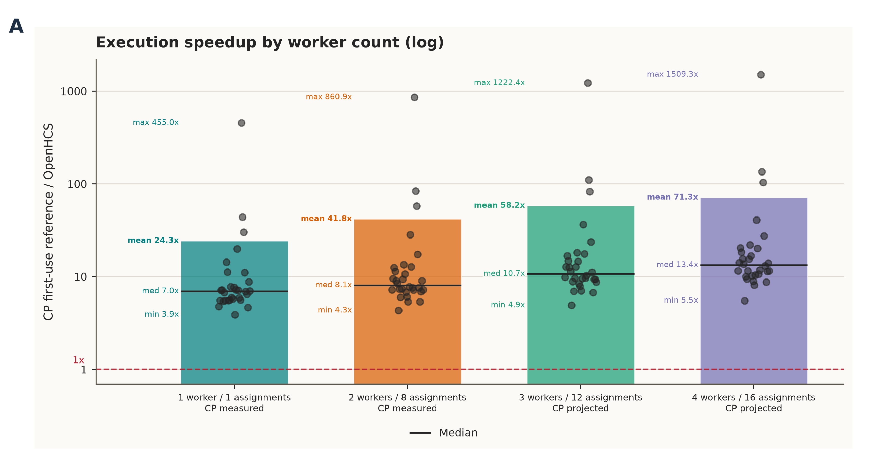
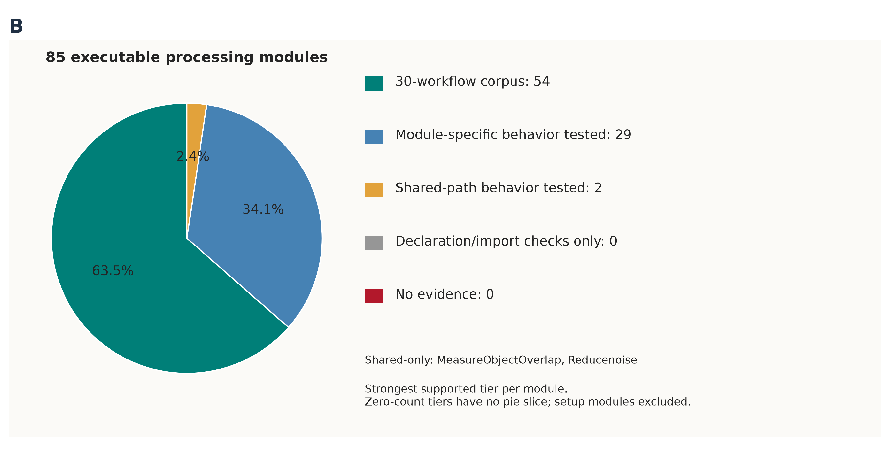

# OpenHCS: high-performance autonomous image analysis for the Python ecosystem

**Authors:** Tristan Simas, Jathav Puvirajan, and Alyson Fournier

**Affiliation:** McGill University, Montreal, Quebec, Canada

**Correspondence:** Tristan Simas, <tristan.simas@mail.mcgill.ca>

**Short title:** OpenHCS: autonomous microscopy analysis

**Keywords:** microscopy; image analysis; self-driving laboratory; autonomous analysis; agentic AI; high-content screening

## Abstract

Turning microscopy images into measurements takes specialist decisions about preprocessing, segmentation and quality control. OpenHCS connects graphical controls, editable Python and the Model Context Protocol to one workflow, allowing scientists and AI agents to construct and revise the same analysis. Function declarations supply parameter interfaces, and a compiled parallel runtime coordinates processing, measurements, exports and viewer delivery. All 30 imported CellProfiler workflows passed the declared output comparisons, with exact label agreement and numerical measurement agreement at 1e-6 tolerance. One-core execution was a median [pending]{.benchmark-claim key=execution_median}-fold faster than native CellProfiler. Agents built analyses through MCP from task briefs, with packaged guidance in later trials. They finalized their pipelines before reference scoring. Three independent agents reached pooled nuclear object F1 of 0.906 to 0.910 on 175 BBBC039 fields none of them opened. A translocation analysis gave control Z′ of 0.849 for LY294002 and 0.726 for Wortmannin across 96 wells, including four development wells. Further trials located nuclei in 3D images and detected retinal cell bodies and neurite shafts. Assigning neurites to cells at crossings remains unresolved. Scientists can inspect linked images, masks and measurements in napari or Fiji and revise the workflow that produced them. OpenHCS supplies efficient, editable analysis for direct scientific use and self-driving laboratories.

## Introduction

An investigator may know which cells, neurites or subcellular signals matter to an experiment without knowing how to turn their images into reliable measurements. Image analysis adds specialist decisions about channels, preprocessing, segmentation and quality control. A pipeline that executes successfully can still miss dim structures or divide a cell incorrectly. Delegating analysis requires an efficient, editable workflow and access to the images behind each measurement.

Fiji/ImageJ, CellProfiler, Icy and BioImageIT provide desktop processing workflows, and napari supports multidimensional inspection [@Schneider2012; @Schindelin2012; @Carpenter2006; @McQuin2018; @deChaumont2012; @Prigent2022; @Napari]. Integration into the Python ecosystem also concerns how workflows are authored and extended. CellProfiler's documentation recommends against running the full application as a Python package and describes CellProfiler Library as a route to using processing functions directly [@CellProfilerPythonPackage].

MCMICRO combines interchangeable modules for multiplexed tissue imaging through containerized tools and workflow engines [@Schapiro2022]. Its Nextflow implementation connects tools through command-line interfaces and intermediate image and table files. Its configuration specifies each tool's command, input options and channel numbering; workflow code identifies output files and where to save them [@MCMICROImplementation]. Combining tools requires coordinating these interfaces, data representations and execution state.

OpenHCS supplies a shared workflow model for graphical controls, editable Python and MCP (Figure 1). Functions' parameter declarations and documentation generate graphical controls and descriptions for agents. Laboratory functions and imported CellProfiler workflows use these same interfaces. The runtime compiles function calls, data flow, array conversions and output destinations into a parallel execution plan (Figure 2). ArrayBridge converts arrays and tensors between libraries when successive steps require different backends. Images, labels and measurements remain linked to their source samples and processing steps when saved or displayed. Scientists can inspect and revise analyses they built themselves or delegated to an agent.

BioImage.IO Chatbot connects community resources to analysis extensions, and Omega generates and runs Python in napari [@Lei2024; @Royer2024]. Agentic-J combines curated bioimage knowledge, plugin-specific skills and specialized agents to generate, debug and audit Fiji scripts; scientists can inspect the scripts, interact with Fiji and connect external tools through MCP [@Johanns2026]. OpenHCS gives agents the workflow that scientists edit and the runtime that validates and executes it. BIABench evaluates end-to-end analysis using output comparisons and expert-rubric process scores; it found stronger performance on routine 2D tasks and unreliable repeated runs on more complex data [@Pan2026BIABench].

We compared imported workflows with native CellProfiler outputs, measured execution and compile-plus-run time, and tested blind agents constructing and repairing analyses from task briefs. Reference annotations, well-level assay responses and matched image review supplied task-specific endpoints. Self-driving laboratories need unattended image analysis to turn microscopy into measurements for the next experiment. SiLA-based systems connect instrument control and laboratory data [@Hinkel2023; @Lange2026; @Courtney2025; @Thieme2024; @Rihm2024]; OpenHCS supplies the analysis step while the scientist chooses the biological question.

## Materials and Methods

### Pipeline model

An OpenHCS pipeline is an ordered sequence of functions and settings. Steps use shared defaults unless they declare overrides. Compilation resolves inputs, function calls, array conversions and output destinations into a plan for workers (Supplementary Figure 1). Function signatures supply parameter names, types and defaults for graphical controls and editable Python; docstrings supply searchable descriptions. Backend declarations specify compatible CPU, GPU and deep-learning libraries and support for planes or volumes. ArrayBridge supplies array and tensor conversions across NumPy, CuPy, PyTorch, TensorFlow, JAX and pyclesperanto (Supplementary Table 1). The compiler resolves conversion boundaries from functions' declared input and output backends, allowing custom functions from different libraries to participate in one pipeline without manually wiring conversions between steps.

Source mappings select channels, planes or stacks and divide images into processing groups. Later steps inherit or replace these choices. Sample, site, channel, plane and time coordinates link results to images through stacking and processing. Microscope handlers interpret acquisition layouts and metadata. Bio-Formats reads image planes from microscopy containers; OME-Zarr supplies arrays, axes, channels and pixel scales; experimental OMERO support supplies managed images. Explicit mappings assign roles when acquisition metadata are insufficient. Reusable libraries supply discovery, settings, generated interfaces, array conversion, storage and process coordination (Supplementary Table 1).

### Figure 1. Scientists can inspect and edit the agent's analysis

{width=6.5in}

::: {custom-style="ImageCaption"}
**(I)** Native workspace with ExampleHuman and ExampleFly folders and the nine-step ExampleHuman recipe. Blue boxes mark the plate manager, pipeline editor and execution-server list.
:::

### Execution and viewers

Steps produce images, labels, measurements, object relationships and files. Function contracts specify inputs and outputs, and compilation connects later steps to their sources. Each result carries its source coordinates, processing group and producing step. Saving and viewer delivery can be configured independently.

The execution server coordinates requests and workers. Each worker reuses loaded libraries and initialized array backends while processing its assigned samples, then releases its resources when the run finishes. Worker count controls concurrency; workers use processes by default, with threads available as a configuration option. Storage routes include local files, in-memory data, Zarr and OMERO.

napari and Fiji receive selected outputs with their source coordinates and producing step. The streaming service checks viewer readiness and waits for display updates. Sessions remain open for inspection after execution, and agents can query napari layers and regions of interest.

### Agent access through MCP

MCP operations cover function discovery, pipeline editing and validation, execution, progress and result inspection [@MCP]. Each operation declares request and result types, implementation, permitted changes, data access and security requirements. These declarations generate the interface and govern execution.

Registered function descriptions let agents select functions and edit the shared workflow. Registering a custom function adds its signature and docstring to the existing controls and MCP catalogue (Figure 1II). Desktop operations edit the live workflow; headless operations use an isolated execution context. Local clients use standard input/output. Desktop connections are authenticated, workflow revisions are checked, and file access follows permitted roots. Hosted HTTP offers selected read-only operations.

### Figure 1, continued. The laboratory's own Python joins the shared analysis

{width=6.5in}

::: {custom-style="ImageCaption"}
**(II)** The Python declaration and docstring generate the function's graphical controls and MCP descriptions. Form and code views show gain 1.2 and offset 0.0.
:::

### CellProfiler import and output comparison

CellProfiler `.cppipe` files supply modules and settings. Setup modules define image sources; processing and export modules become editable OpenHCS steps. Each module declaration specifies images, objects, measurements and relationships and whether it operates per image group or across the plate. The same function is available through GUI, Python and MCP. Named images and objects connect measurements to their inputs. Generated Python was reloaded for the advanced segmentation and 3D monolayer tutorials to check functions and parameters [@CellProfilerTutorials] (Supplementary Data 5).

Numerical measurements and image pixels were compared with absolute and relative tolerances of `1e-6`. Identifiers and categorical values were compared exactly after documented CellProfiler-compatible normalization. Object-label images were compared exactly after singleton-axis normalization. Five workflows lacking exports received terminal image or label exports with their processing settings unchanged. Supplementary Data 1 lists output inventories and comparison definitions; Supplementary Data 2 lists the imported modules and settings. The matched run checked every declared exported file in each workflow, a file-level fraction of 1.00; Supplementary Data 1 gives per-workflow counts.

Continuous integration tests Linux, Windows and macOS. Python 3.11 and 3.13 each run the generated CellProfiler workflow corpus through multiprocessing and the ZeroMQ server on all three operating systems. Python 3.12 tests every combination of disk or Zarr storage and ImageXpress or OperaPhenix inputs on those systems. A separate Python 3.14 Linux job checks the installed core runtime without the optional Centrosome comparison dependency. The full 30-workflow numerical comparison runs through ZeroMQ against committed native CellProfiler references on Linux with Python 3.12 and on Linux, Windows and macOS with Python 3.14. A required CI check enforces the complete parity matrix for relevant pull requests. Additional jobs exercise package installation, the GUI and installed desktop candidates through MCP, including Intel and Apple Silicon macOS, and native Windows and macOS installers. The versioned CI workflow defines these test scopes (Supplementary Data 1).

### Figure 2. One editable workflow connects editing, execution and inspection

{width=6.5in}

::: {custom-style="ImageCaption"}
Forms, Python and MCP edit one workflow, including imported CellProfiler pipelines. The ZeroMQ execution server compiles the pipeline and coordinates workers. Workers read images, save outputs and stream results to napari or Fiji; progress returns to the editor. Supplementary Figure 1 shows runtime preparation.
:::

### Autonomous trial design

A fresh agent received a biological task brief, acquisition information and MCP access. Later trials also supplied the packaged OpenHCS skill. The brief could include channel hints, requested outputs and review instructions. For example, the retinal task requested RBPMS-positive soma labels, per-object measurements and a count, and supplied RBPMS/Hoechst channel hints for confirmation against metadata. Supplementary Data 8 summarizes the original briefs. [TODO: skill versions for each earlier and later trial, from original deliveries.]

The skill instructs agents to inspect channels and representative regions, measure feature scales, retrieve function contracts, build and execute a pipeline, and compare matched raw-only, result-only and combined views. Repairs begin at the earliest failing stage and are checked against positive and regression controls. Figure 3A shows this procedure; recorded attempts show its use in individual trials. Earlier prospective trials used OpenHCS 0.8.5; the later task-only trials used 0.8.7.

Agents finalized their pipelines before reference scoring, a boundary termed the freeze. They received no reference labels, accepted settings or score feedback during authoring. First versus final comparisons use the first completed prediction and the agent's final settings on the same inputs. Self-directed inspection and repair are autonomous; revisions informed by external scientific corrections are assisted. The earlier gpt-5.6-sol trials withheld evaluation images and treatment metadata until after finalization and changed only input/output roots for evaluation. Later gpt-6.1-sol trials included development images and used task-specific reference comparisons after authoring.

For the later BBBC039 agents, original image-delivery records identified 25 fields opened by at least one agent, leaving 175 commonly uninspected fields for retrospective evaluation. This subset and the prospective held-out partitions are reported separately. Supplementary Data 7–8 provides final pipelines, partitions, scores, model and software versions, task clocks and computational usage.

### Endpoints and references

**BBBC039.** The earlier trial used four development and 50 held-out fields. One-to-one instance matching used intersection over union ≥ 0.5. Scores included object precision, recall and F1, foreground Dice, signed count error, and split/merge diagnostics. Later comparisons used all 200 annotated fields and the 175-field uninspected subset.

**BBBC007.** The earlier trial used four development and 12 held-out DNA/actin fields. The directed boundary fraction was the proportion of predicted adjacent-cell boundary pixels within two pixels of the manual-outline union. Later agents were compared on the complete 16-field collection.

**BBBC013.** The earlier trial used four development and 92 held-out wells. Its endpoint was the per-well mean of cell-level mean nuclear GFP divided by mean cytoplasmic GFP, using matched nuclear and cytoplasmic object labels. The later agent used each well's median eligible-cell log2 nuclear-to-cytoplasmic GFP ratio. Z′ used sample standard deviations across four positive and four negative control wells for each drug, with wells as replicates.

**H001.** A notebook-derived image and predeclared computational instance labels supplied the bright-object endpoint. First and final predictions were compared by one-to-one object matching.

**H002.** Manual centre annotations supplied the volumetric endpoint. One-to-one matching used a predeclared 30-voxel radius; errors are reported in voxels.

**Retina.** RBPMS-positive soma detection was reviewed in matched raw, label and combined views across several regions. [TODO: annotated soma-centre reference, from four to six hand-marked crops.]

**Neurites.** Principal shafts in the public field and soma/path recovery in nine laboratory fields were inspected with matched raw and result views. The public comparison used the published NeuronCyto II image and algorithm output [@NeuronCytoII]. [TODO: spatial reference, from crossing ownership labels in two to three fields.] The earlier method-directed demonstration and assisted 20-well transfer are described in the supplement.

### Performance measurement

The matched single-sample comparison used one physical CPU core, one worker and one numerical thread. OpenHCS ran with Python 3.12 and native CellProfiler 4.2.8.1 with Python 3.9. Each workflow used one selected source well or sample, with unchanged processing settings and the declared comparison outputs. OpenHCS used a warmup followed by three measured repetitions. The native baseline was one complete first-use-inclusive serial CellProfiler batch; its natural internal initialization remained included. Source revisions, workloads, hardware and environments accompany the matched benchmark in Supplementary Data 1 and 3.

CellProfiler execution time covered the pipeline call, including run/group preparation, processing and post-run work. OpenHCS execution time covered the complete server job, including output publication and plate exports. External process and server startup, OpenHCS library readiness and warmup, and scientific comparison were excluded. Native initialization inside the pipeline call remained included. Larger batches amortize CellProfiler’s internal initialization and OpenHCS compilation. Worker scaling was therefore calculated by comparing OpenHCS worker counts on the same twelve-assignment workload. Total time compared the prepared native invocation with the sum of OpenHCS client compilation and execution submission/wait. Nested server and worker durations were counted once. Each workflow's speedup was its complete native first-batch duration divided by the median of three OpenHCS durations; the cohort median was the median of those ratios. Native source observation count was one and OpenHCS measured observation count was three. Twelve- and sixteen-assignment native baselines were projected from the actual eight-assignment first-batch and warm observations, with zero native target observations; fixed-twelve-assignment OpenHCS scaling was measured directly. Supplementary Data 3 gives the projection law and its limited three-workflow calibration. Process-tree memory was unavailable.

## Results

### Scientists and agents revise the same analysis

The shared interface supports graphical authoring, editable Python and agent operations on the same workflow (Figure 1). A custom function's declaration and docstring supply its graphical controls and MCP parameter descriptions (Figure 1II). Imported CellProfiler steps use these same interfaces. Scientists can construct an analysis directly, open an agent-authored pipeline, inspect linked images and measurements in napari or Fiji, and revise the settings before rerunning it.

In a code-to-control check, an MCP request changed the normalization step's high percentile from 99.8 to 99.6 and the form showed 99.6. A field-edit request restored 99.8, and generated Python contained the restored value (Supplementary material, Figure assembly and interface records). Figure 2 shows how the editor, execution server and viewers share the workflow and its outputs.

### Autonomous analysis

Table 1. Results by assay from the later gpt-6.1-sol trials. Agent counts refer to independent agents within each assay. Agents could inspect development images while building their pipelines; the nuclear fields they had not opened were identified after authoring. Supplementary Data 7–8 give the individual trial results, identifiers, earlier held-out trials and additional repeats.

| Assay | Agents | Evaluation inputs | Endpoint | Result |
|---|---|---|---|---|
| BBBC039 nuclei | 3 | 175 commonly uninspected fields | Pooled object F1 | 0.906 to 0.910 |
| BBBC007 DNA/actin | 2 | 16 fields including development | Directed boundary fraction | 0.740; 0.743 |
| BBBC013 translocation | 1 | 96 wells including four development wells | Control Z′, LY294002; Wortmannin | 0.849; 0.726 |
| H001 bright objects | 1 | One development image | Computational-reference F1, first to final | 0.929 to 0.944 |
| H002 3D centres | 2 | One development volume per agent | Centres within 30 voxels; mean matched error | 15 of 15 for both; 4.80 and 4.86 voxels |
| Retinal somata | 2 | One development field per agent | Object counts; matched image review | 102 objects; 136 candidates, including ten at the border |
| Public neurites | 1 | One development field | Principal-shaft recovery | Matched image review |
| Laboratory neurites | 1 | Nine development fields | Soma and path recovery | Matched image review |

#### Nuclear segmentation and assay responses

Three independent agents analysing nuclei reached pooled object F1 of 0.906 to 0.910 on the 175 BBBC039 fields none of them opened. Across all 200 fields, including development fields, F1 was 0.898 to 0.906 (Figure 4B). A same-input repair raised F1 from 0.908 to 0.934 on three fields. In the full-corpus repeat, 61 fields improved, 123 decreased and 16 were unchanged (Supplementary Figure 3). The earlier gpt-5.6-sol trial reached F1 0.746 and foreground Dice 0.935 on 50 prospectively held-out fields (Supplementary Data 7). [TODO: field-level error pattern, from the per-field scores and matched images.]

The later BBBC013 agent completed all 96 wells and obtained control Z′ of 0.849 for LY294002 and 0.726 for Wortmannin (Figure 4E). Cytoplasmic compartments were eligible for 14,631 of 17,320 nuclei (84.5%). The agent selected the per-well median eligible-cell log2 nuclear-to-cytoplasmic GFP ratio. Four wells contributed to each treatment group. The earlier held-out trial obtained Z′ of 0.751 for Wortmannin and 0.554 for LY294002 across 92 wells (Supplementary Data 7).

Two later BBBC007 agents reached directed boundary fractions of 0.743 and 0.740 across 16 DNA/actin fields; the earlier held-out trial reached 0.671 across 12 fields (Figure 4C; Supplementary Data 7). In one paired-field analysis, the agent detected 56 nuclei and kept 54 actin-supported cells after removing two seed-only candidates. Each cell mask included all pixels of its associated nucleus. Figure 4F shows a same-region merge repair.

#### Inspection, repair and morphological analysis

The H001 agent matched 59 of 64 computational-reference objects and raised F1 from 0.929 to 0.944 through self-directed repair (Figures 3B and 4A). The matched views show correction of an elongated object's split and recovery of a pair lost during an intermediate revision.

The H002 agent recovered all 15 annotated 3D centres within 30 voxels, with mean matched error of 4.80 voxels (Figure 4D,I). Eleven predictions had no matching annotation. A different agent repaired an internal body partition at Z=36 while keeping its neighbour separate (Figure 4H). [TODO: precision, from classification of the eleven unmatched predictions.]

The retinal repair trial detected 102 objects after improving fragmented soma footprints while keeping a neighbouring pair separate (Figure 4G). A repeat detected 136 candidates, including ten at the border. Distributed raw/result review covered bright somata, diffuse rings and crowded regions (Supplementary Figure 4). [TODO: manual-reference result, from annotated soma centres.]

One autonomous agent analysed all nine laboratory neurite fields and revised its neurite admission settings after inspecting thin processes (Figure 5II). Matched sparse and dense views showed recovery of raw-visible paths with the same soma labels in the reviewed field. In the public NeuronCyto II field, the initial pipeline recovered principal shafts and junctions (Figure 5I); the final repair extended beyond that target. The initial result is shown alongside the published algorithm output. [TODO: spatial ownership comparison, from crossing annotations.]

### Figure 3. Delegated specialist work leaves an analysis the scientist can inspect

{width=6.5in}

::: {custom-style="ImageCaption"}
**(A)** The packaged skill's workflow: biological brief, input inspection, pipeline execution, matched-view audit, targeted repair and delivery. **(B)** H001 decisions across four executions and matched raw, first (a01) and final (a04) views. The elongated object's split is corrected. Colours distinguish labels within each view. Times include inspection, repair, reporting and cleanup.
:::

### Figure 4. Quantitative results and matched image-repair evidence

{width=6in}

::: {custom-style="ImageCaption"}
**(A)** H001 computational-reference object F1, first and final, one image.
**(B)** BBBC039 object F1 for three agents on all 200 fields and the 175 commonly uninspected fields.
**(C)** BBBC007 directed boundary agreement with manual outlines; dots are fields and lines are pooled-pixel fractions.
**(D)** H002 voxel errors for the 15 matched manual centres.
**(E)** BBBC013 dose means and sample SD, four wells per dose; control Z′ uses four positive and four negative wells.
**(F)** BBBC007 raw and label views of the same C4 region, before (candidate01_retry01) and after (candidate06) merge repair. Colours distinguish labels within each view.
:::

### Figure 4, continued. Repairs and volumetric localisation

{width=6in}

::: {custom-style="ImageCaption"}
**(G)** Retinal raw, first and final views of fragmented soma footprints and a neighbouring pair.
**(H)** Body-partition repair at Z=36 in a 3D volume.
**(I)** H002 XY labels, XZ/YZ outlines (yellow) and in-plane centres (magenta), with 15 matched manual centres and 11 unmatched predictions. Distances are voxels. Colours distinguish labels within each view.
:::

### Figure 5. Neurite analysis and assisted drug responses

{width=6in}

::: {custom-style="ImageCaption"}
**(I)** Raw image, initial OpenHCS analysis and published NeuronCyto II algorithm output [@NeuronCytoII] (CC BY-NC 4.0), displayed at the same field scale. **(II)** Matched raw, soma/path and combined views of the autonomous P001 analysis. **(III)** Assisted 20-well responses relative to each drug's DMSO mean; dots are two technical wells per dose and whiskers are sample SD. The supplementary Treatment evaluation and endpoint definitions section gives the methods; Supplementary Figure 5 shows additional endpoints.
:::

### Imported CellProfiler workflows reproduce native outputs

All 30 imported workflows passed the declared output comparisons: labels matched exactly and numerical measurements agreed at 1e-6 tolerance. The comparison included 21 CSV profiles, three SQLite profiles and six image/array profiles. Five workflows received added exports comprising five label images and three numerical images (Supplementary Data 1).

The workflows covered DNA damage, human and Drosophila morphology, tumor morphology, Cell Painting, protein translocation, wound healing, tracking, imaging flow cytometry, colocalization, positive-cell classification, yeast screening and *C. elegans* phenotyping. Seven workflows had image comparisons, including the translocation overlay alongside SQLite measurements. Advanced segmentation and 3D monolayer imports could be reloaded as editable Python with their named structures, measurements and processing sequences (Supplementary Data 5).

### Execution speed

Across 30 workflows, one-core execution was a median [pending]{.benchmark-claim key=execution_median}-fold faster than native CellProfiler, with minimum [pending]{.benchmark-claim key=execution_min}-fold (Figure 6). Compile-plus-run total speedup was a median [pending]{.benchmark-claim key=total_median}-fold, with minimum [pending]{.benchmark-claim key=total_min}-fold. Each point compares one complete native first-use-inclusive batch with the median of three OpenHCS repetitions after warmup. Output comparisons passed during warmup and every measured repetition.

The execution measurements include worker coordination, output publication and plate exports. The speedups therefore apply to the complete server job, including those runtime responsibilities. Compile-plus-run measurements also include per-job compilation.

Figure 6 shows workflow execution speedups across worker configurations and graded module-test coverage. Supplementary Figure 6 shows the seven assignment configurations and fixed-workload scaling; Supplementary Data 3 gives total times and projection calibration. Twelve- and sixteen-assignment CellProfiler references are projected. Supplementary Figure 6 also reports one-worker comparisons at one and twelve samples, including time per sample and preparation amortization.

### Figure 6. Execution speed and module-test coverage

{width=6.5in}

::: {custom-style="ImageCaption"}
**(A)** Execution speedups at workers/assignments 1/1, 2/8, 3/12 and 4/16. Each configuration contains all thirty workflows; bars show means and black lines medians. Each ratio uses a complete CellProfiler first-use-inclusive batch divided by the median of three OpenHCS runs after warmup. CellProfiler 1- and 8-assignment batches were measured; 12 and 16 were projected from the measured 8-assignment batch and warmed per-assignment rate. The dashed line marks equal runtime. Repeated assignments are computational replicates of each selected sample.
:::

### Figure 6, continued

{width=6.5in}

::: {custom-style="ImageCaption"}
**(B)** Evidence tiers for the current executable processing-module catalog: exercised in the thirty-workflow corpus, module-specific behavior tests, shared-path behavior tests, declaration/import checks only, or no evidence. A module receives its strongest supported tier. Shared-path evidence covers the named common behavior, not every module-specific setting or algorithm. Setup modules and non-executable declarations are excluded. Supplementary Data 3 provides the per-module evidence and timing tables.
:::

## Discussion

OpenHCS connects function declarations to an analysis that scientists and agents can edit, execute and inspect. A function's parameters and documentation generate graphical controls and descriptions for agents. Its declared input and output backends tell the compiler where array conversions are needed. Custom laboratory functions and imported CellProfiler steps use the same workflow and runtime. Scientists can add functions without separately building their graphical controls or agent interfaces. Results remain linked to their source samples and processing steps through measurements, saving and display.

The output comparison also provides evidence for reproducing established analyses on a newer scientific Python stack. The benchmarked CellProfiler 4.2.8.1 release pins SciPy to 1.9.0 and scikit-image to 0.18.3 [@CellProfiler4281Dependencies]. Retained OpenHCS comparisons ran with Python 3.12, NumPy 2 and newer SciPy while preserving the compared outputs under the declared equivalence policy (Supplementary Data 1). The reusable adapter-based parity suite checks measurement values, images and exports rather than successful completion alone. Its evidence applies to the tested workflows and outputs; dependency upgrades within CellProfiler require their own validation.

Across all 30 workflows, OpenHCS combined agreement with the compared native CellProfiler outputs with faster one-core execution and compile-plus-run time. The execution measurements include worker coordination, output publication and plate exports. The performance gains therefore apply while the platform carries those responsibilities. Autonomous trials demonstrate analysis construction and repair with quantitative reference comparisons and linked images for scientific review.

A shared workflow reduces the separate rules needed to connect scientific tools. MCMICRO's Nextflow extension template requires developers to declare matching filename patterns for process outputs and saved files and to connect a new stage to the main workflow [@MCMICROImplementation]. OpenHCS derives parameter interfaces from function declarations and resolves data flow and publication through the compiler and runtime. Imported CellProfiler workflows and custom functions participate in those same mechanisms.

Agentic-J grounds analysis in curated domain knowledge and coordinates generated scripts through a supervisor state ledger and specialized agents [@Johanns2026]. In OpenHCS, agents and scientists edit the pipeline that the compiler and runtime execute. The same settings determine the processing and remain available when scientists inspect the results. Scientists can therefore revise an agent's analysis through the existing controls or Python interface.

BIABench compares final outputs with ground truth and uses a vision-language model to score analysis practice against expert rubrics [@Pan2026BIABench]. Reference scoring followed pipeline finalization. Inspection of corresponding input and result images supplied additional evidence for repair and morphology. The scientist can revise the pipeline that produced the result.

The trials have several limits. Models and skill versions changed together, and the number of agents varied by assay, so their contributions to reliability cannot be isolated. Some development images were inspected during authoring; the 175-field nuclear subset was selected retrospectively. Nuclear agreement varied across fields and self-repair could introduce regional errors. Retinal counts and neurite recovery lack exhaustive spatial references; unresolved crossings limit per-neuron length and branch assignment. The public neurite final repair exceeded its principal-shaft target, which was clarified after the run. H002 annotations cover a subset of centres, so precision awaits classification of unmatched predictions. DNA/actin outlines support directed boundary proximity, and eligible-cell translocation responses may differ from the full cell population because compartment eligibility varies with treatment. Overlapping laboratory neurite fields were analysed independently. Ease of use by scientists without image-analysis training remains untested. [TODO: independent frozen-skill evaluation on an unused nuclear dataset, from the new trial.]

An imaging-based self-driving laboratory needs efficient analysis that can be constructed and repaired autonomously while remaining available for scientific inspection and revision. OpenHCS supplies the shared interface, execution runtime and agent access for that division of work. The same platform supports scientists working directly with their images and agents processing a delegated task. Measurements retain the source images and settings needed for review before they inform the next experiment.

## Supplementary Data

The supplement describes the comparisons, reference definitions and trial evidence. Archive DOI: [TODO: Zenodo archive DOI, publication].

1. **CellProfiler workflow comparison:** unified 30-workflow results, output inventories and five-workflow export definitions.
2. **CellProfiler coverage:** module-to-workflow associations, individual setting handling, and archived processing-registration coverage.
3. **Worker measurements:** execution timings by workflow, worker count and repeated-image assignment count.
4. **Recorded agent workflow:** earlier method-directed NeuronCyto demonstration, model and software versions, outputs and comparison references.
5. **Complex CellProfiler workflows:** source-derived step sequences, function-call counts and editable Python for advanced segmentation and 3D monolayer analysis.
6. **Workflow regression tests:** representative configuration, generated-Python and compiler-validation checks, with source and CI-job references.
7. **Prospective agent-authored assays:** final pipelines and held-out BBBC039, BBBC007 and BBBC013 scores.
8. **Task-only authoring and independent repair:** first/final comparisons, full-corpus nuclear evaluation, original brief summaries and trial measurements.

## Code and Data Availability

OpenHCS source code: <https://github.com/OpenHCSDev/OpenHCS>.

OpenHCS documentation: <https://openhcs.readthedocs.io/>.

The supplementary archive contains figure inputs and generation scripts, final pipelines, scores and benchmark measurements. Repository copies are available at <https://github.com/OpenHCSDev/openhcs/tree/main/paper/supplementary> and <https://github.com/OpenHCSDev/openhcs/tree/main/benchmark/results>.

The benchmark uses biological images and pipelines distributed by the CellProfiler project. Original sources:

- official CellProfiler example pipelines and images: <https://github.com/CellProfiler/examples> [@CellProfilerExamples]
- official CellProfiler tutorial pipelines and images: <https://github.com/CellProfiler/tutorials> [@CellProfilerTutorials]
- CellProfiler 4 benchmark supplement: <https://github.com/carpenterlab/2021_Stirling_BMCBioInformatics> [@Stirling2021]

The benchmark manifest specifies the source collections. Benchmark [pending]{.benchmark-claim key=record_name} contains source revision [pending]{.benchmark-claim key=source_revision}, original reports and figure inputs. Original timing reports and historical comparisons are available in the archive.

Supplementary Table 1 links the source repositories for the eight reusable libraries.

## Acknowledgements

We thank the CellProfiler project, its contributors, and the authors of the underlying biological datasets for making the example, tutorial, and benchmark materials available.

## Author Contributions

[To be confirmed by the authors: assign contributions to the final author list.]

## Funding

[To be confirmed by the authors: list applicable funding bodies, grants and fellowships, or confirm that no specific funding supported this work.]

## Declaration of Competing Interests

[To be confirmed by the authors: disclose relevant financial or personal relationships, or confirm that there are no competing interests to declare.]

## Declaration of generative AI and AI-assisted technologies in the manuscript preparation process

OpenAI Codex was used to assist with manuscript organization, prose revision and reproducible figure-assembly code under the corresponding author's direction. The autonomous analyses evaluated in this study are described separately in Materials and Methods. [Before submission, the authors must confirm their review of the text, citations and figures and their responsibility for the final manuscript.]
