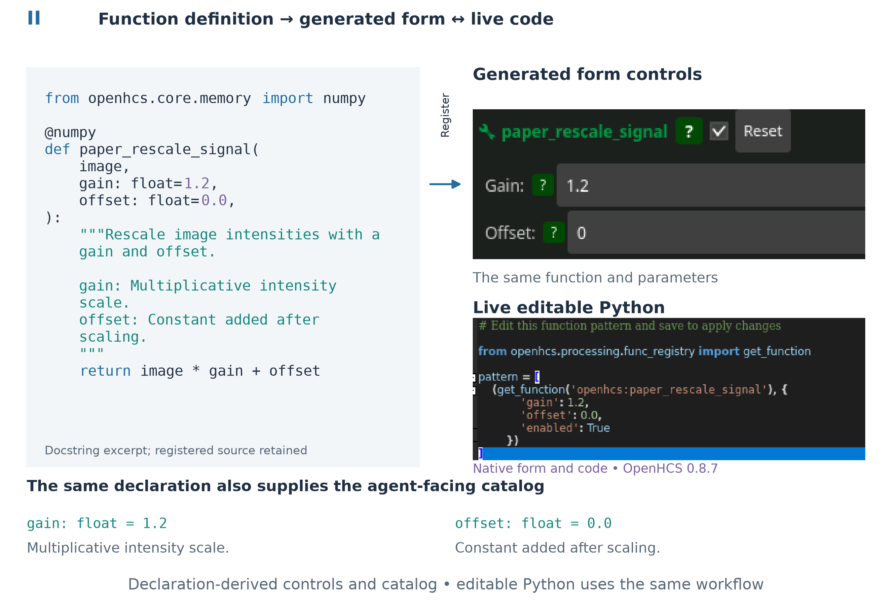
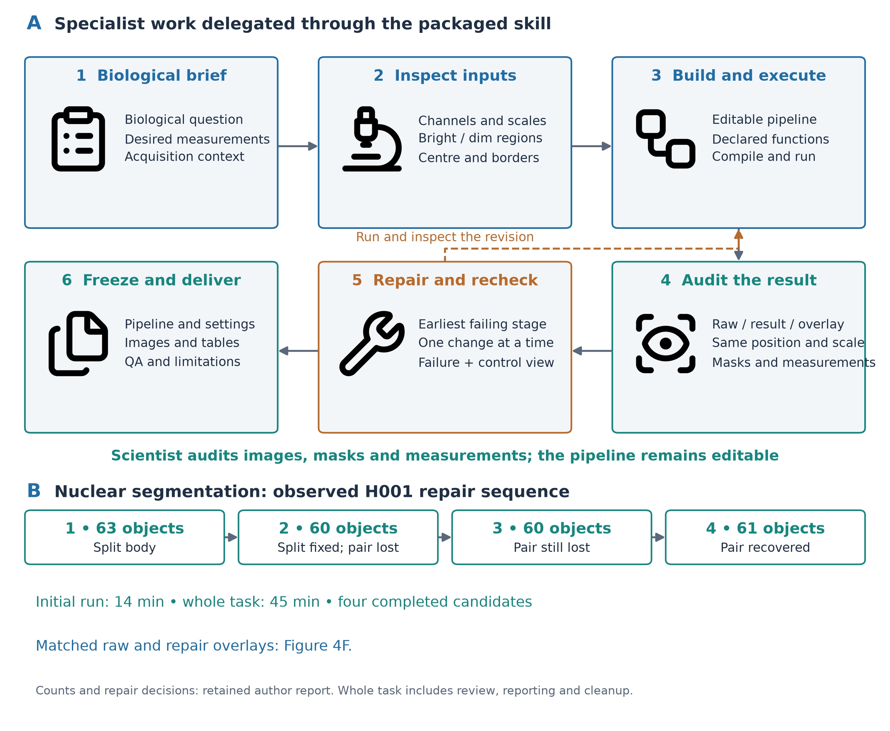
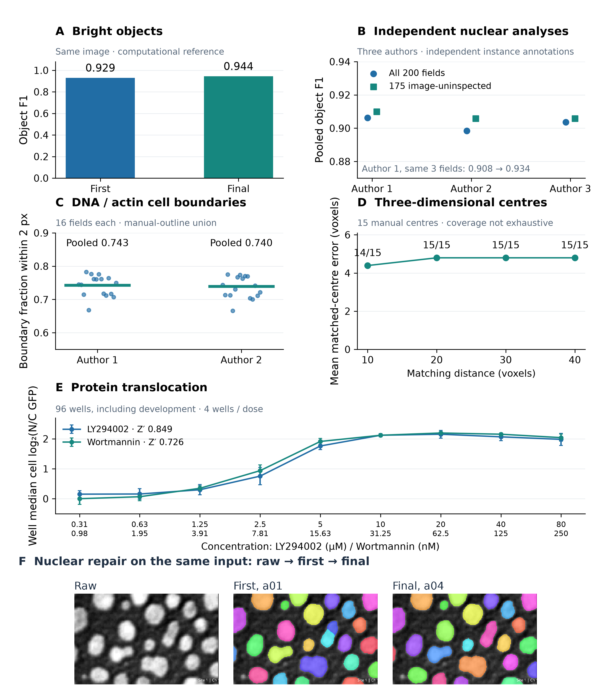
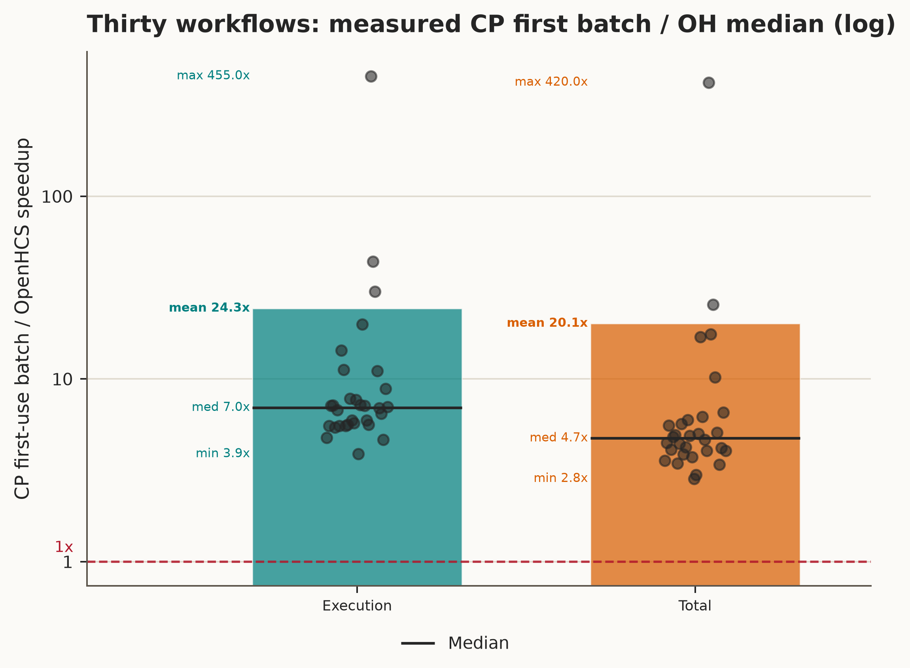

# OpenHCS: autonomous image analysis that domain experts can audit

**Authors:** Tristan Simas, Jathav Puvirajan, and Alyson Fournier

**Affiliation:** McGill University, Montreal, Quebec, Canada

**Correspondence:** Tristan Simas, <tristan.simas@mail.mcgill.ca>

**Short title:** OpenHCS: autonomous microscopy analysis

**Keywords:** microscopy; image analysis; self-driving laboratory; autonomous analysis; agentic AI; high-content screening

## Abstract

Turning microscopy images into measurements requires choices about channels, preprocessing, segmentation and quality control beyond the biological question itself. We developed OpenHCS, an open-source platform in which an AI agent builds and repairs an analysis from a task brief while the scientist can inspect images, masks and measurements in napari and Fiji. Scientists and agents edit the same pipeline through graphical controls, Python or the Model Context Protocol (MCP). Established CellProfiler workflows and custom Python functions can be combined. All 30 imported CellProfiler workflows passed selected reference-output comparisons, including five supplemented with image or object-label exports. We evaluated autonomy with blind task-only trials: agents constructed and repaired analyses using MCP and packaged guidance, with pipelines frozen before reference comparison and no reference-score feedback. Independent nuclear analyses reached pooled object F1 of 0.898–0.906 across 200 annotated fields, including development fields. A completed 96-well translocation analysis yielded control Z-prime values of 0.849 and 0.726 for two drugs among cells with measurable compartments. Image review showed recovery of retinal cell bodies and principal neurite shafts, with uncertain cell boundaries and unresolved assignment at neurite crossings. Matched single-thread measurements across [pending]{.benchmark-claim key=case_count} workflows showed a minimum execution speedup of [pending]{.benchmark-claim key=execution_min}-fold over native CellProfiler and a median of [pending]{.benchmark-claim key=execution_median}-fold, with no declared-output differences. Scientists can delegate analysis construction and execution without writing an image-analysis program, while retaining the evidence and controls needed to judge the biological result.

## Introduction

An investigator may know which cells, neurites or subcellular signals matter to an experiment without knowing how to turn their images into reliable measurements. Image analysis adds specialist decisions: identifying channels, choosing preprocessing, setting segmentation parameters and checking results across samples. A pipeline that executes successfully can still miss dim structures or divide a cell incorrectly. Delegating this work therefore requires more than a table of answers. The investigator needs to see what was measured and decide whether it represents the biology.

OpenHCS lets an agent construct and repair an analysis from a task brief while keeping the scientist in control of scientific interpretation. Images, masks and measurements remain available in familiar viewers, and the processing settings remain editable through graphical controls or Python. The analysis can be reused without reconstructing its settings from the agent's conversation. Our trials test analysis authoring and repair, rather than ease of use by scientists without image-analysis training.

This capability also supplies the analysis step needed by imaging-based self-driving laboratories, where measurements inform the next experiment. SiLA 2 standardizes device communication, and the Tecan SiLA2 SDK generates server and client interfaces from annotated software declarations [@Hinkel2023]. Modular SiLA infrastructure connects device control and data management, and cell-culture instruments can operate in an out-of-hours autopilot [@Lange2026; @Courtney2025]. Other work connects liquid handlers to orchestration and laboratory assets through shared information models [@Thieme2024; @Rihm2024]. OpenHCS addresses image analysis within such a system; experiment selection and instrument execution remain separate responsibilities.

OpenHCS records processing functions and settings as editable Python with matching graphical controls (Figure 1). Function declarations supply both controls and agent-facing descriptions. A scientist can open an agent-authored pipeline, revise a setting and rerun it; imported CellProfiler workflows and laboratory Python functions enter the same analysis.

Fiji/ImageJ, CellProfiler, Icy and BioImageIT provide established processing workflows, while napari supports multidimensional inspection [@Schneider2012; @Schindelin2012; @Carpenter2006; @McQuin2018; @deChaumont2012; @Prigent2022; @Napari]. OpenHCS connects processing and viewing through an editable pipeline that keeps image identities, settings and intermediate results together.

MCMICRO combines interchangeable processing modules for multiplexed tissue imaging [@Schapiro2022]. AI assistants also support executable bioimage analysis: BioImage.IO Chatbot connects community resources with analysis extensions, Omega generates and runs Python within napari, and Agentic-J generates scripts and coordinates Fiji tools with debugging and quality-assurance agents [@Lei2024; @Royer2024; @Johanns2026]. OpenHCS exposes a shared workflow object for agent operation: submitted pipeline documents are validated before analysis execution and remain editable through the scientist's controls and Python interface.

We evaluated OpenHCS using established CellProfiler workflows and agent-authored analyses of nuclei, cell bodies, neurites and protein translocation. Comparisons with native CellProfiler tested whether imported workflows preserved their selected outputs. Autonomous trials tested whether agents could construct an analysis, inspect its results and correct segmentation errors without access to reference scores. We assessed frozen analyses using annotations, well-level assay responses and matched image review. Separate experiments compared execution and total time across the 30 imported workflows.

```{=openxml}
<w:p><w:r><w:br w:type="page"/></w:r></w:p>
```

### Figure 1. Scientists can inspect and edit the agent's analysis

{width=6.5in}

**(I)** Native main window with outlined editorial enlargements of its plate manager, pipeline editor and real ZeroMQ server browser. Insets cover unused workspace and are not extra application windows. The server browser was captured in OpenHCS 0.8.7; the authoring window in 0.8.5. The supplementary package retains the editing record and capture provenance.

### Figure 1, continued. The laboratory's own Python joins the shared analysis

{width=6.5in}

**(II)** The syntax-highlighted `paper_rescale_signal` declaration, including its NumPy backend decorator and docstring, supplies the shown form defaults and MCP descriptions; no function-specific form or tool was written. Native OpenHCS 0.8.7 form and code views show the same function with gain 1.2 and offset 0.0, verified against its code-document readback. These records establish authoring, not assay execution or a parameter-editing round trip. Supplementary Data 3 retains capture records and limitations.

### Figure 2. One editable workflow connects editing, execution and inspection

{width=6.5in}

Forms, Python and MCP act on one editable workflow; CellProfiler imports enter the same definition. The ZeroMQ execution server compiles pipelines, coordinates workers and returns progress to the editor. Workers read source images, save outputs and stream results to separate napari or Fiji viewers. Logos identify import, storage, processing and viewing integrations, not separate analysis steps. CPU/GPU support depends on the selected functions; OMERO support is experimental. Supplementary Figure 1 expands the runtime and preparation details.

## Materials and Methods

### Workflow definition and image sources

An OpenHCS pipeline is an ordered sequence of functions and settings: for example, selecting a nuclear channel, segmenting nuclei and measuring the resulting labels. Steps use shared defaults unless they declare overrides.

Compilation identifies each step's inputs, checks compatibility and prepares function calls, array conversions and output destinations, resolving defaults and overrides. Workers receive this prepared plan (Supplementary Figure 1).

Function signatures supply parameter names, types and defaults for the controls and editable Python. Backend declarations permit conversions between compatible CPU, GPU and deep-learning libraries. Functions declare whether they support volumes or image planes.

Registering a custom function adds it to the editor and MCP catalog; its signature and docstring supply controls and searchable descriptions (Figure 1II).

Source mappings select channels, planes or stacks and divide images into processing groups. Later steps inherit or replace these choices. Sample, site, channel, plane and time identities remain separate from storage paths, linking measurements to their source images through stacking and processing.

Microscope handlers interpret acquisition-specific layouts and metadata. Bio-Formats-backed discovery provides image-plane records from microscopy containers. The OME-Zarr source reads declared axes, channels, pixel scale and image or plate structure. Explicit source mappings assign roles where acquisition metadata are insufficient. Experimental OMERO support supplies managed images and metadata through the same source model.

### Execution, intermediate results and viewers

Steps produce named images, labels, measurements, object relationships and files. Function contracts declare inputs and outputs; compilation connects later operations to their sources. Results retain the producing step, source coordinates and processing group. Saving and viewer delivery are independent choices (Supplementary Data 4).

napari and Fiji receive selected outputs together with their source coordinates and producing step. The streaming service checks that each viewer is ready and waits for pending display updates to finish. Viewer sessions remain available for inspection after execution. Local files, in-memory data, Zarr-backed stores and OMERO provide storage routes; the OME-Zarr array source is read-only.

The execution server coordinates analysis runs and remains available between requests. Within a run, each worker processes its assigned samples using the prepared plan and reuses loaded libraries and initialized array backends. Worker resources are released when that execution finishes. Worker count controls how many samples can be processed concurrently. Workers normally run in separate processes; a configuration option selects threads instead.

### Agent access through MCP

Through MCP, an AI client requests defined operations for discovering functions, editing and validating pipelines, running analyses, and inspecting progress and results [@MCP]. Each operation's declaration specifies its request and result types, implementation, changes it can make, data access and security requirements. The MCP interface is generated from these declarations, which also govern execution.

Function-discovery operations return descriptions derived from registered processing functions. An agent uses those descriptions to select functions and edit the shared workflow. Registering an additional function makes it available through the existing catalog and workflow operations without requiring a function-specific MCP tool.

Desktop operations edit and run the live workflow; headless operations use a separate execution context. Local clients use standard input/output. Desktop connections are authenticated, stale workflow revisions are rejected, and file access is restricted to permitted paths. Hosted HTTP provides selected read-only operations in isolated workspaces.

### Reusable workflow infrastructure

Reusable libraries supply discovery, settings, generated interfaces, array conversion, storage and process coordination; OpenHCS supplies microscopy functions, source handlers and viewers (Supplementary Table 1).

### Agent-operated analysis

A separate, earlier gpt-5.6-sol demonstration analysed NeuronCyto II field 1 through desktop MCP [@NeuronCytoII]. Its prompt explicitly requested normalization and dim-neurite enhancement, unlike the later task-only trials. Supplementary Data 4 retains the complete prompt, input and software identities, tool trace, wall time, saved outputs and subsequent comparison with published manual measurements. This method-directed demonstration is not included as a task-only trial.

### Prospective agent-authored assay evaluation

Three prospective public-assay trials gave fresh gpt-5.6-sol agents a bounded development partition, biological task, channel identities and desktop/MCP access. Annotations, treatment metadata, held-out images, evaluation code, earlier pipelines and repository source were withheld. Functions and parameters were frozen before disclosing held-out paths; evaluation changed only input and output roots. These were single attempts, not estimates of reliability. Supplementary Data 7 retains partitions, original archives and evaluation artifacts.

BBBC039 supplied four development and 50 held-out fields with independent nuclear instance annotations. One-to-one matching used an intersection-over-union threshold of 0.5; reported measures include object precision, recall and F1, foreground Dice, signed count error, and explicitly defined split and merge diagnostics. BBBC007 supplied four development and 12 held-out DNA/actin fields with manual outlines. Its directed boundary measure reports the fraction of predicted adjacent-cell boundary pixels within two pixels of the manual-outline union. The outlines do not provide exhaustive object correspondence, so this score is not an instance-accuracy estimate.

BBBC013 supplied four development and 92 held-out wells from a two-drug FKHR-GFP translocation assay. The frozen endpoint was the per-well mean of cell-level mean nuclear GFP divided by mean cytoplasmic GFP. Each cell required the same retained object identity in the nuclear and cytoplasmic measurements. Z-prime used sample standard deviations across the four positive and four negative control wells for each drug; cells were not treated as independent replicates. BBBC013 provides treatment truth rather than manual segmentation truth. Prediction bytes were frozen before the evaluator opened held-out annotations or treatment metadata. The exact pipelines, typed score receipts, limitations and infrastructure repairs are retained in Supplementary Data 7.

### CellProfiler import and reference-output comparison

CellProfiler `.cppipe` files are parsed into modules and settings. Setup modules define image sources; registered processing and export modules become editable OpenHCS steps. Each module declaration specifies the images, objects, measurements and relationships its function needs, together with whether it runs per image group or across the plate. The same function is exposed in the GUI, Python and MCP.

Named images and objects connect imported measurements to their inputs, as illustrated by the Comet Assay (Supplementary Data 4). For the advanced segmentation and 3D monolayer tutorials, reloading generated Python checked preservation of function identities and parameters [@CellProfilerTutorials]. Supplementary Data 5 provides their step sequences and source records.

Comparisons use absolute and relative tolerances of `1e-6` for numerical values and image pixels, with no out-of-tolerance pixels; identifiers and categorical values are compared exactly after documented CellProfiler-compatible normalizations. Object-label images are compared exactly after singleton-axis normalization. For five workflows lacking exports, terminal image or object-label exports supplied reference artifacts without changing their processing settings. Supplementary Data 1 records export definitions, output inventories, software versions and historical release-CI results; Supplementary Data 2 documents the imported corpus and setting coverage.

### Task-only authoring and independent repair

The primary outcome is the author's final frozen result after its own inspection
and repairs. Self-directed iteration remains autonomous when the author receives
no external scientific corrections or reference feedback. First-attempt results
describe initial method selection and the extent of repair, not the criterion
for autonomous success. Continuations receiving external scientific corrections
provide assisted-development evidence and are reported separately.

The scientific brief states the target and requested outputs; acquisition facts and operational instructions accompany it. For example, the retinal trial requested: “Produce RBPMS-positive soma instance labels, per-object measurements, qualified counts and a complete PipelineDocument with compile/execution receipts. Report uncertain identity, extent and dividing boundaries explicitly.” Its brief also supplied RBPMS/Hoechst channel hints and instructed metadata confirmation. These are biological targets with technical output and review requirements, not an unrestricted natural-language usability test. The inspected original briefs and their technical hints are retained in Supplementary Data 8.

The packaged skill describes the specialist workflow: inspect channels and representative raw regions, measure feature scales, retrieve applicable function contracts, build and execute a pipeline, and compare matched raw-only, result-only and combined views. It calls for diagnosis at the earliest failing stage, rechecking a positive and a regression control, and retaining the author's selected frozen result. These instructions describe intended practice; the recorded attempts and captures establish which actions each author actually performed. General lessons can improve a later frozen skill, but reference answers and dataset-specific settings remain outside fresh authoring inputs.

Fresh gpt-6.1-sol agents received the brief, packaged skill and MCP, but no reference labels or accepted settings. Public assay briefs included catalogue tracks and typed source bindings; BBBC007 specifically requested seeded-cell segmentation. Authors retained attempts, tool calls and matched views. The coordinator evaluated frozen predictions after authoring ended, without returning scores. These trials are distinct from the earlier prospective held-out evaluation (Supplementary Data 8).

We compared first completed scientific settings with the final settings on exactly the same inputs. Technical corrections needed to submit or execute a pipeline remain part of the record; the first completed prediction is not necessarily the first tool call. H001 used a single notebook-derived bright-object image and its predeclared computational label reference. BBBC039 used independent nuclear annotations, with a paired first/final comparison on three fields and a separate final evaluation across all 200 fields. Some of those fields were inspected during development, so the 200-field result measures reference agreement rather than unseen generalization. Existing instance scorers used one-to-one matching at intersection over union at least 0.5.

For BBBC039, we also scored the frozen final predictions on fields whose images
were not opened by the analysis agents. Original image-delivery records excluded
25 fields opened by at least one of the three agents, leaving a common 175-field
comparison. This retrospective subset is distinct from the prospectively
withheld images above. Supplementary Data 8 records the exclusions, frozen
predictions and each trial's wall time, model and software versions. We report
recorded input, cached-input and output tokens as computational usage. For
selected independent trials, the supplement also estimates API-dollar and
Codex-credit equivalents at published rates observed on 6 October 2026.
These rate scenarios are not actual subscription charges; billing amounts
were not recorded.

For the laboratory neurite comparison, we applied the frozen recipe settings
to nine fields in each of 20 FC-A and Y27632 wells using the current production
backend. An evaluation-only source key linked coded inputs to physical wells.
Each well's endpoint was the unweighted mean of nine field-level measurements:
outgrowth per detected cell, cell count, total outgrowth, branches per cell,
and mean and median process length. For the last two endpoints, we first
averaged the corresponding per-cell values within each field, including
zero-growth cells. Overlapping fields were not deduplicated; total outgrowth
therefore denotes a mean field total, not unique whole-well length. Treatment means
were divided by the same drug curve's zero-dose DMSO mean, with two technical
wells at each concentration. Existing MetaXpress well exports supplied the
comparison response, not manual tracing truth. This fixed-recipe transfer was
separate from autonomous pipeline authoring.

We retained these predictions when subsequent visual inspection identified
shafts included in soma masks, spurious soma-edge branches and supported paths
lost during tracing. Repairs informed by those external observations were
evaluated separately as assisted development, not autonomous authoring. The
comparison retained the same channels, pixel calibration, field sampling and
well aggregation. Matched raw-image, soma-mask and path views were used to
check recovered shafts and genuine branches alongside unsupported routes;
agreement with MetaXpress fold changes was not a tuning criterion.

### Performance measurements and reproducibility

The matched single-sample evaluation used CPU execution with one worker and one numerical thread on one physical core. OpenHCS revision [pending]{.benchmark-claim key=source_revision} ran with Python 3.12; native CellProfiler 4.2.8.1 ran with Python 3.9 in its separate environment. Each workflow used one selected source well or sample, which can contain multiple image sets, with unchanged processing settings and the declared comparison outputs. A warmup preceded three measured repetitions. Complete retained native observations were reused only after the workload, inputs, outputs, software environment and hardware checks passed; OpenHCS observations were acquired on the same clean source revision across all 30 workflows.

Execution timing covers the native pipeline call, including preparation of the run and groups, module processing and post-run work; OpenHCS timing covers the complete server execution job, including ordinary output publication and plate exports. Process, JVM and execution-server startup, function-library readiness, warmup and scientific comparison are excluded. The separate total metric compares the prepared native invocation with the sum of disjoint OpenHCS client compilation and execution submission/wait phases. Nested server and worker durations are not added again. Each workflow's speedup is the ratio of the two engines' independently calculated median durations; the reported cohort median is the median of those 30 ratios. Original reports, summaries, source checksums and figure provenance are retained with the matched benchmark record.

Historical performance protocols and their different timing and output policies are retained in the supplement. They are not combined with the matched execution and total-time comparisons.

## Results

### Scientists and agents can revise the same analysis

The desktop interface, generated Python and MCP operations read and modify the same workflow definition (Figure 1). A pipeline created by an agent can be opened in the editor, revised by a scientist and run again. Source mappings connect folders, Bio-Formats containers and managed images to named inputs. Intermediate images and measurements retain their source coordinates and producing step, allowing a displayed result to be traced back to its processing choices.

A separately retained authoring check demonstrates this connection directly (Supplementary Data 3). An MCP request applied edited Python to the normalization step, changing its high percentile from 99.8 to 99.6; the control then showed 99.6. A subsequent MCP field-edit request restored 99.8, and regenerated Python contained that value. The full application view, parameter controls and function-code window were captured in the same session, using the source commit released as OpenHCS 0.8.5. Forms show the values that will be used, including shared defaults; clearing a step's override restores its shared setting.

The UI submits work to a separate execution server using ZeroMQ messaging. The server prepares the function catalog, compiles the workflow and coordinates workers. Workers execute the prepared steps and stream selected results to separate napari or Fiji processes, while progress returns through the server to the UI (Figure 2).

Scientists can inspect streamed images and objects in Fiji or napari (Supplementary Data 4). napari also exposes layer and ROI information to agents; selected objects remain linked to their measurements.


### Prospective held-out assay analyses

The earlier prospective trials recovered nuclear foreground and translocation responses but over-segmented nuclear instances and left uncertain actin-defined boundaries. On held-out fields, BBBC039 pooled object F1 was 0.746 and foreground Dice was 0.935; BBBC007's directed boundary fraction was 0.671. Across 92 BBBC013 held-out wells, control Z-prime was 0.751 for Wortmannin and 0.554 for LY294002. These single-attempt trials are distinct from the later self-repair evaluations below. Supplementary Figures 2–3 and Supplementary Data 7 provide counts, scoring definitions and treatment summaries.

### Imported CellProfiler workflows match the compared reference outputs

All 30 workflows passed selected reference-output comparisons in one unified current-source run, with zero reported differences. The selected reference profiles comprised 21 with CSV measurements, three with SQLite measurements and CellProfiler Analyst properties, and six containing only retained images or arrays. The five supplemented workflows contributed five object-label images and three numerical images. All five label images matched exactly after singleton-axis normalization, and all three numerical images passed with zero out-of-tolerance pixels. Supplementary Data 1 identifies every selected output and preserves the unified observations and source identity.

Image comparison executed for seven workflows: six image- or array-only profiles and the completed translocation example, whose overlay was compared alongside its SQLite measurements. Supplementary Data 4 shows how named images, objects and operations are retained in the imported Comet Assay.

The assays include DNA-damage measurement, human and Drosophila cell morphology, tumor morphology, Cell Painting morphology and quality control, protein translocation, wound healing, time-lapse tracking, imaging flow cytometry, colocalization, positive-cell classification, yeast screening, and *C. elegans* phenotyping. Supplementary Data 1-2 identify the workflows and imported settings.

The advanced segmentation and 3D monolayer imports retain their named structures, measurements and processing sequences in editable Python (Supplementary Data 5).

### Autonomous analysis across distinct biological tasks

Agents used only a task brief, the packaged skill and MCP to select parameters,
inspect matched raw and result views, and repair their own pipelines. The final
pipeline was frozen before reference evaluation. The examples below distinguish
instance detection, localisation, cell-body support and assay measurements;
these endpoints should not be combined into a single accuracy percentage.

For bright-object segmentation, the H001 author matched 59 of 64
notebook-reference objects while reducing excess predictions from four to two,
raising object F1 from 0.929 to 0.944 (Figure 4A,F). The reference is computational,
not a manual cell census. Independent BBBC039 authors achieved final pooled
object F1 of 0.898–0.906 over the same 200 annotated fields. On the common
175 fields opened by none of the three agents, final F1 was 0.906–0.910.
The lower-scoring
fields show that useful overall agreement does not imply uniform accuracy.

In three dimensions, a measurement-first author recovered all 15 annotated
centres within the predeclared 30-voxel matching distance, with mean matched
error of 4.80 voxels (Figure 4D,I). All 15 also matched within 20 voxels.
Eleven further predictions were unmatched to annotations of unestablished
coverage. Native orthogonal views reveal supported body locations and remaining
lobed-body ambiguity; a separate author repaired an internal partition without
merging the neighbouring body (Figure 4H; Supplementary Figure 4 shows a separate author).

Paired DNA/actin analysis separates nuclear detection from supported cell-body
growth (Supplementary Figure 4). A completed autonomous field analysis
recovered 56 nuclei and retained 54 actin-supported cells after removing two
seed-only candidates. Every retained cell contains all pixels of its associated
nucleus. This is a geometric consistency check, not proof of biological identity
or complete cell boundaries. Local controls include recovered crowded nuclei
and unsupported body candidates.

In the noisy retinal images, agents detected bright RBPMS-positive cell bodies
against heterogeneous background. Figure 4G and Supplementary Figure 4 show an agent
repairing a divided cell body while keeping a neighbouring pair separate;
its final segmentation contained 102 objects. A separate completed analysis
retained 136 candidates, including ten touching the image border
(Supplementary Data 8). Diffuse rings and crowded outlines remained uncertain
(Supplementary Figure 4). No exhaustive manual count was available, so retinal
performance was assessed by comparing the detections with the underlying
signal in several regions rather than assigning an accuracy percentage.

For public neurite images, autonomous analysis recovered principal shafts and
raw-supported junctions (Figure 5 and Supplementary Data 8). Main-shaft coverage is the
relevant illustrative endpoint: exhaustive filopodial tracing is not required.
Additional threshold lowering can add uncertain short twigs without improving
that endpoint. The last repair expanded tracing beyond the intended thick-shaft
target; Figure 5 therefore illustrates the retained initial shaft candidate,
not a successful final repaired result. The shaft-specific target was clarified
after the run and is not credited to its original brief. Crossings remain a
limitation for assigning length to individual
neurons. The representative shaft result is not presented as a manual-trace
accuracy measurement. Its inputs matched the published NeuronCyto II image-1
field, but the manual-reference tables did not specify length units and the
available reference lacked spatial traces for matching (Supplementary Data 8).

A separate autonomous author analysed all nine fields of the laboratory neurite
dataset using only its task brief, MCP and packaged guidance. During image
review, it detected that its initial settings excluded thin processes and
adjusted neurite admission while retaining the same cell-body labels in the
reviewed field. The final analysis recovered many raw-visible paths in sampled
sparse and dense regions, although some fine branches and cell assignments at
crossings remained uncertain. Fields were analysed separately; overlapping
positions were not deduplicated, so their counts do not represent unique
neurons. The frozen pipeline, outputs and independent image review are linked
in Supplementary Data 8. This trial used development images rather than an
unseen test set.

Following externally informed repairs, analysis of all 180 fields in 20 matched
wells recovered increasing outgrowth-per-cell responses to FC-A and Y27632
(Figure 5; Supplementary Figure 6). At 40 µM, OpenHCS fold changes were
1.77 and 1.76, respectively, versus MetaXpress's 1.98 and 2.05. Total-outgrowth
estimated fold changes were also smaller. Branches-per-cell fold changes were 1.65 versus
3.00 for FC-A and 1.82 versus 3.26 for Y27632. OpenHCS control branch counts
per cell were approximately 10–11% higher, but treated counts were 38–39%
lower. Cell counts were unchanged in all 180 fields across the latest
ownership/junction fix relative to the preceding assisted checkpoint;
the difference persisted in total branches and branches per primary process.
Control excess alone therefore does not explain the smaller estimated branching fold changes. Remaining
branch recall, assignment and measurement-definition differences cannot be
separated without spatial ground truth. Both methods recovered concordant
positive outgrowth responses with different measured magnitudes. This is an
assisted-development evaluation, separate from autonomous authoring.

The public BBBC013 translocation analysis completed all 96 wells. It retained
14,631 of 17,320 detected nuclei with eligible cytoplasmic compartments (84.5%).
The agent selected each well's median eligible-cell log2 nuclear-to-cytoplasmic
GFP ratio; the task brief did not prescribe this summary. All 96 wells include
the four development wells. Four wells contribute to each treatment group. Control Z-prime was
0.849 for the LY294002 block and 0.726 for the Wortmannin block (Figure 4E).
Eligibility varies with treatment, so the response describes contributing cells,
not an unbiased estimate for every detected cell. Supplementary Figure 2 shows complementary
compartment-level inspection from assisted development. Frozen records and
individual unsuccessful attempts remain in Supplementary Data 8 rather than
being treated as additional experiments.

| Input and task | Evaluation evidence | Supported result and limit |
|---|---|---|
| H001 bright objects | Pinned notebook instance labels | Object F1 after one-to-one matching; computational reference, not manual biological truth |
| BBBC039 nuclei | Independent instance annotations; full corpus and retrospective image-uninspected subset | Pooled object F1; development and retrospective uninspected subsets distinguished |
| BBBC007 DNA/actin | Manual-outline union | Fraction of predicted boundary pixels near the reference; not boundary recall or exhaustive instance accuracy |
| H002 3-D centres | Manual centre annotations | Matched-centre voxel distance; annotations not established as exhaustive |
| R0010 retinal somata | Distributed matched raw/result review | Autonomous repair retained neighbours and reduced nuisance masks; manual-reference accuracy unmeasured |
| H004 public neurites | Matched raw shafts and nuisance controls | Retained initial principal-shaft recovery; final repair exceeded the shaft target, and per-neuron crossing ownership remains unresolved |
| Laboratory neurites, nine fields | Matched raw/path review in three sampled fields | Autonomous completion and recovery of thin paths after self-directed repair; overlapping fields not stitched or deduplicated, per-neuron ownership unresolved |
| Laboratory neurites, 20-well transfer | MetaXpress well responses; two technical wells per drug/concentration | Concordant positive outgrowth responses with smaller estimated fold changes; assisted transfer, not a separate autonomous authoring trial or manual-trace score |
| BBBC013 translocation | Well-level control and dose summaries; 96 wells | Assay responses recovered in contributing cohorts; compartment coverage varied and whole-cell accuracy unmeasured |

Table 1. Endpoints, references and scope of autonomous image analysis.

Predictions were frozen before reference comparison; scores were not returned to authors. Visual-review rows provide no numerical accuracy estimate.

### Figure 3. Delegated specialist work leaves an analysis the scientist can inspect

{width=6.5in}

**(A)** Licensed Lucide pictograms explain the packaged skill's intended workflow, not assay data: a biological brief leads to input inspection, execution, matched-view audit, targeted repair and delivery. The scientist can audit the delivered images, masks, settings and measurements. (B) Recorded nuclear-segmentation decisions across four executions: the author's report describes split repair and recovery of a pair lost during revision (matched repair images, Figure 4F). Catalogue times include review, reporting and cleanup. This example does not establish universal adherence to the current skill.

The independent full-200 repeat reached pooled F1 0.898 versus 0.906 for the
earlier author: 61 fields improved, 123 decreased and 16 were unchanged
(Supplementary Figure 3). This repeat retains useful agreement but shows that
within-run repair does not guarantee a better result from the next fresh author.


### Figure 4. Quantitative results and matched image-repair evidence

{width=6in}

**(A)** H001 first/final computational-reference F1 (three fields). (B) Three BBBC039 authors, all 200 and 175 commonly uninspected fields. (C) BBBC007 boundary agreement: field dots and pooled-pixel lines. (D) H002 matched-centre errors and recovered references. (E) BBBC013 dose means/sample SD, four wells per dose; control Z-prime uses four positive/four negative wells. (F) Same-input H001 raw, a01 and a04: a split body is repaired without reference feedback. Colours are not shared object identities. References differ across endpoints; none is a pooled accuracy score. Evaluation records: Supplementary Data 8.

### Figure 4, continued. Repairs and volumetric localisation

{width=6in}

**(G)** Same-input retinal raw/first/final views: fragmented footprints improve while neighbours remain separate. Border and weak-body coverage remain uncertain; this is continuation, not a fresh trial. (H) An independent 3-D author repairs a body partition at Z=36, not the complete volume. (I) A separate frozen analysis: XY labels and post-freeze XZ/YZ outlines (yellow), with in-plane centres (magenta). Fifteen manual centres were recovered; eleven further predictions have no matching annotation of established coverage. Distances are voxels, not micrometres. Colours do not identify objects across attempts. Wider views and remaining errors: Supplementary Figures 3–4 and Data 8.


### Figure 5. Autonomous neurite analysis and assisted treatment evaluation

{width=6in}

**(I, A–C)** Same field and display scale: raw, initial OpenHCS and published NeuronCyto II (Ong et al., Figure 2D [@NeuronCytoII]; CC BY-NC 4.0). C is an algorithm comparison, not manual ground truth; its red annotations are original and exact pixel registration is unestablished. Later OpenHCS repair overextended the target. (II, D–F) Matched autonomous P001 views; overlapping fields were not deduplicated. A/B and D–F are display-inverted only; paths and measurements are unchanged. (III, G–H) Assisted 20-well responses, relative to each drug's DMSO mean. Dots: two technical wells/dose; whiskers: sample SD. Five additional endpoints: Supplementary Figure 6.


### Matched execution and total time across 30 workflows

The matched single-sample evaluation used [pending]{.benchmark-claim key=case_count} workflows from record [pending]{.benchmark-claim key=record_name}, production revision [pending]{.benchmark-claim key=source_revision}. Its publication status is [pending]{.benchmark-claim key=status}. Declared-output comparisons passed in the warmup and three measured repetitions. Figure 6 shows the distribution of workflow speedups, with every workflow retained as a point. The minimum execution speedup over native CellProfiler was [pending]{.benchmark-claim key=execution_min}-fold and the median was [pending]{.benchmark-claim key=execution_median}-fold.

Compile-plus-run total speedup had a minimum of [pending]{.benchmark-claim key=total_min}-fold and a median of [pending]{.benchmark-claim key=total_median}-fold. This comparison includes OpenHCS compilation and client coordination, separately from execution. Exact per-workflow times and the clock definitions accompany the same record.

Measured multi-worker comparisons, total speedup versus assigned sample count, and individual workflow runtimes are shown in Supplementary Figure 7. Single-core amortization and exact efficiencies are retained in Supplementary Data 3.

```{=openxml}
<w:p><w:r><w:br w:type="page"/></w:r></w:p>
```

### Figure 6. Matched single-sample speedup over native CellProfiler

{width=6in}

Execution and compile-plus-run total speedups for [pending]{.benchmark-claim key=case_count} workflows, using one selected source sample, one worker and one numerical thread. Coloured bars show mean speedup, grey points show individual workflows, and black lines show medians on a logarithmic scale. Each workflow's speedup is the ratio of independent engine medians from three repetitions after warmup; the dashed line marks equal runtime. All workflows passed the declared-output comparisons; this is workflow parity, not biological segmentation accuracy. Minimum and median execution speedups are [pending]{.benchmark-claim key=execution_min}-fold and [pending]{.benchmark-claim key=execution_median}-fold; corresponding total speedups are [pending]{.benchmark-claim key=total_min}-fold and [pending]{.benchmark-claim key=total_median}-fold. Record [pending]{.benchmark-claim key=record_name} supplies every panel and manuscript claim. The linear view, individual runtimes and sample-count comparisons appear in Supplementary Figure 7.


## Discussion

OpenHCS makes delegated image analysis inspectable in the terms of the biological experiment. An agent's processing choices remain connected to the source images, masks and measurements, and the scientist can revise the pipeline as the sample or question changes. The trials show agents performing analysis construction and self-directed repair from supplied briefs and acquisition context. They do not establish how easily an untrained user can formulate a brief or judge the result.

A laboratory can import a CellProfiler workflow, adjust source mappings and parameters, add its own Python functions and inspect the masks before processing further samples. Explicit choices permit revision as assays and imaging conditions change.

Imported workflows preserved their selected CellProfiler outputs, and agents recovered useful nuclei, neurite shafts and translocation responses. Image review supported self-directed repairs, but remaining errors included over-segmentation, uncertain boundaries and crossing assignments. Agreement across nuclear fields was uneven; retinal repair showed that improving one region could merge neighbours elsewhere. Task-specific endpoints and distributed inspection remain necessary.

The appropriate endpoint also depends on the experiment. Principal neurite shafts can be recovered without tracing every fine protrusion, whereas assigning length to individual neurons requires resolving crossings. For translocation, the completed 96-well analysis recovered control separation and dose-dependent response among cells with measurable nuclear and cytoplasmic compartments. Treatment-dependent compartment eligibility limits interpretation of the entire cell population. Retinal images lacked exhaustive manual annotations, and their heterogeneous background left some cell outlines uncertain. These distinctions prevent a useful result for one measurement from being treated as evidence for every aspect of segmentation.

Additional models, assays and expert-reviewed images are needed to estimate reliability on new experiments. These trials do not isolate the effect of packaged guidance. When pipelines transfer to new samples, channel choices, parameters and intermediate results remain available for review.

Scientists can therefore delegate pipeline construction and execution while retaining the images, measurements and editable settings needed to judge the result. The same division of work can support an AI-guided laboratory: the agent performs the image-analysis work, while the domain expert remains responsible for the scientific question and interpretation.

## Supplementary Data

The supplementary package indexes retained files and describes their fields and interpretation. Archive DOI: [pending Zenodo publication].

1. **CellProfiler workflow comparison:** unified 30-workflow current-source observations, reference inventory and exact run provenance; historical OpenHCS 0.8.5 release-CI evidence; the five-workflow export definitions and per-artifact audit; and separate historical timing records.
2. **CellProfiler coverage:** module-to-workflow associations, individual setting handling, and archived processing-registration coverage.
3. **Worker and memory measurements:** measured execution and memory by workflow, worker count and repeated-image assignment count, including completion status.
4. **Recorded agent workflow:** evaluated client, model and software versions; input checksums; exact prompt; tool trace and error counts; original outputs; and separately identified later corrections.
5. **Complex CellProfiler workflows:** source-derived step sequences, function-call counts and editable Python for advanced segmentation and 3D monolayer analysis.
6. **Workflow regression tests:** representative configuration, generated-Python and compiler-validation checks, with source and CI-job references.
7. **Prospective agent-authored assays:** frozen pipelines and held-out score receipts for BBBC039, BBBC007 and BBBC013, with quantitative results and operational findings.
8. **Task-only authoring and independent repair:** first/final reference agreement on the same inputs, full-corpus BBBC039 coverage, computational versus biological reference definitions, and retained post-freeze evaluation receipts.

## Code and Data Availability

OpenHCS source code: <https://github.com/OpenHCSDev/OpenHCS>.

OpenHCS documentation: <https://openhcs.readthedocs.io/>.

The supplementary archive contains the figure inputs and generation scripts, frozen analysis pipelines, scoring records and benchmark evidence. Archive DOI: [pending Zenodo publication]. Repository copies are available at <https://github.com/OpenHCSDev/openhcs/tree/main/paper/supplementary> and <https://github.com/OpenHCSDev/openhcs/tree/main/benchmark/results>.

The benchmark uses biological images and pipelines distributed by the CellProfiler project rather than OpenHCS-authored benchmark data. Original sources:

- official CellProfiler example pipelines and images: <https://github.com/CellProfiler/examples> [@CellProfilerExamples]
- official CellProfiler tutorial pipelines and images: <https://github.com/CellProfiler/tutorials> [@CellProfilerTutorials]
- CellProfiler 4 benchmark supplement: <https://github.com/carpenterlab/2021_Stirling_BMCBioInformatics> [@Stirling2021]

The benchmark manifest pins the source collections. The selected matched record, [pending]{.benchmark-claim key=record_name}, retains the measured repetitions, original reports and figure inputs. Earlier unified comparisons and OpenHCS 0.8.5 release-CI evidence remain separately identified in the supplementary archive; they are not combined with the final matched timing record.

Supplementary Table 1 links the source repositories for the eight reusable libraries.

## Acknowledgements

We thank the CellProfiler project, its contributors, and the authors of the underlying biological datasets for making the example, tutorial, and benchmark materials available.

## Author Contributions

[To be confirmed by the authors: assign contributions to the final author list.]

## Funding

[To be confirmed by the authors: list applicable funding bodies, grants and fellowships, or confirm that no specific funding supported this work.]

## Declaration of Competing Interests

[To be confirmed by the authors: disclose relevant financial or personal relationships, or confirm that there are no competing interests to declare.]

## Declaration of generative AI and AI-assisted technologies in the manuscript preparation process

OpenAI Codex was used to assist with manuscript organization, prose revision and reproducible figure-assembly code under the corresponding author's direction. The autonomous analyses evaluated in this study are described separately in Materials and Methods. [Before submission, the authors must confirm their review of the text, citations and figures and their responsibility for the final manuscript.]
