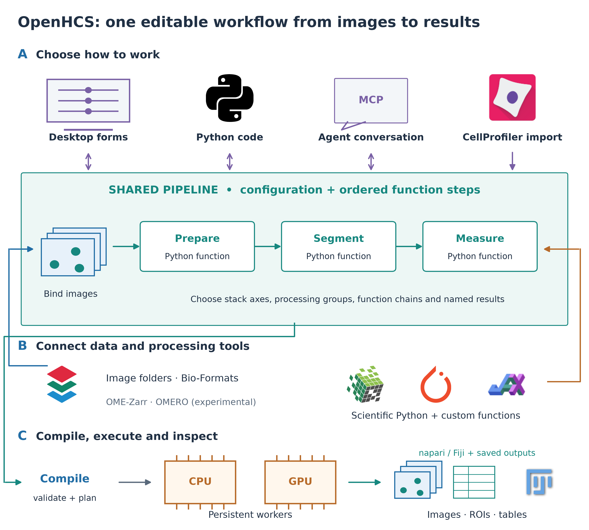
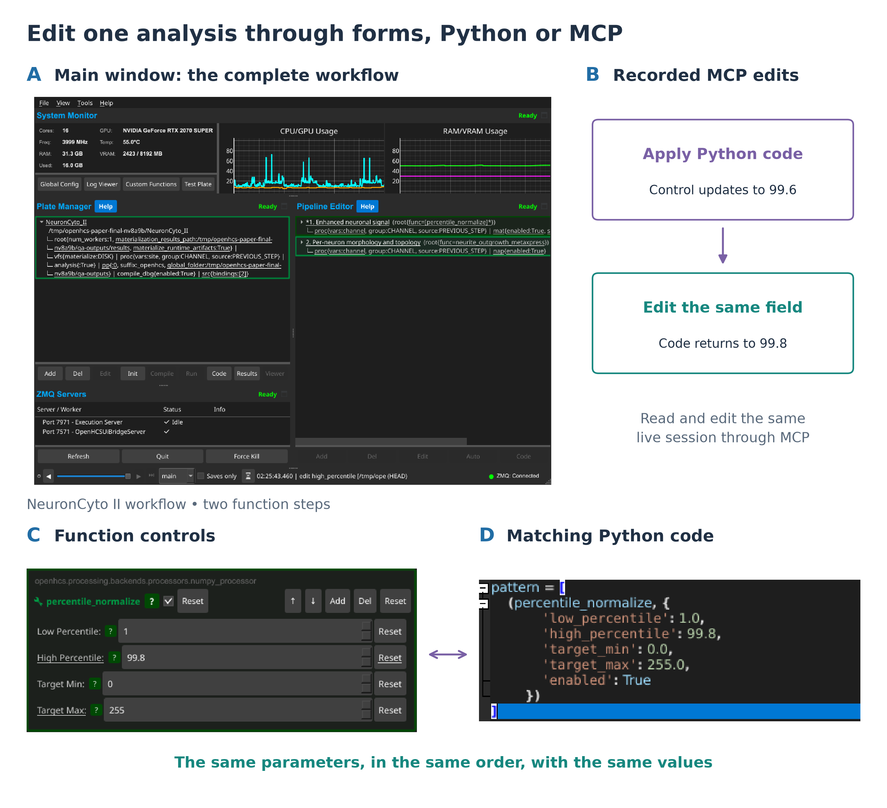
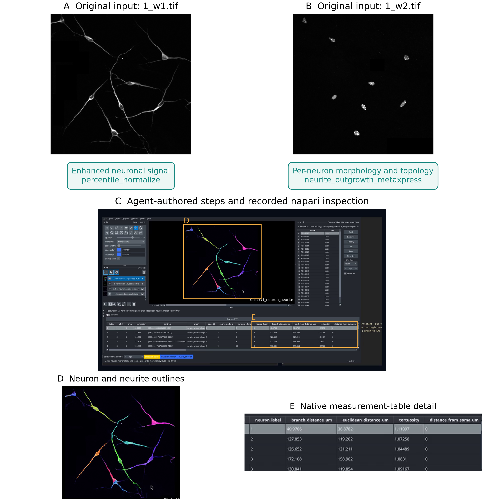
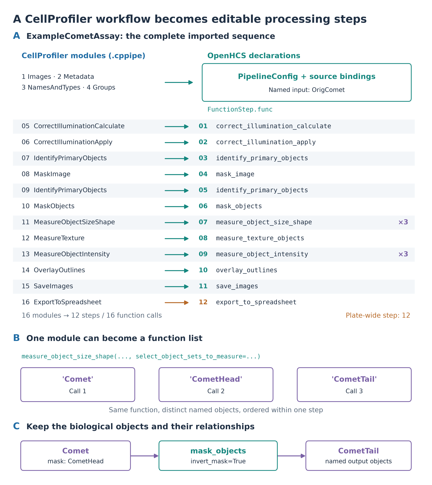
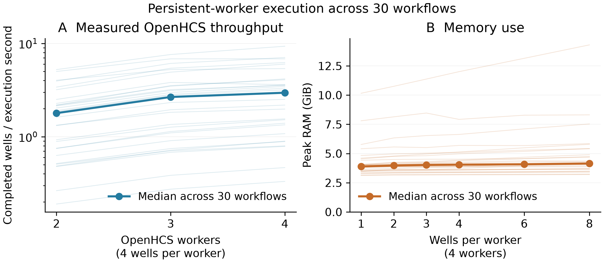
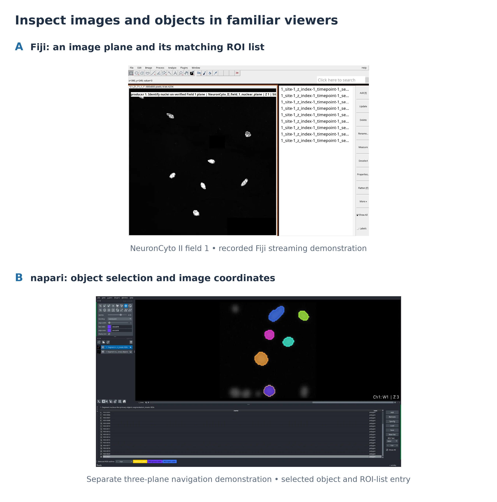

# OpenHCS: interoperable, agent-guided microscopy analysis

**Short title:** OpenHCS: agent-guided microscopy analysis

**Keywords:** microscopy; image analysis; laboratory automation; agentic AI; interoperability; high-content screening

## Abstract

Automated microscopy produces images that must be converted into measurements through analysis workflows scientists can inspect, adapt, and repeat. OpenHCS is an open-source platform that allows scientists and AI agents to operate the same microscopy workflow through a graphical interface, Python, and the Model Context Protocol (MCP). It combines image-source mapping, established image-processing functions, intermediate-output inspection in napari and Fiji, and parallel execution. In a recorded neurite-outgrowth analysis of a public image, an agent selected and configured functions, executed a pipeline, saved images, regions of interest, morphology files and measurements, and inspected the napari results without further human input after a detailed prompt. The pipeline remained editable in the desktop interface and Python. Separately, all 30 official CellProfiler workflows passed their enabled reference-output comparisons, and persistent-worker runs recorded repeated-sample execution and memory use. OpenHCS provides an image-analysis component for AI-guided laboratories in which established methods, intermediate results and processing choices remain accessible to scientists and agents.

## Introduction

Automated microscopy supports screening, time-course experiments, and quantitative studies of cells and tissues. Turning the resulting images into useful measurements requires an analysis workflow: identifying the image channels and dimensions, selecting processing functions, inspecting segmentation, and repeating the analysis across samples. Scientists often revise these choices after reviewing intermediate images. AI-guided laboratories need access to these same operations so that analysis can respond to experimental goals and scientist feedback.

An agent-operated analysis must also remain usable by the scientist. Researchers need to see which images were selected, how parameters were chosen, and whether the resulting masks match the structures of interest. They need to revise the pipeline directly and rerun it on another experiment. These requirements connect agent access to existing image-analysis tools, viewers, data stores, and execution systems.

Related laboratory-automation work has connected liquid handlers to workflow orchestration and linked laboratory assets through shared information models [@Thieme2024; @Rihm2024]. OpenHCS addresses microscopy analysis within this broader effort to make laboratory operations interoperable and accessible.

Fiji/ImageJ, CellProfiler, Icy and BioImageIT support image processing and workflow construction [@Schneider2012; @Schindelin2012; @Carpenter2006; @McQuin2018; @deChaumont2012; @Prigent2022]. napari provides interactive multidimensional viewing, while OMERO, OME-NGFF and Bio-Formats support image management and access [@Napari; @Allan2012; @Moore2021; @BioFormats]. Scientific Python and GPU libraries supply additional algorithms [@vanDerWalt2014; @Haase2020], and workflow systems organize reproducible computation [@Koster2012; @DiTommaso2017; @Galaxy2020; @Galaxy2024]. Combining these resources requires keeping image identities, parameter choices and intermediate results consistent as an analysis moves between tools.

MCMICRO combines interchangeable processing modules for multiplexed tissue imaging [@Schapiro2022]. AI assistants also support executable bioimage analysis: BioImage.IO Chatbot connects community resources with analysis extensions, Omega generates and runs Python within napari, and the Agentic-J preprint describes a containerised system for Fiji workflows with MCP-based extensions [@Lei2024; @Royer2024; @Johanns2026].

OpenHCS represents an analysis as an ordered list of configured processing steps shared by the graphical interface, Python and MCP clients. This common definition includes imported CellProfiler workflows and custom Python functions. Scientists and agents can edit its image selections and parameters, inspect intermediate results in napari or Fiji, and run it across samples. These choices remain attached to the pipeline as users move between interfaces.

Before execution, a compilation stage resolves the selected images, checks the inputs and outputs of each step, and prepares the work for separate execution processes. These checks give scientists and agents feedback on setup errors before a long analysis starts. The same pipeline can incorporate existing CellProfiler modules and additional Python functions.

CellProfiler import provides a direct test of workflow preservation. A `.cppipe` file contains image-loading rules, module settings, image names, object names, measurement expectations, display choices, and output behavior. OpenHCS compiles `.cppipe` files into editable workflows and compares their outputs against native CellProfiler; the benchmark retains these comparisons alongside timing records. Native OpenHCS functions and backend-specific algorithms remain distinct methods unless they are evaluated against their own reference.

We evaluated agent-operated pipeline construction and inspection using a public neurite-outgrowth image, and workflow preservation using official CellProfiler analyses spanning cellular morphology, Cell Painting, translocation, wound healing, tracking, yeast screening, and worm phenotyping. Execution benchmarks assessed single-sample runtime and many-sample throughput. Together, these evaluations examine how existing microscopy analyses can be operated through an agent interface while retaining reviewable results and reusable pipelines.

## Materials and Methods

### Workflow definition and image sources

An OpenHCS pipeline contains shared configuration and an ordered list of function steps. Each step specifies a Python function or a sequence of functions with their parameters. Before execution, compilation resolves inherited defaults and step-specific overrides, identifies source images and dependencies, and prepares function calls, array conversions and output destinations. Workers receive this prepared plan (Supplementary Figure 3).

Function signatures supply the editable parameters shown in the GUI and generated Python. Each function declares the array library it expects, allowing compatible conversions between CPU arrays, GPU array libraries and deep-learning frameworks. Functions retain their own dimensional requirements: volumetric analysis uses functions that support three-dimensional inputs, while two-dimensional functions operate on image planes.

Users can register custom Python functions for use in ordinary pipeline steps. The registered function appears in the editor's function list; its signature and docstring supply parameter controls and MCP descriptions (Supplementary Figure 5).

Image-source mappings select and name the inputs, link them to metadata tables, and specify how they form stacks and processing groups. Individual steps inherit these choices and can select different inputs. Sample, site, channel, plane and time coordinates are recorded separately from storage addresses, preserving acquisition identity when images are assembled into stacks or passed to later steps.

Microscope handlers interpret acquisition-specific layouts and metadata. Bio-Formats-backed discovery provides image-plane records from microscopy containers. The OME-Zarr source reads declared axes, channels, pixel scale and image or plate structure. Explicit source mappings assign roles where acquisition metadata are insufficient. Experimental OMERO support supplies managed images and metadata through the same source model.

### Execution, intermediate results and viewers

Processing steps produce named images, labels, measurements, relationships and files. Each function declares its required inputs and available outputs; the compiler connects later operations to the source images or earlier results they need. During execution, named results retain their producing step, source coordinates and processing group. Saving a result and sending it to a viewer are independent configuration choices (Supplementary Figure 4).

napari and Fiji receive selected outputs with producer and source metadata. The streaming service checks that each viewer is ready and waits for pending display updates to finish. Persistent viewer sessions remain available for inspection after execution. Local files, in-memory data, Zarr-backed stores and OMERO provide storage routes; the OME-Zarr array source is read-only.

Persistent execution processes reuse imported libraries and backend initialization across samples. The worker experiments measure execution time, completed sample count, worker count and peak memory separately from the single-sample comparison.

### Agent access through MCP

MCP gives an agent structured operations for discovering functions, editing and validating pipelines, running analyses, and inspecting progress and results [@MCP]. Each operation is defined once, with its request and result types, implementation, side effects, data access and security requirements. MCP derives the exposed operations from these definitions, which also govern execution.

Local clients communicate with the MCP server through standard input and output. Deployment profiles select desktop-assisted, headless, authoring or development operations. Desktop operations connect to the running application through an authenticated bridge; revision checks detect edits based on an outdated workflow state. Headless operations use a separate execution context. Filesystem reads and writes are restricted to configured roots. A hosted HTTP service exposes a selected read-only subset in isolated server-side workspaces.

### Agent-operated analysis

The recorded run used Codex 0.146.0 with gpt-5.6-sol on Linux, connected by local stdio MCP to the desktop profile of OpenHCS 0.7.13 in a source-checkout virtual environment. The input was field 1 from the public NeuronCyto II dataset [@NeuronCytoII], comprising two 800 x 800-pixel, unsigned 8-bit TIFF images. Both were assigned to one biological image, with separate neuronal/neurite and soma/nuclear channels. Supplementary Data 4 identifies the software revision, input checksums and exact task prompt.

The prompt requested normalization, dim-neurite enhancement, segmentation and per-neuron morphology measurements, with saved images, regions of interest (ROIs), graph paths, SWC neuron-morphology files, tables and a reviewable napari presentation. It authorized changes to an isolated desktop session and writes under the stated output root, and prohibited shell commands and repository inspection. The client ran with approval checks and its operating-system sandbox bypassed. MCP-only operation was assessed from the observed tool trace: no non-MCP calls or subsequent human interventions were recorded.

The event trace was used to count attempted calls, returned errors and subsequent corrections (Supplementary Data 4). Agent wall time was measured from the recorded start and end timestamps; pipeline execution time was reported separately. Checks covered completed execution, saved files, editable pipeline source, and delivered viewer outputs and coordinates. Segmentation accuracy was not quantified against a manual ground truth in this run.

### CellProfiler import and reference-output comparison

CellProfiler `.cppipe` files are parsed into modules and settings. Setup modules define image sources; registered processing and export modules become editable OpenHCS steps. Each module declaration specifies the images, objects, measurements and relationships its function needs, together with whether it runs per image group or across the plate. The same function is exposed in the GUI, Python and MCP.

The imported ExampleCometAssay illustrates this mapping (Figure 4). Its 16 modules become image-source configuration and 12 processing steps containing 16 function calls. One step measures the size and shape of three named object sets: Comet, CometHead and CometTail. Another defines CometTail by masking the comet with the inverted head mask. These names connect each measurement to the object set it describes.

Two additional workflows illustrate larger imports: the advanced segmentation tutorial and the 3D monolayer tutorial [@CellProfilerTutorials]. Enabled modules were parsed from the benchmark pipeline files, translated using the current importer, and counted alongside their generated function steps and individual calls. The imported Python documents were reloaded to check preservation of function identities and parameters. These authoring checks are separate from the archived output comparisons. Supplementary Data 5 provides the complete step sequences and source records.

Imported `ExportToDatabase` modules run once per plate after image-group processing. They collect the selected images, objects, measurements, relationships, thumbnails and grouping information into CellProfiler Analyst tables [@Jones2008]. The export produces a self-contained SQLite database and matching `.properties` files. Non-SQLite databases, custom filter rows, `.workspace` generation and some historical aggregation settings remain unsupported; unsupported requests fail or are identified in the compatibility documentation.

Native CellProfiler generates the reference outputs for each benchmark workflow. OpenHCS imports and runs the same `.cppipe` file on the same images. The official-30 manifest enables value-output comparison: exported tables and database values are checked, with image comparisons for native reference profiles containing only images. CellProfiler Analyst SQLite tables and `.properties` values participate when present. Numeric comparisons use declared absolute and relative tolerances; identifiers and categorical values are compared exactly unless a specific CellProfiler-compatible normalization is documented. A workflow passes when its enabled comparisons report no unresolved differences. The original per-run comparison profiles and environment records are needed to reproduce the historical checks exactly.

The corpus contains 22 workflows and associated image sets from the official CellProfiler 3 examples repository, seven workflows and image sets from the official CellProfiler tutorials repository, and one workflow from the supplement to the CellProfiler 4 performance study [@CellProfilerExamples; @CellProfilerTutorials; @Stirling2021]. The CellProfiler project and the cited dataset contributors retain authorship and provenance for these materials. The retained manifest maps workflow names to pipeline and image locations; Supplementary Data 1-3 provide the corresponding comparison, coverage and throughput tables.

### Performance measurements and reproducibility

Multi-sample runs measured completed wells per execution second and peak memory while varying worker count and queue depth. Workers reused imported libraries and initialized backends across replicated inputs. The throughput comparison queued four wells per worker; the memory sweep used four workers. Runtime-artifact saving and runtime-observation collection were disabled. These measurements cover CPU execution on local or explicitly mounted image sources; GPU and cloud or network-storage performance were not measured.

The archived single-sample benchmark specifies one thread/core, CPU-only execution and no batching, with one retained comparison observation per workflow. The harness committed with the tables times the native CellProfiler command from subprocess launch through completion, including its startup. It times OpenHCS execution after initialization and compilation. Total-phase values also include different work, including benchmark validation and comparison on the OpenHCS path. Supplementary Figure 6 and Supplementary Data 1 report these observations with their timer definitions; they do not establish a like-for-like speed comparison. The wound-healing native duration equals the 900-s timeout ceiling without an explicit completion flag and is excluded from timing statistics.

The benchmark package contains the workflow manifest, pinned dataset revisions, timing and output-comparison summaries, worker/memory measurements, and coverage tables. Figure scripts regenerate panels from saved CSVs and record source and output checksums.

## Results

### One executable workflow retains analysis state across tools

The desktop interface, generated Python and MCP operations read and modify the same workflow definition (Figure 1). A pipeline created by an agent can be opened in the editor, revised by a scientist and run again. Source mappings connect folders, Bio-Formats containers and managed images to named inputs. Intermediate images and measurements retain their source coordinates and producing step, allowing a displayed result to be traced back to its processing choices.

A recorded authoring check demonstrates this connection directly (Figure 2). Through MCP, the normalization high-percentile parameter was changed in Python from 99.8 to 99.6, and the corresponding control was checked. Editing the field back to 99.8 then produced matching regenerated Python. The full application view, parameter controls and function-code window were captured in the same session, using the source commit released as OpenHCS 0.8.5. Forms show effective values, including inherited defaults; clearing a local override restores inheritance.

Stacking, grouping and scheduling express different choices. A step can assemble Z planes into an array, apply different function chains to different channels, and supply named segmentation labels to a later measurement step. When time is configured as sequential, the entire pipeline finishes for one timepoint before the next begins; separate wells can run in parallel (Supplementary Figure 1). Each selected function determines its array-library support and whether it processes individual planes, whole stacks or reduces a stack to an output.

The UI submits work to a separate execution server using ZeroMQ messaging. The server compiles the workflow and coordinates workers. Workers execute the prepared steps and stream selected results to separate napari or Fiji processes, while progress returns through the server to the UI (Supplementary Figure 2). Figure 6 shows both viewer destinations. napari additionally exposes structured image, layer and ROI information for agent inspection; Supplementary Figure 4 links a selected object to its saved measurements and viewer features. Fiji provides native image and ROI display with a smaller programmatic inspection interface.

### An agent builds and inspects a neurite-outgrowth workflow

From a detailed prompt identifying the two NeuronCyto II channels and requested outputs, the agent built and inspected a neurite-outgrowth analysis without further human input.

The agent inspected the images' organization and constructed a two-step pipeline: normalization followed by a registered neurite morphology and topology function (Figure 3). Of 140 attempted MCP calls, one failed at the tool-call level and 30 completed responses reported operation errors. Code-document validation rejected incorrect preset imports and configuration values before execution; the agent revised the document until validation succeeded, then compiled and ran it in the desktop session. The saved record reports 609 s from start to completion, including authoring, corrections, execution and review; pipeline execution took 16.5 s. Outputs included neuron and nuclear labels, per-neuron measurements, neurite paths, ROI files and an SWC morphology file. The pipeline remained editable in Python and the graphical interface.

The final napari view displayed enhanced neuronal signal, unified neuron labels and neurite paths, with a feature table linking paths to measurements. Structured viewer checks found all nine expected outputs present with no missing or duplicate coordinates. The original analysis reported nine neurons, ten nuclei and 25 graph paths. Subsequent visual review identified a crossover classified as branching. The later corrected demonstration reported the same neuron and nucleus counts, six branches instead of eight, and 24 graph paths instead of 25. Supplementary Data 4 separates the original and later result summaries. The example records agent-operated construction, execution and inspection followed by scientist-led review and method refinement.

### Imported CellProfiler workflows match the compared reference outputs

An imported workflow is assessed against the outputs produced by native CellProfiler on the same images. The official-30 manifest checks exported table and database values and, for image-only reference profiles, image outputs. All 30 workflows passed their enabled comparisons with no unresolved differences. The retained tables report one passing comparison observation per workflow, alongside timing and separate module/setting coverage (Supplementary Data 1 and 2). Figure 4 shows how named images, objects and operations are retained in the imported Comet Assay.

The assays include DNA-damage measurement, human and Drosophila cell morphology, tumor morphology, Cell Painting morphology and quality control, protein translocation, wound healing, time-lapse tracking, imaging flow cytometry, colocalization, positive-cell classification, yeast screening, and *C. elegans* phenotyping. The corresponding operations include segmentation, filtering, intensity and texture measurement, illumination correction, spatial relationships, tracking, image and table export, and specialized worm morphology. Supplementary Data 1-2 identify the workflows and imported settings.

The archived coverage tables list 58 distinct module names and 7,158 setting rows. They record whether a setting supplies a function parameter, an input/output requirement, an infrastructure option, or is intentionally ignored. Coverage describes how configurations are imported; the comparison results assess their outputs. Database export remains an ordinary terminal workflow step, using the same measurements and source identities as preceding steps.

### Complex workflows retain their processing and measurement structure

The advanced segmentation tutorial imports 23 enabled modules into 16 steps containing 59 function calls (Supplementary Data 5). It corrects illumination in five channels and identifies nuclei, cells, cytoplasm, nucleoli and mitochondria. Measurements include colocalization, intensity, radial intensity distribution, size and shape, and neighbors. Object relationships associate nucleoli with nuclei and mitochondria with cells before SQLite export. Repeated channel/object measurements become function lists within a step, retaining the selected inputs and parameters.

The 3D monolayer tutorial imports 35 enabled modules into 31 steps containing 35 function calls. It combines volumetric resizing and filtering, hole filling, nuclear watershed segmentation, seed preparation and cell watershed segmentation, followed by intensity and shape measurements, overlays, label-image saving and spreadsheet export. Both workflows have passing output-comparison summaries in the archived corpus. The current import checks additionally preserve their function identities and parameters through generated Python; they do not constitute new analysis executions.

### Many-well throughput uses persistent workers

OpenHCS throughput was measured directly in replicated-well runs over all 30 workflows. With four wells queued per worker, median throughput across workflows was 1.79, 2.67 and 2.96 completed wells per execution second with two, three and four workers, respectively (Figure 5A). Each run completed all assigned wells. These measurements describe prepared execution with persistent workers under the output settings specified in Methods. Supplementary Data 3 retains the individual runs and a separate serial CellProfiler projection; native persistent or matched parallel execution was not measured.

Each worker uses memory for imported libraries, cached arrays, and intermediate outputs. Across all 30 OpenHCS workflows in the four-core queue-depth sweep, median peak RAM increased from 3.89 GiB at one well per core to 4.15 GiB at eight wells per core, with maximum peak RAM reaching 14.3 GiB. Memory summaries include the wound-healing workflow because its OpenHCS run completed; only comparisons requiring its native CellProfiler timing exclude it.

## Discussion

OpenHCS makes microscopy workflows accessible to scientists and agents through a shared analysis definition. In the recorded neurite-outgrowth example, an agent constructed and executed the pipeline, inspected its outputs, and left an editable workflow for further use. The CellProfiler experiments address a complementary requirement: retaining the outputs of established analyses while changing how they are configured and executed. Together, these capabilities support the analysis stage of AI-guided laboratory work.

CellProfiler contributes established analysis modules and reusable workflows, while Fiji and napari provide familiar environments for inspecting images. Icy Protocols and BioImageIT also address graphical workflow composition and integrated image-data processing [@deChaumont2012; @Prigent2022]. OpenHCS connects these roles to agent-operated authoring and execution. Its shared workflow definition allows scientists to take over an agent-authored pipeline, adjust a processing step, or inspect an intermediate result through the desktop interface.

Workflow reuse can reduce the setup required for a new experiment. A laboratory can import a CellProfiler analysis, adjust its source mapping and parameters, add an assay-specific Python function, and inspect the resulting masks before processing further samples. Pipelines can also be authored directly in OpenHCS. Keeping the processing choices explicit provides a basis for review as analysis methods and experimental conditions change.

The single-field agent demonstration establishes workflow completion under the stated prompt and client/model conditions. The crossover correction illustrates the value of reviewing segmentation and tracing after execution succeeds. Further evaluations across datasets and users can measure task completion, required interventions, elapsed time, and agreement with expert-reviewed results using the same trace-based assessment.

The many-well runs show completed work and memory use with persistent workers. Comparative throughput can be assessed with paired CellProfiler and OpenHCS runs using the same output requirements and resource limits, measuring cold-start analysis and repeated prepared execution separately.

The tested CellProfiler corpus defines the present output-equivalence evidence. Additional modules, settings, and versions can be assessed through the same comparison procedure. For new image sources, explicit channel and dimensional mappings remain important, particularly when acquisition metadata are incomplete. The workflow records these choices so that they can be reviewed before interpreting measurements.

OpenHCS provides reusable image-analysis infrastructure for laboratories adopting agent-guided workflows. Scientists can retain established functions, review intermediate results in familiar viewers, and move between agent assistance and direct editing. Its combination of workflow reuse, inspectable results, and parallel execution supports applying that process to repeated microscopy experiments.

```{=openxml}
<w:p><w:r><w:br w:type="page"/></w:r></w:p>
```

## Figures

### Figure 1. Scientists and agents operate a shared microscopy workflow

{width=6in}

\(A) Desktop, Python and MCP operations act on a shared pipeline; CellProfiler import supplies an editable analysis in that model. The processing sequence is illustrative, with functions chosen for each assay. (B) Image-source bindings and established or custom functions connect to the same definition. OMERO is experimental. (C) Compilation resolves inputs, dependencies and array requirements before worker processes execute the analysis. Selected intermediate results can be inspected in napari or Fiji, and retained images, ROIs and measurements support review and subsequent edits. CPU/GPU support depends on the selected functions; performance measurements are presented separately in Figure 5.

```{=openxml}
<w:p><w:r><w:br w:type="page"/></w:r></w:p>
```

### Figure 2. Forms, Python and MCP edit the same analysis

{width=6in}

\(A) The main window shows the public NeuronCyto II workflow, its two processing steps and connected execution server. (B) A recorded MCP authoring check changes the normalization percentile through Python code, verifies the updated control, then edits the same field and verifies the regenerated code. (C, D) Details from the same session show matching function controls and Python parameters, including the restored high percentile of 99.8. Parameter order follows the function signature. Captures use OpenHCS 0.8.5; Figure 3 presents the original analysis execution.

```{=openxml}
<w:p><w:r><w:br w:type="page"/></w:r></w:p>
```

### Figure 3. Agent-operated analysis of a public neurite-outgrowth image

{width=5.5in}

(A, B) Original 800 x 800-pixel neuronal/neurite and soma/nuclear images from NeuronCyto II field 1 [@NeuronCytoII], displayed linearly over their unsigned 8-bit range without spatial cropping. The two step names and functions come from the agent's saved pipeline. (C) Full frame at 600 s of the original OpenHCS 0.7.13 unattended-run recording, showing outlines, ROI entries and the feature table. Labelled rectangles locate the enlarged details: (D) neuron and neurite outlines and (E) native measurement columns. Both details use unchanged pixels from C. Native column names are preserved; no physical calibration is inferred. This is the original result before the crossover correction described in Results.

```{=openxml}
<w:p><w:r><w:br w:type="page"/></w:r></w:p>
```

### Figure 4. A familiar CellProfiler pipeline expressed as OpenHCS steps

{width=5.8in}

\(A) The public ExampleCometAssay pipeline maps image loading to source bindings and processing to 12 function steps. Rows align original modules and imported functions; multiplicity marks repeated calls. Spreadsheet export runs plate-wide. (B) MeasureObjectSizeShape applies the same function to Comet, CometHead and CometTail within one step. (C) Masking the comet with its head, with inversion enabled, defines CometTail. The diagram is derived from the source pipeline and importer code matching OpenHCS 0.8.5.

```{=openxml}
<w:p><w:r><w:br w:type="page"/></w:r></w:p>
```

### Figure 5. Measured OpenHCS throughput and memory use

{width=5.5in}

\(A) Completed wells per execution second with four replicated wells queued per worker. (B) Peak memory with four workers and increasing wells per worker. Both panels include all 30 workflows; every run completed its assigned wells. Thin lines identify workflows and thick lines show medians. Execution follows compilation, with runtime-artifact saving and runtime-observation collection disabled. Throughput uses a logarithmic axis. Supplementary Figure 6 presents the separate historical single-sample timings.

```{=openxml}
<w:p><w:r><w:br w:type="page"/></w:r></w:p>
```

### Figure 6. Image and object inspection in Fiji and napari

{width=5.5in}

\(A) Fiji displays a single NeuronCyto II field 1 nuclear plane with nine corresponding native ROI Manager entries. (B) A separate three-plane napari demonstration shows segmented objects, a selected ROI-list entry and the displayed channel/Z coordinates. Its accompanying recording shows selection navigating between planes. These are retained viewer demonstrations, separate from the unattended analysis in Figure 3; their segmentation outputs are not compared with each other. The full captures and checksum records are retained in the gallery archive.

## Supplementary Data

The [supplementary index](supplementary/README.md) links the retained files and describes their fields and interpretation.

1. **CellProfiler workflow comparison:** archived single-process timing and equivalence summaries for all 30 workflows. The unresolved native wound-healing time is retained in the source table and excluded from manuscript timing comparisons.
2. **CellProfiler coverage:** module-to-workflow associations, individual setting handling, and archived processing-registration coverage.
3. **Worker and memory measurements:** measured execution and memory by workflow, worker count and well count, including completion status and the serial CellProfiler projection.
4. **Recorded agent workflow:** evaluated client, model and software versions; input checksums; exact prompt; tool trace and error counts; original outputs; and separately identified later corrections.
5. **Complex CellProfiler workflows:** source-derived step sequences, function-call counts and editable Python for advanced segmentation and 3D monolayer analysis.

## Code and Data Availability

OpenHCS source code: <https://github.com/OpenHCSDev/OpenHCS>.

OpenHCS documentation: <https://openhcs.readthedocs.io/>.

Benchmark scripts and records are indexed in the [supplementary data](supplementary/README.md). Figure-generation scripts and figures are located under `paper/figures/` in the source repository.

The benchmark uses biological images and pipelines distributed by the CellProfiler project rather than OpenHCS-authored benchmark data. Original sources:

- official CellProfiler example pipelines and images: <https://github.com/CellProfiler/examples> [@CellProfilerExamples]
- official CellProfiler tutorial pipelines and images: <https://github.com/CellProfiler/tutorials> [@CellProfilerTutorials]
- CellProfiler 4 benchmark supplement: <https://github.com/carpenterlab/2021_Stirling_BMCBioInformatics> [@Stirling2021]

The benchmark manifest records acquisition paths and maps workflows to pinned revisions of their source collections. The linked package contains the archived summaries; original per-run environment records and detailed comparison reports are not included.

Reusable libraries:

- ObjectState: <https://github.com/OpenHCSDev/objectstate>
- ArrayBridge: <https://github.com/OpenHCSDev/arraybridge>
- PolyStore: <https://github.com/OpenHCSDev/PolyStore>
- ZMQRuntime: <https://github.com/OpenHCSDev/zmqruntime>
- pyqt-reactive: <https://github.com/OpenHCSDev/pyqt-reactive>
- pycodify: <https://github.com/OpenHCSDev/pycodify>
- python-introspect: <https://github.com/OpenHCSDev/python-introspect>
- metaclass-registry: <https://github.com/OpenHCSDev/metaclass-registry>

## Acknowledgements

We thank the CellProfiler project, its contributors, and the authors of the underlying biological datasets for making the example, tutorial, and benchmark materials available.
