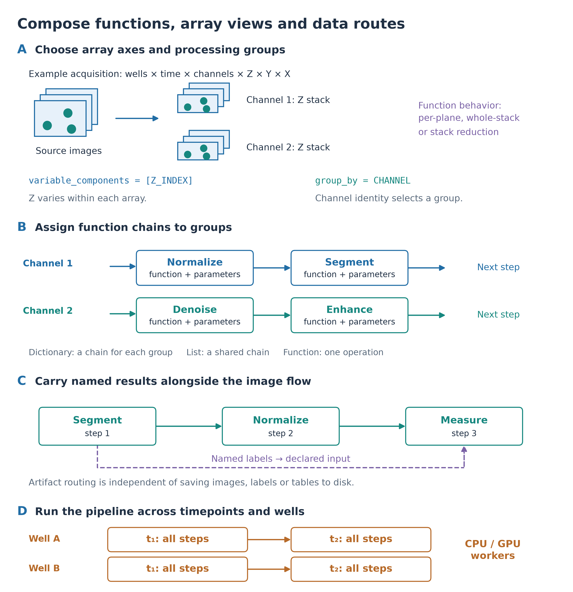
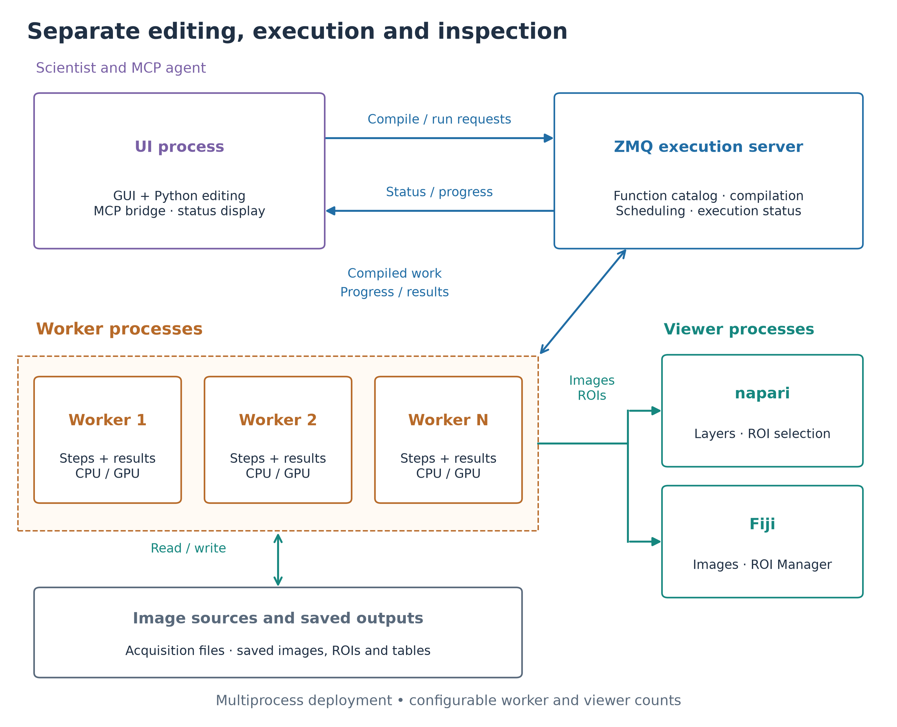
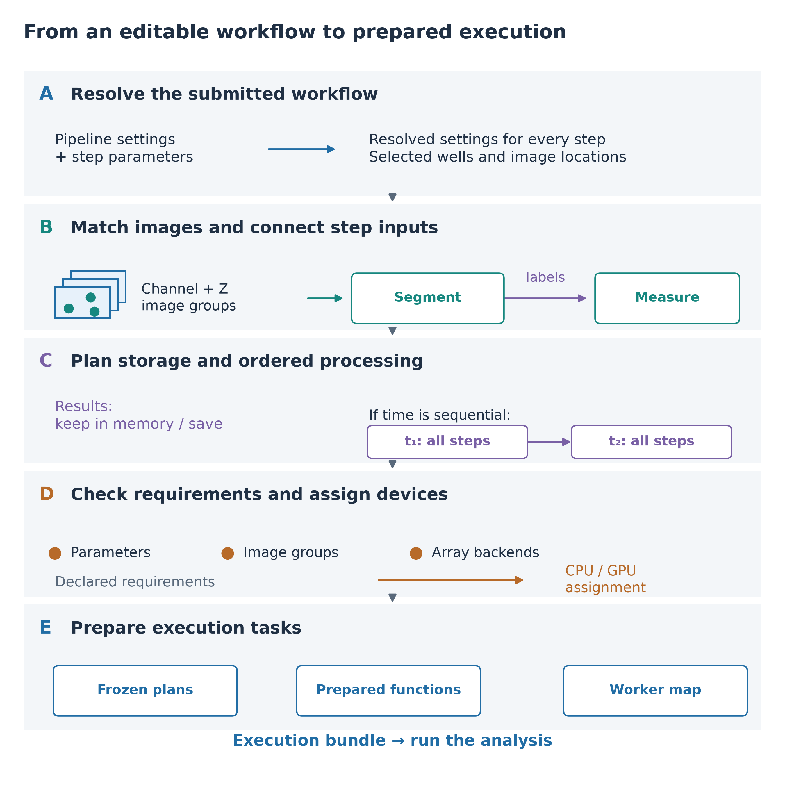
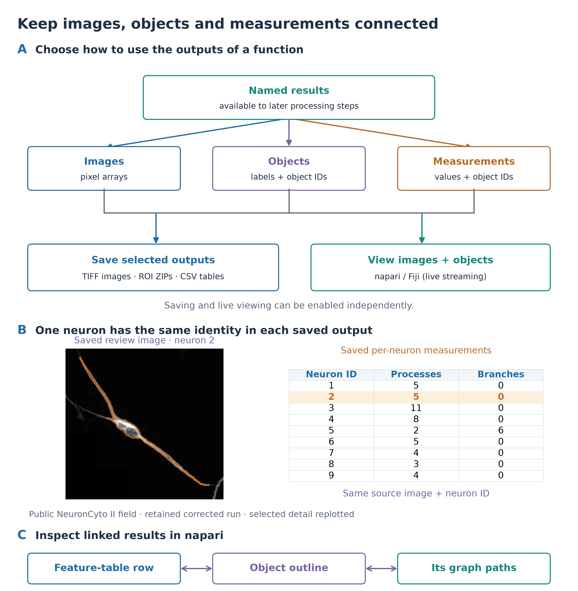
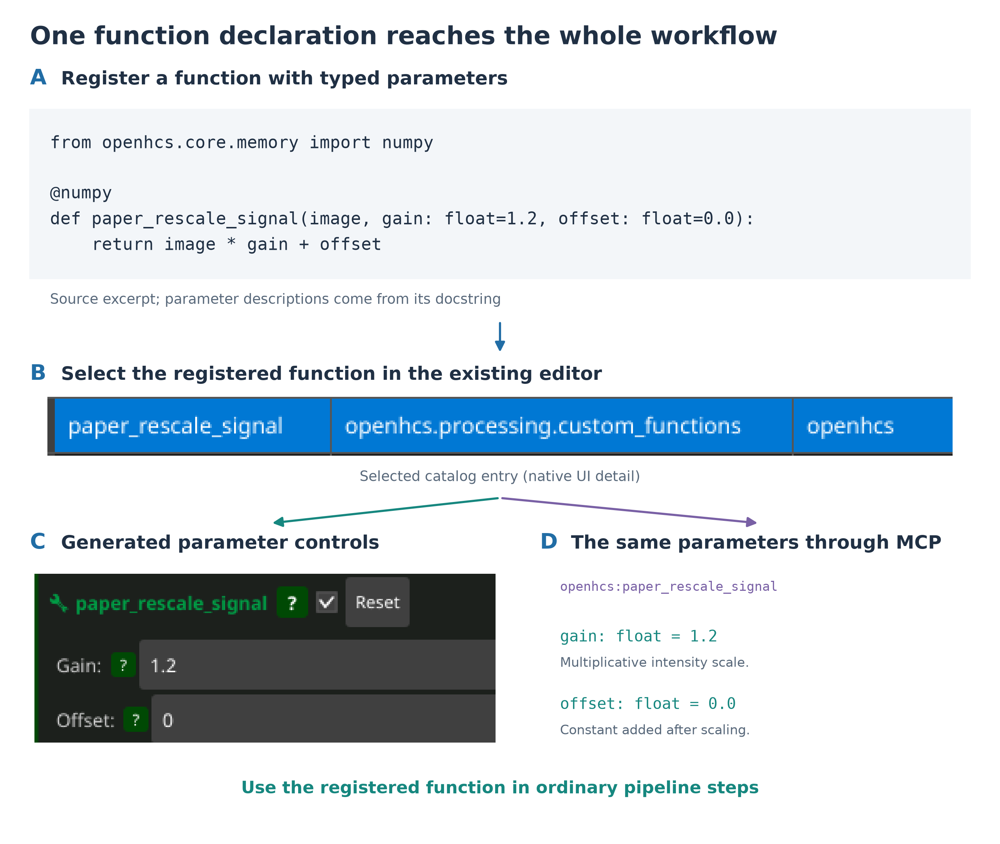
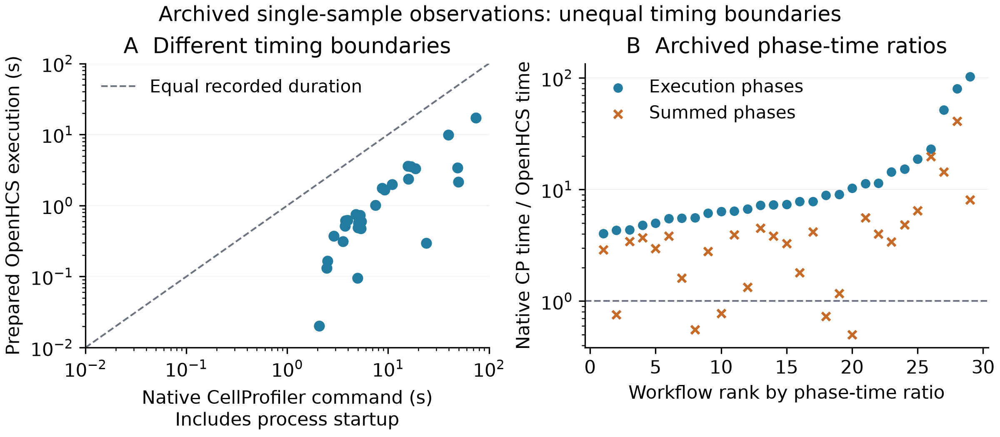
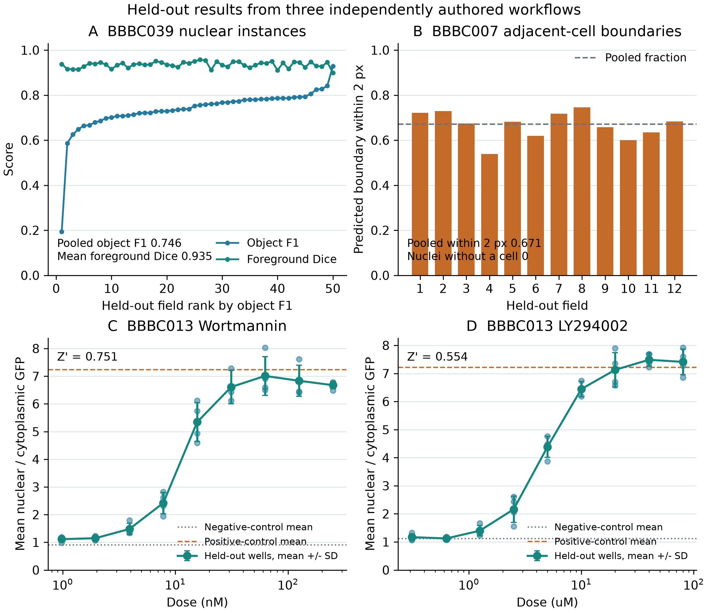
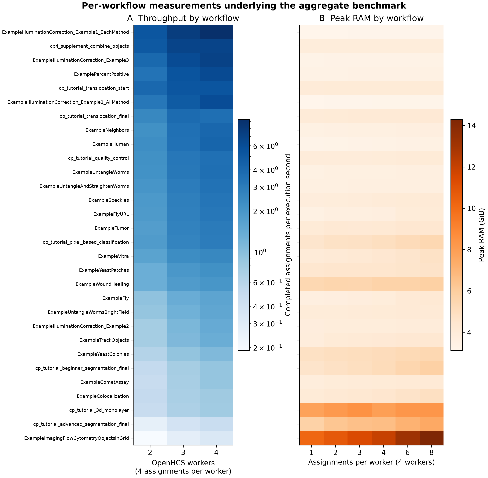

# OpenHCS supplementary material

## Supplementary Figure 1. Runtime composition

{width=4.9in}

\(A) `variable_components` selects the axes within each array; `group_by` selects
the processing group. Each function declares per-plane, whole-stack or
stack-reduction behavior. (B) A dictionary assigns function chains to groups;
a list supplies an ordered chain. Entries are functions with their parameter
values. (C) A separate example routes named labels from segmentation to
measurement alongside the image flow, independently of saving to disk. (D) With
time configured as sequential, each timepoint completes the pipeline before the
next begins; wells can run in parallel. Selected functions determine CPU/GPU
array support.

```{=openxml}
<w:p><w:r><w:br w:type="page"/></w:r></w:p>
```

## Supplementary Figure 2. Separate UI, execution and viewer processes

{width=5.3in}

The illustrated deployment uses multiple processes. The UI process hosts the
editors and MCP bridge and submits requests to a separate ZMQ execution server.
The server prepares the function catalog, compiles workflows and coordinates
execution. Worker processes execute prepared tasks on compatible CPU/GPU array
backends and retain the named results produced during execution. Progress returns
through the server to the UI. Workers read image sources, save configured
outputs and stream selected images and ROIs to separate napari or Fiji processes.
Each viewer owns its interactive display. Arrows distinguish task/status traffic
(blue) from image/result flow (green). Worker and viewer counts are configurable;
single-worker inline and threaded execution are also supported.

```{=openxml}
<w:p><w:r><w:br w:type="page"/></w:r></w:p>
```

## Supplementary Figure 3. Compiler preparation

{width=5.3in}

\(A) Inherited settings and step parameters are resolved for the submitted
pipeline. (B) Source metadata identifies image groups, and declared inputs link
functions to images and named results from earlier steps. (C) The compiler plans
which results remain in memory or are saved, and separates contexts for ordered
components such as time. (D) Function parameters, processing groups and
array-backend requirements are checked before compatible devices are assigned.
(E) Frozen contexts, prepared functions and worker assignments form the execution
bundle. The panels group related compiler responsibilities; analysis functions
run during execution.

```{=openxml}
<w:p><w:r><w:br w:type="page"/></w:r></w:p>
```

## Supplementary Figure 4. Connected outputs support saving and inspection

{width=5.3in}

\(A) Functions produce named images, objects and measurements available to
subsequent steps. Saving selected outputs and live viewer streaming are
independent choices. (B) A saved image and ROI outline from the public NeuronCyto
II corrected demonstration are replotted beside the corresponding measurement
rows. Neuron 2 is highlighted in both; shared source and object identity link its
contour and measurements. (C) Native napari feature-row selection links an object
outline and its graph paths through the same neuron identity. CSV rows provide
saved measurements, while native feature rows support viewer selection.

```{=openxml}
<w:p><w:r><w:br w:type="page"/></w:r></w:p>
```

## Supplementary Figure 5. Custom functions enter the shared workflow

{width=5.3in}

\(A) A custom intensity-scaling function declares its array backend and typed
parameters. (B) After registration through MCP, the function is selected in the
editor's existing function list. (C) The editor generates gain and offset controls
from the function signature. (D) Function discovery through MCP exposes the same
defaults and the parameter descriptions from its docstring. UI details are cropped from native screenshots;
the complete source and captures accompany the figure.

```{=openxml}
<w:p><w:r><w:br w:type="page"/></w:r></w:p>
```

## Supplementary Figure 6. Historical single-sample timing observations

{width=6in}

\(A) Native CellProfiler command duration, including subprocess startup, versus
OpenHCS execution after initialization and compilation. The dashed line marks
equal recorded duration. (B) Ratios of execution phases and summed phases,
ordered by execution-phase ratio. Summed phases also cover different work,
including benchmark validation and comparison on the OpenHCS path. Both panels
contain 29 workflows, with one comparison observation per workflow; the unresolved
native wound-healing duration is excluded. These observations do not measure
like-for-like speedup. Source tables and timer definitions follow in
Supplementary Data 1.

```{=openxml}
<w:p><w:r><w:br w:type="page"/></w:r></w:p>
```

## Supplementary Figure 7. Held-out results from prospectively authored workflows

{width=6in}

Four development fields or wells were available to each fresh agent before its
pipeline was frozen. \(A) BBBC039 object F1 and foreground Dice across 50
held-out fields, ordered by object F1. \(B) The fraction of predicted BBBC007
adjacent-cell boundary pixels within two pixels of a manual outline in each of
12 held-out fields. This directed measure does not establish object
correspondence. \(C, D) Held-out BBBC013 well means for cell-level nuclear to
cytoplasmic GFP ratios. Points are wells; the line and error bars show the mean
and sample standard deviation at each dose. Control means and Z-prime use four
independent wells per control condition. BBBC013 supplies treatment truth, not
manual segmentation truth.

```{=openxml}
<w:p><w:r><w:br w:type="page"/></w:r></w:p>
```

## Supplementary Figure 8. Per-workflow throughput and memory measurements

{width=6in}

The rows are the 30 imported CellProfiler workflows, ordered by median measured
throughput. \(A) Completed repeated-image assignments per execution second for
two, three and four workers, with four assignments queued per worker. The color
scale is logarithmic. \(B) Peak process-tree RAM for one, two, three, four, six
and eight assignments per worker with four workers. Figure 5 summarizes these
same observations with individual points, interquartile ranges and medians.

```{=openxml}
<w:p><w:r><w:br w:type="page"/></w:r></w:p>
```

## Supplementary Data 1. CellProfiler workflow comparison

This supplement indexes source tables and evaluation records. Figure scripts
derive panels and plotted-row exports from the linked files; paths are relative
to this file.

The acquisition scripts pin the official CellProfiler examples to
`4972b59e670a4ae96c3d453803c92eeff378d054`, the official tutorials to
`264a8155da21a2d468051f78211bed2e580a8934`, and the CellProfiler 4 benchmark
supplement to `40abc2e600fd46b74c213999dd25c5245048dc92`.

### OpenHCS 0.8.5 release comparison

The release CI run executed all 30 workflows and supplied 25 reference-bearing
comparisons. A later unified current-source run, described below, supplied
reference-value comparisons for all 30 workflows in one execution.

The [preserved CI evidence](ci_official30_085/README.md) contains the observations,
summary, phase timings and suite metadata from the hosted Official30 job at
release commit `e867013a8eb188edcc63b5b0cdfd06f42a99b409`.
[The successful job](https://github.com/OpenHCSDev/openhcs/actions/runs/34445574926/job/102769520329)
built candidate packages and executed all 30 imported workflows through ZMQ on
Linux with Python 3.12.14. Every OpenHCS execution was uncached; native
CellProfiler outputs came from the committed references.

The [per-workflow observations](ci_official30_085/observations.csv) report
successful execution and zero comparison differences for all 30 cases. The
[reference inventory](ci_official30_085/reference_inventory.csv) identifies
which cases contain values to compare:

| Selected native reference class | Workflows | Value comparisons |
| --- | ---: | --- |
| CSV measurements | 21 | Measurement tables |
| SQLite and CellProfiler Analyst properties | 3 | Database tables and properties; one also has an overlay image |
| NPY-only illumination output | 1 | Image pixels |
| No retained value files | 5 | Execution checks only |

Image comparison selects output directories containing images and no CSV files.
This selects two workflows: the AllMethod illumination array and the completed
translocation tutorial's overlay alongside SQLite measurements. The advanced
segmentation tutorial's five illumination arrays are source inputs outside its
reference-output directory. Images saved alongside CSV measurements in 14
profiles are outside image comparison. Numeric comparisons use absolute and
relative tolerances of `1e-6`, with no pixels allowed outside tolerance.

The records retain per-case comparison outcomes and timing, rather than raw
candidate output trees or individual pixel-difference reports. The native
references' original dependency environments were not recorded. The evidence
index supplies source and test permalinks, checksums and the separate
14 September 2026 reference-inventory audit provenance.

### Unified 30-workflow value comparison

The [unified evidence directory](../../benchmark/results/official30_unified_value_comparison_20260916/README.md)
preserves one immutable run in which all 30 workflows were compiled and executed
afresh through isolated ZMQ execution endpoints. All 30 selected reference-value
comparisons were equivalent and reported zero differences. Its fresh
[reference inventory](../../benchmark/results/official30_unified_value_comparison_20260916/reference_inventory.csv)
contains 21 CSV profiles, three SQLite profiles and six image- or array-only
profiles. Image comparison executed for seven workflows, including the completed
translocation overlay compared alongside its SQLite values.

The [observations](../../benchmark/results/official30_unified_value_comparison_20260916/observations.csv),
[phase timings](../../benchmark/results/official30_unified_value_comparison_20260916/phase_timing.csv),
[summary](../../benchmark/results/official30_unified_value_comparison_20260916/summary.csv)
and [run environment](../../benchmark/results/official30_unified_value_comparison_20260916/run_environment.json)
retain the result and exact candidate source identities. The candidate used
OpenHCS 0.8.5 current source on Python 3.12.3, NumPy 2.1.3 and SciPy 1.18.1.
The selected native references used CellProfiler 4.2.8.1 on Python 3.9.25,
NumPy 1.24.4 and SciPy 1.9.0.

### Five-workflow image and object-label exports

Five source workflows compute images or objects without exporting files. The
[export-extension manifest](../../benchmark/manifests/official30_value_completion_20260914.json)
selects versions of those workflows with terminal exports added. Its generated
pipelines retain the original processing modules and settings. Native CellProfiler
produced the exported references; OpenHCS processed the same scoped inputs.

| Workflow | Exported values compared | Result |
| --- | --- | --- |
| Combine objects | Combined-object labels | Exact label agreement |
| Translocation starter | Nuclear labels | Exact label agreement |
| Illumination Example 1, EachMethod | Corrected green image | Float-tolerance agreement |
| Illumination Example 2 | Uncorrected, small-block-corrected and large-block-corrected nuclear labels | Exact agreement for all three label images |
| Illumination Example 3 | Polynomial-corrected and convex-hull-corrected images | Float-tolerance agreement for both images |

The [per-artifact comparison table](../../benchmark/results/official30_value_completion_20260914/label_aware_exact_commit_run/artifact_comparisons.csv)
records eight passing artifacts. All five integer label images agree exactly
after normalization of singleton dimensions. The three numerical images have
zero pixels outside the absolute and relative tolerances of `1e-6`; their
maximum absolute difference is `2.9802322387695312e-8`. The
[per-workflow observations](../../benchmark/results/official30_value_completion_20260914/label_aware_exact_commit_run/observations.jsonl)
link these comparisons to fresh candidate executions and the retained native
outputs.

The [run environment](../../benchmark/results/official30_value_completion_20260914/label_aware_exact_commit_run/run_environment.json)
identifies OpenHCS execution source `7ca8ecb8e73a882ef0f15616d57b00f0dabf73e0`,
Python 3.12.3, NumPy 2.1.3 and SciPy 1.18.0. Native references were generated
with CellProfiler 4.2.8.1 on Python 3.9.25, NumPy 1.24.4 and SciPy 1.9.0.
Each candidate ran through a fresh matching OpenHCS endpoint. Source revisions,
native-reference origin and endpoint identities are retained with the results.
These exported references are incorporated into the unified 30-workflow run;
the earlier five-workflow audit and release records retain their own protocols
and identities.

### Retained single-sample timing records

The separate [May single-process table](../../benchmark/results/labmeeting_20260513/official30_well_throughput/data/single_process_summary.csv)
contains one observation and one passing status flag per workflow, execution and
total-phase timings, ratios and the legacy accuracy field. Its native
ExampleWoundHealing timing is 900 s without a native completion flag, so that
row is excluded from timing comparisons. Empty fields remain as recorded.

The field `min_parity_accuracy` is 1.0 in all rows. It is the minimum Boolean
pass flag across a workflow's observations, including the five workflows without
reference values, rather than the fraction of matching measurements or pixels.
Times below are in seconds, rounded to five significant figures from the source
CSV. The full-precision values remain in that file. Native command and prepared
OpenHCS execution have different timing boundaries, described below. The other
columns sum each system's recorded benchmark phases. The ExampleWoundHealing
native values equal the timeout ceiling and are shown for source completeness;
that row is excluded from timing comparisons.

| Workflow | Native command | Prepared execution | Native phase sum | OpenHCS phase sum |
|----------------------------------------|-----------:|-----------:|-----------:|-----------:|
| ExampleColocalization | 48.936 | 3.4135 | 48.957 | 14.439 |
| ExampleCometAssay | 15.65 | 3.588 | 15.729 | 4.6023 |
| ExampleFly | 9.2186 | 1.6629 | 9.2536 | 5.7264 |
| ExampleFlyURL | 5.4078 | 0.59741 | 5.4323 | 4.6231 |
| ExampleHuman | 5.0468 | 0.56671 | 5.111 | 6.9859 |
| ExampleIlluminationCorrection_Example1_AllMethod | 23.846 | 0.2981 | 23.875 | 0.58255 |
| ExampleIlluminationCorrection_Example1_EachMethod | 4.9526 | 0.095801 | 4.9629 | 0.34526 |
| ExampleIlluminationCorrection_Example2 | 49.621 | 2.1512 | 49.632 | 2.5107 |
| ExampleIlluminationCorrection_Example3 | 2.5101 | 0.1649 | 2.5214 | 0.52152 |
| ExampleImagingFlowCytometryObjectsInGrid | 74.157 | 17.18 | 74.417 | 98.545 |
| ExampleNeighbors | 4.9983 | 0.48576 | 5.0753 | 10.148 |
| ExamplePercentPositive | 2.902 | 0.37111 | 2.917 | 1.6261 |
| ExampleSpeckles | 3.7868 | 0.61381 | 3.7957 | 1.3598 |
| ExampleTrackObjects | 10.919 | 1.9784 | 11.15 | 2.9135 |
| ExampleTumor | 5.2672 | 0.7298 | 5.3182 | 1.183 |
| ExampleUntangleAndStraightenWorms | 3.9757 | 0.61834 | 3.9825 | 1.0111 |
| ExampleUntangleWorms | 3.7546 | 0.51335 | 3.7662 | 0.98515 |
| ExampleUntangleWormsBrightField | 8.755 | 1.7514 | 8.764 | 2.947 |
| ExampleVitra | 4.7962 | 0.75417 | 4.87 | 6.2844 |
| ExampleWoundHealing | 900 | 1.0723 | 900 | 1.4437 |
| ExampleYeastColonies | 15.848 | 2.3553 | 15.943 | 11.971 |
| ExampleYeastPatches | 7.4914 | 1.0139 | 7.5774 | 2.3141 |
| cp4_supplement_combine_objects | 2.0789 | 0.020116 | 2.0855 | 0.25762 |
| cp_tutorial_3d_monolayer | 16.866 | 3.5231 | 16.929 | 4.5869 |
| cp_tutorial_advanced_segmentation_final | 39.617 | 9.8382 | 40.19 | 13.865 |
| cp_tutorial_beginner_segmentation_final | 18.625 | 3.3373 | 18.831 | 33.811 |
| cp_tutorial_pixel_based_classification | 5.1064 | 0.65263 | 5.1965 | 1.2405 |
| cp_tutorial_quality_control | 5.3916 | 0.4757 | 5.7724 | 1.0273 |
| cp_tutorial_translocation_final | 3.5821 | 0.31336 | 3.6072 | 0.9035 |
| cp_tutorial_translocation_start | 2.4696 | 0.13163 | 2.4866 | 0.38448 |

The 29 workflows retained after the wound-healing exclusion have a median native
command duration of 5.39 s and median prepared OpenHCS execution of 0.653 s.
The per-workflow execution-phase ratios have a minimum of 4.03 and median of
7.39. Summed-phase ratios have a median of 3.42; five workflows have a larger
OpenHCS phase sum. These summaries use the unequal intervals defined below.

### Timing boundaries in the archived harness

The results table first entered Git in commit `f58bca4e9` on 13 May 2026.
In that source tree, the native adapter's execution timer surrounds the complete
CellProfiler subprocess. OpenHCS initialization and compilation are timed
separately, before its prepared-execution call. The native-command/OpenHCS-
execution ratio therefore combines startup and execution on one side with
prepared execution on the other.

The collector computes total-phase time by summing the recorded phases. The
OpenHCS path also records benchmark validation and output-comparison work.
These sums are not equivalent cold-start or end-to-end analysis intervals.
The many-well projection multiplies the native command duration, including its
startup, by well count; it does not measure native persistent-worker throughput.
Original CSV field names, including `median_speedup`, remain unchanged as
historical record labels. Supplementary Figure 6 presents them as phase-time ratios.

The collector also supports cached reference results and can substitute the
configured timeout when a successful cached native reference lacks execution
timing. The summary's `n=1` counts comparison observations, not necessarily fresh
timed executions. This policy could account for a timeout-valued row, but the
retained summary alone does not establish which path produced it.

The [timing source audit](../review/slas-panel-20260910/TIMING_BOUNDARY_AUDIT.md)
identifies the exact code locations and reproduction commands. The committed
source establishes these timer definitions; the original run environment and
per-run phase traces still need recovery to establish the executed snapshot.
A new matched comparison would time the same work on both systems, separately
for cold-start and repeated prepared execution, with repeated observations.

## Supplementary Data 2. Archived CellProfiler coverage

- [Module names and associated workflows](../../benchmark/results/labmeeting_20260513/official30_well_throughput/figures/module_coverage_cppipe_modules.csv).
- [Individual settings and recorded handling categories](../../benchmark/results/labmeeting_20260513/official30_well_throughput/figures/module_coverage_cppipe_settings.csv).
- [Processing registration and corpus membership](../../benchmark/results/labmeeting_20260513/official30_well_throughput/figures/module_coverage_absorbed_modules.csv).

These files describe the archived coverage report. Setting categories distinguish
bound parameters, artifact contracts, infrastructure, and intentionally ignored
settings. Registration or a handling category is not itself an output-equivalence
test. Module aliases and source/export roles differ between the tables, so their
category totals must not be added as mutually exclusive classes. They are not a
current-version compatibility matrix.

## Supplementary Data 3. Worker and memory measurements

- [Core-count sweep](../../benchmark/results/labmeeting_20260513/official30_well_throughput/data/core_scaling_well_throughput.csv).
- [Two-, three- and four-worker queue-depth conditions](../../benchmark/results/labmeeting_20260513/official30_well_throughput/data/wells_per_core_2c3c4c.csv).
- [Four-worker conditions with six and eight wells per worker](../../benchmark/results/labmeeting_20260513/official30_well_throughput/data/wells_per_core_4c_6wpc_8wpc.csv).

Figure 5A uses the measured two-, three- and four-worker rows, with four repeated-image
assignments per worker, for all 30 workflows. The runtime schedules each assignment
as a well; these are repeated inputs, not independent biological replicates.
Each row reports completion of every assignment. Throughput is completed
assignments divided by execution seconds; the derived
values match the source `wells_per_second` field. The one-worker condition used
one well and is not included in this fixed-queue-depth panel.

The co-committed sweep source sets `materialize_runtime_artifacts=False` and
`runtime_observation_mode=OMIT`, and requests pruning of unused unsaved-output
steps. These conditions measure the configured execution workload; they do not
establish throughput for every output-saving policy. Exact per-workflow retained
work still depends on the compiled plans and historical run records.

Each row retains its workflow, worker count, assignment count, completed-assignment
count, execution and total time, memory, status and serial CellProfiler projection.
The source CSV uses well terminology for the virtual-well assignment fields.
The projection multiplies the native single-sample command duration, including
startup, by well count; it does not represent a measured persistent or parallel
CellProfiler run. The source memory
column is named `peak_memory_mb`; the collector expresses MiB, converted to GiB
for the manuscript figure. Historical collector-version confirmation remains
listed in the author-review record.

[Benchmark figure provenance](../figures/slas/figure2_provenance.json) records source and
output hashes. Exact plotted observations accompany the figure as separate CSVs.
Run `python paper/figures/build_slas_benchmark.py` in the project environment to
regenerate them without rerunning the experiments.

The benchmark is Figure 5 in the expanded manuscript. Existing artifact
filenames retain their original identifiers so links do not depend on editorial
renumbering.

## Figure assembly and interface records

Supplementary diagram receipts identify the source declarations and generated
output hashes: [runtime composition](../figures/slas/runtime_composition_provenance.json),
[process architecture](../figures/slas/process_architecture_provenance.json),
[compiler preparation](../figures/slas/compiler_preparation_provenance.json),
[connected outputs](../figures/slas/outputs_and_inspection_provenance.json), and
[custom-function integration](../figures/slas/custom_function_extension_provenance.json).
Their generators are retained in `paper/figures/` alongside editable SVG and PDF
versions. The output figure also records the saved image, ROI and CSV identities.
Its corrected demonstration is distinct from the original recording in Figure 3.

The [custom-function capture record](../figures/slas/custom_extension_evidence.json)
retains registration and selection receipts, source identities and full native
screenshots from an isolated development session. The session includes the
catalog-refresh and selector-lifetime fixes recorded there. It demonstrates
registration and editor integration; the example function was not run on the
analysis dataset.

The [visual storyboard](../review/FIGURE_STORYBOARD.md) identifies the purpose
and source of each main figure. The
[gallery capture record](../../website/assets/gallery/release-media-record.json)
owns the source identities, published hashes and demonstration descriptions for
the retained Fiji/napari panels. Figure 2 instead uses fresh matching captures
from one development-checkout session. Its
[native interaction record](../figures/slas/authoring_verified_roundtrip_provenance.json)
contains the code/field round trip, widget observations and screenshot receipts.
Both sets of captures are distinct from the original unattended agent run.

`paper/figures/build_slas_visual_story.py` checks the published media hashes and
records any UI-detail crop rectangles before assembling Figures 1, 2 and 6.
`paper/figures/build_slas_agent.py` additionally derives the two displayed step
labels from the original saved pipeline, without importing or executing it.

Figure 4 aligns the public ExampleCometAssay pipeline with its imported OpenHCS
steps. `paper/figures/build_slas_cellprofiler.py` derives the module sequence,
function names, repetitions and named-object parameters from the source pipeline
and current importer. The [translation receipt](../figures/slas/cellprofiler_translation_provenance.json)
records the source and generated workflow, including a Python round-trip check.

## Supplementary Data 4. Recorded agent workflow

The [original evaluation record](../../website/assets/agent/cold-start-workflow-record.json)
contains the client and model identity, software commits, two-channel input
manifest, exact prompt, authorization, tool-trace counts, timings, completion
checks, output summary, and viewer checks. Evidence paths in that record resolve
relative to `website/assets/agent/`; original absolute runtime paths describe
the recorded machine and are not portable download locations.

The record separately identifies post-run software corrections and a later
viewer replay. Figure 3 uses the original input pixels and uncut recording, with
checksums in [its provenance record](../figures/slas/figure3_provenance.json).
The run evaluates workflow completion and inspection; it contains no manually
annotated segmentation-accuracy score.

### Errors and recovery in the original agent run

Of 140 attempted MCP calls, one failed at the tool-call level and 139 returned
completed responses. Thirty of those responses reported an operation error.
The table counts calls, including repeated attempts, rather than distinct bugs.
It is checked against the original event log and its recorded SHA256 by
`paper/review/slas-panel-20260910/audit_agent_trace.py`.

| Operation | Calls | Reported issue |
|----------------------------|---------:|--------------------------------------------------------------|
| Code-document validation | 17 | Preset imports/construction, document structure or configuration types |
| Configuration-schema discovery | 5 | Requested schema name was not exposed |
| Internal-symbol discovery | 1 | Requested symbol was outside the curated namespace |
| Result-file query | 3 | Invalid query target |
| Code-document retrieval | 1 | Requested window had no registered code-document reader |
| UI state query | 1 | Bridge timeout |
| UI action | 1 | Another mutating operation was running |
| Apply-operation receipt | 1 | Confirmation was required; change not applied |

Thirteen of the 17 code-validation calls attempted to construct a preset through
unavailable names or attributes. The agent then authored the two steps using
registered functions. Subsequent validation exposed incorrect document structure
and configuration types; event `item_81` records successful validation.
The separate failed tool call requested `init` instead of the accepted
`init_plate` operation. Compilation, execution, viewer inspection and final
pipeline retrieval are identified by their event IDs in the evaluation record.

### Original and later result summaries

These are the separately recorded original analysis and later corrected
demonstration on the same public field. The original outputs and video retain
their original identity; the later record identifies its own pipeline and
execution hashes.

| Recorded output | Original OpenHCS 0.7.13 | Later OpenHCS 0.7.14 |
|----------------------------------------|-----------------------------:|-----------------------------:|
| Neurons | 9 | 9 |
| Nuclei | 10 | 10 |
| Branches | 8 | 6 |
| Graph paths | 25 | 24 |
| Total outgrowth pixels | 1,982 | 1,865 |

Visual review identified a clustered neurite crossover classified as branching.
The later record reports one resolved crossover after the graph-extraction
correction. Inspection of the retained ROI files also found two cell-body
objects at the bottom soma and three nuclear objects in the same region.
The table above preserves the separately recorded run summaries.

### Current-source replay after algorithm development

A separate OpenHCS 0.8.5 replay used the same two public images with
nuclear-supported soma detection and soma-rooted path assignment. It produced
eight neuronal cell bodies, eight nuclei, 18 processes, two branch events,
one resolved crossover and 24 graph paths. The eight per-cell table totals
agree with the graph distance features and sum to 2556.137 pixels under unit
spacing. The [current replay summary](current_neurite_replay_summary.md)
identifies its execution, saved source and native receipts separately from
the original demonstration and the OpenHCS 0.7.14 correction.

### Published manual-tracing references

The [NeuronCyto II publication](https://doi.org/10.1002/cyto.a.22872) supplies independent measurements
for image 1 in its supplementary files 8–10. The two input TIFFs used here are
byte-identical to `CrossOvers_Images/1_w1.tif` and `1_w2.tif` in the public
`Testing image.zip` archive. The checksums are listed in the original run record.

| Published reference | Image 1 entry | Source file |
| --- | --- | --- |
| Manually traced neurons | Eight per-cell entries | Supplement 9 |
| Neurite length by branch order | Primary 3,633.672; secondary 198.929; tertiary 0; total 3,832.601 | Supplement 8 |
| Crossover count | Three crossovers; NeuronCyto II resolved two | Supplement 10 |

Lengths above retain the numerical units of the source tables. The eight
per-cell reference lengths are 426.82, 172.375, 751.962, 395.04, 669.783,
343.629, 587.841 and 485.152. These entries give a reference against which to
investigate the nine reported neurons. Spatial cell matching, measurement-unit
alignment and agreement on the definition of neurite length are needed before
computing per-cell accuracy. The public testing archive contains the images;
downloadable manual trace coordinates have not been located. The published
crossover count and the OpenHCS branch count measure different quantities.

The [reference audit](neuroncyto_reference_audit.md) records the source links,
file checksums and ROI identifiers. These measurements were examined after the
recorded agent run and were not supplied to the agent during authoring.

### Intermediate correction recorded on 15 September 2026

Before the current-source replay, a separate GUI/MCP rerun (execution
`b2a64589-6fc1-4ac2-8b2b-551818f6273b`) used the same field and pipeline
settings. Width-scale nuclear peak suppression preserved the bottom nucleus
as one object, and the filled neuron artifact was derived from final rooted
trace ownership rather than earlier secondary propagation. The run produced
eight nuclei and eight cell bodies, including one body at the bottom soma.
Native viewer captures showed matching filled and thin-trace ownership at the
two reviewed crossings, and total measured outgrowth was 1860 pixels. The audit
records the execution identity, ROI locations, capture checksums and test
results. This retained intermediate result preserves the development sequence;
the current-source replay above supplies the current findings.

### Exact task prompt

The following text is taken from the original evaluation record. Absolute paths
identify that recorded session's input and output locations.

> The folder /home/ts/code/projects/openhcs/mcp_outputs/website-agent-demo/candidate-20260804-13/plate contains field 1 from the public NeuronCyto II crossover neurite-outgrowth assay. The W1 plane is the neuronal cell-and-neurite signal, and the W2 plane is the soma/nuclear signal. Treat both planes as biological well/image id 1.
>
> Using only the OpenHCS MCP and the connected OpenHCS desktop, build a compact but biologically meaningful pipeline that normalizes the raw channels, enhances dim neurites, segments nuclei and neuronal cell bodies, assigns neurite outgrowth to individual neurons, and measures per-neuron morphology and topology. Save reviewable images, object ROIs, spatial-graph paths, SWC morphology, and measurement tables under /home/ts/code/projects/openhcs/mcp_outputs/website-agent-demo/candidate-20260804-13/outputs, and open the results in Napari on port 5613.
>
> Start by inspecting the folder and confirming its axes and channel identities. These exported TIFF containers each expose their own native channel coordinate, so declare the authoritative Source Bindings projection from the start: keep both planes in biological well/image id 1 and preserve their physical filename provenance, while projecting W1 and W2 as distinct biological channels 1 and 2. Use registered OpenHCS functions or presets, not repository/source inspection or a new custom function. Leave the finished workflow visible and editable in the desktop UI. Keep the ZMQ Server Manager and its granular execution progress visible while the pipeline runs. Validate and compile before running, inspect the structured measurements and persistent outputs, and verify the settled Napari viewer state.
>
> Make the final viewer scientifically legible rather than showing every intermediate mask at once: retain an enhanced neuronal signal as context, show the unified neuron labels in which each cell body and its assigned neurites share one identity, show the spatial-graph path layer, hide redundant intermediate label layers, select the graph layer, and expose its feature table so branch identity, neuron assignment, distance, and tortuosity can be inspected. Return the editable generated Python plus a concise evidence summary. If validation, execution, or presentation fails, diagnose and repair it through MCP.
>
> This prompt authorizes writes under the stated output directory, changes to this isolated OpenHCS desktop session, pipeline execution, and launching Napari. Do not use shell commands or inspect repository files.

## Supplementary Data 5. Complex CellProfiler workflow imports

The [derived workflow report](complex_cellprofiler_workflows.md) lists every
imported step, its function names and call count for the advanced segmentation
and 3D monolayer tutorials. It links the source pipelines and generated editable
Python. The generator checks function identities and parameters after reloading
each document and records the hashes of the source pipelines, importer and
function implementations.

These are import and code-round-trip checks. Supplementary Data 1 separately
records the release CI executions and selected output comparisons for both
workflows.

## Supplementary Data 6. Workflow regression tests

The tests exercise representative authoring and validation cases alongside the
recorded UI demonstration. The following source files are pinned to commit
`7a7d21fee726905b87b9020cebf0bdfc350631f4`; these three test files are unchanged
from the OpenHCS 0.8.5 release commit.

| Tested behavior | Source tests |
| --- | --- |
| Nested and inherited configuration, parameter order, enum identity and function-step reconstruction | [Python generation tests](https://github.com/OpenHCSDev/openhcs/blob/7a7d21fee726905b87b9020cebf0bdfc350631f4/tests/unit/test_pycodify_formatters.py) |
| Rejection of incompatible memory types, grouping, required axes and stack configuration | [Compiled-function validation tests](https://github.com/OpenHCSDev/openhcs/blob/7a7d21fee726905b87b9020cebf0bdfc350631f4/tests/unit/test_funcstep_contract_validator.py) |
| Rejection of a function-detail request using a stale catalog revision | [Function-catalog tests](https://github.com/OpenHCSDev/openhcs/blob/7a7d21fee726905b87b9020cebf0bdfc350631f4/tests/unit/test_function_catalog_zmq.py) |

The [unit-test job](https://github.com/OpenHCSDev/openhcs/actions/runs/34870874969/job/104066142788)
passed while selecting `tests/unit` and `tests/core`. These focused tests include
controlled fixtures and isolate the stated behavior. The real-corpus execution
and value comparisons are provided by the separate Official30 job in
Supplementary Data 1.

## Supplementary Data 7. Prospective agent-authored assay validation

The [validation report](independent_agent_validation.md) records the prospective
design, quantitative results, limitations, prediction-manifest hashes and
infrastructure findings for BBBC039, BBBC007 and BBBC013. Each trial used a
fresh gpt-5.6-sol author through the connected OpenHCS desktop and MCP surface.
Four development fields or wells were visible before the scientific pipeline
was frozen; held-out references and treatment metadata were then scored by the
typed evaluator in
[`benchmark/annotated_validation.py`](../../benchmark/annotated_validation.py).

The tracked [evidence index](independent_validation/README.md) links each exact
frozen pipeline and held-out score receipt. Prediction arrays and source-image
archives remain outside the paper package because the BBBC013 held-out result
tree alone contains 1,472 artifacts and 672 MB. The score receipts bind their
prediction manifests and the common corpus manifest by SHA-256. The
[preparation record](../../benchmark/annotated_validation_20260915.md) explains
the deterministic partitions, image normalization and evaluation definitions;
the preparation manifest records the downloaded source identities.

Supplementary Figure 7 is regenerated by
[`build_slas_independent_validation.py`](../figures/build_slas_independent_validation.py)
from the three score receipts. Its
[plot data](../figures/slas/independent_agent_validation_plot_data.csv) and
[provenance receipt](../figures/slas/independent_agent_validation_provenance.json)
retain the plotted rows and source/output hashes.

## Software snapshots and evidence

| Evidence | Software identity | What the record establishes |
|------------------------------|------------------------------|----------------------------------------|
| May CellProfiler benchmark | Co-committed source `f58bca4e9`; executed environment still to be recovered | Retained comparison and timing summaries, worker and memory observations |
| Release Official30 comparison | OpenHCS 0.8.5, `e867013a8`; Linux, Python 3.12.14 | 30 fresh candidate executions; 25 retained-value comparisons; two selected image cases |
| Unified Official30 comparison | OpenHCS 0.8.5 current source based on `b2f3cf83b`; Python 3.12.3, NumPy 2.1.3, SciPy 1.18.1 | 30 fresh candidate executions; 30 equivalent selected-value comparisons; seven workflows with image comparison; zero differences |
| Five-workflow export extension | OpenHCS source `7ca8ecb8e`; Python 3.12.3, NumPy 2.1.3, SciPy 1.18.0 | Five fresh candidate executions; eight passing image or object-label comparisons; native and candidate environments retained |
| Workflow regression tests | `7a7d21fee`; named test files unchanged from 0.8.5 | Successful unit-test job; representative authoring and validation cases |
| Original unattended neurite run; Figure 3 | OpenHCS 0.7.13, `f1c1d9b670`; Codex 0.146.0, gpt-5.6-sol | Recorded construction, execution, saved outputs and viewer checks |
| Later corrected neurite demonstration; Supplementary Figure 4 | OpenHCS 0.7.14; correction `0eb5f77c02` | Separately recorded corrected outputs and object-to-measurement links |
| Parameter/code round trip; Figure 2 | OpenHCS 0.8.5 release commit `e867013a8` | Same-session code/field edits and matching native controls |
| Comet Assay translation; Figure 4 | Mapping retained from the 0.8.5 figure; regenerated with source hashes in the translation receipt | Unchanged module-to-step mapping, function parameters and generated-code round trip |
| Custom-function registration; Supplementary Figure 5 | 0.8.5 development checkout with root patch `89ef46cb05` and generic patch `c5aeee2413` | Registration, selection, controls and MCP descriptions |
| Prospective agent-authored assays; Supplementary Figure 7 | OpenHCS 0.8.5 current-source trials on 15-16 September 2026; frozen source and score receipts retained | Three single-attempt pipelines frozen before held-out scoring; BBBC039/007 annotations and BBBC013 treatment response |

The full figure receipts retain source hashes and capture-specific changes.
The custom-function example was registered and selected but not executed on
the analysis dataset. Viewer demonstrations in Figure 6 are identified by the
gallery record and remain separate from the original unattended evaluation.
