# OpenHCS supplementary material

## Supplementary Figure 1. Runtime composition

{width=4.9in}

\(A) `variable_components` selects the axes within each array; `group_by` selects
the processing group. Each function declares per-plane, whole-stack or
stack-reduction behavior. (B) A dictionary assigns function chains to groups;
a list supplies an ordered chain. Entries are functions with their parameter
values. (C) A separate example routes named labels from segmentation to
measurement alongside the image flow, independently of saving to disk. (D) With
time configured as sequential, each timepoint completes the pipeline before the
next begins; wells can run in parallel. Selected functions determine CPU/GPU
array support.

```{=openxml}
<w:p><w:r><w:br w:type="page"/></w:r></w:p>
```

## Supplementary Figure 2. Compiler preparation

{width=5.3in}

\(A) Inherited settings and step parameters are resolved for the submitted
pipeline. (B) Source metadata identifies image groups, and declared inputs link
functions to images and named results from earlier steps. (C) The compiler plans
which results remain in memory or are saved, and separates contexts for ordered
components such as time. (D) Function parameters, processing groups and
array-backend requirements are checked before compatible devices are assigned.
(E) Frozen contexts, prepared functions and worker assignments form the execution
bundle. The panels group related compiler responsibilities; analysis functions
run during execution.

```{=openxml}
<w:p><w:r><w:br w:type="page"/></w:r></w:p>
```

## Supplementary Figure 3. Connected outputs support saving and inspection

{width=5.3in}

\(A) Functions produce named images, objects and measurements available to
subsequent steps. Saving selected outputs and live viewer streaming are
independent choices. (B) A saved image and ROI outline from the public NeuronCyto
II corrected demonstration are replotted beside the corresponding measurement
rows. Neuron 2 is highlighted in both; shared source and object identity link its
contour and measurements. (C) Native napari feature-row selection links an object
outline and its graph paths through the same neuron identity. CSV rows provide
saved measurements, while native feature rows support viewer selection.

```{=openxml}
<w:p><w:r><w:br w:type="page"/></w:r></w:p>
```

## Supplementary Figure 4. Custom functions enter the shared workflow

{width=5.3in}

\(A) A custom intensity-scaling function declares its array backend and typed
parameters. (B) After registration through MCP, the function is selected in the
editor's existing function list. (C) The editor generates gain and offset controls
from the function signature. (D) Function discovery through MCP exposes the same
defaults and the parameter descriptions from its docstring. UI details are cropped from native screenshots;
the complete source and captures accompany the figure.

```{=openxml}
<w:p><w:r><w:br w:type="page"/></w:r></w:p>
```

## Supplementary Figure 5. Historical single-sample timing observations

{width=6in}

\(A) Native CellProfiler command duration, including subprocess startup, versus
OpenHCS execution after initialization and compilation. The dashed line marks
equal recorded duration. (B) Ratios of execution phases and summed phases,
ordered by execution-phase ratio. Summed phases also cover different work,
including benchmark validation and comparison on the OpenHCS path. Both panels
contain 29 workflows, with one comparison observation per workflow; the unresolved
native wound-healing duration is excluded. These observations do not measure
like-for-like speedup. Source tables and timer definitions follow in
Supplementary Data 1.

```{=openxml}
<w:p><w:r><w:br w:type="page"/></w:r></w:p>
```

## Supplementary Figure 6. Translocation measurements and prospective held-out assays

### Full-plate translocation and compartment eligibility

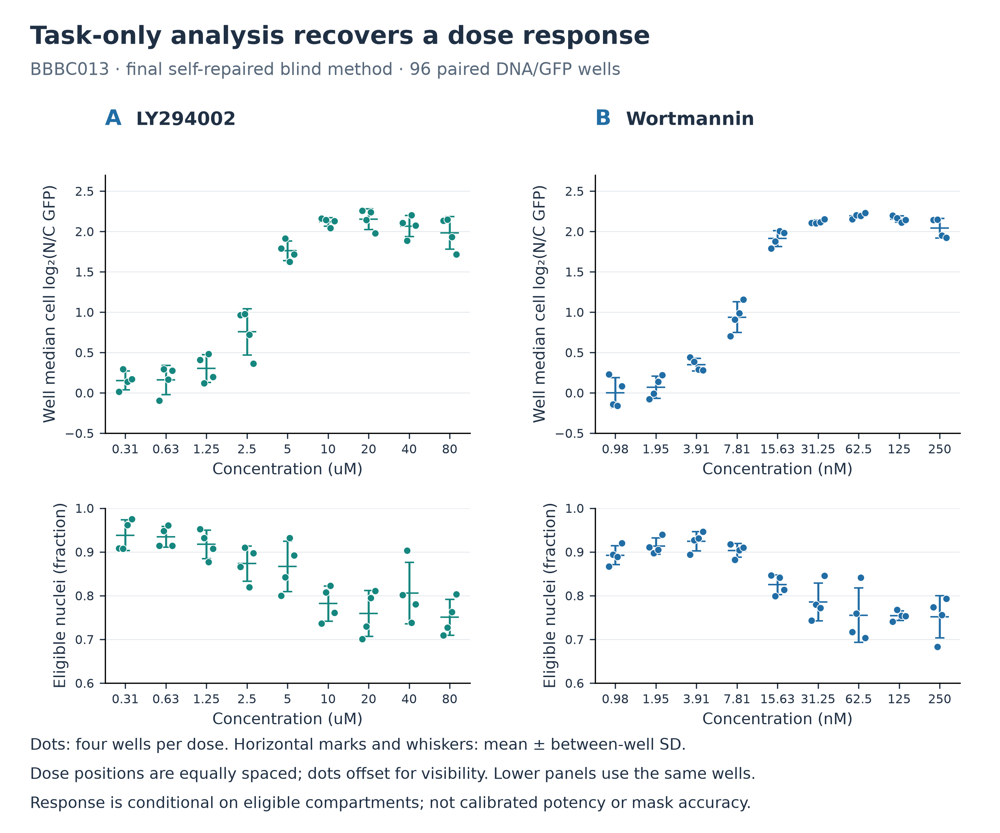{width=6in}

Upper panels show the agent-selected well-level median eligible-cell log2
nuclear/cytoplasmic GFP ratio. Lower panels show the fraction of detected nuclei
with eligible compartments. Each dose has four wells; marks and whiskers show
the mean and sample standard deviation between wells. All 96 wells include
development wells. This final full-plate trial differs from the prospective
held-out assay below. Main Figure 4 enlarges the same dose-response panels;
no measurements or underlying pixels were changed.

### Nuclear detection improves while cytoplasmic boundaries remain uncertain

{width=6in}

\(A) Matched H12 views before and after a foreground-admission adjustment show
recovery of a dim broad profile and retained separation of nearby regions. The
minimum-size rule was unchanged; retained intermediate measurements support
threshold-shrunken support as the earlier loss mechanism. (B) An after-only
bright crowded A01 control shows separate supported regions at the reviewed
position, with touching or lobed identities still uncertain. (C) Corrected D06
GFP views show unresolved propagated-compartment extent and ownership. Numeric
raw windows are 0–60, 0–123 and 0–111 in A, B and C, respectively; gamma is 1.
Colours are not cross-candidate identities. Physical calibration is unverified.
These same-author development witnesses support a local nuclear repair, not
exhaustive accuracy, validated translocation measurements, complete plate
execution or fresh autonomous success. The full-plate continuation remained
interrupted. The [source proof](task_only_analysis/bbbc013-development-source-proof.json)
and [render receipt](task_only_analysis/bbbc013-development-render-receipt.json)
retain the original capture, source, presentation and unchanged embed identities.
Source: Ilya Ravkin, [Broad Bioimage Benchmark Collection BBBC013v1](https://bbbc.broadinstitute.org/BBBC013),
[CC BY 3.0](https://creativecommons.org/licenses/by/3.0/). Adaptations comprise
OpenHCS-derived overlays, native display windows and screenshot cropping/scaling.

{width=6in}

Four development fields or wells were available to each fresh agent before its
pipeline was frozen. \(A) BBBC039 object F1 and foreground Dice across 50
held-out fields, ordered by object F1. \(B) The fraction of predicted BBBC007
adjacent-cell boundary pixels within two pixels of a manual outline in each of
12 held-out fields. This directed measure does not establish object
correspondence. \(C, D) Held-out BBBC013 well means for cell-level nuclear to
cytoplasmic GFP ratios. Points are wells; the line and error bars show the mean
and sample standard deviation at each dose. Control means and Z-prime use four
independent wells per control condition. BBBC013 supplies treatment truth, not
manual segmentation truth.

```{=openxml}
<w:p><w:r><w:br w:type="page"/></w:r></w:p>
```

## Supplementary Figure 7. Per-workflow throughput and memory measurements

{width=6in}

The rows are the 30 imported CellProfiler workflows, ordered by median measured
throughput. \(A) Completed repeated-image assignments per execution second for
two, three and four workers, with four assignments queued per worker. The color
scale is logarithmic. \(B) Peak process-tree RAM for one, two, three, four, six
and eight assignments per worker with four workers. These panels retain the individual historical observations.

```{=openxml}
<w:p><w:r><w:br w:type="page"/></w:r></w:p>
```

## Supplementary Figure 8. Bright-object separation

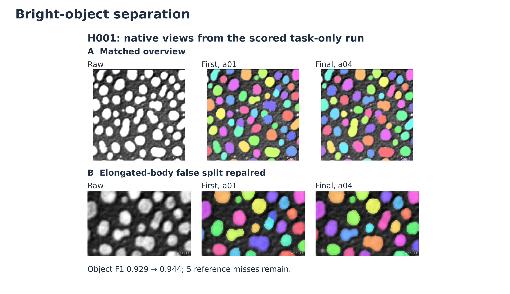{width=6in}

The scored autonomous result repairs an elongated-body split. Whole-image object F1 increases from 0.929 to 0.944 against the notebook-derived computational reference, which is not manual biological annotation. Raw windows are 8–152 and 8–248, gamma 1. Native captures retain their original crop, presentation and scientific pixels. Source identities and pipelines are linked in Supplementary Data 8.

```{=openxml}
<w:p><w:r><w:br w:type="page"/></w:r></w:p>
```

## Supplementary Figure 9. Volumetric localisation and body separation

{width=6in}

The H002 fresh15 trial matched 14 of 15 annotated centres within 10 voxels and
all 15 within the primary 30-voxel distance, with mean matched error 4.80 voxels.
Eleven predictions were unmatched to annotations of unestablished coverage.
These are centre-localisation measurements, not validated nuclear boundaries.
Main Figure 4 enlarges these same planes. XY uses the original native ROI
capture; XZ/YZ are post-freeze renderings of the unchanged raw volume and
saved label intersections, with yellow outlines and enlarged magenta centres.
Only centres within half a voxel of the displayed plane are drawn. Raw
contrast limits are shared across the two orthogonal planes. No detector or
reference score was rerun; the outlines expose the existing masks rather
than establishing their biological accuracy.

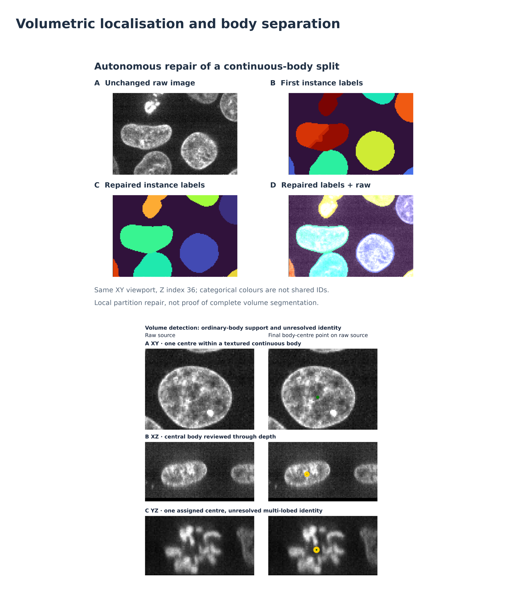{width=6in}

Upper: raw, initial labels, repaired labels and combined view at Z index 36. Local seed suppression removes an internal body split while retaining its neighbour. Lower: native XY, XZ and YZ body-centre views from a separate autonomous author. Postfreeze matching of the upper-row run recovers all 15 manual centres within 20 voxels; annotation coverage is not exhaustive. Lobed-body identity and complete volume boundaries remain uncertain. Native captures retain their original crop, presentation and scientific pixels. Source identities and pipelines are linked in Supplementary Data 8.

```{=openxml}
<w:p><w:r><w:br w:type="page"/></w:r></w:p>
```

## Supplementary Figure 10. Retinal soma localisation

### Autonomous retinal repair preserves a neighbouring pair

{width=5.3in}

\(A) Whole-field detections against heterogeneous retinal background. (B) Northwest neighbours remain separate. (C) A southeast partition is repaired. Using only the task, MCP and packaged skill, the author recognised a pair-merging regression and retained both corrections in its final 102-instance segmentation. Diffuse regions remain uncertain (Supplementary Figure 10), and accuracy against a manual reference is unmeasured. Raw and outlined views use different intensity stretches, so brightness differs at matched positions. Supplementary Data 8 retains the original captures and display settings. Source: user-provided R0010 RBPMS-labelled retina; physical calibration is unverified.

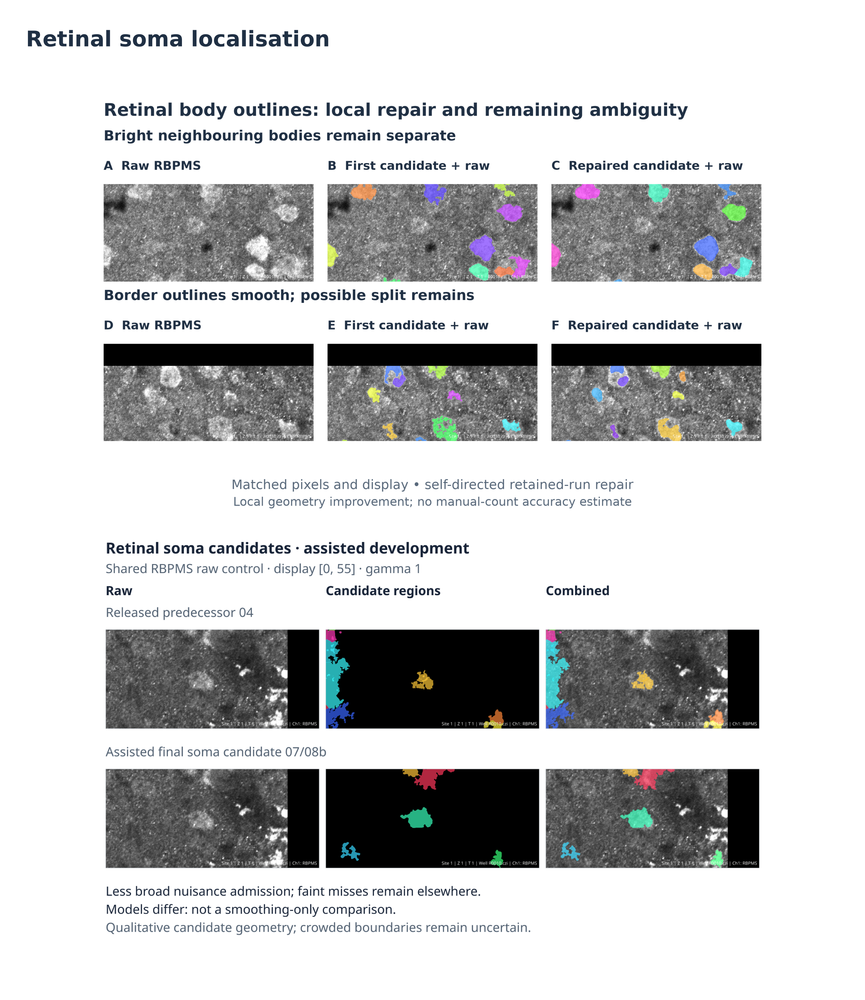{width=6in}

Upper: matched raw, initial and repaired outlines at neighbouring bodies and the acquisition border. Lower: raw and candidate support from assisted development. Useful soma localisation is possible despite acquisition noise; faint profiles and crowded boundaries remain uncertain. Original windows are 0–42 and 0–55, gamma 1. The independent autonomous and assisted examples are not a single continuous trial or manual-count accuracy assessment. Native captures retain their original crop, presentation and scientific pixels. Source identities and pipelines are linked in Supplementary Data 8.

```{=openxml}
<w:p><w:r><w:br w:type="page"/></w:r></w:p>
```

## Supplementary Figure 11. Paired nuclear and cell-body analysis

### An agent separates crowded nuclei but misses a faint pair

{width=6in}

\(A) Matched raw DNA images and initial/final overlays show separation of a joined nuclear pair while a compact neighbour remains separate. Diffuse signal remains in the lower region. (B) Final raw, segmentation-only and combined views reveal a faint pair that remains merged. The autonomous author revised its pipeline without reference feedback. These examples demonstrate a useful correction and a remaining failure, not exhaustive detection accuracy or validation of actin-defined cell boundaries. Contrast windows differ between regions to reveal their local signal; colours do not identify objects across attempts. Capture and display settings are retained in Supplementary Data 8. Source: BBBC007v1 A02, Sabatini laboratory, Whitehead Institute; CC0.

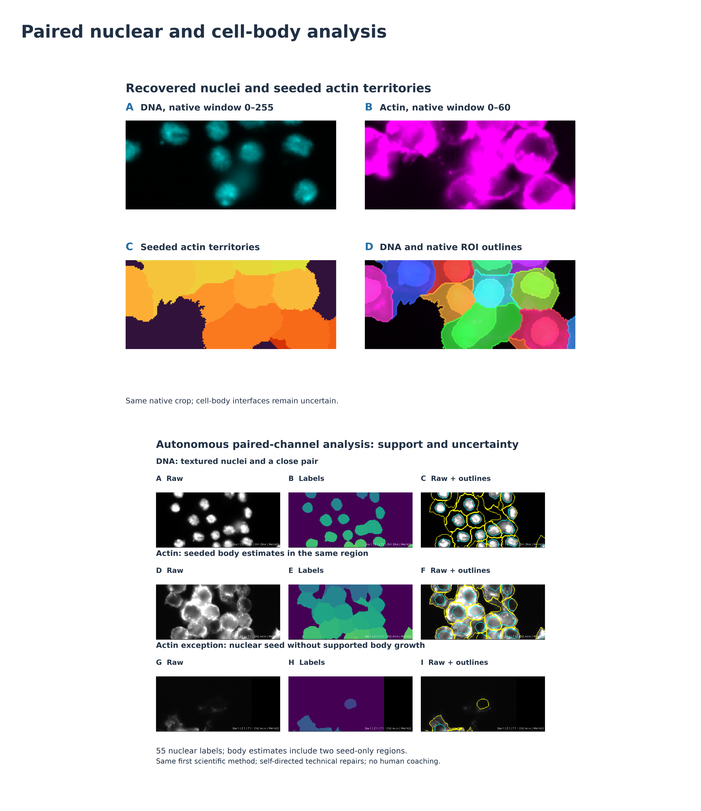{width=6in}

Upper: matched DNA, actin, seeded territories and combined outlines following autonomous nuclear repair. Lower: separate nuclear and body-support triplets, with an unsupported seed-only candidate as a negative witness. These are independent authors. Nuclear separation and supported cell-body extent are distinct decisions. Original windows are 0–255/0–60 (upper) and 0–151/0–104 (lower), gamma 1. Source: BBBC007v1 A02, Sabatini laboratory, Whitehead Institute; CC0. Native captures retain their original crop, presentation and scientific pixels. Source identities and pipelines are linked in Supplementary Data 8.

```{=openxml}
<w:p><w:r><w:br w:type="page"/></w:r></w:p>
```

## Supplementary Figure 12. Neurite main-shaft recovery

### Assisted laboratory neurite mosaic

{width=6in}

(A–C) Sampled overlap region; (D–F) lower-right field core in an acquisition-placed
nine-field mosaic. Each triplet uses the same native crop, with raw FITC,
body envelopes plus process paths, and their combination. The analysis fits
one pooled percentile pair per complete nine-field channel stack before
assembly, rather than fitting fields separately. Supported long paths remain
visible; faint segments and crowded ownership remain incomplete. The displayed
mosaic is an assisted retained-context example, not a fresh unguided trial.
Original captures, the precise selected pipeline and the development history
remain in the [source record](../../figure-collection-20261004/P001-STITCHED-DEV13-INDEPENDENT-REVIEW.rst).
The completed all-channel continuation is recorded separately in Supplementary
Data 8; its aggregate measurements are not assigned to these earlier panels.


An assisted analysis of the same dataset assembled the nine overlapping fields
into a mosaic (shown above). A shared percentile fit across the complete stack preserves a
common channel scale before mosaic analysis. The completed retained-context
workflow produced 1,740 soma candidates and 123,054 micrometres of computed total
outgrowth at the declared spacing. These are algorithmic outputs, not a unique
biological cell census or calibrated ground-truth length. The workflow is
assisted development, distinct from the fresh unguided trials.

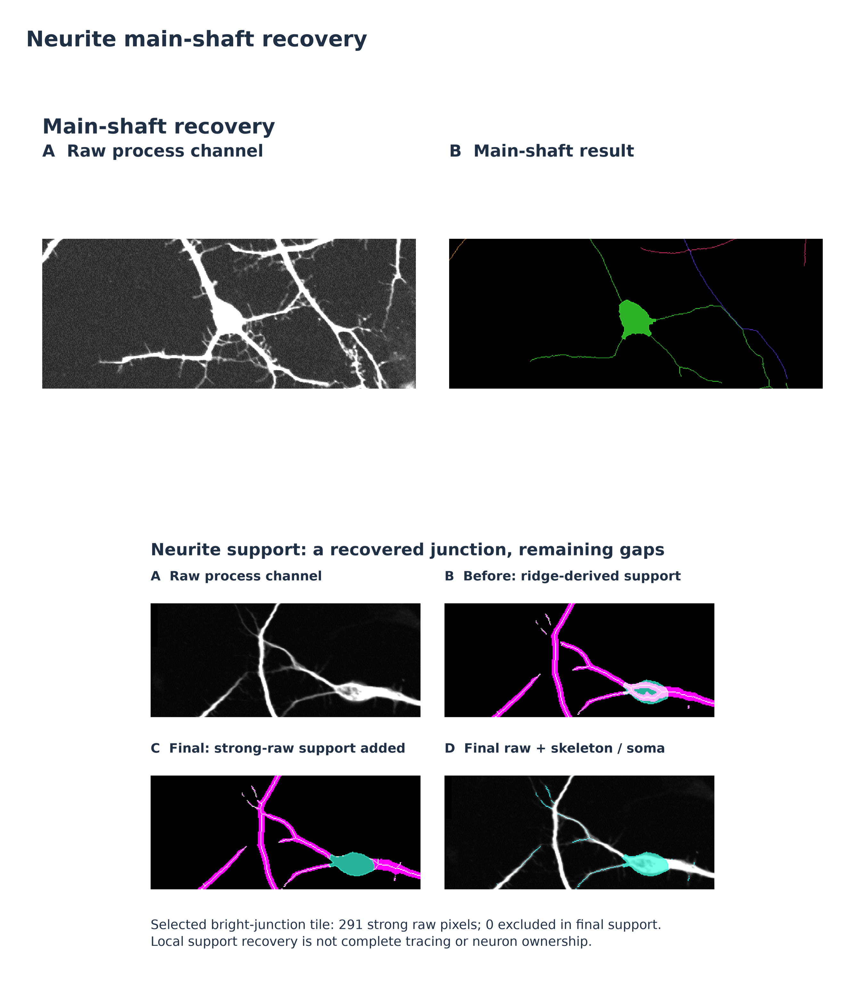{width=6in}

Upper: matched process-channel raw image and the initial autonomous shaft-focused result. Raw window 0–12, gamma 1, exposes processes by saturating bright somata. Lower: an independent autonomous author recovers strong raw-supported junction support while retaining a quiet negative control; raw window 0–80, gamma 1. Main-shaft recovery is sufficient for the demonstrated outgrowth analysis. Later revisions adding uncertain fine twigs are not used as the representative result. Faint protrusions and neuron-specific crossing ownership remain limitations; neither row is a ground-truth accuracy comparison. Native captures retain their original crop, presentation and scientific pixels. Source identities and pipelines are linked in Supplementary Data 8.

```{=openxml}
<w:p><w:r><w:br w:type="page"/></w:r></w:p>
```

## Supplementary Figure 13. A familiar CellProfiler pipeline expressed as OpenHCS steps

{width=5.3in}

\(A) The public ExampleCometAssay pipeline maps image loading to source bindings and processing to 12 function steps. Rows align original modules and imported functions; multiplicity marks repeated calls. Spreadsheet export runs plate-wide. (B) MeasureObjectSizeShape applies the same function to Comet, CometHead and CometTail within one step. (C) Masking the comet with its head, with inversion enabled, defines CometTail. The diagram is derived from the source pipeline and importer; function identities, parameters and counts are checked against its retained mapping.

```{=openxml}
<w:p><w:r><w:br w:type="page"/></w:r></w:p>
```

## Supplementary Figure 14. Image and object inspection in Fiji and napari

{width=5.5in}

\(A) Fiji displays a single NeuronCyto II field 1 nuclear plane with nine corresponding native ROI Manager entries. (B) A separate three-plane napari demonstration shows segmented objects, a selected ROI-list entry and the displayed channel/Z coordinates. Its accompanying recording shows selection navigating between planes. These are retained viewer demonstrations, separate from the unattended analysis in Figure 5; their segmentation outputs are not compared with each other. Details enlarge the ROI entries and a nuclear outline in A, and the selected object, highlighted list entry and coordinates in B. The full captures and checksum records are retained in the gallery archive.

```{=openxml}
<w:p><w:r><w:br w:type="page"/></w:r></w:p>
```

## Supplementary Figure 15. Independent BBBC039 authors on the same 200 fields

{width=6in}

\(A) Each point compares final object F1 on the same field for the earlier
author and an independent repeat. The dashed line marks equal scores. All
200 fields are included: blue points are annotated fields, and the three orange
annotation-empty fields coincide at the origin. (B) Pooled precision, recall
and F1 against the same 23,615 reference
instances, using intersection over union at least 0.5. The repeat matched
20,207 objects with 1,164 excess predictions and 3,408 misses; the earlier
author matched 20,521 with 1,153 excess predictions and 3,094 misses.
The repeat's F1 was 0.898 versus 0.906 earlier. Its field F1 reached at least
0.90 in 133 fields, while eleven remained below 0.80. Each author used its own
method and settings; this is not a controlled test of a skill change, a paired
first/final repair, or unseen-image generalization. Reference answers were used
only for postfreeze scoring and were not supplied to either author. Exact
field scores, reference hashes and original lifecycle records are retained in
the [repeat evaluation](../../figure-collection-20261004/bbbc039-fresh10coverage-postfreeze-evaluation.json)
and Supplementary Data 8.


## Supplementary Figure 16. Matched single-core amortization

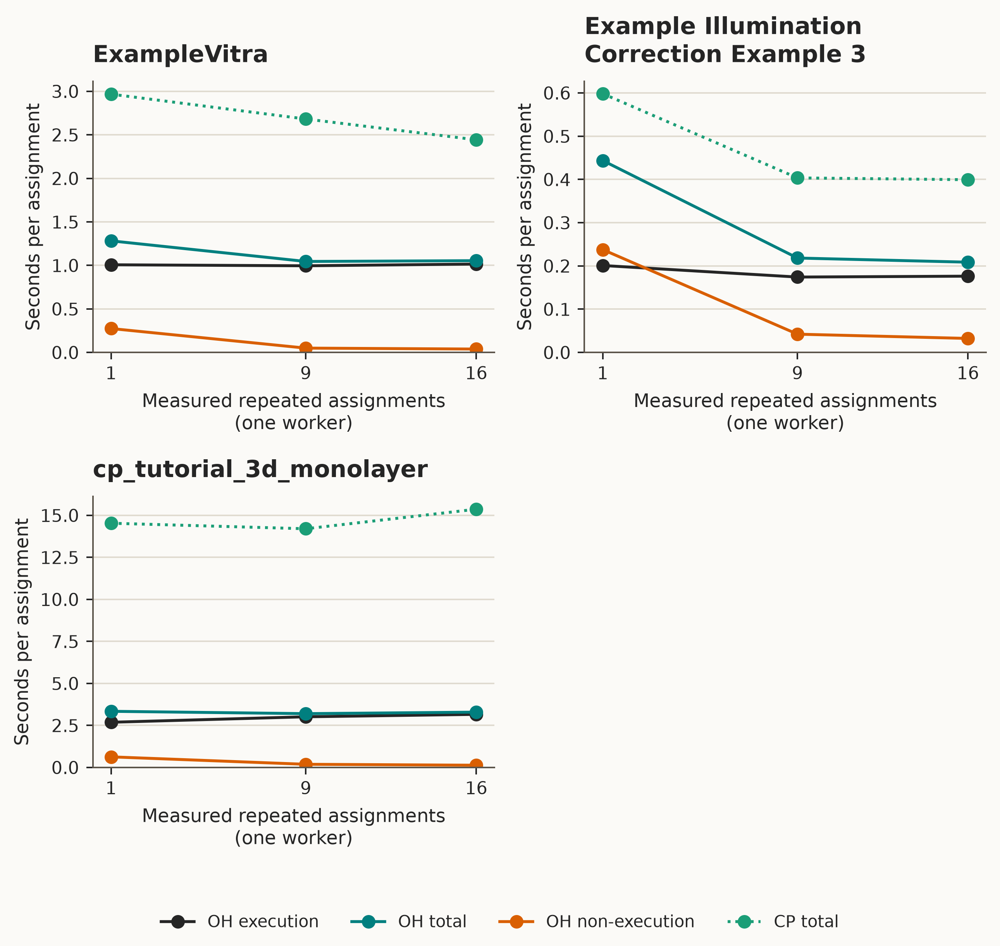{width=6in}

The three selected workflows retain the prior single-sample execution frontier
(Vitra), total-time frontier (illumination correction Example 3) and representative
3D monolayer workflow. They were not reselected from the final single-sample
rankings. Each engine used one worker and one numerical thread. Points are actual
medians over three measured repetitions after warmup at 1, 9 and 16 repeated
assignments of one biological source sample. Connecting lines join observations;
they do not predict other assignment counts. OpenHCS nonexecution overhead is the
median paired difference between total and full server execution per assignment,
including compilation and client coordination; it is not a decomposition of
kernel and plumbing work. Native total excludes one-time pipeline loading and
JVM initialization. Endpoint, library and kernel readiness and post-run scientific
comparison are outside both clocks. All observations passed declared-output
comparisons on production revision `eb773573c` in one refreshed environment.

## Supplementary Figure 17. Matched workload comparisons across worker counts

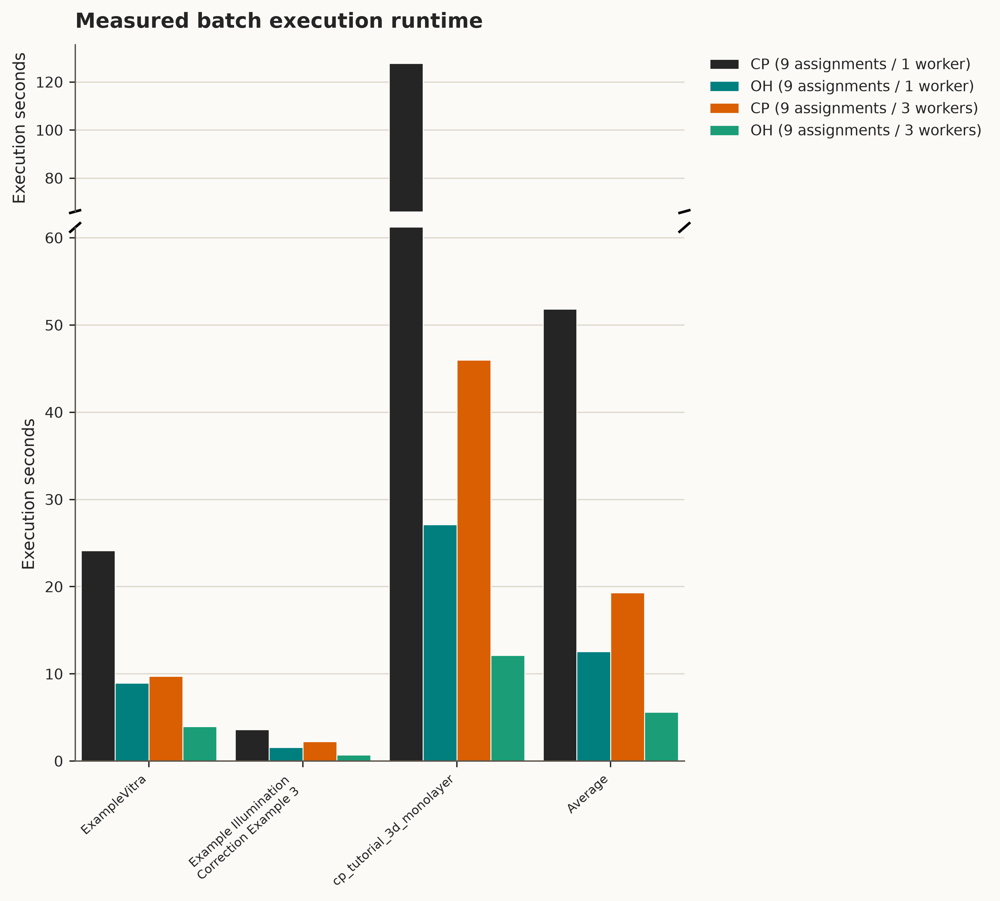{width=6in}

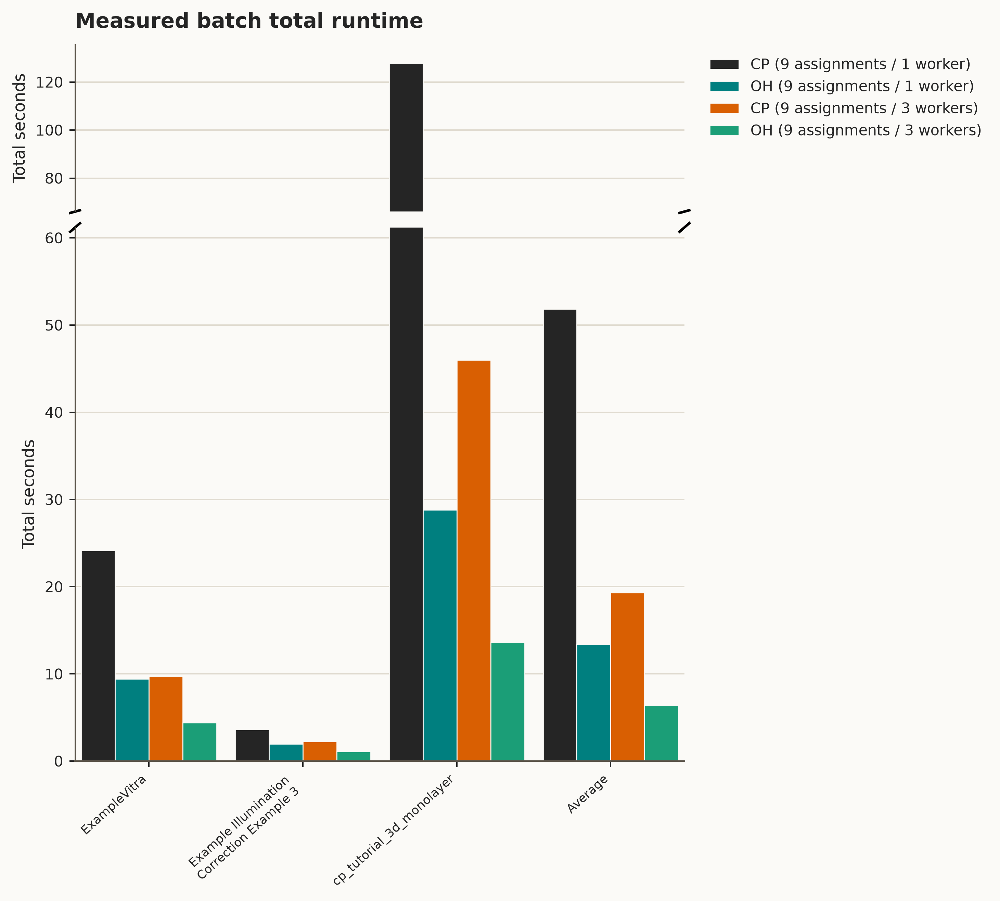{width=6in}

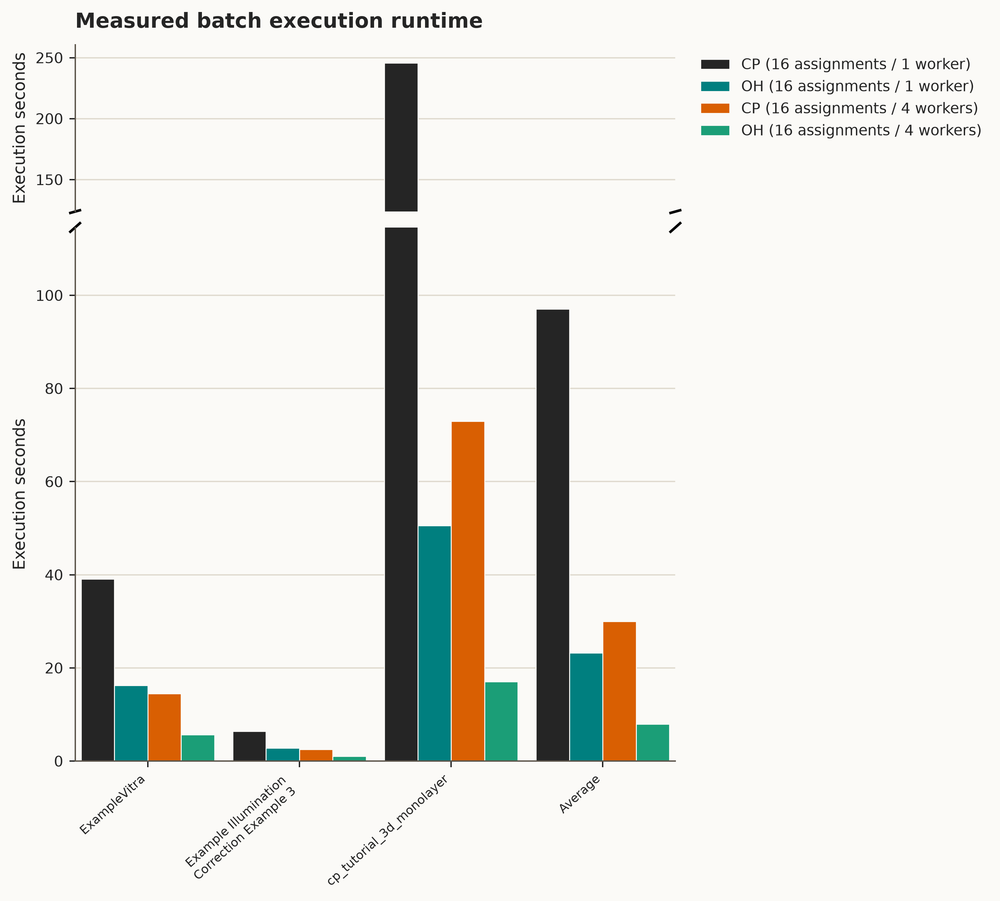{width=6in}

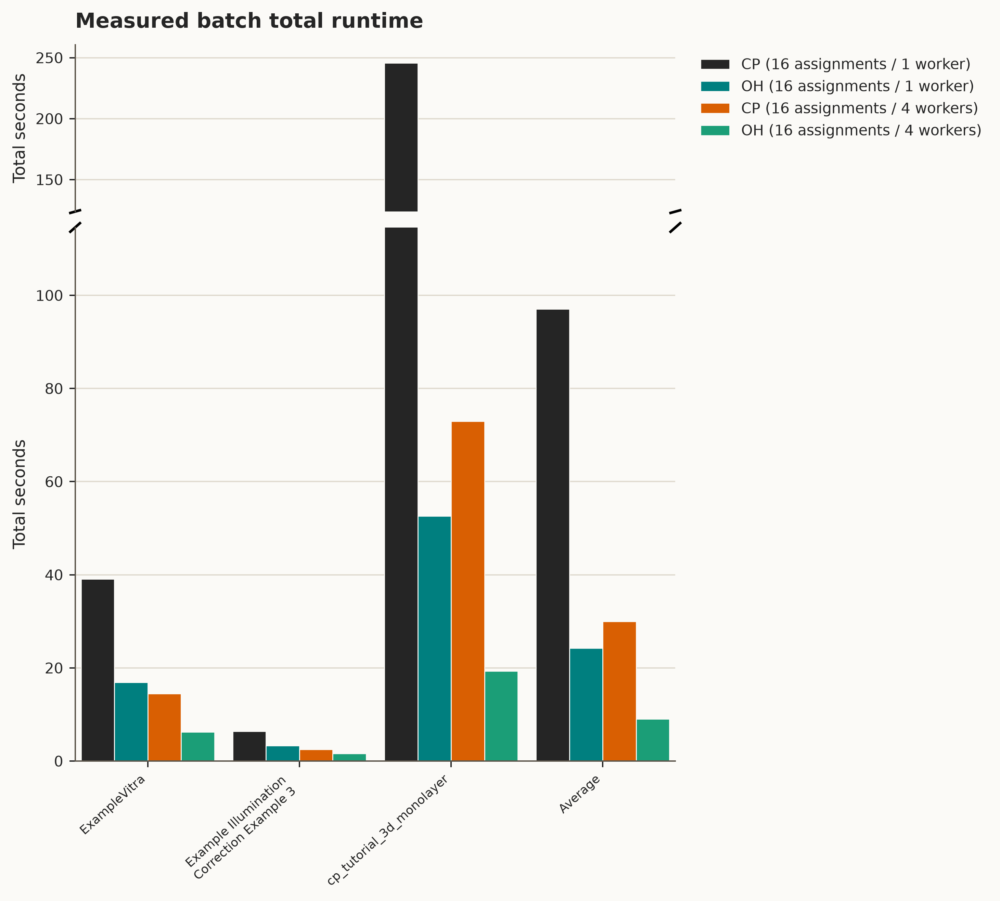{width=6in}

The same three-workflow cohort, source revision and environment as Supplementary
Figure 16 are used. Each condition completed warmup and three measured repetitions
with no declared-output differences. Native parallel durations are actual
simultaneous shard makespans validated against a complete serial batch; they are
not estimated from independent durations. OpenHCS execution includes the complete
server job and plate exports. The Average category is an arithmetic summary of
workflow bars, not a pooled runtime.

For the same assignment count, execution efficiency is the one-worker median
divided by worker count times the parallel median. OpenHCS efficiencies for Vitra,
illumination and 3D were 75.5%, 72.3% and 74.4% at three workers, and 71.8%, 69.1%
and 74.1% at four workers. Native efficiencies were 82.6%, 54.3% and 92.7% at three
workers, and 67.4%, 64.5% and 84.2% at four workers. These efficiencies measure
loss against ideal scaling and are distinct from speedup over native. The
[retained passive-counter comparison](../../benchmark/results/matched_postgrid_20261006/diagnostics/3d-same-step-scaling-counter-comparison.json)
shows additional 3D work inside the critical worker lane, increased system time,
process swap and major faults during parallel execution, supporting a working-set
and reclaim contribution. It does not identify the allocation owner or prove a
guaranteed fix. Process memory ranges are not summed as unique physical bytes;
these diagnostics are separate from the benchmark clock and science qualification.

Dividing OpenHCS efficiency by native efficiency measures additional scaling loss
on this hardware. At three workers, the additional execution loss was 8.6% for
Vitra and 19.7% for 3D; illumination scaled better than native. At four workers,
Vitra and illumination scaled better than native, while 3D had 12.0% additional
loss. Ideal linear scaling is not established. Four-worker execution speedups
over native CellProfiler were 2.56-, 2.43- and 4.28-fold; total speedups were 2.32-,
1.53- and 3.77-fold, respectively. The single-sample minimum speedup does not apply
to every parallel condition. Exact execution and total denominators, native
baselines, inventories and provenance accompany the [current matched record](../../benchmark/results/matched_postgrid_20261006/README.md); the [earlier checkpoint](../../benchmark/results/matched_final_20261006/README.md) remains separate.

```{=openxml}
<w:p><w:r><w:br w:type="page"/></w:r></w:p>
```

## Supplementary Table 1. Reusable libraries and their roles

| Library | Role in OpenHCS |
| --- | --- |
| [metaclass-registry](https://github.com/OpenHCSDev/metaclass-registry) | Discovers classes implementing a shared interface and makes them available for selection. |
| [python-introspect](https://github.com/OpenHCSDev/python-introspect) | Reads a function's parameters, types, defaults and documentation. |
| [ObjectState](https://github.com/OpenHCSDev/objectstate) | Tracks editable settings and resolves shared defaults and local overrides. |
| [pyqt-reactive](https://github.com/OpenHCSDev/pyqt-reactive) | Generates parameter controls and updates them as settings change. |
| [pycodify](https://github.com/OpenHCSDev/pycodify) | Generates editable Python representations and manages their imports. |
| [ArrayBridge](https://github.com/OpenHCSDev/arraybridge) | Converts arrays between supported libraries and manages their computational resources. |
| [PolyStore](https://github.com/OpenHCSDev/PolyStore) | Reads, writes and streams data through supported storage interfaces. |
| [ZMQRuntime](https://github.com/OpenHCSDev/zmqruntime) | Coordinates communication, startup, shutdown and progress between processes. |

```{=openxml}
<w:p><w:r><w:br w:type="page"/></w:r></w:p>
```

## Supplementary Data 1. CellProfiler workflow comparison

### Import, export and comparison methods

Imported `ExportToDatabase` modules run once per plate after image-group processing. They collect the selected images, objects, measurements, relationships, thumbnails and grouping information into CellProfiler Analyst tables [@Jones2008]. The export produces a self-contained SQLite database and matching `.properties` files. Non-SQLite databases, custom filter rows, `.workspace` generation and some historical aggregation settings remain unsupported; unsupported requests fail or are identified in the compatibility documentation.

Automated testing for the OpenHCS 0.8.5 release checked execution of all 30 imported workflows and compared selected outputs for the 25 with retained CellProfiler-produced reference values. The continuous-integration (CI) job built installable packages from the release source and its dependencies on Linux with Python 3.12. It acquired the workflows and image sets at the revisions specified in the benchmark manifest, then compiled and executed each imported workflow through the execution server. Every OpenHCS analysis ran afresh. The historical release test required 30 successful execution records and no differences in its selected comparisons. Supplementary Data 1 preserves the per-workflow observations, run metadata and tested revision.

The historical release comparison selects exported values from CSV tables and CellProfiler Analyst SQLite tables and `.properties` files. Its image comparison selects files, including NumPy arrays, from native reference-output directories that contain images and no CSV files. This includes the NPY-only illumination workflow and the completed translocation tutorial's overlay alongside its SQLite measurements. Images accompanying CSV measurements in 14 historical profiles remain outside that release comparison. Absolute and relative tolerances are `1e-6` for numeric values and image pixels, with no pixels allowed outside tolerance; identifiers and categorical values are compared exactly after documented CellProfiler-compatible normalizations.

The subsequent matched performance evaluation retained the complete 30-workflow manifest and compared the declared table, database and image outputs in a warmup and three measured repetitions per engine. All 120 OpenHCS observations completed without declared-output differences against complete native CellProfiler runs. These current-source observations, their output inventories and their timing boundaries are separate from the historical release comparison and are retained in the [matched benchmark record](../../benchmark/results/matched_postgrid_20261006/README.md).

For the five workflows without file exports, terminal image or object-label exports were appended while preserving the original processing modules and settings. Native CellProfiler generated eight additional reference artifacts. A subsequent unified run compiled and executed all 30 workflows afresh and compared each candidate with its selected native reference values. Object labels were compared exactly after singleton-axis normalization; numerical images used the stated float tolerances. The unified run used OpenHCS 0.8.5 current source on Python 3.12.3 with NumPy 2.1.3 and SciPy 1.18.1. Native references used CellProfiler 4.2.8.1 on Python 3.9.25 with NumPy 1.24.4 and SciPy 1.9.0. Supplementary Data 1 links the export definitions, reference inventory, per-workflow comparisons and exact source identities separately from the historical release CI records.

The corpus contains 22 workflows and associated image sets from the official CellProfiler 3 examples repository, seven workflows and image sets from the official CellProfiler tutorials repository, and one workflow from the supplement to the CellProfiler 4 performance study [@CellProfilerExamples; @CellProfilerTutorials; @Stirling2021]. The CellProfiler project and the cited dataset contributors retain authorship and provenance for these materials. The retained manifest maps workflow names to pipeline and image locations; Supplementary Data 1-3 provide the corresponding comparison, coverage and throughput tables.


This supplement indexes source tables and evaluation records. Figure scripts
derive panels and plotted-row exports from the linked files; paths are relative
to this file.

The acquisition scripts pin the official CellProfiler examples to
`4972b59e670a4ae96c3d453803c92eeff378d054`, the official tutorials to
`264a8155da21a2d468051f78211bed2e580a8934`, and the CellProfiler 4 benchmark
supplement to `40abc2e600fd46b74c213999dd25c5245048dc92`.

### OpenHCS 0.8.5 release comparison

The release CI run executed all 30 workflows and supplied 25 reference-bearing
comparisons. A later unified current-source run, described below, supplied
reference-value comparisons for all 30 workflows in one execution.

The [preserved CI evidence](ci_official30_085/README.md) contains the observations,
summary, phase timings and suite metadata from the hosted Official30 job at
release commit `e867013a8eb188edcc63b5b0cdfd06f42a99b409`.
[The successful job](https://github.com/OpenHCSDev/openhcs/actions/runs/34445574926/job/102769520329)
built candidate packages and executed all 30 imported workflows through ZMQ on
Linux with Python 3.12.14. Every OpenHCS execution was uncached; native
CellProfiler outputs came from the committed references.

The [per-workflow observations](ci_official30_085/observations.csv) report
successful execution and zero comparison differences for all 30 cases. The
[reference inventory](ci_official30_085/reference_inventory.csv) identifies
which cases contain values to compare:

| Selected native reference class | Workflows | Value comparisons |
| --- | ---: | --- |
| CSV measurements | 21 | Measurement tables |
| SQLite and CellProfiler Analyst properties | 3 | Database tables and properties; one also has an overlay image |
| NPY-only illumination output | 1 | Image pixels |
| No retained value files | 5 | Execution checks only |

Image comparison selects output directories containing images and no CSV files.
This selects two workflows: the AllMethod illumination array and the completed
translocation tutorial's overlay alongside SQLite measurements. The advanced
segmentation tutorial's five illumination arrays are source inputs outside its
reference-output directory. Images saved alongside CSV measurements in 14
profiles are outside image comparison. Numeric comparisons use absolute and
relative tolerances of `1e-6`, with no pixels allowed outside tolerance.

The records retain per-case comparison outcomes and timing, rather than raw
candidate output trees or individual pixel-difference reports. The native
references' original dependency environments were not recorded. The evidence
index supplies source and test permalinks, checksums and the separate
14 September 2026 reference-inventory audit provenance.

### Unified 30-workflow value comparison

The [unified evidence directory](../../benchmark/results/official30_unified_value_comparison_20260916/README.md)
preserves one immutable run in which all 30 workflows were compiled and executed
afresh through isolated ZMQ execution endpoints. All 30 selected reference-value
comparisons were equivalent and reported zero differences. Its fresh
[reference inventory](../../benchmark/results/official30_unified_value_comparison_20260916/reference_inventory.csv)
contains 21 CSV profiles, three SQLite profiles and six image- or array-only
profiles. Image comparison executed for seven workflows, including the completed
translocation overlay compared alongside its SQLite values.

The [observations](../../benchmark/results/official30_unified_value_comparison_20260916/observations.csv),
[phase timings](../../benchmark/results/official30_unified_value_comparison_20260916/phase_timing.csv),
and [summary](../../benchmark/results/official30_unified_value_comparison_20260916/summary.csv)
retain the comparison results. The original observations identify the candidate
as OpenHCS 0.8.5 and retain endpoint, executable and submitted-pipeline provenance.
The full run-environment and suite-metadata records were not retained in this
archive; its exact candidate source commit and Python, NumPy and SciPy versions
cannot be established from those observations. The selected native references'
original dependency environments are likewise not established by this bundle.
Environment identities from later matched runs do not supply this missing
historical provenance.

### Five-workflow image and object-label exports

Five source workflows compute images or objects without exporting files. The
[export-extension manifest](../../benchmark/manifests/official30_value_completion_20260914.json)
selects versions of those workflows with terminal exports added. Its generated
pipelines retain the original processing modules and settings. Native CellProfiler
produced the exported references; OpenHCS processed the same scoped inputs.

| Workflow | Exported values compared | Result |
| --- | --- | --- |
| Combine objects | Combined-object labels | Exact label agreement |
| Translocation starter | Nuclear labels | Exact label agreement |
| Illumination Example 1, EachMethod | Corrected green image | Float-tolerance agreement |
| Illumination Example 2 | Uncorrected, small-block-corrected and large-block-corrected nuclear labels | Exact agreement for all three label images |
| Illumination Example 3 | Polynomial-corrected and convex-hull-corrected images | Float-tolerance agreement for both images |

The [per-artifact comparison table](../../benchmark/results/official30_value_completion_20260914/label_aware_exact_commit_run/artifact_comparisons.csv)
records eight passing artifacts. All five integer label images agree exactly
after normalization of singleton dimensions. The three numerical images have
zero pixels outside the absolute and relative tolerances of `1e-6`; their
maximum absolute difference is `2.9802322387695312e-8`. The
[per-workflow observations](../../benchmark/results/official30_value_completion_20260914/label_aware_exact_commit_run/observations.jsonl)
link these comparisons to fresh candidate executions and the retained native
outputs.

The [run environment](../../benchmark/results/official30_value_completion_20260914/label_aware_exact_commit_run/run_environment.json)
identifies OpenHCS execution source `7ca8ecb8e73a882ef0f15616d57b00f0dabf73e0`,
Python 3.12.3, NumPy 2.1.3 and SciPy 1.18.0. Native references were generated
with CellProfiler 4.2.8.1 on Python 3.9.25, NumPy 1.24.4 and SciPy 1.9.0.
Each candidate ran through a fresh matching OpenHCS endpoint. Source revisions,
native-reference origin and endpoint identities are retained with the results.
These exported references are incorporated into the unified 30-workflow run;
the earlier five-workflow audit and release records retain their own protocols
and identities.

### Retained single-sample timing records

The separate [May single-process table](../../benchmark/results/labmeeting_20260513/official30_well_throughput/data/single_process_summary.csv)
contains one observation and one passing status flag per workflow, execution and
total-phase timings, ratios and the legacy accuracy field. Its native
ExampleWoundHealing timing is 900 s without a native completion flag, so that
row is excluded from timing comparisons. Empty fields remain as recorded.

The field `min_parity_accuracy` is 1.0 in all rows. It is the minimum Boolean
pass flag across a workflow's observations, including the five workflows without
reference values, rather than the fraction of matching measurements or pixels.
Times below are in seconds, rounded to five significant figures from the source
CSV. The full-precision values remain in that file. Native command and prepared
OpenHCS execution have different timing boundaries, described below. The other
columns sum each system's recorded benchmark phases. The ExampleWoundHealing
native values equal the timeout ceiling and are shown for source completeness;
that row is excluded from timing comparisons.

| Workflow | Native command | Prepared execution | Native phase sum | OpenHCS phase sum |
|----------------------------------------|-----------:|-----------:|-----------:|-----------:|
| ExampleColocalization | 48.936 | 3.4135 | 48.957 | 14.439 |
| ExampleCometAssay | 15.65 | 3.588 | 15.729 | 4.6023 |
| ExampleFly | 9.2186 | 1.6629 | 9.2536 | 5.7264 |
| ExampleFlyURL | 5.4078 | 0.59741 | 5.4323 | 4.6231 |
| ExampleHuman | 5.0468 | 0.56671 | 5.111 | 6.9859 |
| ExampleIlluminationCorrection_Example1_AllMethod | 23.846 | 0.2981 | 23.875 | 0.58255 |
| ExampleIlluminationCorrection_Example1_EachMethod | 4.9526 | 0.095801 | 4.9629 | 0.34526 |
| ExampleIlluminationCorrection_Example2 | 49.621 | 2.1512 | 49.632 | 2.5107 |
| ExampleIlluminationCorrection_Example3 | 2.5101 | 0.1649 | 2.5214 | 0.52152 |
| ExampleImagingFlowCytometryObjectsInGrid | 74.157 | 17.18 | 74.417 | 98.545 |
| ExampleNeighbors | 4.9983 | 0.48576 | 5.0753 | 10.148 |
| ExamplePercentPositive | 2.902 | 0.37111 | 2.917 | 1.6261 |
| ExampleSpeckles | 3.7868 | 0.61381 | 3.7957 | 1.3598 |
| ExampleTrackObjects | 10.919 | 1.9784 | 11.15 | 2.9135 |
| ExampleTumor | 5.2672 | 0.7298 | 5.3182 | 1.183 |
| ExampleUntangleAndStraightenWorms | 3.9757 | 0.61834 | 3.9825 | 1.0111 |
| ExampleUntangleWorms | 3.7546 | 0.51335 | 3.7662 | 0.98515 |
| ExampleUntangleWormsBrightField | 8.755 | 1.7514 | 8.764 | 2.947 |
| ExampleVitra | 4.7962 | 0.75417 | 4.87 | 6.2844 |
| ExampleWoundHealing | 900 | 1.0723 | 900 | 1.4437 |
| ExampleYeastColonies | 15.848 | 2.3553 | 15.943 | 11.971 |
| ExampleYeastPatches | 7.4914 | 1.0139 | 7.5774 | 2.3141 |
| cp4_supplement_combine_objects | 2.0789 | 0.020116 | 2.0855 | 0.25762 |
| cp_tutorial_3d_monolayer | 16.866 | 3.5231 | 16.929 | 4.5869 |
| cp_tutorial_advanced_segmentation_final | 39.617 | 9.8382 | 40.19 | 13.865 |
| cp_tutorial_beginner_segmentation_final | 18.625 | 3.3373 | 18.831 | 33.811 |
| cp_tutorial_pixel_based_classification | 5.1064 | 0.65263 | 5.1965 | 1.2405 |
| cp_tutorial_quality_control | 5.3916 | 0.4757 | 5.7724 | 1.0273 |
| cp_tutorial_translocation_final | 3.5821 | 0.31336 | 3.6072 | 0.9035 |
| cp_tutorial_translocation_start | 2.4696 | 0.13163 | 2.4866 | 0.38448 |

The 29 workflows retained after the wound-healing exclusion have a median native
command duration of 5.39 s and median prepared OpenHCS execution of 0.653 s.
The per-workflow execution-phase ratios have a minimum of 4.03 and median of
7.39. Summed-phase ratios have a median of 3.42; five workflows have a larger
OpenHCS phase sum. These summaries use the unequal intervals defined below.

### Timing boundaries in the archived harness

The results table first entered Git in commit `f58bca4e9` on 13 May 2026.
In that source tree, the native adapter's execution timer surrounds the complete
CellProfiler subprocess. OpenHCS initialization and compilation are timed
separately, before its prepared-execution call. The native-command/OpenHCS-
execution ratio therefore combines startup and execution on one side with
prepared execution on the other.

The collector computes total-phase time by summing the recorded phases. The
OpenHCS path also records benchmark validation and output-comparison work.
These sums are not equivalent cold-start or end-to-end analysis intervals.
The many-well projection multiplies the native command duration, including its
startup, by well count; it does not measure native persistent-worker throughput.
Original CSV field names, including `median_speedup`, remain unchanged as
historical record labels. Supplementary Figure 5 presents them as phase-time ratios.

The collector also supports cached reference results and can substitute the
configured timeout when a successful cached native reference lacks execution
timing. The summary's `n=1` counts comparison observations, not necessarily fresh
timed executions. This policy could account for a timeout-valued row, but the
retained summary alone does not establish which path produced it.

The committed source establishes these timer definitions. The separate timing
source audit document is not retained in this archive; the original run
environment and per-run phase traces still need recovery to establish the
executed snapshot. The subsequent matched comparison in Figure 2 uses separately
declared execution and total intervals with three measured observations per
engine; it does not reconstruct the missing historical timing provenance.

## Supplementary Data 2. Archived CellProfiler coverage

- [Module names and associated workflows](../../benchmark/results/labmeeting_20260513/official30_well_throughput/figures/module_coverage_cppipe_modules.csv).
- [Individual settings and recorded handling categories](../../benchmark/results/labmeeting_20260513/official30_well_throughput/figures/module_coverage_cppipe_settings.csv).
- [Processing registration and corpus membership](../../benchmark/results/labmeeting_20260513/official30_well_throughput/figures/module_coverage_absorbed_modules.csv).

These files describe the archived coverage report. Setting categories distinguish
bound parameters, artifact contracts, infrastructure, and intentionally ignored
settings. Registration or a handling category is not itself an output-equivalence
test. Module aliases and source/export roles differ between the tables, so their
category totals must not be added as mutually exclusive classes. They are not a
current-version compatibility matrix.

## Supplementary Data 3. Worker and memory measurements

### Historical performance protocols

#### Matched scaling and archived comparisons

Actual single-core measurements at 1, 9 and 16 repeated source assignments separate execution from compilation and client coordination (Supplementary Figure 16). Balanced comparisons at nine assignments on one/three workers and sixteen assignments on one/four workers retain measured native parallel clocks and matched outputs (Supplementary Figure 17). Four-worker OpenHCS execution efficiencies ranged from 69.1% to 74.1% of ideal scaling, compared with 64.5% to 84.2% for native CellProfiler. OpenHCS retained 88.0% to 107.3% of native execution scaling efficiency, with execution speedups of 2.43- to 4.28-fold in these matched four-worker workloads. These measurements distinguish loss against ideal scaling from additional loss relative to native CellProfiler and do not establish near-linear scaling.

The earlier analysis-focused throughput and memory measurements remain archived in Supplementary Data 3 and Supplementary Figure 7. Their configured worker and output policies differ from this output-complete matched evaluation, so their rates and memory values are not combined with the fresh timing distributions.

#### Archived protocols

Archived May development runs measured throughput and peak memory by assigning the same source images to multiple well identifiers, creating repeated analysis work. Queue depth specifies how many assignments were supplied per configured worker. Each condition has one recorded run per workflow. The retained rows report completed assignments but do not preserve worker-process traces or per-run output inventories.

Throughput varied the configured worker maximum over two, three and four,
with four assignments per worker. The memory sweep fixed four workers and
varied assignments per worker over one, two, three, four, six and eight.

Throughput uses execution time after initialization and compilation. The recorded configuration disables default saving of named results and return of detailed worker records, and requests removal of unused steps whose outputs are not saved. Supplementary Data 3 identifies these settings, the individual runs and the limits of their historical output-policy provenance. These rows characterize that archived analysis-focused workload, not the current output-complete CellProfiler translation. Measurements cover CPU execution on local or explicitly mounted image sources; GPU and cloud or network-storage performance were not measured.

The archived single-sample benchmark specifies one thread/core, CPU-only execution and no batching, with one retained comparison observation per workflow. The harness committed with the tables times the native CellProfiler command from subprocess launch through completion, including its startup. It times OpenHCS execution after initialization and compilation. Total-phase values also include different work, including benchmark validation and comparison on the OpenHCS path. Supplementary Figure 5 and Supplementary Data 1 report these observations with their timer definitions; they do not establish a like-for-like speed comparison. The wound-healing native duration equals the 900-s timeout ceiling without an explicit completion flag and is excluded from timing statistics.

The supplementary package separates the release CI comparison records from the earlier performance measurements. Its software-snapshot table identifies the revision and evidence for each evaluation. Figure scripts regenerate panels from saved CSVs and record source and output checksums. Supplementary Data 6 links automated tests of workflow editing and pre-execution validation to their source and CI jobs.

- [Core-count sweep](../../benchmark/results/labmeeting_20260513/official30_well_throughput/data/core_scaling_well_throughput.csv).
- [Two-, three- and four-worker queue-depth conditions](../../benchmark/results/labmeeting_20260513/official30_well_throughput/data/wells_per_core_2c3c4c.csv).
- [Four-worker conditions with six and eight wells per worker](../../benchmark/results/labmeeting_20260513/official30_well_throughput/data/wells_per_core_4c_6wpc_8wpc.csv).

The historical throughput analysis uses the measured two-, three- and four-worker rows, with four repeated-image
assignments per worker, for all 30 workflows. The runtime schedules each assignment
as a well; these are repeated inputs, not independent biological replicates.
Each row reports completion of every assignment. Throughput is completed
assignments divided by execution seconds; the derived
values match the source `wells_per_second` field. The one-worker condition used
one well and is not included in this fixed-queue-depth panel.

The co-committed sweep source sets `materialize_runtime_artifacts=False` and
`runtime_observation_mode=OMIT`, and requests pruning of unused unsaved-output
steps. These conditions measure the configured execution workload; they do not
establish throughput for every output-saving policy. The historical rows do not
retain the exact executed source revision, compiled plans, output inventories or
worker-process event traces. At the May presentation-source commit
`f58bca4e9`, `ExportToDatabase` was explicitly a pass-through stub rather than
the later SQLite exporter. It is therefore not defensible to read Supplementary Figure 7 as
current output-complete throughput or to infer actual worker-process counts
solely from the configured worker labels.

The separate [current-API four-mode readiness probe](../../benchmark/results/paper_config_new_api_probe_20260923/translocation_four_modes_fork/README.md)
ran one Translocation workflow with its explicit TIFF, SQLite and CPA properties
outputs and verified one, two, three and four active worker PIDs from progress
events. It is not pooled into Supplementary Figure 7: it covers only one workflow, includes
different output work, and uses the ordinary completed-server timing boundary.

The separate [matched genuine-well Translocation pilot](../../benchmark/results/matched_batch_concurrency_fork_20260923/README.md)
used two native CellProfiler jobs and two observed OpenHCS worker processes on
the same eight source wells. Three timed observations each had no TIFF or SQLite
value differences. Native invocation-to-completion makespans were 5.27--5.59 s;
OpenHCS completed-server jobs were 16.08--16.75 s, including 11.33--11.65 s
of plate-scoped SQLite export. The native processes persisted across observations,
while OpenHCS created workers per job. This one-workflow, different-lifecycle
pilot is not pooled into Supplementary Figure 7 and does not establish general comparative
throughput.

A second [matched BBBC022 advanced-segmentation pilot](../../benchmark/results/matched_bbbc022_20260923_rc5/README.md)
used eight distinct wells (16 image sets), two native CellProfiler jobs and
two observed OpenHCS worker processes. One warm-up and one timed repetition
each emitted one SQLite database and seven CellProfiler Analyst properties
files on both sides. Native shards reconstructed their whole-batch outputs;
the OpenHCS value comparisons reported no SQLite or normalized-properties
differences, and no images were saved. The timed native two-job invocation
makespan was 206.459 s, versus a 189.933 s OpenHCS completed-server job. The
native process startup and OpenHCS compilation were excluded, but the job
boundaries and process lifecycles still differ. This single timed repetition
is retained as a matched-concurrency diagnostic, not a cross-system speedup
claim or a Supplementary Figure 7 input.

Each row retains its workflow, worker count, assignment count, completed-assignment
count, execution and total time, memory, status and serial CellProfiler projection.
The source CSV uses well terminology for the virtual-well assignment fields.
The projection multiplies the native single-sample command duration, including
startup, by well count; it does not represent a measured persistent or parallel
CellProfiler run. The source memory
column is named `peak_memory_mb`; the collector expresses MiB, converted to GiB
for the manuscript figure. Historical collector-version confirmation remains
listed in the author-review record.

[Benchmark figure provenance](../figures/slas/figure2_provenance.json) records source and
output hashes. Exact plotted observations accompany the figure as separate CSVs.
Run `python paper/figures/build_slas_benchmark.py` in the project environment to
regenerate them without rerunning the experiments.

The historical per-workflow measurements are shown in Supplementary Figure 7. Existing artifact
filenames retain their original identifiers so links do not depend on editorial
renumbering.

## Figure assembly and interface records

Supplementary diagram receipts identify the source declarations and generated
output hashes: [runtime composition](../figures/slas/runtime_composition_provenance.json),
[process architecture](../figures/slas/process_architecture_provenance.json),
[compiler preparation](../figures/slas/compiler_preparation_provenance.json),
[connected outputs](../figures/slas/outputs_and_inspection_provenance.json), and
[custom-function integration](../figures/slas/custom_function_extension_provenance.json).
Their generators are retained in `paper/figures/` alongside editable SVG and PDF
versions. The output figure also records the saved image, ROI and CSV identities.
Its corrected demonstration is distinct from the original recording in Figure 5.

The [custom-function capture record](../figures/slas/custom_extension_evidence.json)
retains registration and selection receipts, source identities and full native
screenshots from an isolated development session. The session includes the
catalog-refresh and selector-lifetime fixes recorded there. It demonstrates
registration and editor integration; the example function was not run on the
analysis dataset.

The separate visual storyboard is not retained in this archive. The
[gallery capture record](../../website/assets/gallery/release-media-record.json)
owns the source identities, published hashes and demonstration descriptions for
the retained Fiji/napari panels. Figure 1 panels A, C and D use matching captures
from one OpenHCS 0.8.5 editing session. Its
[native interaction record](../figures/slas/authoring_verified_roundtrip_provenance.json)
contains the code/field round trip, widget observations and screenshot receipts.
Panel B is a separate OpenHCS 0.8.7 native capture of the ZeroMQ server browser
on an isolated display; its [original MCP receipt](../figures/slas/authoring_server_browser_verified_capture_provenance.json)
records the unmodified widget image and checksum. The browser lists observed
endpoints; the status ticks alone do not establish client/server version compatibility.
These captures are distinct from the original unattended agent run.

`paper/figures/build_slas_visual_story.py` checks the published media hashes and
records any UI-detail crop rectangles used in the shared-workflow figure and Supplementary Figure 14.
`paper/figures/build_slas_agent.py` additionally derives the two displayed step
labels from the original saved pipeline, without importing or executing it.

Supplementary Figure 13 aligns the public ExampleCometAssay pipeline with its imported OpenHCS
steps. `paper/figures/build_slas_cellprofiler.py` derives the module sequence,
function names, repetitions and named-object parameters from the source pipeline
and current importer. The [translation receipt](../figures/slas/cellprofiler_translation_provenance.json)
records the source and generated workflow, including a Python round-trip check.

## Supplementary Data 4. Recorded agent workflow

The [original evaluation record](../../website/assets/agent/cold-start-workflow-record.json)
contains the client and model identity, software commits, two-channel input
manifest, exact prompt, authorization, tool-trace counts, timings, completion
checks, output summary, and viewer checks. Evidence paths in that record resolve
relative to `website/assets/agent/`; original absolute runtime paths describe
the recorded machine and are not portable download locations.

The record separately identifies post-run software corrections and a later
viewer replay. The original demonstration retains its input pixels and uncut recording, with
checksums in [its provenance record](../figures/slas/figure3_provenance.json).
The run evaluates workflow completion and inspection; it contains no manually
annotated segmentation-accuracy score.

### Errors and recovery in the original agent run

Of 140 attempted MCP calls, one failed at the tool-call level and 139 returned
completed responses. Thirty of those responses reported an operation error.
The table counts calls, including repeated attempts, rather than distinct bugs.
It is checked against the original event log and its recorded SHA256 by
`paper/review/slas-panel-20260910/audit_agent_trace.py`.

| Operation | Calls | Reported issue |
|----------------------------|---------:|--------------------------------------------------------------|
| Code-document validation | 17 | Preset imports/construction, document structure or configuration types |
| Configuration-schema discovery | 5 | Requested schema name was not exposed |
| Internal-symbol discovery | 1 | Requested symbol was outside the curated namespace |
| Result-file query | 3 | Invalid query target |
| Code-document retrieval | 1 | Requested window had no registered code-document reader |
| UI state query | 1 | Bridge timeout |
| UI action | 1 | Another mutating operation was running |
| Apply-operation receipt | 1 | Confirmation was required; change not applied |

Thirteen of the 17 code-validation calls attempted to construct a preset through
unavailable names or attributes. The agent then authored the two steps using
registered functions. Subsequent validation exposed incorrect document structure
and configuration types; event `item_81` records successful validation.
The separate failed tool call requested `init` instead of the accepted
`init_plate` operation. Compilation, execution, viewer inspection and final
pipeline retrieval are identified by their event IDs in the evaluation record.

### Original and later result summaries

These are the separately recorded original analysis and later corrected
demonstration on the same public field. The original outputs and video retain
their original identity; the later record identifies its own pipeline and
execution hashes.

| Recorded output | Original OpenHCS 0.7.13 | Later OpenHCS 0.7.14 |
|----------------------------------------|-----------------------------:|-----------------------------:|
| Neurons | 9 | 9 |
| Nuclei | 10 | 10 |
| Branches | 8 | 6 |
| Graph paths | 25 | 24 |
| Total outgrowth pixels | 1,982 | 1,865 |

Visual review identified a clustered neurite crossover classified as branching.
The later record reports one resolved crossover after the graph-extraction
correction. Inspection of the retained ROI files also found two cell-body
objects at the bottom soma and three nuclear objects in the same region.
The table above preserves the separately recorded run summaries.

### Current-source replay after algorithm development

A separate OpenHCS 0.8.5 replay used the same two public images with
nuclear-supported soma detection and soma-rooted path assignment. It produced
eight neuronal cell bodies, eight nuclei, 18 processes, two branch events,
one resolved crossover and 24 graph paths. The eight per-cell table totals
agree with the graph distance features and sum to 2556.137 pixels under unit
spacing. The [current replay summary](current_neurite_replay_summary.md)
identifies its execution, saved source and native receipts separately from
the original demonstration and the OpenHCS 0.7.14 correction.

### Published manual-tracing references

The [NeuronCyto II publication](https://doi.org/10.1002/cyto.a.22872) supplies independent measurements
for image 1 in its supplementary files 8–10. The two input TIFFs used here are
byte-identical to `CrossOvers_Images/1_w1.tif` and `1_w2.tif` in the public
`Testing image.zip` archive. The checksums are listed in the original run record.

| Published reference | Image 1 entry | Source file |
| --- | --- | --- |
| Manually traced neurons | Eight per-cell entries | Supplement 9 |
| Neurite length by branch order | Primary 3,633.672; secondary 198.929; tertiary 0; total 3,832.601 | Supplement 8 |
| Crossover count | Three crossovers; NeuronCyto II resolved two | Supplement 10 |

Lengths above retain the numerical units of the source tables. The eight
per-cell reference lengths are 426.82, 172.375, 751.962, 395.04, 669.783,
343.629, 587.841 and 485.152. These entries give a reference against which to
investigate the nine reported neurons. Spatial cell matching, measurement-unit
alignment and agreement on the definition of neurite length are needed before
computing per-cell accuracy. The public testing archive contains the images;
downloadable manual trace coordinates have not been located. The published
crossover count and the OpenHCS branch count measure different quantities.

The [reference audit](neuroncyto_reference_audit.md) records the source links,
file checksums and ROI identifiers. These measurements were examined after the
recorded agent run and were not supplied to the agent during authoring.

### Intermediate correction recorded on 15 September 2026

Before the current-source replay, a separate GUI/MCP rerun (execution
`b2a64589-6fc1-4ac2-8b2b-551818f6273b`) used the same field and pipeline
settings. Width-scale nuclear peak suppression preserved the bottom nucleus
as one object, and the filled neuron artifact was derived from final rooted
trace ownership rather than earlier secondary propagation. The run produced
eight nuclei and eight cell bodies, including one body at the bottom soma.
Native viewer captures showed matching filled and thin-trace ownership at the
two reviewed crossings, and total measured outgrowth was 1860 pixels. The audit
records the execution identity, ROI locations, capture checksums and test
results. This retained intermediate result preserves the development sequence;
the current-source replay above supplies the current findings.

### Exact task prompt

The following text is taken from the original evaluation record. Absolute paths
identify that recorded session's input and output locations.

> The folder /home/ts/code/projects/openhcs/mcp_outputs/website-agent-demo/candidate-20260804-13/plate contains field 1 from the public NeuronCyto II crossover neurite-outgrowth assay. The W1 plane is the neuronal cell-and-neurite signal, and the W2 plane is the soma/nuclear signal. Treat both planes as biological well/image id 1.
>
> Using only the OpenHCS MCP and the connected OpenHCS desktop, build a compact but biologically meaningful pipeline that normalizes the raw channels, enhances dim neurites, segments nuclei and neuronal cell bodies, assigns neurite outgrowth to individual neurons, and measures per-neuron morphology and topology. Save reviewable images, object ROIs, spatial-graph paths, SWC morphology, and measurement tables under /home/ts/code/projects/openhcs/mcp_outputs/website-agent-demo/candidate-20260804-13/outputs, and open the results in Napari on port 5613.
>
> Start by inspecting the folder and confirming its axes and channel identities. These exported TIFF containers each expose their own native channel coordinate, so declare the authoritative Source Bindings projection from the start: keep both planes in biological well/image id 1 and preserve their physical filename provenance, while projecting W1 and W2 as distinct biological channels 1 and 2. Use registered OpenHCS functions or presets, not repository/source inspection or a new custom function. Leave the finished workflow visible and editable in the desktop UI. Keep the ZMQ Server Manager and its granular execution progress visible while the pipeline runs. Validate and compile before running, inspect the structured measurements and persistent outputs, and verify the settled Napari viewer state.
>
> Make the final viewer scientifically legible rather than showing every intermediate mask at once: retain an enhanced neuronal signal as context, show the unified neuron labels in which each cell body and its assigned neurites share one identity, show the spatial-graph path layer, hide redundant intermediate label layers, select the graph layer, and expose its feature table so branch identity, neuron assignment, distance, and tortuosity can be inspected. Return the editable generated Python plus a concise evidence summary. If validation, execution, or presentation fails, diagnose and repair it through MCP.
>
> This prompt authorizes writes under the stated output directory, changes to this isolated OpenHCS desktop session, pipeline execution, and launching Napari. Do not use shell commands or inspect repository files.

## Supplementary Data 5. Complex CellProfiler workflow imports

The [derived workflow report](complex_cellprofiler_workflows.md) lists every
imported step, its function names and call count for the advanced segmentation
and 3D monolayer tutorials. It links the source pipelines and generated editable
Python. The generator checks function identities and parameters after reloading
each document and records the hashes of the source pipelines, importer and
function implementations.

These are import and code-round-trip checks. Supplementary Data 1 separately
records the release CI executions and selected output comparisons for both
workflows.

## Supplementary Data 6. Workflow regression tests

The tests exercise representative authoring and validation cases alongside the
recorded UI demonstration. The following source files are pinned to commit
`7a7d21fee726905b87b9020cebf0bdfc350631f4`; these three test files are unchanged
from the OpenHCS 0.8.5 release commit.

| Tested behavior | Source tests |
| --- | --- |
| Nested and inherited configuration, parameter order, enum identity and function-step reconstruction | [Python generation tests](https://github.com/OpenHCSDev/openhcs/blob/7a7d21fee726905b87b9020cebf0bdfc350631f4/tests/unit/test_pycodify_formatters.py) |
| Rejection of incompatible memory types, grouping, required axes and stack configuration | [Compiled-function validation tests](https://github.com/OpenHCSDev/openhcs/blob/7a7d21fee726905b87b9020cebf0bdfc350631f4/tests/unit/test_funcstep_contract_validator.py) |
| Rejection of a function-detail request using a stale catalog revision | [Function-catalog tests](https://github.com/OpenHCSDev/openhcs/blob/7a7d21fee726905b87b9020cebf0bdfc350631f4/tests/unit/test_function_catalog_zmq.py) |

The [unit-test job](https://github.com/OpenHCSDev/openhcs/actions/runs/34870874969/job/104066142788)
passed while selecting `tests/unit` and `tests/core`. These focused tests include
controlled fixtures and isolate the stated behavior. The real-corpus execution
and value comparisons are provided by the separate Official30 job in
Supplementary Data 1.

## Supplementary Data 7. Prospective agent-authored assay validation

### Earlier prospective held-out results

The three prospectively authored workflows were applied without scientific parameter changes after their held-out partitions were disclosed (Supplementary Figure 6 and Supplementary Data 7). On the 50 BBBC039 fields, 4,733 of 5,720 reference nuclei matched at intersection over union at least 0.5. Pooled precision was 0.680, recall was 0.827 and object F1 was 0.746; mean field foreground Dice was 0.935. The workflow predicted 6,964 nuclei, 1,244 more than the reference, and the overlap diagnostic identified more split reference instances than merged predictions. The first blind pipeline therefore recovered nuclear foreground well while over-segmenting instances.

On the 12 BBBC007 fields, 29,450 of 43,875 relevant predicted adjacent-cell boundary pixels were within two pixels of a manual outline, a pooled fraction of 0.671. The workflow predicted 1,274 nuclei and 1,273 cells; every predicted nucleus overlapped a cell and one cell shared two nuclei. The manual outlines enclosed 1,082 closed nuclear interiors, while 12 open or frame-connected regions were excluded. Because the boundary score is directed from predictions to the outline union, it can reward an incomplete segmentation and does not establish object correspondence.

The BBBC013 run produced matched nuclear and cytoplasmic measurements for 14,262 cells across all 92 held-out wells. Wortmannin controls separated with Z-prime 0.751 and mean nuclear-to-cytoplasmic GFP ratios of 7.235 and 0.915 for positive and negative controls. LY294002 controls gave Z-prime 0.554 and means of 7.219 and 1.127. Both held-out dose series showed the expected increase in nuclear translocation. This result evaluates recovery of the assay response; BBBC013 does not supply manual masks with which to score segmentation.

The [validation report](independent_agent_validation.md) records the prospective
design, quantitative results, limitations, prediction-manifest hashes and
infrastructure findings for BBBC039, BBBC007 and BBBC013. Each trial used a
fresh gpt-5.6-sol author through the connected OpenHCS desktop and MCP surface.
Four development fields or wells were visible before the scientific pipeline
was frozen; held-out references and treatment metadata were then scored by the
typed evaluator in
[`benchmark/annotated_validation.py`](../../benchmark/annotated_validation.py).

The tracked [evidence index](independent_validation/README.md) links each exact
frozen pipeline and held-out score receipt. Prediction arrays and source-image
archives remain outside the paper package because the BBBC013 held-out result
tree alone contains 1,472 artifacts and 672 MB. The score receipts bind their
prediction manifests and the common corpus manifest by SHA-256. The
[preparation record](../../benchmark/annotated_validation_20260915.md) explains
the deterministic partitions, image normalization and evaluation definitions;
the preparation manifest records the downloaded source identities.

Supplementary Figure 6 is regenerated by
[`build_slas_independent_validation.py`](../figures/build_slas_independent_validation.py)
from the three score receipts. Its
[plot data](../figures/slas/independent_agent_validation_plot_data.csv) and
[provenance receipt](../figures/slas/independent_agent_validation_provenance.json)
retain the plotted rows and source/output hashes.

## Supplementary Data 8. Autonomous analysis evidence

Supplementary Figures 8–12 group native views by assay. Main Figure 4 shows
translocation and volume localisation; main Figure 5 shows public and personal
field-by-field neurite analysis. The assisted mosaic appears only in
Supplementary Figure 12. Reference evaluation
follows pipeline selection; examples lacking exhaustive annotations do not
receive an accuracy percentage.

- [Bright-object analysis](task_only_analysis/h001-fresh25-qualified-review.rst).
- [Volume localisation](task_only_analysis/h002-fresh23-paired-localisation.rst).
- [Paired-channel analysis](task_only_analysis/h003-fresh26-qualified-completion.rst).
- [Retinal soma localisation](task_only_analysis/retinal-fresh26-qualified-completion.rst).
- [Personal nine-field mosaic](task_only_analysis/p001-allchannel25-qualified-completion.rst).
- [Independent field-by-field laboratory neurite analysis](../../figure-collection-20261004/P001-FRESH13-NINE-FIELD-REVIEW.rst), with frozen pipeline and output identities, sampled raw/path review and remaining limitations.
- [Public translocation assay](task_only_analysis/bbbc013-fresh23-qualified-completion.rst).
- [Public neurite analysis](task_only_analysis/h004-fresh20-qualified-completion.rst).
- [BBBC039 frozen predictions on image-uninspected fields](task_only_analysis/bbbc039-uninspected-fields.rst),
  with the [field-level scores and exposure flags](task_only_analysis/bbbc039-uninspected-fields.csv)
  and [source and image-opening evidence](task_only_analysis/bbbc039-uninspected-fields.json).
- [BBBC013 endpoint selection and development-well inclusion](task_only_analysis/bbbc013-fresh23-endpoint-provenance.rst).
- [Trial wall times, usage and dated model/software identities](task_only_analysis/trial_resources.rst),
  with the [complete resource catalogue](task_only_analysis/trial_resources.csv).

The [frozen nine-field pipeline source](task_only_analysis/pipelines/p001-fresh13.py)
is supplied unchanged, with SHA256
`8b9a70c205103ec9d1600b0592cfb9481bf989e449f049aee176803069f34203`.
It retains the recorded output root and viewer endpoint; for reproduction,
relocate only input/output destinations and use the source-document MCP
validation, compilation and execution workflow with the recorded installation.
Do not execute the file as an alternative analysis route. The input manifest
and interpretation limits are identified in the linked review.

The following source files are also supplied byte-for-byte from the authors'
selected frozen attempts. Their run identities and original hashes remain in
the linked analysis records; no candidate was reselected using reference scores.

| Analysis and run | Selected attempt | Frozen pipeline |
|---|---|---|
| Bright objects, fresh25 | REPAIR02 | [Source](task_only_analysis/pipelines/h001-fresh25.py) |
| Volume localisation, fresh23 | REPAIR05 | [Source](task_only_analysis/pipelines/h002-fresh23.py) |
| DNA/actin, fresh26 | REPAIR03 | [Source](task_only_analysis/pipelines/h003-fresh26.py) |
| Retinal somata, fresh26 | repair03 | [Source](task_only_analysis/pipelines/retina-fresh26.py) |
| Public neurites, fresh20 | repair03 | [Source](task_only_analysis/pipelines/h004-fresh20.py) |
| Translocation, fresh23 | FULL_S08 | [Source](task_only_analysis/pipelines/bbbc013-fresh23.py) |
| BBBC039, fresh612 | final_full200 | [Source](task_only_analysis/pipelines/bbbc039-fresh612.py) |
| BBBC039, fresh10 coverage | FULL200 | [Source](task_only_analysis/pipelines/bbbc039-fresh10.py) |
| BBBC007, fresh26 | REPAIR05 | [Source](task_only_analysis/pipelines/bbbc007-fresh26.py) |

The two BBBC039 sources correspond to the plotted full-200 result (pooled
F1 0.906) and the independent coverage repeat (0.898), respectively. Both
require the original [image metadata table](task_only_analysis/pipelines/bbbc039/source_manifest.csv);
fresh10 also imports the supplied [source binding](task_only_analysis/pipelines/bbbc039/source_bindings.py).
Relocate its original import directory and metadata location to these supplied
files when reproducing the workflow. The binding's SHA256 is
`fdbe5bd37084b6f03a10dd8617fb503e26dbc73e011cda655cb1b028a2597dcc`.
It matches fresh10's original source-identity record and an identical copy in
fresh612's frozen manifest, but is not directly listed in fresh10's final manifest.
The BBBC007 source is the final REPAIR05 analysis of all 16 paired fields,
not an earlier candidate; its relative `source_sets.csv` location refers to the
supplied [paired-field metadata](task_only_analysis/pipelines/bbbc007/source_sets.csv).

The volume pipeline also requires the original [centre-detection custom function](task_only_analysis/pipelines/h002-fresh23/custom_function.py).
The translocation pipeline requires its original [compartment measurements](task_only_analysis/pipelines/bbbc013-fresh23/bbbc013_compartment_qc_v4.py),
[assay statistics](task_only_analysis/pipelines/bbbc013-fresh23/bbbc013_assay_statistics_v1.py)
and [dose-response summary](task_only_analysis/pipelines/bbbc013-fresh23/bbbc013_dose_response_v2.py)
functions. Register these sources through MCP under their recorded function
names before validating the corresponding pipeline. Reproduction also requires
the recorded inputs, metadata and software version. Preserve scientific
settings while relocating destinations and use an isolated viewer endpoint.
These are frozen analysis artifacts, not additions to the processing library.
The retinal and volume sources in this table correspond to Data 8's named
trials, not the different retinal trial in Supplementary Figure 10 or the
volume trial in main Figure 4.

The personal mosaic and explicitly labelled development examples retain assisted
provenance; they are not counted as fresh unguided trials. Recovery of principal
neurite shafts is the relevant illustrated result, not exhaustive filopodial
tracing or definitive neuron ownership at crossings.

Original attempts, unsuccessful candidates and delivery history remain in the
linked records and the [archived evidence inventory](https://github.com/OpenHCSDev/openhcs/blob/7f318f36969cae281964a31f4f43899a45a9a8f3/paper/supplementary/README.md#supplementary-data-8-task-only-authoring-and-independent-repair).
They are not additional experimental replicates.

For NeuronCyto II image 1, the published manual-reference table contains eight
traced-cell entries, without spatial identifiers or an exhaustive-coverage
statement. The official testing archive contains the two source images but no
manual spatial tracing files. Aggregate agreement therefore does not establish
shaft recall, neuron ownership or calibrated length accuracy. The
[reference audit](neuroncyto_reference_audit.md) retains the source-table
checksums, image correspondence and interpretation. The manual-reference
construction is described by [Ong et al. (2016)](https://doi.org/10.1002/cyto.a.22872).

The [image-1 length comparison](neuroncyto_length_evaluation/conclusion.rst)
verifies that the H004 first prediction used the same source field. It reports
4,085.1925 pixels of rooted outgrowth; the published manual total is 3,832.601
in unspecified units. These values are descriptive, not an accuracy ratio:
the length definitions and units have not been aligned, and the retained
reference has no spatial traces or cell correspondences. The
[aggregate table](neuroncyto_length_evaluation/aggregate_lengths.csv) keeps the
first prediction separate from the final candidate illustrated beside it.
The [primary-source follow-through](neuroncyto_length_evaluation/unit_followthrough.rst)
records the article and user-guide checks and the remaining unit requirement.

## Software snapshots and evidence

A further task-only BBBC007 author completed sixteen paired fields after
self-directed repair, retaining 1,428 nuclear and seeded-cell IDs. Direct saved
mask checks reconcile every reported area and same-ID nuclear containment.
The [final-candidate record](task_only_analysis/bbbc007-fresh26-final-candidate.rst)
separates this exploratory result from held-out accuracy and exact cell-boundary
claims; a plausible residual merge and crowded-boundary uncertainty remain.

A subsequent independent paired DNA/actin author recovered three crowded
nuclear omissions and excluded two cell candidates with no growth beyond their
nuclear seeds. Its final 56 nuclei and 54 retained cell regions have reconciled
labels, areas and parent relationships. The
[qualified completed repair](task_only_analysis/h003-fresh26-qualified-completion.rst)
records independent matched-view review and full own-nucleus containment,
without treating uncertain cell boundaries as a failure of useful localisation.

| Evidence | Software identity | What the record establishes |
|------------------------------|------------------------------|----------------------------------------|
| May CellProfiler benchmark | Co-committed source `f58bca4e9`; executed environment still to be recovered | Retained comparison and timing summaries, worker and memory observations |
| Release Official30 comparison | OpenHCS 0.8.5, `e867013a8`; Linux, Python 3.12.14 | 30 fresh candidate executions; 25 retained-value comparisons; two selected image cases |
| Unified Official30 comparison | OpenHCS 0.8.5 current source based on `b2f3cf83b`; Python 3.12.3, NumPy 2.1.3, SciPy 1.18.1 | 30 fresh candidate executions; 30 equivalent selected-value comparisons; seven workflows with image comparison; zero differences |
| Five-workflow export extension | OpenHCS source `7ca8ecb8e`; Python 3.12.3, NumPy 2.1.3, SciPy 1.18.0 | Five fresh candidate executions; eight passing image or object-label comparisons; native and candidate environments retained |
| Workflow regression tests | `7a7d21fee`; named test files unchanged from 0.8.5 | Successful unit-test job; representative authoring and validation cases |
| Original unattended neurite run; Figure 5 | OpenHCS 0.7.13, `f1c1d9b670`; Codex 0.146.0, gpt-5.6-sol | Recorded construction, execution, saved outputs and viewer checks |
| Later corrected neurite demonstration; Supplementary Figure 3 | OpenHCS 0.7.14; correction `0eb5f77c02` | Separately recorded corrected outputs and object-to-measurement links |
| Parameter/code round trip; Figure 1 | OpenHCS 0.8.5 release commit `e867013a8` | Same-session code/field edits and matching native controls |
| Comet Assay translation; Supplementary Figure 13 | Mapping retained from the 0.8.5 figure; regenerated with source hashes in the translation receipt | Unchanged module-to-step mapping, function parameters and generated-code round trip |
| Custom-function registration; Supplementary Figure 4 | 0.8.5 development checkout with root patch `89ef46cb05` and generic patch `c5aeee2413` | Registration, selection, controls and MCP descriptions |
| Prospective agent-authored assays; Supplementary Figure 6 | OpenHCS 0.8.5 current-source trials on 15-16 September 2026; frozen source and score receipts retained | Three single-attempt pipelines frozen before held-out scoring; BBBC039/007 annotations and BBBC013 treatment response |
| Task-only authoring; Supplementary Data 8 | Separately qualified OpenHCS bundles; gpt-6.1-sol trials on 4 October 2026; original source, freeze and scorer identities in evaluation receipts | H001 first/final computational reference agreement; BBBC039 paired three-field repair and separate final full-200 reference agreement; no reference-score feedback |

The full figure receipts retain source hashes and capture-specific changes.
The custom-function example was registered and selected but not executed on
the analysis dataset. Viewer demonstrations in Supplementary Figure 14 are identified by the
gallery record and remain separate from the original unattended evaluation.
