# OpenHCS supplementary material

## Supplementary Figure 1. Process architecture, runtime composition and extension

{width=6in}

(I) The graphical editor and MCP bridge submit compilation and execution
requests to the ZMQ server and receive status updates. The server assigns
compiled work to CPU/GPU workers, which read source images, save outputs and
stream images and ROIs to separate napari or Fiji viewers. Worker and viewer
counts are configurable. This diagram shows process responsibilities and data
flow, rather than a particular deployment's process count.

```{=openxml}
<w:p><w:r><w:br w:type="page"/></w:r></w:p>
```

### Supplementary Figure 1, continued: complete runtime composition

{width=5.6in}

(II, A–D) Array axes and processing groups determine the image views supplied
to each function. Functions declare per-plane, whole-stack or stack-reduction
behaviour. A dictionary assigns function chains to groups; a list supplies a
shared ordered chain. Named segmentation labels remain available to later
measurements alongside the image flow, independently of saving to disk. When
time is sequential, each timepoint completes the pipeline before the next
begins; wells can run in parallel. Selected functions determine CPU/GPU support.

```{=openxml}
<w:p><w:r><w:br w:type="page"/></w:r></w:p>
```

### Supplementary Figure 1, continued: preparation and typed extension

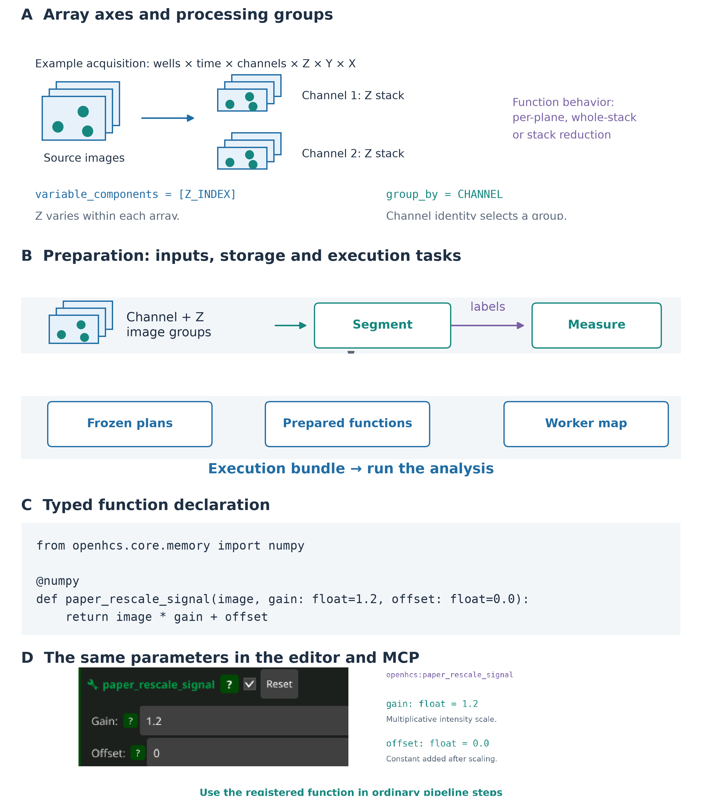{width=6in}

(III, A–B) Selected array-grouping and preparation details. (C–D) One custom
function declaration supplies typed parameters and defaults to both the editor
and MCP catalog. Supplementary Data 4 retains further compiler, output-routing,
importer and viewer illustrations.

```{=openxml}
<w:p><w:r><w:br w:type="page"/></w:r></w:p>
```

## Supplementary Figure 2. Translocation response and compartment eligibility

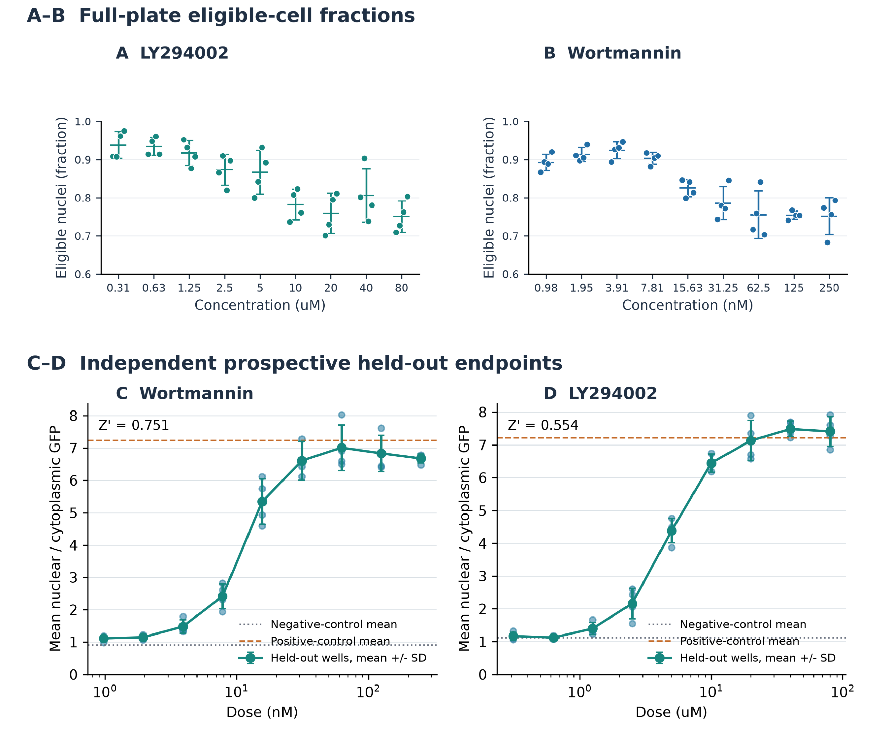{width=6in}

(A–D, upper block) Final BBBC013 full-plate analysis: LY294002 and wortmannin
responses, with the contributing-cell fractions below the same dose panels.
The agent selected the well-level median eligible-cell log2 nuclear/cytoplasmic
GFP ratio. All 96 wells include development wells. Dots are four wells per dose;
marks and whiskers show their mean and sample standard deviation.
(E–F, lower block) A separate prospective held-out trial uses well means of
cell-level nuclear/cytoplasmic GFP ratios, not the median log2 endpoint above.
Four development wells preceded pipeline freeze; held-out wells and controls
were disclosed only afterward. Control means and Z-prime use four independent
wells per condition. These are different authors and endpoints, not successive
stages of one run. Treatment labels support response evaluation; BBBC013 does
not supply manual segmentation truth.

Nuclear-repair and uncertain-compartment examples remain in the
[retained development sheet](../figures/slas/bbbc013_development_repair.png).
Their source proof and display settings are retained in Supplementary Data 8.

```{=openxml}
<w:p><w:r><w:br w:type="page"/></w:r></w:p>
```

## Supplementary Figure 3. Nuclear-instance evaluation and object separation

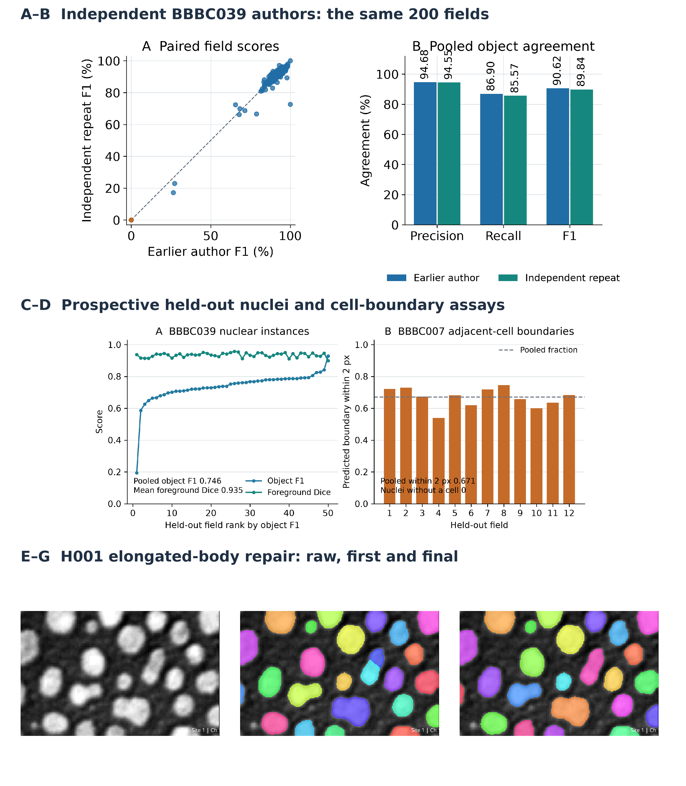{width=6in}

(A–B, upper block) Two independent BBBC039 authors evaluated on the same 200
fields. The repeat matched 20,207 of 23,615 reference instances, with 1,164
excess predictions and 3,408 misses; the earlier author matched 20,521, with
1,153 excess predictions and 3,094 misses. Intersection over union is at least
0.5. Pooled F1 is 0.898 and 0.906, respectively. Annotation-empty fields coincide
at the scatter origin. This comparison tests independent final methods, not a
controlled skill change or first-to-final repair.
(C–D, middle block) Separate prospective trials: BBBC039 object F1 and foreground
Dice on 50 held-out fields, and directed BBBC007 boundary support on 12 held-out
fields. Four development fields preceded each freeze. Boundary support is the
fraction of predicted boundary pixels within two pixels of a manual outline;
it does not establish object correspondence.
(E–G, lower block) H001 raw image, first segmentation and final segmentation at
one matched elongated-body region. Whole-image object F1 improved from 0.929
to 0.944 against a notebook-derived computational reference. That reference
is not manual biological annotation. Raw windows are 8–152 and 8–248, gamma 1.
The three blocks are separate datasets and trials; scores were computed only
after pipeline selection. Supplementary Data 7–8 retain reference identities,
full native overviews and per-field scores.

```{=openxml}
<w:p><w:r><w:br w:type="page"/></w:r></w:p>
```

## Supplementary Figure 4. Volumetric localisation and body separation

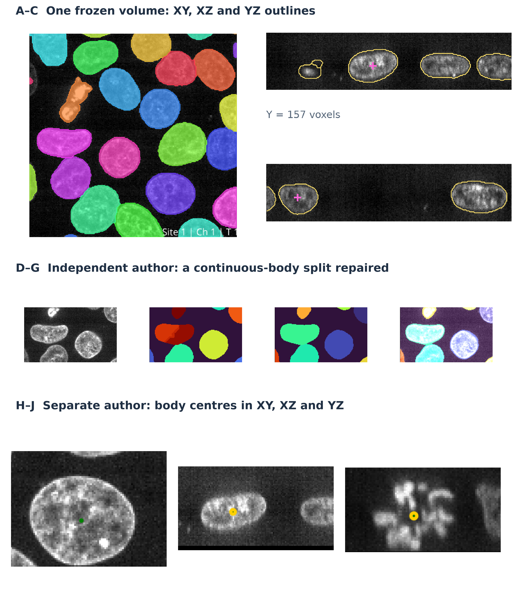{width=6in}

(A–C, upper block) The volume trial shown in main Figure 3: native XY and
post-freeze XZ/YZ intersections of the unchanged raw volume and saved labels.
Yellow outlines expose the masks and magenta marks show centres within half a
voxel of each plane. Raw contrast limits are shared across orthogonal planes.
The trial matched 14 of 15 manual centres within 10 voxels and all 15 within
the primary 30-voxel distance; mean matched error was 4.80 voxels. Eleven
predictions were unmatched to annotations whose completeness is unestablished.
(D–G, middle row, left to right) An independent author at Z index 36: raw,
first labels, repaired labels and combined view. Local seed suppression removes
an internal body split while retaining its neighbour. All 15 manual centres
matched within 20 voxels in post-freeze evaluation.
(H–J, lower row) A third author’s centres on raw source in XY, XZ and YZ.
Centre localisation and complete volume boundaries are distinct endpoints;
lobed-body identity remains uncertain. Categorical colours are not shared
identities across authors. No detector or reference score was rerun to lay out
these retained panels. Original captures and matching records are in
Supplementary Data 8.

```{=openxml}
<w:p><w:r><w:br w:type="page"/></w:r></w:p>
```

## Supplementary Figure 5. Retinal soma localisation across spatial scales

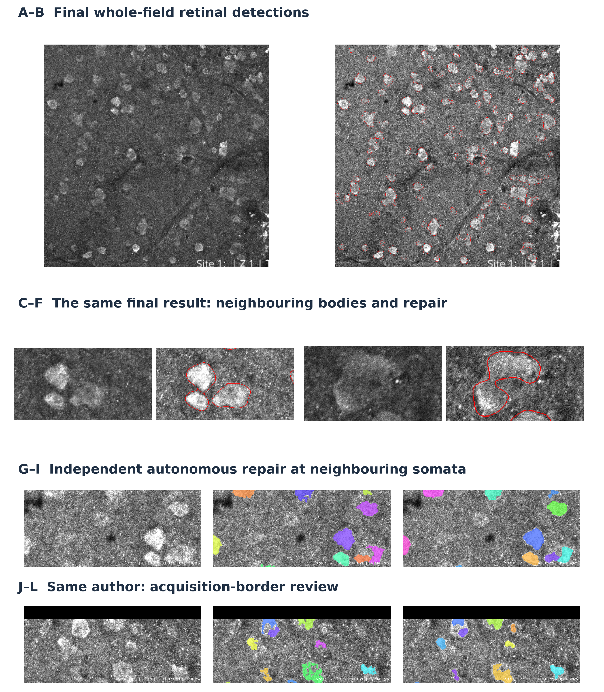{width=6in}

(A–B, upper block) Matched whole-field RBPMS raw image and final outlines from
the autonomous 102-instance result. (C–F, second row) Northwest neighbours
remain separate; the southeast partition becomes one continuous body.
The author detected a pair-merging regression and retained both corrections.
Raw and outlined views use different stretches at matched positions.
(G–I, third row) An independent autonomous author’s matched raw, initial and
repaired outlines at neighbouring somata. (J–L, lower row) The same independent
author at the acquisition border. Its raw window is 0–42, gamma 1.
These are separate autonomous trials, not a continuous repair history.
Faint profiles and crowded boundaries remain uncertain; no manual-count
accuracy is assigned. Assisted developmental examples and their original
0–55 window remain in the [retained development sheet](../figures/slas/retinal_development_repair.png).
Source: user-provided R0010 RBPMS-labelled retina; physical calibration is
unverified. Supplementary Data 8 retains pipelines, capture identities and
original display settings.

```{=openxml}
<w:p><w:r><w:br w:type="page"/></w:r></w:p>
```

## Supplementary Figure 6. Nuclear repair and actin-defined body support

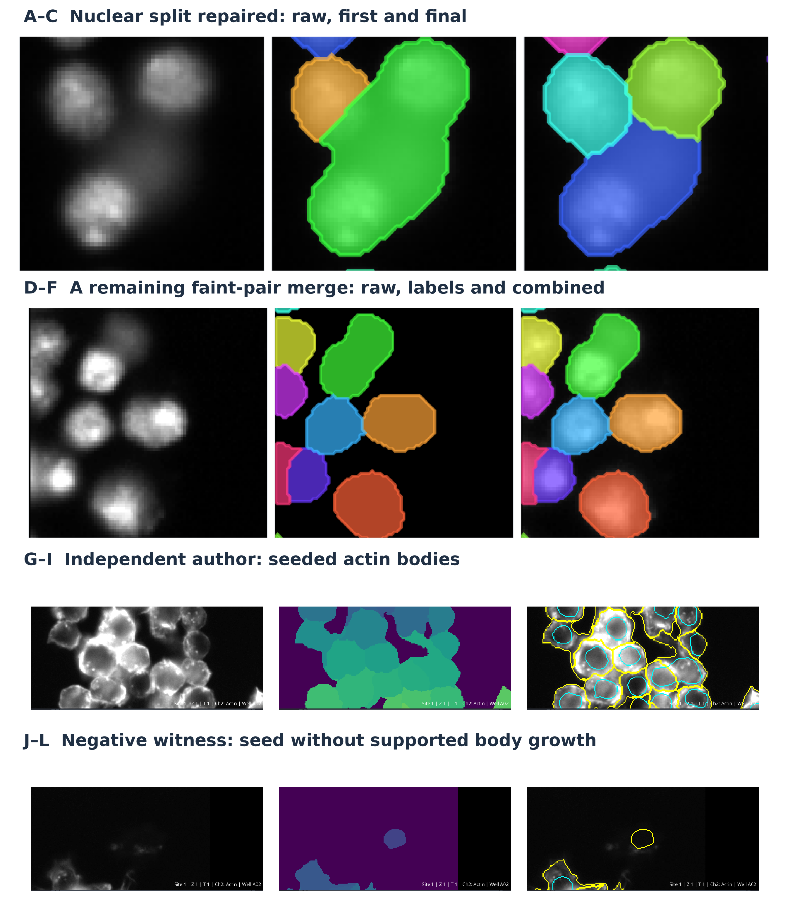{width=6in}

(A–C, upper row) Matched raw DNA, first and final overlays separate a joined
nuclear pair while retaining its compact neighbour; DNA window 0–255.
(D–F, second row) A final raw/labels/combined triplet shows a faint pair still
merged; window 0–151. The same author revised without reference feedback.
(G–I, third row) An independent author’s actin raw, labels and combined outlines
in a matched dense region. (J–L, lower row) A nuclear seed has no supported
actin body growth. The actin window is 0–104, gamma 1; these outputs belong to
a different author from the first two rows.
Nuclear separation and body extent require separate validation. Wider paired
DNA/actin views and full first/final records remain in Supplementary Data 8.
Source: BBBC007v1 A02, Sabatini laboratory, Whitehead Institute; CC0.

```{=openxml}
<w:p><w:r><w:br w:type="page"/></w:r></w:p>
```

## Supplementary Figure 7. Neurite morphology in a public field and laboratory mosaic

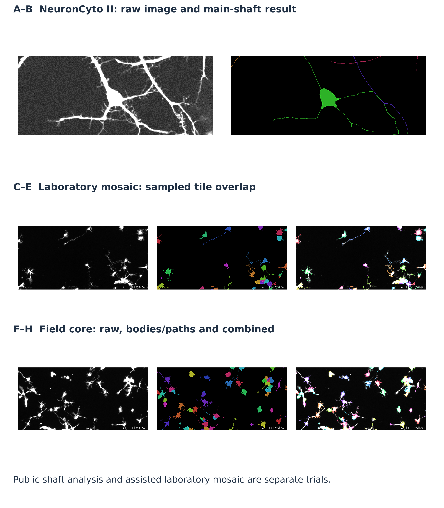{width=6in}

(A–B, upper block) NeuronCyto II process-channel raw image and the autonomous
shaft-focused result. Raw window 0–12, gamma 1, reveals processes while saturating
bright somata. Later revisions adding uncertain fine twigs are not the
representative result. Faint protrusions and neuron-specific crossing ownership
remain limitations.
(C–E, middle row) Laboratory dataset: overlap region in an acquisition-placed
nine-field mosaic, showing raw FITC, body envelopes plus process paths, and
their combination. (F–H, lower row) The same views in the lower-right field core.
Each triplet uses the same native crop. One pooled percentile pair is fitted
per complete nine-field channel stack before assembly. Supported long paths
remain visible; faint segments and crowded ownership remain incomplete.
This laboratory mosaic is assisted retained-context development, separate
from the unguided public trial and the field-by-field trial in main Figure 5.

The completed all-channel mosaic continuation produced 1,740 soma candidates
and 123,054 micrometres of computed outgrowth at the declared spacing.
Those aggregate outputs are not assigned to the earlier sampled panels here.
They are algorithmic measurements rather than a unique biological census or
ground-truth length. Supplementary Data 8 retains the separate continuation,
original captures and selected pipelines. The independent public junction
review remains in the [full shaft/junction sheet](../figures/slas/h004_assay_review.png).

```{=openxml}
<w:p><w:r><w:br w:type="page"/></w:r></w:p>
```

## Supplementary Figure 8. Laboratory treatment responses compared with MetaXpress

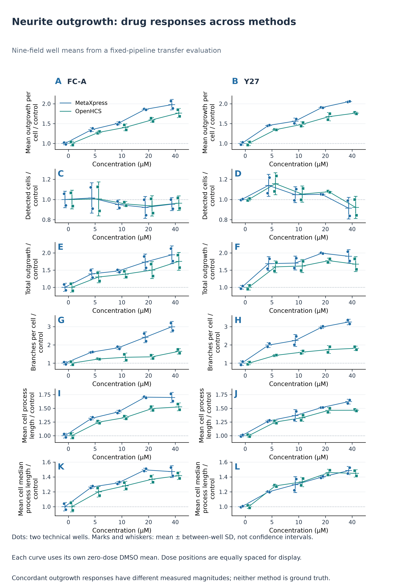{width=6in}

The existing commercial export contains 120 well summaries from two plates.
An evaluation-only source key links the coded images to their physical wells.
Following externally informed soma and tracing repairs, 20 drug and control
wells on one plate were analysed using one fixed repaired pipeline. All nine
fields in each well were analysed, giving 180 field summaries. The repaired
run retained DAPI channel w1 and calcein channel w2, with neurite response
and candidate admission settings of 30 and 0.03 after the earlier sensitivity
repair. The completed 180-field evaluation additionally used the repaired
ownership propagation and branch-counting backend. Detected-cell counts were
unchanged in every field relative to the preceding assisted checkpoint.
This count preservation concerns only the latest ownership/junction fix,
not the entire sequence of repairs from the original frozen recipe.
Source-file hashes, physical well identities and
the 1.3556 µm pixel calibration were checked against the retained source key.
This assisted-development evaluation measures treatment responses; it is not an
additional autonomous authoring trial.

Each FC-A and Y27632 (export label Y27) concentration has two technical-replicate
wells. Fold change is the treatment mean divided by the same curve's zero-dose
DMSO mean; zero-dose wells are not pooled across drugs. Mean outgrowth increased
at every nonzero concentration in both methods:

(A–B) Mean outgrowth per detected cell; (C–D) detected cells; (E–F) total
outgrowth; (G–H) branches per cell; (I–J) mean cell process length; (K–L) mean
cell median process length. Every endpoint is divided by the same drug
curve's DMSO mean. Dots show the two technical
wells at each concentration. Marks and whiskers show their mean and sample
standard deviation after division by the observed control mean; they do not
propagate uncertainty in that denominator or represent confidence intervals.
Dose positions are equally spaced for display, not a fitted concentration–response
model. Paired treatment panels use the same vertical scale. The plot and
numerical tables are generated from the same well measurements.

Both methods recover concordant positive biological responses: mean outgrowth
increases across the four nonzero doses for each drug, with different measured
magnitudes. OpenHCS estimates smaller fold changes at every nonzero concentration.
The magnitude difference did not narrow for every endpoint: relative to the
original frozen recipe, mean-process-length fold changes moved farther from
MetaXpress after repair. Closer outgrowth fold changes therefore do not imply
closer estimates for every morphological endpoint.
Each OpenHCS well endpoint is the unweighted mean of its nine field-level
measurements. Total outgrowth is therefore a mean field total, not unique
whole-well length.
The commercial endpoint is an existing well export whose exact site weighting
and software settings are not retained. The
[MetaXpress 6 Neurite Outgrowth guide](https://www.moleculardevices.com/sites/default/files/en/assets/training-material/dd/img/metaxpress-6-software-application-modules-neurite-outgrowth.pdf)
defines total outgrowth in micrometres with diagonal-length correction, primary
processes as outgrowths attached to cell bodies, and branches as branching
junctions rather than daughter-process counts. It does not specify how the
module distinguishes crossings from branches. These documented definitions
do not establish identical segmentation or topology for the retained export;
absolute lengths and counts are not treated as equivalent.
Within-method ratios avoid a constant unit conversion but do not remove those
measurement differences. Neither method is manual ground truth, and two
technical wells do not establish biological replication or significance.

OpenHCS process lengths describe the connected paths assigned to a
soma-adjacent root, including daughter branches, rather than individual
segments between graph junctions. Per-cell mean and median process lengths
are averaged within each field, including zero-growth cells, then across its
nine fields. Branches require at least three same-neuron paths and distinct
admitted image arms around the junction. Paths sharing one image corridor
and graph stars confined within a foreground cap do not add branch events;
resolved crossings are not automatically branches. These
definitions specify the OpenHCS measurements without asserting that the
commercial algorithm uses identical topology or aggregation.

The [joined physical-well table](personal_neurite_repaired_morphometry/joined_wells.csv)
and [treatment-effect table](personal_neurite_repaired_morphometry/treatment_effects.csv)
retain well identities, means, sample standard deviations, counts, raw deltas,
fold changes and fractional-change differences. Cell-count changes accompany
outgrowth to expose denominator changes without inferring toxicity. The
[source hashes](personal_neurite_repaired_morphometry/source_evidence.json) identify the
exact submitted pipeline, source key, commercial export and all 180 native
summaries. The comparison script processes tables only and does not tune images.
Overlapping fields are not deduplicated, so averaged field counts are not unique
whole-well neuron counts. Unselected wells are not filled with zero.
The [original frozen comparison](personal_neurite_baseline_morphometry/treatment_effects.csv)
is retained separately for before/after evaluation; it was not overwritten.

Additional [branch and primary-process totals](personal_neurite_branch_diagnostics/joined_wells.csv)
and their [treatment responses](personal_neurite_branch_diagnostics/treatment_effects.csv)
test whether smaller estimated branching fold changes are explained by the cell denominator.
At 40 µM, total-branch fold changes are 1.65 versus 3.01 for FC-A and 1.73
versus 3.03 for Y27632 (OpenHCS versus MetaXpress). Branches per primary
process likewise give smaller estimated fold changes: 1.31 versus 2.48 and 1.29 versus
2.23, respectively. The difference therefore persists without a cell-count
denominator. OpenHCS totals are means of field totals, and its branch/process
endpoint is the mean of the nine field ratios. The commercial comparison
uses ratios of exported well totals; its internal site weighting and primary
process definition remain unspecified. These diagnostic ratios are not proof
of equivalent topology or of which method is more accurate. Their
[source record](personal_neurite_branch_diagnostics/source_evidence.json)
identifies the same completed assisted evaluation, not an additional autonomous trial.

The completed repair does not support the earlier explanation of excess
branches in both cohorts. OpenHCS branches per cell in Y27632 control and
40 µM wells were 1.417 and 2.573, versus MetaXpress's 1.283 and 4.182;
corresponding FC-A values were 1.628 and 2.684, versus 1.471 and 4.408.
Thus control counts were approximately 10–11% higher while treated counts
were 38–39% lower. The difference in estimated branching fold changes reflects
lower measured counts in treated wells, not merely higher control counts.
Without spatial tracing truth, remaining branch
recall, neurite assignment and differences between measurement definitions
cannot be distinguished. These results are from the completed assisted
evaluation, not a fresh autonomous success.

```{=openxml}
<w:p><w:r><w:br w:type="page"/></w:r></w:p>
```

## Supplementary Figure 9. Total speedup by workflow and assigned sample count

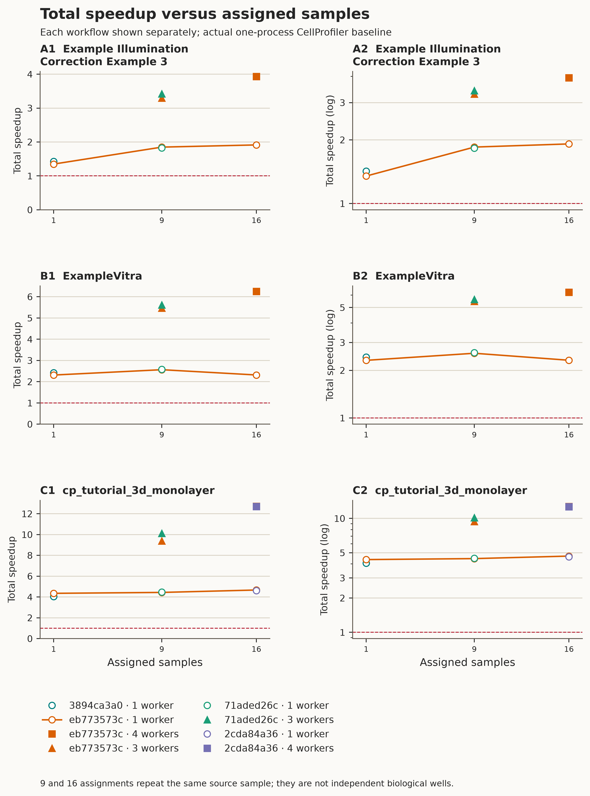{width=6in}

(A1–A2) Illumination correction Example 3; (B1–B2) Vitra;
(C1–C2) 3D monolayer. Left and right columns present the same measurements on
linear and logarithmic axes. Each point is the ratio of the median total time
for one stock CellProfiler process to the median OpenHCS total time, from three
measured repetitions. Colour identifies the production revision; marker shape
identifies the OpenHCS worker count. Lines join only observations of the same
workflow, revision and worker configuration, never different capture heads.

The earlier revision `eb773573c` supplies the measured 1, 9 and 16-assignment
series for these three workflows. Revision `d8678dbd4` supplies matched eight-assignment
observations with one and two workers for all three workflows, with its own
same-revision single-assignment observations. The later nine-assignment record at `71aded26c`
supplies one- and three-worker observations for all three workflows; the later
sixteen-assignment record at `2cda84a369` supplies one- and four-worker
observations for the 3D monolayer only. The current full-cohort revision
`3894ca3a0` supplies one-assignment, one-worker observations, not a current
multiworker sweep. Two-, three- and four-worker captures have different revisions,
assignment counts and cohort sizes; they are not a single matched 1–4-worker sweep.
Eight, nine and sixteen assignments repeat each workflow's existing source sample;
they are not independent biological wells. No averages across unlike workflows
or revisions are used here.

Execution includes worker coordination, saving, plate exports and finalization.
Total includes disjoint compile and execute client submit/wait phases. Endpoint,
library and kernel readiness and subsequent scientific comparison are outside
the clocks; native total excludes one-time pipeline loading and JVM startup.
The different revisions and workloads remain separate qualified checkpoints.
Exact ratios, independent-CellProfiler-process controls and the separate
single-core amortization plots are linked in Supplementary Data 3. These selected
workflows do not replace the full single-sample cohort of main Figure 6.

```{=openxml}
<w:p><w:r><w:br w:type="page"/></w:r></w:p>
```

## Supplementary Figure 9 (continued). Matched worker comparisons

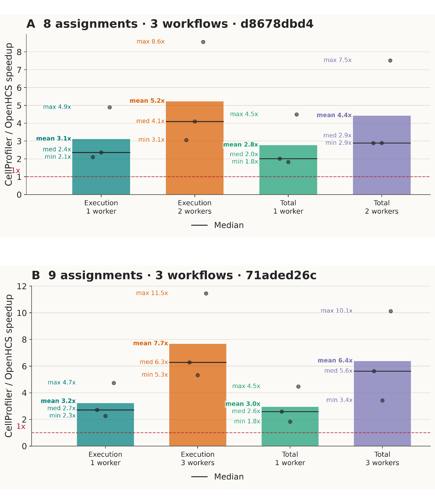{width=6in}

(A) Eight assignments of three workflows on revision `d8678dbd4`: one versus
two OpenHCS workers. (B) Nine assignments of the same three workflow identities
on revision `71aded26c`: one versus three OpenHCS workers. Within each row, execution
and compile-plus-run total are separate groups. Each dot is one workflow's
measured ratio against one actual stock CellProfiler process on the same
assignments. Bars give arithmetic means, black lines medians, and annotations
the minimum, median, mean and maximum. Rows do not share a revision or
cohort and are not pooled. Warmup and three measured repetitions passed each
workflow's declared-output comparisons. Repeated assignments are computational
replicates, not biological replicates.

```{=openxml}
<w:p><w:r><w:br w:type="page"/></w:r></w:p>
```

## Supplementary Figure 9 (continued). Four-worker comparison

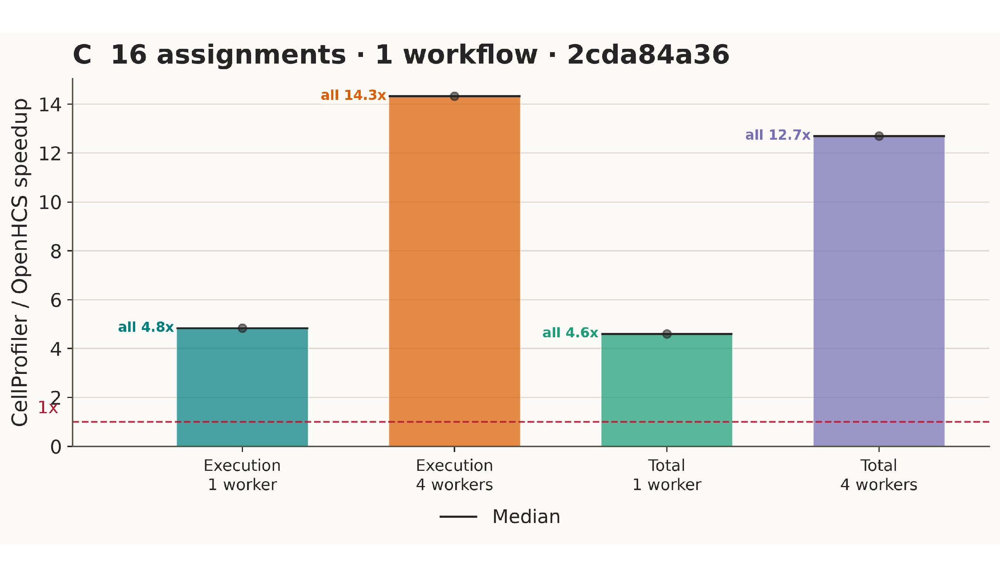{width=6in}

(C) Sixteen assignments of the 3D monolayer workflow on revision `2cda84a369`:
one versus four OpenHCS workers, with execution and total measured separately
against one actual stock CellProfiler process. There is one workflow, so
minimum, median, mean and maximum coincide and are marked “all”. This capture
does not extend the eight- or nine-assignment records into a common scaling sweep.

```{=openxml}
<w:p><w:r><w:br w:type="page"/></w:r></w:p>
```

## Supplementary Figure 9 (continued). Individual workflow runtimes

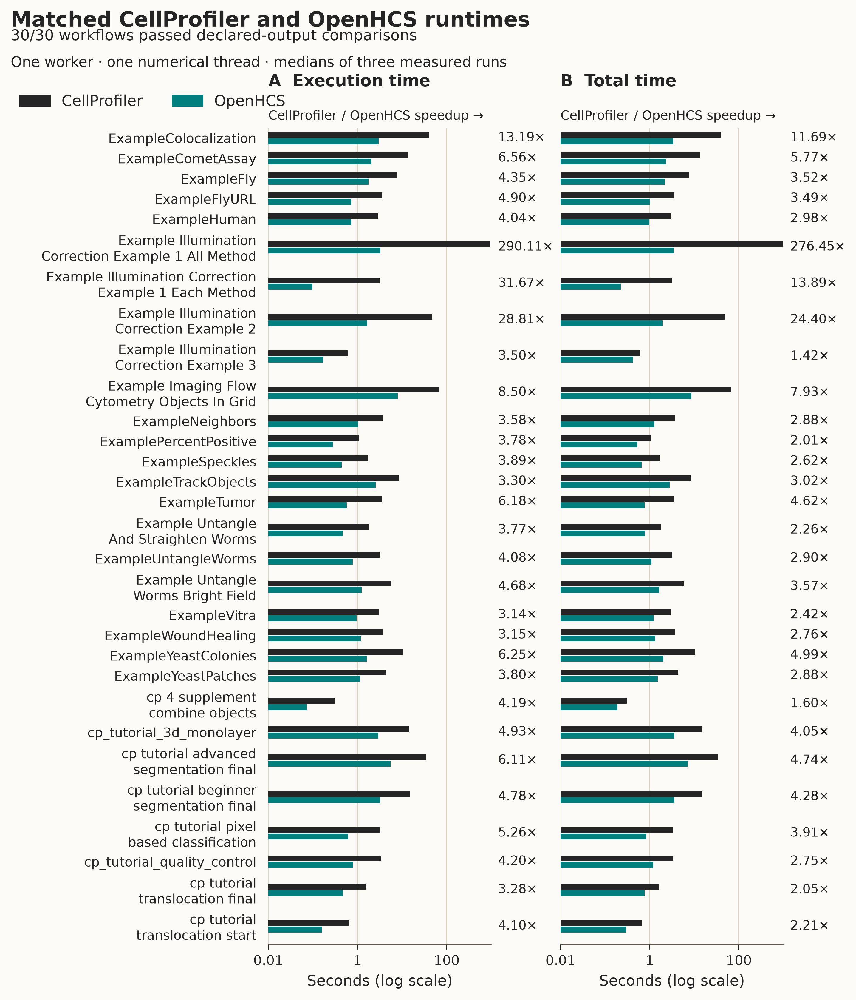{width=6in}

(A) Execution; (B) compile-plus-run total. Paired bars show measured median
CellProfiler and OpenHCS durations for each of the thirty workflows in main
Figure 2, with one worker and one numerical thread. Both panels use the same
logarithmic seconds scale. Row annotations give CellProfiler/OpenHCS ratios of
independent engine medians from three measured repetitions. These are measured
native clocks, not projected many-well baselines. All thirty workflows passed
their declared-output comparisons; that agreement does not establish biological
segmentation accuracy.

```{=openxml}
<w:p><w:r><w:br w:type="page"/></w:r></w:p>
```

## Supplementary Figure 9 (continued). Aggregate speedups on a linear scale

{width=6in}

The same workflow ratios, mean bars, median lines and extrema as main Figure 6,
on a linear vertical scale. The marked axis break keeps the bulk of the cohort
visible without excluding the large speedup observations. Each clock contains
the same thirty workflows; no many-worker measurements enter either distribution.

```{=openxml}
<w:p><w:r><w:br w:type="page"/></w:r></w:p>
```

## Supplementary Table 1. Reusable libraries and their roles

| Library | Role in OpenHCS |
| --- | --- |
| [metaclass-registry](https://github.com/OpenHCSDev/metaclass-registry) | Discovers classes implementing a shared interface and makes them available for selection. |
| [python-introspect](https://github.com/OpenHCSDev/python-introspect) | Reads a function's parameters, types, defaults and documentation. |
| [ObjectState](https://github.com/OpenHCSDev/objectstate) | Tracks editable settings and resolves shared defaults and local overrides. |
| [pyqt-reactive](https://github.com/OpenHCSDev/pyqt-reactive) | Generates parameter controls and updates them as settings change. |
| [pycodify](https://github.com/OpenHCSDev/pycodify) | Generates editable Python representations and manages their imports. |
| [ArrayBridge](https://github.com/OpenHCSDev/arraybridge) | Converts arrays between supported libraries and manages their computational resources. |
| [PolyStore](https://github.com/OpenHCSDev/PolyStore) | Reads, writes and streams data through supported storage interfaces. |
| [ZMQRuntime](https://github.com/OpenHCSDev/zmqruntime) | Coordinates communication, startup, shutdown and progress between processes. |

```{=openxml}
<w:p><w:r><w:br w:type="page"/></w:r></w:p>
```

## Supplementary Data 1. CellProfiler workflow comparison

The [archived single-sample timing plot](../figures/slas/figure2_historical_timings.png)
retains the May observations and their unequal clock boundaries. It is linked
as historical evidence, not part of the current figure sequence or the final
matched speedup comparison.

### Import, export and comparison methods

Imported `ExportToDatabase` modules run once per plate after image-group processing. They collect the selected images, objects, measurements, relationships, thumbnails and grouping information into CellProfiler Analyst tables [@Jones2008]. The export produces a self-contained SQLite database and matching `.properties` files. Non-SQLite databases, custom filter rows, `.workspace` generation and some historical aggregation settings remain unsupported; unsupported requests fail or are identified in the compatibility documentation.

Automated testing for the OpenHCS 0.8.5 release checked execution of all 30 imported workflows and compared selected outputs for the 25 with retained CellProfiler-produced reference values. The continuous-integration (CI) job built installable packages from the release source and its dependencies on Linux with Python 3.12. It acquired the workflows and image sets at the revisions specified in the benchmark manifest, then compiled and executed each imported workflow through the execution server. Every OpenHCS analysis ran afresh. The historical release test required 30 successful execution records and no differences in its selected comparisons. Supplementary Data 1 preserves the per-workflow observations, run metadata and tested revision.

The historical release comparison selects exported values from CSV tables and CellProfiler Analyst SQLite tables and `.properties` files. Its image comparison selects files, including NumPy arrays, from native reference-output directories that contain images and no CSV files. This includes the NPY-only illumination workflow and the completed translocation tutorial's overlay alongside its SQLite measurements. Images accompanying CSV measurements in 14 historical profiles remain outside that release comparison. Absolute and relative tolerances are `1e-6` for numeric values and image pixels, with no pixels allowed outside tolerance; identifiers and categorical values are compared exactly after documented CellProfiler-compatible normalizations.

The subsequent matched performance evaluation retained the complete 30-workflow manifest and compared the declared table, database and image outputs in a warmup and three measured repetitions per engine. All 120 OpenHCS observations completed without declared-output differences against complete native CellProfiler runs. These current-source observations, their output inventories and their timing boundaries are separate from the historical release comparison and are retained in the [minimum-threefold integrated-main matched benchmark record](../../benchmark/results/matched_min3_integrated_main_20261007/README.md).

For the five workflows without file exports, terminal image or object-label exports were appended while preserving the original processing modules and settings. Native CellProfiler generated eight additional reference artifacts. A subsequent unified run compiled and executed all 30 workflows afresh and compared each candidate with its selected native reference values. Object labels were compared exactly after singleton-axis normalization; numerical images used the stated float tolerances. The unified run used OpenHCS 0.8.5 current source on Python 3.12.3 with NumPy 2.1.3 and SciPy 1.18.1. Native references used CellProfiler 4.2.8.1 on Python 3.9.25 with NumPy 1.24.4 and SciPy 1.9.0. Supplementary Data 1 links the export definitions, reference inventory, per-workflow comparisons and exact source identities separately from the historical release CI records.

The corpus contains 22 workflows and associated image sets from the official CellProfiler 3 examples repository, seven workflows and image sets from the official CellProfiler tutorials repository, and one workflow from the supplement to the CellProfiler 4 performance study [@CellProfilerExamples; @CellProfilerTutorials; @Stirling2021]. The CellProfiler project and the cited dataset contributors retain authorship and provenance for these materials. The retained manifest maps workflow names to pipeline and image locations; Supplementary Data 1-3 provide the corresponding comparison, coverage and throughput tables.


This supplement indexes source tables and evaluation records. Figure scripts
derive panels and plotted-row exports from the linked files; paths are relative
to this file.

The acquisition scripts pin the official CellProfiler examples to
`4972b59e670a4ae96c3d453803c92eeff378d054`, the official tutorials to
`264a8155da21a2d468051f78211bed2e580a8934`, and the CellProfiler 4 benchmark
supplement to `40abc2e600fd46b74c213999dd25c5245048dc92`.

### OpenHCS 0.8.5 release comparison

The release CI run executed all 30 workflows and supplied 25 reference-bearing
comparisons. A later unified current-source run, described below, supplied
reference-value comparisons for all 30 workflows in one execution.

The [preserved CI evidence](ci_official30_085/README.md) contains the observations,
summary, phase timings and suite metadata from the hosted Official30 job at
release commit `e867013a8eb188edcc63b5b0cdfd06f42a99b409`.
[The successful job](https://github.com/OpenHCSDev/openhcs/actions/runs/34445574926/job/102769520329)
built candidate packages and executed all 30 imported workflows through ZMQ on
Linux with Python 3.12.14. Every OpenHCS execution was uncached; native
CellProfiler outputs came from the committed references.

The [per-workflow observations](ci_official30_085/observations.csv) report
successful execution and zero comparison differences for all 30 cases. The
[reference inventory](ci_official30_085/reference_inventory.csv) identifies
which cases contain values to compare:

| Selected native reference class | Workflows | Value comparisons |
| --- | ---: | --- |
| CSV measurements | 21 | Measurement tables |
| SQLite and CellProfiler Analyst properties | 3 | Database tables and properties; one also has an overlay image |
| NPY-only illumination output | 1 | Image pixels |
| No retained value files | 5 | Execution checks only |

Image comparison selects output directories containing images and no CSV files.
This selects two workflows: the AllMethod illumination array and the completed
translocation tutorial's overlay alongside SQLite measurements. The advanced
segmentation tutorial's five illumination arrays are source inputs outside its
reference-output directory. Images saved alongside CSV measurements in 14
profiles are outside image comparison. Numeric comparisons use absolute and
relative tolerances of `1e-6`, with no pixels allowed outside tolerance.

The records retain per-case comparison outcomes and timing, rather than raw
candidate output trees or individual pixel-difference reports. The native
references' original dependency environments were not recorded. The evidence
index supplies source and test permalinks, checksums and the separate
14 September 2026 reference-inventory audit provenance.

### Unified 30-workflow value comparison

The [unified evidence directory](../../benchmark/results/official30_unified_value_comparison_20260916/README.md)
preserves one immutable run in which all 30 workflows were compiled and executed
afresh through isolated ZMQ execution endpoints. All 30 selected reference-value
comparisons were equivalent and reported zero differences. Its fresh
[reference inventory](../../benchmark/results/official30_unified_value_comparison_20260916/reference_inventory.csv)
contains 21 CSV profiles, three SQLite profiles and six image- or array-only
profiles. Image comparison executed for seven workflows, including the completed
translocation overlay compared alongside its SQLite values.

The [observations](../../benchmark/results/official30_unified_value_comparison_20260916/observations.csv),
[phase timings](../../benchmark/results/official30_unified_value_comparison_20260916/phase_timing.csv),
and [summary](../../benchmark/results/official30_unified_value_comparison_20260916/summary.csv)
retain the comparison results. The original observations identify the candidate
as OpenHCS 0.8.5 and retain endpoint, executable and submitted-pipeline provenance.
The full run-environment and suite-metadata records were not retained in this
archive; its exact candidate source commit and Python, NumPy and SciPy versions
cannot be established from those observations. The selected native references'
original dependency environments are likewise not established by this bundle.
Environment identities from later matched runs do not supply this missing
historical provenance.

### Five-workflow image and object-label exports

Five source workflows compute images or objects without exporting files. The
[export-extension manifest](../../benchmark/manifests/official30_value_completion_20260914.json)
selects versions of those workflows with terminal exports added. Its generated
pipelines retain the original processing modules and settings. Native CellProfiler
produced the exported references; OpenHCS processed the same scoped inputs.

| Workflow | Exported values compared | Result |
| --- | --- | --- |
| Combine objects | Combined-object labels | Exact label agreement |
| Translocation starter | Nuclear labels | Exact label agreement |
| Illumination Example 1, EachMethod | Corrected green image | Float-tolerance agreement |
| Illumination Example 2 | Uncorrected, small-block-corrected and large-block-corrected nuclear labels | Exact agreement for all three label images |
| Illumination Example 3 | Polynomial-corrected and convex-hull-corrected images | Float-tolerance agreement for both images |

The [per-artifact comparison table](../../benchmark/results/official30_value_completion_20260914/label_aware_exact_commit_run/artifact_comparisons.csv)
records eight passing artifacts. All five integer label images agree exactly
after normalization of singleton dimensions. The three numerical images have
zero pixels outside the absolute and relative tolerances of `1e-6`; their
maximum absolute difference is `2.9802322387695312e-8`. The
[per-workflow observations](../../benchmark/results/official30_value_completion_20260914/label_aware_exact_commit_run/observations.jsonl)
link these comparisons to fresh candidate executions and the retained native
outputs.

The [run environment](../../benchmark/results/official30_value_completion_20260914/label_aware_exact_commit_run/run_environment.json)
identifies OpenHCS execution source `7ca8ecb8e73a882ef0f15616d57b00f0dabf73e0`,
Python 3.12.3, NumPy 2.1.3 and SciPy 1.18.0. Native references were generated
with CellProfiler 4.2.8.1 on Python 3.9.25, NumPy 1.24.4 and SciPy 1.9.0.
Each candidate ran through a fresh matching OpenHCS endpoint. Source revisions,
native-reference origin and endpoint identities are retained with the results.
These exported references are incorporated into the unified 30-workflow run;
the earlier five-workflow audit and release records retain their own protocols
and identities.

### Retained single-sample timing records

The separate [May single-process table](../../benchmark/results/labmeeting_20260513/official30_well_throughput/data/single_process_summary.csv)
contains one observation and one passing status flag per workflow, execution and
total-phase timings, ratios and the legacy accuracy field. Its native
ExampleWoundHealing timing is 900 s without a native completion flag, so that
row is excluded from timing comparisons. Empty fields remain as recorded.

The field `min_parity_accuracy` is 1.0 in all rows. It is the minimum Boolean
pass flag across a workflow's observations, including the five workflows without
reference values, rather than the fraction of matching measurements or pixels.
Times below are in seconds, rounded to five significant figures from the source
CSV. The full-precision values remain in that file. Native command and prepared
OpenHCS execution have different timing boundaries, described below. The other
columns sum each system's recorded benchmark phases. The ExampleWoundHealing
native values equal the timeout ceiling and are shown for source completeness;
that row is excluded from timing comparisons.

| Workflow | Native command | Prepared execution | Native phase sum | OpenHCS phase sum |
|----------------------------------------|-----------:|-----------:|-----------:|-----------:|
| ExampleColocalization | 48.936 | 3.4135 | 48.957 | 14.439 |
| ExampleCometAssay | 15.65 | 3.588 | 15.729 | 4.6023 |
| ExampleFly | 9.2186 | 1.6629 | 9.2536 | 5.7264 |
| ExampleFlyURL | 5.4078 | 0.59741 | 5.4323 | 4.6231 |
| ExampleHuman | 5.0468 | 0.56671 | 5.111 | 6.9859 |
| ExampleIlluminationCorrection_Example1_AllMethod | 23.846 | 0.2981 | 23.875 | 0.58255 |
| ExampleIlluminationCorrection_Example1_EachMethod | 4.9526 | 0.095801 | 4.9629 | 0.34526 |
| ExampleIlluminationCorrection_Example2 | 49.621 | 2.1512 | 49.632 | 2.5107 |
| ExampleIlluminationCorrection_Example3 | 2.5101 | 0.1649 | 2.5214 | 0.52152 |
| ExampleImagingFlowCytometryObjectsInGrid | 74.157 | 17.18 | 74.417 | 98.545 |
| ExampleNeighbors | 4.9983 | 0.48576 | 5.0753 | 10.148 |
| ExamplePercentPositive | 2.902 | 0.37111 | 2.917 | 1.6261 |
| ExampleSpeckles | 3.7868 | 0.61381 | 3.7957 | 1.3598 |
| ExampleTrackObjects | 10.919 | 1.9784 | 11.15 | 2.9135 |
| ExampleTumor | 5.2672 | 0.7298 | 5.3182 | 1.183 |
| ExampleUntangleAndStraightenWorms | 3.9757 | 0.61834 | 3.9825 | 1.0111 |
| ExampleUntangleWorms | 3.7546 | 0.51335 | 3.7662 | 0.98515 |
| ExampleUntangleWormsBrightField | 8.755 | 1.7514 | 8.764 | 2.947 |
| ExampleVitra | 4.7962 | 0.75417 | 4.87 | 6.2844 |
| ExampleWoundHealing | 900 | 1.0723 | 900 | 1.4437 |
| ExampleYeastColonies | 15.848 | 2.3553 | 15.943 | 11.971 |
| ExampleYeastPatches | 7.4914 | 1.0139 | 7.5774 | 2.3141 |
| cp4_supplement_combine_objects | 2.0789 | 0.020116 | 2.0855 | 0.25762 |
| cp_tutorial_3d_monolayer | 16.866 | 3.5231 | 16.929 | 4.5869 |
| cp_tutorial_advanced_segmentation_final | 39.617 | 9.8382 | 40.19 | 13.865 |
| cp_tutorial_beginner_segmentation_final | 18.625 | 3.3373 | 18.831 | 33.811 |
| cp_tutorial_pixel_based_classification | 5.1064 | 0.65263 | 5.1965 | 1.2405 |
| cp_tutorial_quality_control | 5.3916 | 0.4757 | 5.7724 | 1.0273 |
| cp_tutorial_translocation_final | 3.5821 | 0.31336 | 3.6072 | 0.9035 |
| cp_tutorial_translocation_start | 2.4696 | 0.13163 | 2.4866 | 0.38448 |

The 29 workflows retained after the wound-healing exclusion have a median native
command duration of 5.39 s and median prepared OpenHCS execution of 0.653 s.
The per-workflow execution-phase ratios have a minimum of 4.03 and median of
7.39. Summed-phase ratios have a median of 3.42; five workflows have a larger
OpenHCS phase sum. These summaries use the unequal intervals defined below.

### Timing boundaries in the archived harness

The results table first entered Git in commit `f58bca4e9` on 13 May 2026.
In that source tree, the native adapter's execution timer surrounds the complete
CellProfiler subprocess. OpenHCS initialization and compilation are timed
separately, before its prepared-execution call. The native-command/OpenHCS-
execution ratio therefore combines startup and execution on one side with
prepared execution on the other.

The collector computes total-phase time by summing the recorded phases. The
OpenHCS path also records benchmark validation and output-comparison work.
These sums are not equivalent cold-start or end-to-end analysis intervals.
The many-well projection multiplies the native command duration, including its
startup, by well count; it does not measure native persistent-worker throughput.
Original CSV field names, including `median_speedup`, remain unchanged as
historical record labels. The archived single-sample timing plot presents them as phase-time ratios.

The collector also supports cached reference results and can substitute the
configured timeout when a successful cached native reference lacks execution
timing. The summary's `n=1` counts comparison observations, not necessarily fresh
timed executions. This policy could account for a timeout-valued row, but the
retained summary alone does not establish which path produced it.

The committed source establishes these timer definitions. The separate timing
source audit document is not retained in this archive; the original run
environment and per-run phase traces still need recovery to establish the
executed snapshot. The subsequent matched comparison in Figure 2 uses separately
declared execution and total intervals with three measured observations per
engine; it does not reconstruct the missing historical timing provenance.

## Supplementary Data 2. Archived CellProfiler coverage

- [Module names and associated workflows](../../benchmark/results/labmeeting_20260513/official30_well_throughput/figures/module_coverage_cppipe_modules.csv).
- [Individual settings and recorded handling categories](../../benchmark/results/labmeeting_20260513/official30_well_throughput/figures/module_coverage_cppipe_settings.csv).
- [Processing registration and corpus membership](../../benchmark/results/labmeeting_20260513/official30_well_throughput/figures/module_coverage_absorbed_modules.csv).

These files describe the archived coverage report. Setting categories distinguish
bound parameters, artifact contracts, infrastructure, and intentionally ignored
settings. Registration or a handling category is not itself an output-equivalence
test. Module aliases and source/export roles differ between the tables, so their
category totals must not be added as mutually exclusive classes. They are not a
current-version compatibility matrix.

## Supplementary Data 3. Worker and memory measurements

### Retained measured panels and numerical tables

- [Current aggregate speedups, logarithmic view](../figures/slas/benchmark-publication/measured_benchmark_publication_log.png), using the same thirty workflows as main Figure 6 and the paired-runtime continuation of Supplementary Figure 9.
- [Every plotted assignment-count observation](../figures/slas/benchmark-publication/assignments/assignment_total_speedups.csv), including exact source revision, worker count, native and OpenHCS total clocks and their ratio.
- [Eight-assignment measured source record](../../benchmark/results/official30_matched_20261006/README.md), including the matched one-process baseline used for the two-worker comparison.
- [Retained nine- and sixteen-assignment paired clock panels](../figures/slas/supp_matched_scaling.png), with the original separate capture heads.
- [Single-core amortization: execution, total and paired nonexecution time](../figures/slas/matched_postgrid_20261006/single-core-amortization/measured_single_core_amortization.png).
- [Nine-assignment execution ratios](../figures/slas/matched_latestmain_nine_20261006/primary-execution/measured_execution_metrics_long.csv) and [total ratios](../figures/slas/matched_latestmain_nine_20261006/primary-total/measured_total_metrics_long.csv), with the [qualified source record](../../benchmark/results/matched_latestmain_nine_20261006/README.md).
- [Sixteen-assignment execution ratios](../figures/slas/matched_lastconsumer_20261006/primary-execution/measured_execution_metrics_long.csv) and [total ratios](../figures/slas/matched_lastconsumer_20261006/primary-total/measured_total_metrics_long.csv), with the [qualified source record](../../benchmark/results/matched_lastconsumer_20261006/README.md).
- Additional independent-CellProfiler-process controls: [nine-assignment execution](../figures/slas/matched_latestmain_nine_20261006/independent-cp-calibration-execution/measured_execution_seconds.png), [nine-assignment total](../figures/slas/matched_latestmain_nine_20261006/independent-cp-calibration-total/measured_total_seconds.png), [sixteen-assignment execution](../figures/slas/matched_lastconsumer_20261006/independent-cp-calibration-execution/measured_execution_seconds.png) and [sixteen-assignment total](../figures/slas/matched_lastconsumer_20261006/independent-cp-calibration-total/measured_total_seconds.png).
- [Archived May per-workflow throughput and memory plot](../figures/slas/figure2_benchmarks_by_workflow.png).

Single-core amortization uses one worker and one numerical thread, with actual
medians over three measured repetitions after warmup at 1, 9 and 16 repeated
assignments of one biological source sample. Connecting lines join observations.
OpenHCS nonexecution time is the median paired difference between total and full
server execution per assignment; it is not a kernel/runtime decomposition.
Those observations passed declared-output comparisons on revision `eb773573c`.
Their selected workflows were not reselected from the final single-sample rankings.
The [earlier three-workflow sixteen-assignment checkpoint](../../benchmark/results/matched_postgrid_20261006/README.md)
and its [passive-counter diagnostics](../../benchmark/results/matched_postgrid_20261006/diagnostics/3d-same-step-scaling-counter-comparison.json)
remain separate records. Increased system time, process swap and major faults
support a working-set/reclaim contribution; they do not identify an allocation
owner or establish that later fixes eliminate paging.

### Historical performance protocols

#### Matched scaling and archived comparisons

Historical single-core measurements at 1, 9 and 16 repeated source assignments separate execution from compilation and client coordination (the linked single-core amortization plots). Supplementary Figure 9 presents total-speedup observations by workflow, assignment count, worker count and capture revision, keeping the older same-revision series distinct from the later nine- and sixteen-assignment checkpoints. All primary ratios use one actual stock CellProfiler process. OpenHCS uses its built-in workers, including their coordination, saving, exports and finalization. Externally parallel CP processes are an additional calibration, not a native CellProfiler multiprocessing feature or the primary product baseline. Exact qualified clocks and ratios remain in the linked figure tables and original records; loss against ideal worker scaling is distinct from speedup over stock single-process CP.

The earlier analysis-focused throughput and memory measurements remain archived in Supplementary Data 3 and the archived per-workflow throughput/memory plot. Their configured worker and output policies differ from this output-complete matched evaluation, so their rates and memory values are not combined with the fresh timing distributions.

#### Archived protocols

Archived May development runs measured throughput and peak memory by assigning the same source images to multiple well identifiers, creating repeated analysis work. Queue depth specifies how many assignments were supplied per configured worker. Each condition has one recorded run per workflow. The retained rows report completed assignments but do not preserve worker-process traces or per-run output inventories.

Throughput varied the configured worker maximum over two, three and four,
with four assignments per worker. The memory sweep fixed four workers and
varied assignments per worker over one, two, three, four, six and eight.

Throughput uses execution time after initialization and compilation. The recorded configuration disables default saving of named results and return of detailed worker records, and requests removal of unused steps whose outputs are not saved. Supplementary Data 3 identifies these settings, the individual runs and the limits of their historical output-policy provenance. These rows characterize that archived analysis-focused workload, not the current output-complete CellProfiler translation. Measurements cover CPU execution on local or explicitly mounted image sources; GPU and cloud or network-storage performance were not measured.

The archived single-sample benchmark specifies one thread/core, CPU-only execution and no batching, with one retained comparison observation per workflow. The harness committed with the tables times the native CellProfiler command from subprocess launch through completion, including its startup. It times OpenHCS execution after initialization and compilation. Total-phase values also include different work, including benchmark validation and comparison on the OpenHCS path. The archived single-sample timing plot and Supplementary Data 1 report these observations with their timer definitions; they do not establish a like-for-like speed comparison. The wound-healing native duration equals the 900-s timeout ceiling without an explicit completion flag and is excluded from timing statistics.

The supplementary package separates the release CI comparison records from the earlier performance measurements. Its software-snapshot table identifies the revision and evidence for each evaluation. Figure scripts regenerate panels from saved CSVs and record source and output checksums. Supplementary Data 6 links automated tests of workflow editing and pre-execution validation to their source and CI jobs.

- [Core-count sweep](../../benchmark/results/labmeeting_20260513/official30_well_throughput/data/core_scaling_well_throughput.csv).
- [Two-, three- and four-worker queue-depth conditions](../../benchmark/results/labmeeting_20260513/official30_well_throughput/data/wells_per_core_2c3c4c.csv).
- [Four-worker conditions with six and eight wells per worker](../../benchmark/results/labmeeting_20260513/official30_well_throughput/data/wells_per_core_4c_6wpc_8wpc.csv).

The historical throughput analysis uses the measured two-, three- and four-worker rows, with four repeated-image
assignments per worker, for all 30 workflows. The runtime schedules each assignment
as a well; these are repeated inputs, not independent biological replicates.
Each row reports completion of every assignment. Throughput is completed
assignments divided by execution seconds; the derived
values match the source `wells_per_second` field. The one-worker condition used
one well and is not included in this fixed-queue-depth panel.

The co-committed sweep source sets `materialize_runtime_artifacts=False` and
`runtime_observation_mode=OMIT`, and requests pruning of unused unsaved-output
steps. These conditions measure the configured execution workload; they do not
establish throughput for every output-saving policy. The historical rows do not
retain the exact executed source revision, compiled plans, output inventories or
worker-process event traces. At the May presentation-source commit
`f58bca4e9`, `ExportToDatabase` was explicitly a pass-through stub rather than
the later SQLite exporter. It is therefore not defensible to read the archived per-workflow throughput/memory plot as
current output-complete throughput or to infer actual worker-process counts
solely from the configured worker labels.

The separate [current-API four-mode readiness probe](../../benchmark/results/paper_config_new_api_probe_20260923/translocation_four_modes_fork/README.md)
ran one Translocation workflow with its explicit TIFF, SQLite and CPA properties
outputs and verified one, two, three and four active worker PIDs from progress
events. It is not pooled into the archived per-workflow throughput/memory plot: it covers only one workflow, includes
different output work, and uses the ordinary completed-server timing boundary.

The separate [matched genuine-well Translocation pilot](../../benchmark/results/matched_batch_concurrency_fork_20260923/README.md)
used two native CellProfiler jobs and two observed OpenHCS worker processes on
the same eight source wells. Three timed observations each had no TIFF or SQLite
value differences. Native invocation-to-completion makespans were 5.27--5.59 s;
OpenHCS completed-server jobs were 16.08--16.75 s, including 11.33--11.65 s
of plate-scoped SQLite export. The native processes persisted across observations,
while OpenHCS created workers per job. This one-workflow, different-lifecycle
pilot is not pooled into the archived per-workflow throughput/memory plot and does not establish general comparative
throughput.

A second [matched BBBC022 advanced-segmentation pilot](../../benchmark/results/matched_bbbc022_20260923_rc5/README.md)
used eight distinct wells (16 image sets), two native CellProfiler jobs and
two observed OpenHCS worker processes. One warm-up and one timed repetition
each emitted one SQLite database and seven CellProfiler Analyst properties
files on both sides. Native shards reconstructed their whole-batch outputs;
the OpenHCS value comparisons reported no SQLite or normalized-properties
differences, and no images were saved. The timed native two-job invocation
makespan was 206.459 s, versus a 189.933 s OpenHCS completed-server job. The
native process startup and OpenHCS compilation were excluded, but the job
boundaries and process lifecycles still differ. This single timed repetition
is retained as a matched-concurrency diagnostic, not a cross-system speedup
claim or an input to the archived per-workflow throughput/memory plot.

Each row retains its workflow, worker count, assignment count, completed-assignment
count, execution and total time, memory, status and serial CellProfiler projection.
The source CSV uses well terminology for the virtual-well assignment fields.
The projection multiplies the native single-sample command duration, including
startup, by well count; it does not represent a measured persistent or parallel
CellProfiler run. The source memory
column is named `peak_memory_mb`; the collector expresses MiB, converted to GiB
for the manuscript figure. Historical collector-version confirmation remains
listed in the author-review record.

[Benchmark figure provenance](../figures/slas/figure2_provenance.json) records source and
output hashes. Exact plotted observations accompany the figure as separate CSVs.
Run `python paper/figures/build_slas_benchmark.py` in the project environment to
regenerate them without rerunning the experiments.

The historical per-workflow measurements are shown in the archived per-workflow throughput/memory plot. Existing artifact
filenames retain their original identifiers so links do not depend on editorial
renumbering.

## Figure assembly and interface records

The consolidated supplement is regenerated by
[`build_slas_supplement.py`](../figures/build_slas_supplement.py), using the existing
`FigureSheet` placement and receipt owner. It verifies each reused artwork against
its original output hash, records editorial crop rectangles and writes PNG, PDF
and editable SVG together. Reflow removes repeated headings and caption prose;
it does not recompute scores or change scientific contrast or segmentation.

Complete explanatory and interface artwork remains available:
[runtime axes, function patterns, routing and scheduling](../figures/slas/runtime_composition.png),
[compiler preparation](../figures/slas/compiler_preparation.png),
[connected images, objects and measurements](../figures/slas/outputs_and_inspection.png),
[custom-function registration](../figures/slas/custom_function_extension.png),
[CellProfiler module-to-step translation](../figures/slas/cellprofiler_translation.png),
and [Fiji/napari image and ROI inspection](../figures/slas/inspectable_results.png).
The translation illustration aligns the public ExampleCometAssay pipeline with
12 imported function steps and its named-object relationships. The viewer
illustration retains separate Fiji and napari demonstrations, not comparable
segmentations of one sample. Full captures and source/output identities remain
with those original illustrations.

Supplementary diagram receipts identify the source declarations and generated
output hashes: [runtime composition](../figures/slas/runtime_composition_provenance.json),
[process architecture](../figures/slas/process_architecture_provenance.json),
[compiler preparation](../figures/slas/compiler_preparation_provenance.json),
[connected outputs](../figures/slas/outputs_and_inspection_provenance.json), and
[custom-function integration](../figures/slas/custom_function_extension_provenance.json).
Their generators are retained in `paper/figures/` alongside editable SVG and PDF
versions. The output figure also records the saved image, ROI and CSV identities.
Its corrected demonstration is distinct from the original recording in Figure 5.

The [custom-function capture record](../figures/slas/custom_extension_evidence.json)
retains registration and selection receipts, source identities and full native
screenshots from an isolated development session. The session includes the
catalog-refresh and selector-lifetime fixes recorded there. It demonstrates
registration and editor integration; the example function was not run on the
analysis dataset.

The [7 October current-main authoring record](../figures/slas/custom_extension_current_main_evidence.json)
retains a separate OpenHCS 0.8.7 [registration](../figures/slas/custom_extension_current_main_registration.json)
and [catalog description](../figures/slas/custom_extension_current_main_function_detail.json):
the unchanged custom source registered with gain 1.2 and offset 0.0 without
source patches. The isolated GUI launched, but its window/action catalogs
failed MCP decoding (`window_id`, `action_id`, `widget_id`); no new custom-step
form/code capture or code-document readback was established. Main Figure 1III
therefore retains the earlier custom-function form, alongside a separately
labelled normalization code example. Registration is not evidence of a new
GUI editing round trip or analysis execution.

The separate visual storyboard is not retained in this archive. The
[gallery capture record](../../website/assets/gallery/release-media-record.json)
owns the source identities, published hashes and demonstration descriptions for
the retained Fiji/napari panels. Figure 1II's main window and Figure 1III's
normalization code use captures from one OpenHCS 0.8.5 editing session. Its
[native interaction record](../figures/slas/authoring_verified_roundtrip_provenance.json)
contains the code/field round trip, widget observations and screenshot receipts.
The server inset is a separate OpenHCS 0.8.7 native capture of the ZeroMQ server browser
on an isolated display; its [original MCP receipt](../figures/slas/authoring_server_browser_verified_capture_provenance.json)
records the unmodified widget image and checksum. The browser lists observed
endpoints; the status ticks alone do not establish client/server version compatibility.
These captures are distinct from the original unattended agent run.

`paper/figures/build_slas_visual_story.py` checks the published media hashes and
records any UI-detail crop rectangles used in the shared-workflow figure and the linked Fiji/napari inspection illustration.
`paper/figures/build_slas_agent.py` additionally derives the two displayed step
labels from the original saved pipeline, without importing or executing it.

The linked CellProfiler translation illustration aligns the public ExampleCometAssay pipeline with its imported OpenHCS
steps. `paper/figures/build_slas_cellprofiler.py` derives the module sequence,
function names, repetitions and named-object parameters from the source pipeline
and current importer. The [translation receipt](../figures/slas/cellprofiler_translation_provenance.json)
records the source and generated workflow, including a Python round-trip check.

## Supplementary Data 4. Recorded agent workflow

The [original evaluation record](../../website/assets/agent/cold-start-workflow-record.json)
contains the client and model identity, software commits, two-channel input
manifest, exact prompt, authorization, tool-trace counts, timings, completion
checks, output summary, and viewer checks. Evidence paths in that record resolve
relative to `website/assets/agent/`; original absolute runtime paths describe
the recorded machine and are not portable download locations.

The record separately identifies post-run software corrections and a later
viewer replay. The original demonstration retains its input pixels and uncut recording, with
checksums in [its provenance record](../figures/slas/figure3_provenance.json).
The run evaluates workflow completion and inspection; it contains no manually
annotated segmentation-accuracy score.

### Errors and recovery in the original agent run

Of 140 attempted MCP calls, one failed at the tool-call level and 139 returned
completed responses. Thirty of those responses reported an operation error.
The table counts calls, including repeated attempts, rather than distinct bugs.
It is checked against the original event log and its recorded SHA256 by
`paper/review/slas-panel-20260910/audit_agent_trace.py`.

| Operation | Calls | Reported issue |
|----------------------------|---------:|--------------------------------------------------------------|
| Code-document validation | 17 | Preset imports/construction, document structure or configuration types |
| Configuration-schema discovery | 5 | Requested schema name was not exposed |
| Internal-symbol discovery | 1 | Requested symbol was outside the curated namespace |
| Result-file query | 3 | Invalid query target |
| Code-document retrieval | 1 | Requested window had no registered code-document reader |
| UI state query | 1 | Bridge timeout |
| UI action | 1 | Another mutating operation was running |
| Apply-operation receipt | 1 | Confirmation was required; change not applied |

Thirteen of the 17 code-validation calls attempted to construct a preset through
unavailable names or attributes. The agent then authored the two steps using
registered functions. Subsequent validation exposed incorrect document structure
and configuration types; event `item_81` records successful validation.
The separate failed tool call requested `init` instead of the accepted
`init_plate` operation. Compilation, execution, viewer inspection and final
pipeline retrieval are identified by their event IDs in the evaluation record.

### Original and later result summaries

These are the separately recorded original analysis and later corrected
demonstration on the same public field. The original outputs and video retain
their original identity; the later record identifies its own pipeline and
execution hashes.

| Recorded output | Original OpenHCS 0.7.13 | Later OpenHCS 0.7.14 |
|----------------------------------------|-----------------------------:|-----------------------------:|
| Neurons | 9 | 9 |
| Nuclei | 10 | 10 |
| Branches | 8 | 6 |
| Graph paths | 25 | 24 |
| Total outgrowth pixels | 1,982 | 1,865 |

Visual review identified a clustered neurite crossover classified as branching.
The later record reports one resolved crossover after the graph-extraction
correction. Inspection of the retained ROI files also found two cell-body
objects at the bottom soma and three nuclear objects in the same region.
The table above preserves the separately recorded run summaries.

### Current-source replay after algorithm development

A separate OpenHCS 0.8.5 replay used the same two public images with
nuclear-supported soma detection and soma-rooted path assignment. It produced
eight neuronal cell bodies, eight nuclei, 18 processes, two branch events,
one resolved crossover and 24 graph paths. The eight per-cell table totals
agree with the graph distance features and sum to 2556.137 pixels under unit
spacing. The [current replay summary](current_neurite_replay_summary.md)
identifies its execution, saved source and native receipts separately from
the original demonstration and the OpenHCS 0.7.14 correction.

### Published manual-tracing references

The [NeuronCyto II publication](https://doi.org/10.1002/cyto.a.22872) supplies independent measurements
for image 1 in its supplementary files 8–10. The two input TIFFs used here are
byte-identical to `CrossOvers_Images/1_w1.tif` and `1_w2.tif` in the public
`Testing image.zip` archive. The checksums are listed in the original run record.

| Published reference | Image 1 entry | Source file |
| --- | --- | --- |
| Manually traced neurons | Eight per-cell entries | Supplement 9 |
| Neurite length by branch order | Primary 3,633.672; secondary 198.929; tertiary 0; total 3,832.601 | Supplement 8 |
| Crossover count | Three crossovers; NeuronCyto II resolved two | Supplement 10 |

Lengths above retain the numerical units of the source tables. The eight
per-cell reference lengths are 426.82, 172.375, 751.962, 395.04, 669.783,
343.629, 587.841 and 485.152. These entries give a reference against which to
investigate the nine reported neurons. Spatial cell matching, measurement-unit
alignment and agreement on the definition of neurite length are needed before
computing per-cell accuracy. The public testing archive contains the images;
downloadable manual trace coordinates have not been located. The published
crossover count and the OpenHCS branch count measure different quantities.

The [reference audit](neuroncyto_reference_audit.md) records the source links,
file checksums and ROI identifiers. These measurements were examined after the
recorded agent run and were not supplied to the agent during authoring.

### Intermediate correction recorded on 15 September 2026

Before the current-source replay, a separate GUI/MCP rerun (execution
`b2a64589-6fc1-4ac2-8b2b-551818f6273b`) used the same field and pipeline
settings. Width-scale nuclear peak suppression preserved the bottom nucleus
as one object, and the filled neuron artifact was derived from final rooted
trace ownership rather than earlier secondary propagation. The run produced
eight nuclei and eight cell bodies, including one body at the bottom soma.
Native viewer captures showed matching filled and thin-trace ownership at the
two reviewed crossings, and total measured outgrowth was 1860 pixels. The audit
records the execution identity, ROI locations, capture checksums and test
results. This retained intermediate result preserves the development sequence;
the current-source replay above supplies the current findings.

### Exact task prompt

The following text is taken from the original evaluation record. Absolute paths
identify that recorded session's input and output locations.

> The folder /home/ts/code/projects/openhcs/mcp_outputs/website-agent-demo/candidate-20260804-13/plate contains field 1 from the public NeuronCyto II crossover neurite-outgrowth assay. The W1 plane is the neuronal cell-and-neurite signal, and the W2 plane is the soma/nuclear signal. Treat both planes as biological well/image id 1.
>
> Using only the OpenHCS MCP and the connected OpenHCS desktop, build a compact but biologically meaningful pipeline that normalizes the raw channels, enhances dim neurites, segments nuclei and neuronal cell bodies, assigns neurite outgrowth to individual neurons, and measures per-neuron morphology and topology. Save reviewable images, object ROIs, spatial-graph paths, SWC morphology, and measurement tables under /home/ts/code/projects/openhcs/mcp_outputs/website-agent-demo/candidate-20260804-13/outputs, and open the results in Napari on port 5613.
>
> Start by inspecting the folder and confirming its axes and channel identities. These exported TIFF containers each expose their own native channel coordinate, so declare the authoritative Source Bindings projection from the start: keep both planes in biological well/image id 1 and preserve their physical filename provenance, while projecting W1 and W2 as distinct biological channels 1 and 2. Use registered OpenHCS functions or presets, not repository/source inspection or a new custom function. Leave the finished workflow visible and editable in the desktop UI. Keep the ZMQ Server Manager and its granular execution progress visible while the pipeline runs. Validate and compile before running, inspect the structured measurements and persistent outputs, and verify the settled Napari viewer state.
>
> Make the final viewer scientifically legible rather than showing every intermediate mask at once: retain an enhanced neuronal signal as context, show the unified neuron labels in which each cell body and its assigned neurites share one identity, show the spatial-graph path layer, hide redundant intermediate label layers, select the graph layer, and expose its feature table so branch identity, neuron assignment, distance, and tortuosity can be inspected. Return the editable generated Python plus a concise evidence summary. If validation, execution, or presentation fails, diagnose and repair it through MCP.
>
> This prompt authorizes writes under the stated output directory, changes to this isolated OpenHCS desktop session, pipeline execution, and launching Napari. Do not use shell commands or inspect repository files.

## Supplementary Data 5. Complex CellProfiler workflow imports

The [derived workflow report](complex_cellprofiler_workflows.md) lists every
imported step, its function names and call count for the advanced segmentation
and 3D monolayer tutorials. It links the source pipelines and generated editable
Python. The generator checks function identities and parameters after reloading
each document and records the hashes of the source pipelines, importer and
function implementations.

These are import and code-round-trip checks. Supplementary Data 1 separately
records the release CI executions and selected output comparisons for both
workflows.

## Supplementary Data 6. Workflow regression tests

The tests exercise representative authoring and validation cases alongside the
recorded UI demonstration. The following source files are pinned to commit
`7a7d21fee726905b87b9020cebf0bdfc350631f4`; these three test files are unchanged
from the OpenHCS 0.8.5 release commit.

| Tested behavior | Source tests |
| --- | --- |
| Nested and inherited configuration, parameter order, enum identity and function-step reconstruction | [Python generation tests](https://github.com/OpenHCSDev/openhcs/blob/7a7d21fee726905b87b9020cebf0bdfc350631f4/tests/unit/test_pycodify_formatters.py) |
| Rejection of incompatible memory types, grouping, required axes and stack configuration | [Compiled-function validation tests](https://github.com/OpenHCSDev/openhcs/blob/7a7d21fee726905b87b9020cebf0bdfc350631f4/tests/unit/test_funcstep_contract_validator.py) |
| Rejection of a function-detail request using a stale catalog revision | [Function-catalog tests](https://github.com/OpenHCSDev/openhcs/blob/7a7d21fee726905b87b9020cebf0bdfc350631f4/tests/unit/test_function_catalog_zmq.py) |

The [unit-test job](https://github.com/OpenHCSDev/openhcs/actions/runs/34870874969/job/104066142788)
passed while selecting `tests/unit` and `tests/core`. These focused tests include
controlled fixtures and isolate the stated behavior. The real-corpus execution
and value comparisons are provided by the separate Official30 job in
Supplementary Data 1.

## Supplementary Data 7. Prospective agent-authored assay validation

### Earlier prospective held-out results

The three prospectively authored workflows were applied without scientific parameter changes after their held-out partitions were disclosed (Supplementary Figures 2–3 and Supplementary Data 7). On the 50 BBBC039 fields, 4,733 of 5,720 reference nuclei matched at intersection over union at least 0.5. Pooled precision was 0.680, recall was 0.827 and object F1 was 0.746; mean field foreground Dice was 0.935. The workflow predicted 6,964 nuclei, 1,244 more than the reference, and the overlap diagnostic identified more split reference instances than merged predictions. The first blind pipeline therefore recovered nuclear foreground well while over-segmenting instances.

On the 12 BBBC007 fields, 29,450 of 43,875 relevant predicted adjacent-cell boundary pixels were within two pixels of a manual outline, a pooled fraction of 0.671. The workflow predicted 1,274 nuclei and 1,273 cells; every predicted nucleus overlapped a cell and one cell shared two nuclei. The manual outlines enclosed 1,082 closed nuclear interiors, while 12 open or frame-connected regions were excluded. Because the boundary score is directed from predictions to the outline union, it can reward an incomplete segmentation and does not establish object correspondence.

The BBBC013 run produced matched nuclear and cytoplasmic measurements for 14,262 cells across all 92 held-out wells. Wortmannin controls separated with Z-prime 0.751 and mean nuclear-to-cytoplasmic GFP ratios of 7.235 and 0.915 for positive and negative controls. LY294002 controls gave Z-prime 0.554 and means of 7.219 and 1.127. Both held-out dose series showed the expected increase in nuclear translocation. This result evaluates recovery of the assay response; BBBC013 does not supply manual masks with which to score segmentation.

The [validation report](independent_agent_validation.md) records the prospective
design, quantitative results, limitations, prediction-manifest hashes and
infrastructure findings for BBBC039, BBBC007 and BBBC013. Each trial used a
fresh gpt-5.6-sol author through the connected OpenHCS desktop and MCP surface.
Four development fields or wells were visible before the scientific pipeline
was frozen; held-out references and treatment metadata were then scored by the
typed evaluator in
[`benchmark/annotated_validation.py`](../../benchmark/annotated_validation.py).

The tracked [evidence index](independent_validation/README.md) links each exact
frozen pipeline and held-out score receipt. Prediction arrays and source-image
archives remain outside the paper package because the BBBC013 held-out result
tree alone contains 1,472 artifacts and 672 MB. The score receipts bind their
prediction manifests and the common corpus manifest by SHA-256. The
[preparation record](../../benchmark/annotated_validation_20260915.md) explains
the deterministic partitions, image normalization and evaluation definitions;
the preparation manifest records the downloaded source identities.

The prospective held-out panels in Supplementary Figures 2–3 are generated by
[`build_slas_independent_validation.py`](../figures/build_slas_independent_validation.py)
from the three score receipts. Its
[plot data](../figures/slas/independent_agent_validation_plot_data.csv) and
[provenance receipt](../figures/slas/independent_agent_validation_provenance.json)
retain the plotted rows and source/output hashes.

## Supplementary Data 8. Autonomous analysis evidence

### Original scientific briefs

The following retained scientific instructions are reproduced verbatim, including technical hints and operational restrictions. Identical texts are shared across trials; the [complete instruction archive](task_only_analysis/original_task_briefs.json) retains operational TASK files and exact byte hashes, mapping every retained trial to its documents. These instructions demonstrate the supplied task context, not usability with untrained scientists or proof that every instruction was followed.

The public assay briefs supply typed source bindings, catalogue tracks and output contracts. BBBC007 explicitly requests seeded cell segmentation; BBBC013 specifies nuclear versus cytoplasmic GFP measurement. Optional registered-custom tracks are also supplied, although their presence does not establish that an author used them. The H003 brief directs `SourceBindingsConfig` pairing. Neurite briefs request crossing review; the thick-shaft-only target was clarified later, not supplied retrospectively. Some historical packets contain resource caps subsequently removed from the programme. They are reproduced as history, not current requirements.

#### Brief 1: BBBC007_cell_boundaries blind OpenHCS authoring surface

Trials: `BBBC007_FRESH651_88`; `BBBC007_FRESH08_96`; `BBBC007_FRESH10_ROTATION_89`; `BBBC007_RETAINED_DEV13_94`; `BBBC007_FRESH19_95`; `BBBC007_FRESH26_96`.

Technical guidance: explicit source bindings, catalogue authoring tracks, typed artifact requirements and freeze procedure; optional custom-registration tracks where stated. These are not method-free briefs.

> \# BBBC007_cell_boundaries blind OpenHCS authoring surface
>
> Use this directory as the complete filesystem mount for the authoring agent.
> It contains inputs and public metadata only. Manual references, accepted metric
> values, and the trusted scorer are deliberately outside this tree.
>
> \## OpenHCS DSL contract
>
> - Source components: well, site, channel
> - Grouping metadata: `well`
> - Variable components: site
> - Source sets: 16
> - Source planes: 32
> - Source bindings: import `source_bindings_config` from `source_bindings.py`.
> - Preserve typed artifacts and materialization declarations in the frozen pipeline.
>
> The compiled dimensional transitions expected from the source declaration are:
>
> - source planes {well, site, channel} -> named channel bindings per source set
> - bound image arguments -> image/label artifacts retaining {well, site}
> - label artifacts -> object tables keyed by source set and object label
> - per-source artifacts -> declared materialization paths and plate summaries
>
> \## Authoring tracks
>
> - `catalog_seeded_cell_segmentation` (catalog): Use paired DNA and actin bindings to segment nuclei and seeded cells with catalogue functions and materialize both label sets. Expected artifacts: nucleus_labels, cell_labels.
> - `typed_sparse_jaccard_extension` (registered_custom): Register a typed sparse-reference comparison function, expose it through the same reflected UI/MCP catalogue, and materialize its metric table. Expected artifacts: sparse_metric_table.
>
> For a registered-custom track, add a typed function through OpenHCS registration
> so its signature drives the UI, Python document, MCP schema, and compiler. Do not
> inject code into a viewer or bypass the pipeline runtime.
>
> Freeze the final pipeline before the trusted scoring surface is mounted. Preserve
> every authoring attempt, compile refusal, generated source file, materialized
> artifact, MCP event record, and multi-percentile raw/result overlay.

#### Brief 2: Paired DNA and actin: full released sixteen-source collection

Trials: `BBBC007_FRESH19_95`.

The full retained instruction is reproduced below; no successful-run method has been substituted for it.

> Paired DNA and actin: full released sixteen-source collection
> \============================================================
> Use only the declared BBBC007 public images and source_manifest/source_bindings pairing. Inspect physical channels and source axes through MCP. Produce nucleus and seeded-cell labels, per-object tables and qualified image-level summaries across all sixteen sources using a complete PipelineDocument. Without verified physical calibration, retain pixel-native geometry.
> Choose your own method from measurements and packaged guidance. Preserve FIRST separately from scientific repairs and technical retries. Perform matched distributed raw/result/combined QA including faint, crowded, sparse and background controls. No method, settings, expected count or crops are supplied. Manual references, scorers, notebooks and earlier-agent outputs are withheld until scientific freeze.

#### Brief 3: BBBC013_u2os_translocation_bmp blind OpenHCS authoring surface

Trials: `BBBC013_REPEAT94`; `BBBC013_DEV02_94`; `BBBC013_DEV89`; `BBBC013_REMEDIATION02_89`; `BBBC013_FRESH13_88`; `BBBC013_FRESH15_96:01a10d07-78ae-7ac3-b98c-fd27a48fee37`; `BBBC013_FRESH15_96:01a10d7c-7c64-79f2-8988-3c12cb208ef8`; `BBBC013_FRESH20_88`; `BBBC013_FRESH23_96`.

Technical guidance: explicit source bindings, catalogue authoring tracks, typed artifact requirements and freeze procedure; optional custom-registration tracks where stated. These are not method-free briefs.

> \# BBBC013_u2os_translocation_bmp blind OpenHCS authoring surface
>
> Use this directory as the complete filesystem mount for the authoring agent.
> It contains inputs and public metadata only. Manual references, accepted metric
> values, and the trusted scorer are deliberately outside this tree.
>
> \## OpenHCS DSL contract
>
> - Source components: well, site, channel
> - Grouping metadata: `well`
> - Variable components: none
> - Source sets: 96
> - Source planes: 192
> - Source bindings: import `source_bindings_config` from `source_bindings.py`.
> - Preserve typed artifacts and materialization declarations in the frozen pipeline.
>
> The compiled dimensional transitions expected from the source declaration are:
>
> - source planes {well, site, channel} -> named channel bindings per source set
> - bound image arguments -> image/label artifacts retaining {well, site}
> - label artifacts -> object tables keyed by source set and object label
> - per-source artifacts -> declared materialization paths and plate summaries
>
> \## Authoring tracks
>
> - `catalog_translocation_measurement` (catalog): Segment nuclei/cells from paired DNA and GFP planes, measure nuclear versus cytoplasmic GFP, and materialize per-cell and per-well tables. Expected artifacts: nucleus_labels, cell_labels, cell_table, well_table.
> - `typed_plate_statistics_extension` (registered_custom): Register a typed plate-statistics function over the per-well table and materialize dose-response, Z-prime and replicate-SD V-factor outputs. Expected artifacts: assay_statistics, dose_response_table.
>
> For a registered-custom track, add a typed function through OpenHCS registration
> so its signature drives the UI, Python document, MCP schema, and compiler. Do not
> inject code into a viewer or bypass the pipeline runtime.
>
> Freeze the final pipeline before the trusted scoring surface is mounted. Preserve
> every authoring attempt, compile refusal, generated source file, materialized
> artifact, MCP event record, and multi-percentile raw/result overlay.

#### Brief 4: BBBC039_nuclei_segmentation blind OpenHCS authoring surface

Trials: `BBBC039_FRESH594_88`; `BBBC039_FRESH612_96`; `BBBC039_FRESH656_88`; `BBBC039_FRESH08_88`; `BBBC039_FRESH10_COVERAGE_96`; `BBBC039_FRESH13_88`.

Technical guidance: explicit source bindings, catalogue authoring tracks, typed artifact requirements and freeze procedure; optional custom-registration tracks where stated. These are not method-free briefs.

> \# BBBC039_nuclei_segmentation blind OpenHCS authoring surface
>
> Use this directory as the complete filesystem mount for the authoring agent.
> It contains inputs and public metadata only. Manual references, accepted metric
> values, and the trusted scorer are deliberately outside this tree.
>
> \## OpenHCS DSL contract
>
> - Source components: plate, well, site, channel
> - Grouping metadata: `plate, well`
> - Variable components: none
> - Source sets: 200
> - Source planes: 200
> - Source bindings: import `source_bindings_config` from `source_bindings.py`.
> - Preserve typed artifacts and materialization declarations in the frozen pipeline.
>
> The compiled dimensional transitions expected from the source declaration are:
>
> - source planes {plate, well, site, channel} -> named channel bindings per source set
> - bound image arguments -> image/label artifacts retaining {plate, well, site}
> - label artifacts -> object tables keyed by source set and object label
> - per-source artifacts -> declared materialization paths and plate summaries
>
> \## Authoring tracks
>
> - `catalog_instance_segmentation` (catalog): Author and visually debug a catalogue-only DNA instance-segmentation pipeline, then materialize one label image and object table per field. Expected artifacts: instance_labels, object_measurements.
>
> For a registered-custom track, add a typed function through OpenHCS registration
> so its signature drives the UI, Python document, MCP schema, and compiler. Do not
> inject code into a viewer or bypass the pipeline runtime.
>
> Freeze the final pipeline before the trusted scoring surface is mounted. Preserve
> every authoring attempt, compile refusal, generated source file, materialized
> artifact, MCP event record, and multi-percentile raw/result overlay.

#### Brief 5: H001 — bright-object segmentation

Trials: `H001_FRESH10_96`; `H001_FRESH586_96`; `H001_FRESH19_89`; `H001_FRESH22_96`; `H001_FRESH25_FOURTH_95`; `H001_FRESH25_ROTATION_94`.

Technical guidance: 2-D instance labels, pixel areas, counts and matched regional review; no segmentation algorithm or parameter values.

> \# H001 — bright-object segmentation
>
> Use only `image.tif` in this directory as scientific input. Build an OpenHCS
> PipelineDocument that produces a 2-D instance-label image, per-object area in
> pixels, and an image-level object count. Keep every attempt and execution
> receipt in your own trial output directory. Inspect the raw image and final
> labels together at identical native coordinates in several separated regions
> and more than one intensity window; record clear positives, misses, splits,
> merges and an explicit accept/reject decision. Do not infer physical units
> without verified calibration. Freeze the complete pipeline and outputs before
> evaluation.
>
> Do not inspect source notebooks, repository plans, external reference files,
> other agents' outputs, or public expected results. Use OpenHCS MCP for
> scientific inspection, execution and viewer operations; do not inject mouse
> or keyboard events.

#### Brief 6: H002 — 3-D centre detection

Trials: `H002_CAPACITY_DEV94`; `H002_FRESH651_95`; `H002_FRESH656_96`; `H002_FRESH10_89`; `H002_FRESH10_ROTATION_96`; `H002_FRESH13_89`; `H002_FRESH15_89`; `H002_FRESH22_89`; `H002_FRESH23_ROTATION_89`.

Technical guidance: a 3-D volume, z/y/x voxel-coordinate outputs and orthogonal multi-window review; no verified physical scale or detection parameters.

> \# H002 — 3-D centre detection
>
> Use only `image.ome.tif` in this directory as scientific input. It contains
> one greyscale 3-D volume with Z, Y and X axes. Use OpenHCS MCP to develop a
> pipeline that detects nucleus centres and saves a point table in `z,y,x`
> voxel coordinates, an image-level count and reproducible execution receipts.
> Inspect separated Z slices and orthogonal/raw-plus-point views at multiple
> intensity windows. Record obvious misses, unsupported detections, merged
> centres and an explicit accept/reject decision. No physical voxel spacing is
> verified; do not report micrometre distances. Freeze the pipeline and output
> before evaluation.
>
> Do not inspect source notebooks, repository plans, external reference files,
> other agents' outputs, or public expected results. Use OpenHCS MCP for
> scientific inspection, execution and viewer operations; do not inject mouse
> or keyboard events.

#### Brief 7: Paired nucleus and cell segmentation

Trials: `H003_POSTPAUSE_88`; `H003_FRESH656_96`; `H003_FRESH656_88`; `H003_FRESH09_95`; `H003_FRESH10_96`; `H003_FRESH15_96`; `H003_FRESH16_94`; `H003_FRESH23_89`; `H003_FRESH25_89`; `H003_FRESH26_89`.

Technical guidance: exact channel pairing through SourceBindingsConfig, compiled-workspace checks, instance outputs and multi-window image review.

> \# Paired nucleus and cell segmentation
>
> Use only the two TIFFs in this directory as scientific input. Channel 1
> (`w1`) is DNA/nuclei; channel 2 (`w2`) is actin/cell-body signal. Produce
> separate 2-D instance-label images for nuclei and cells, per-object tables,
> and image-level counts with a complete OpenHCS PipelineDocument and execution
> receipts. Preserve the channel identities and the spatial pairing.
>
> These are loose TIFFs, not a complete ImageXpress plate export. Inspect their
> source records before authoring: automatic Bio-Formats discovery may treat
> each file as a separate sample with channel 1. Declare exact file selection
> and the shared A02 well/site/Z/time plus distinct channel identities through
> typed `SourceBindingsConfig`. Confirm the compiled source workspace has one
> paired A02 source set with channels 1 and 2 before segmentation; do not infer
> that pairing from the physical filenames or the default inventory alone.
>
> Inspect the whole field and several separated native-coordinate crops at
> context and object scale. At each diagnostic position, compare raw only,
> labels only, and raw plus labels for each relevant channel, with at least two
> numeric raw display windows. Record clear positives, misses, splits, merges,
> unsupported objects, and an explicit accept/reject decision. No physical
> calibration is verified; report pixel units only. Freeze the pipeline,
> outputs, and QA record before evaluation.
>
> Do not inspect source notebooks, repository plans, external reference files,
> other agents' outputs, or public expected results. Use OpenHCS MCP for
> scientific inspection, execution, and viewer operations; do not inject mouse
> or keyboard events.

#### Brief 8: H004 blind neurite-outgrowth analysis

Trials: `H004_FRESH08_95`; `H004_FRESH10_89`; `H004_FRESH20_95`; `H004_FRESH22_94`; `H004_FRESH25_ROTATION_89`.

Technical guidance: paired-channel soma/process outputs and crossing/extent review. Declared channels and calibration, where supplied, are acquisition hints. Retained-development and mosaic instructions are continuations, not fresh trials.

> \# H004 blind neurite-outgrowth analysis
>
> Analyze only the two source TIFFs in this directory, `field_w1.tif` and
> `field_w2.tif`. Treat them as one paired field with distinct channels. Infer
> their biological roles by inspecting both raw channels; no channel identity,
> segmentation, expected result, or method is supplied here.
>
> Use OpenHCS through its MCP server. Read the complete `use-openhcs` skill and
> the relevant authoring/viewer-review guidance before analysis. Work in your
> own isolated X display `:91` and VNC port `5991` (localhost-only, passwordless)
> and create a Remmina VNC profile for the user if the display is brought up.
> Do not use mouse or direct X-input automation. Do not disturb displays `:0`,
> `:88`, `:89`, or `:90`, or another worker's viewer, service, or output tree.
>
> Create a reproducible pipeline and trial artifacts only under
> `/home/ts/code/projects/openhcs/mcp_outputs/neurite_blind_20260928/trials/H004`.
> Identify neuron/soma and neurite-outgrowth structure, and produce justified
> per-object and image-level measurements where supported. Record the exact
> source pairing, pipeline source, compilation/execution receipts, and output
> paths. Visually inspect raw-only, result-only, and combined views at multiple
> positions/scales and at least two numerical contrast windows. Check uncertain
> connections, missed faint neurites, spurious background, and ownership around
> crossings. Reject or revise a candidate when native-coordinate evidence fails.
>
> Stay blind: do not inspect any sibling directory, prior neurite analysis,
> notebook, reference image, expected table, or other agent's work. Freeze your
> candidate and evidence before asking for a reference comparison. Report any
> unmet scientific or runtime acceptance condition explicitly.
>
> Resource guardrail: check available RAM before loading or running, keep one
> viewer and bounded samples, and stop if memory pressure or swap growth becomes
> substantial. Do not reconfigure the user's desktop session.

#### Brief 9: Paired-field soma and neurite-outgrowth analysis

Trials: `H004_FRESH20_95`.

Technical guidance: paired-channel soma/process outputs and crossing/extent review. Declared channels and calibration, where supplied, are acquisition hints. Retained-development and mosaic instructions are continuations, not fresh trials.

> Paired-field soma and neurite-outgrowth analysis
> \==============================================
>
> Analyze ONLY field_w1.tif and field_w2.tif in the declared input directory.
> Treat them as one spatially paired field with distinct channels. Infer their
> biological roles from both raw channels through MCP metadata and native review;
> no prior segmentation, expected result, method or parameter is supplied.
>
> Produce a complete reproducible OpenHCS PipelineDocument, justified soma and
> process outputs, per-object/image measurements where supported, original
> compile/execution receipts, output tables and matched native captures.
> No verified physical calibration is supplied; use supported pixel geometry
> and qualify biological identity/ownership/extent rather than inventing units.
>
> Inspect distributed raw-only/result-only/combined views at context and object
> scales and numeric raw windows. Review supported positives, uncertain faint
> paths, background, splits/merges and crossing ownership. Preserve FIRST method
> rationale/checkpoint separately from technical retries and later self-directed
> repairs. Report useful local recovery and limitations without treating counts,
> clean overlays or successful execution as whole biological acceptance.
>
> Stay blind: do not inspect prior analyses, sibling outputs, notebooks, reference
> images, expected tables, scorer code or curator answers. Use only task brief,
> packaged skill and original MCP capabilities; no direct X input/science adapter.

#### Brief 10: Blind neurite-outgrowth development task

Trials: `P001_STITCH_DEV94`; `P001_FRESH13_96`; `P001_STITCH_DEV13_94`; `P001_INPUT_REPAIRED22_88`.

Technical guidance: paired-channel soma/process outputs and crossing/extent review. Declared channels and calibration, where supplied, are acquisition hints. Retained-development and mosaic instructions are continuations, not fresh trials.

> Blind neurite-outgrowth development task
> \=======================================
>
> Use OpenHCS to quantify neuronal cell bodies and supported neurite outgrowth
> in the supplied two-channel microscopy fields. Produce a reproducible complete
> PipelineDocument, persisted instance/path artifacts and per-object/per-field
> measurements supported by the images. Retain object identity and units;
> explicitly report unresolved crossing ownership, debris and ambiguous cells.
> Do not manufacture cell assignments where the raw evidence cannot support them.
>
> Inputs are the nine sites of one neutral coded well P001/A01, selected in
> filename order before image inspection. Channel w1 is DAPI and w2 is FITC.
> INPUT_CONTRACT.txt contains the original neutral acquisition facts. Discover
> and verify channel/layout/spacing through OpenHCS; calibration is declared
> 1.3556 micrometres per XY pixel, not an independently repeated calibration.
> There is one Z plane and one timepoint. No original identity, treatments,
> commercial measurements, expected count or reference segmentation is supplied.
>
> This is bounded development evidence, not a whole-corpus result or a claim of
> untouched-data generalization. No pixels outside this input folder are allowed.
> The author independently chooses the method using the frozen operational skill,
> current declarations and empirically measured raw features. Retain technical
> failures and biological rejection separately; a plausible count is not success.
>
> Acceptance requires personally inspected matched raw-only/result-only/combined
> views across fields and distributed positions/scales/windows, support for cell
> bodies and faint process continuity, and explicit split/merge, miss, background
> bridge and crossing decisions. Freeze the candidate, criteria and all evidence
> before any evaluation or additional data access. Abstain on unsupported claims.

#### Brief 11: Personal nine-field neurite analysis

Trials: `P001_INPUT_REPAIRED22_88`; `P001_ALLCHANNEL_RETAINED_DEV25_88`.

Technical guidance: paired-channel soma/process outputs and crossing/extent review. Declared channels and calibration, where supplied, are acquisition hints. Retained-development and mosaic instructions are continuations, not fresh trials.

> Personal nine-field neurite analysis
> \===================================
>
> Analyze the declared nine paired raw fields and their acquisition layout.
> Physical channels are w1 DAPI and w2 FITC/calcein. Use the ordinary declared
> source bindings and preserved acquisition metadata. Retain useful fieldwise
> soma and process geometry with explicit completeness and ownership limits.
> Continue authorized mosaic analysis without treating overlapping field sums
> as unique whole-sample counts. No reference answers or prior detector settings
> are provided by this brief.

#### Brief 12: Personal nine-field neurite analysis: retained development

Trials: `P001_RETAINED_REPAIR23_88`.

Technical guidance: paired-channel soma/process outputs and crossing/extent review. Declared channels and calibration, where supplied, are acquisition hints. Retained-development and mosaic instructions are continuations, not fresh trials.

> Personal nine-field neurite analysis: retained development
> \========================================================
>
> Analyze the declared nine paired raw fields and retained assembled mosaics
> under the original task. Continue your own method and findings from the saved
> review, without any external reference/expected count or hidden answers.
> Preserve local useful soma/process measurements, qualify misses, bridges and
> ownership; do not sum overlapping fields into unique-cell biology.

#### Brief 13: Unavailable pooled-stack scientific brief

Trials: `P001_POOLED_STACK_DEV25_88`.

The full retained instruction is reproduced below; no successful-run method has been substituted for it.

This retained file contains a failed-copy error, not a valid scientific brief. The corresponding operational task is retained verbatim in the archive; no missing brief has been invented.

> sed: can't read /run/media/ts/hdd/openhcs-engineering/p001-input-contract95-20261006/declared-input02/BRIEF.rst: No such file or directory

#### Brief 14: R0010 independent-author development trial

Trials: `R0010_REPAIR10_94`; `R0010_STAGED_96`; `R0010_FRESH656_95`; `R0010_FRESH09_96`; `R0010_FRESH13_89`; `R0010_FRESH22_96`; `R0010_FRESH23_94`; `R0010_FRESH25_94`; `R0010_FRESH26_94`.

Technical guidance: RBPMS/Hoechst channel hints, instance/count outputs and distributed matched-view review; additional workflow/resource restrictions remain visible in the text.

> R0010 independent-author development trial
> \=========================================
>
> Analyse ONLY input/R0010.czi, copied from the authorized retinal development
> split. Assay: retinal whole-mount RBPMS/Hoechst. Acquisition hints are AF647:
> RBPMS and H3258:Hoechst; confirm actual channel/axis/carrier identities yourself
> through MCP metadata and raw-image inspection. Produce inspectable RBPMS-positive
> soma instance labels, object measurements and a qualified image-level count,
> with a complete PipelineDocument and actual compile/execution receipts.
> Biological boundaries or uncertain class/extent must be reported, not inferred
> from an attractive count. No parameter, expected count or earlier method is
> supplied for this field.
>
> Source SHA2563609adc418bb772307804aac1fbecc40d7da54b16cd2a5e3ab8aedbb4d83a851,
> 20946528bytes. This is an already-public DEVELOPMENT input, not held-out data.
> Do not read any other development/held-out image, reference answer, notebook,
> scoring code, repository plan or earlier agent scientific output. The parent
> did not inspect this field's pixels. Agent fork_context=true follows the user's
> standing instruction; inherited conversation is explicitly not a clean-context
> benchmark. Retain independent choices and all later assistance accurately.
>
> Use the full exported harness/skills/use-openhcs/SKILL.md and task-relevant
> references/live MCP contexts. Health first, first_use then selected task context,
> capability discovery and original responsive native/catalog preparation. All
> scientific image reads, processing and viewer control MUST use public MCP in
> the original persistent dev-client shell. No TIFF/CZI Python decoding, viewer
> console, mouse/keyboard/X input, private science adapter or direct execution.
> Source authoring and provider-free synthetic tests are separate from image work.
> If custom source is necessary, read NRA and the authoritative refactor-audit.skill
> plus its pattern catalog first; extend existing nominal declaration/behavior
> owners, shared ancestor algorithms and minimal capability hooks.
>
> Start sh output/launch.sh ONCE in a persistent PTY, retain its exact live handle.
> The existing ordinary installed target is installed-4e745 (OpenHCS0.8.7),
> reviewed source4e745/productionbd2, merged main902913616. Existing dependency
> interpreter is immutable; do not install/download/change it or any package.
> One CPU/pool, no CUDA, shared Fiji cache with downloads disabled. Do not make
> new model/provider calls. Original tool idle limit remains10s; observe exact
> native/catalog/job handles and real progress. Observation expiry does not
> authorize restart, replay, uncertain submission adoption or another process.
>
> Own isolated DISPLAY:89, VNC localhost5989, viewer6000/ACK7000, native6001/ACK7001.
> Parent checked these four execution/ACK ports absent before preparation.
> Do not touch display0, H001display88/5994/5995, H002display90 or neurite91.
> Do not adopt foreign UI bridges/endpoints/locks. Existing Xvfb/VNC belongs to
> parent and remains available after this run; author closes only exact owned
> viewer/runtime via MCP, proves process/listener exit, then cleans owned scratch.
>
> Run resource helper before startup. Twenty GiB disk is advisory; require11GiB
> available RAM at startup,8GiB before jobs/viewer,2GiB filesystem free. The
> entire output plus owned scratch must stay below512MiB. Launcher bounds its
> whole process tree to4GiB RAM/no additional swap/one CPU; take bounded native
> samples before whole-volume operations. If pressure prevents a safe step,
> checkpoint actual live/terminal state and reduce materialization/fleet through
> owners; do not blindly restart or erase partial evidence.
>
> Initial work interval20minutes from actual MCP startup; continue useful
> self-corrections in the SAME context, recording each semantic change and
> failed attempt. Discover validated unrelated Official30 examples and retain
> their exact retrieved pipeline/import/assumptions/parity tier before adapting.
> Measure representative raw features through MCP before selecting scale/size/
> threshold/background/separation settings; use lazy typed configuration.
>
> Distributed QA includes overview plus separated dim/bright, sparse/dense and
> centre/edge witnesses at multiple scales/windows. Personally open matched
> raw-only, labels-only and combined MCP PNGs at identical native coordinates,
> axes/camera/canvas, including faint-signal windows when relevant. Record a
> supported positive, miss/ambiguity and split/merge control and explicit decisions.
> Re-read state after changes; counts and JSON are not visual acceptance. Parent
> may independently review matching artifacts but supplies no expected parameters.
>
> Automatic recording: launcher retains EVERY MCP input/output/timing through
> script; native agent JSONL retains ALL tool calls and image openings. Always
> set snapshot output_dir_path under output/screenshots with unique files. Keep
> all failures, maintain a personally-opened capture index and freeze source,
> parameters, input/package/skill identities, receipts, outputs and denominator.
> No held-out release or reusable-recipe promotion is authorized by this trial.
>
> Owned disposable scratch:
> /home/ts/.cache/agent-scratch/rbpms-r0010-development-434-20261002.
> Persistent source/session/evidence root is this directory under /home/ts/wt.

#### Brief 15: Retinal whole-mount RBPMS analysis

Trials: `R0010_STAGED_96`; `R0010_FRESH656_95`; `R0010_FRESH09_96`; `R0010_FRESH13_89`; `R0010_FRESH22_96`; `R0010_FRESH23_94`; `R0010_FRESH25_94`; `R0010_FRESH26_94`.

Technical guidance: RBPMS/Hoechst channel hints, instance/count outputs and distributed matched-view review; additional workflow/resource restrictions remain visible in the text.

> Retinal whole-mount RBPMS analysis
> \================================
>
> Analyse only R0010.czi in this input directory. Assay: retinal whole-mount
> RBPMS/Hoechst. Acquisition hints AF647:RBPMS and H3258:Hoechst; confirm physical
> channel and axis identity through MCP metadata and raw inspection. Produce
> RBPMS-positive soma instance labels, per-object measurements, qualified counts
> and a complete PipelineDocument with compile/execution receipts. Report
> uncertain identity, extent and dividing boundaries explicitly.
>
> This is authorized development input. No expected count or earlier method is
> supplied. Do not inspect other images, reference answers, notebooks, scorer code,
> repository plans or prior agents' scientific outputs. Use only this input, MCP
> and packaged guidance. Preserve FIRST, later self-directed repairs and matched
> distributed raw/result/combined QA; assess your final selected method at its
> supported scope. Current AUTHOR-PACKET owns operational paths and resources.

#### Brief 16: Retinal whole-mount RBPMS analysis

Trials: `R0010_FRESH22_96`; `R0010_FRESH23_94`; `R0010_FRESH25_94`.

Technical guidance: RBPMS/Hoechst channel hints, instance/count outputs and distributed matched-view review; additional workflow/resource restrictions remain visible in the text.

> Retinal whole-mount RBPMS analysis
> \==================================
>
> Analyse ONLY the authorized public development input:
> /home/ts/wt/openhcs-issue-batch-20260929/next-rbpms-h003-94-20261003/input/R0010.czi.
> Source SHA2563609adc418bb772307804aac1fbecc40d7da54b16cd2a5e3ab8aedbb4d83a851,
> 20946528 bytes. This is development data, not a held-out input.
>
> Assay: retinal whole-mount RBPMS/Hoechst. Acquisition hints AF647:RBPMS and
> H3258:Hoechst; confirm physical channel/axis/carrier identity yourself through
> MCP metadata and raw inspection. Produce RBPMS-positive soma instance labels,
> per-object measurements, qualified image-level count and a complete original
> PipelineDocument with compile/execution receipts. Report uncertain extent,
> class and boundaries explicitly. No expected count or earlier method supplied.
>
> Use only this acquisition and packaged OpenHCS MCP/skill. Do not inspect other
> images, reference answers, notebooks, scorer code, repository plans or prior
> agents' scientific outputs. Inspect distributed native raw/result/combined
> views and keep exact source/channel/view-state provenance. Preserve the first
> scientific checkpoint, later repairs and their independent QA decisions.
> Technical execution/count agreement does not establish biological acceptance.

#### Earlier prospective records

The resource catalogue contains no recoverable original instruction file for `BBBC007_PROSPECTIVE_20260916`, `BBBC013_PROSPECTIVE_20260916`, `BBBC039_PROSPECTIVE_20260916`. Their published prospective protocol and partitions remain in Supplementary Data 7; author-written candidate plans are not relabelled as original prompts.


The current skill describes intended inspection and repair practice. Its later additions are not evidence that earlier authors followed those instructions. Main Figure 2 separates this intended workflow from a recorded H001 example; its wall times come from the original resource catalogue, and its candidate sequence comes from the author's retained report. No universal count of review rounds is inferred from screenshot totals.

Supplementary Figures 3–8 group native views by assay. Main Figure 3 shows
translocation and volume localisation; main Figure 5 shows public and personal
field-by-field neurite analysis. The assisted mosaic appears only in
Supplementary Figure 7. Reference evaluation
follows pipeline selection; examples lacking exhaustive annotations do not
receive an accuracy percentage.

- [Bright-object analysis](task_only_analysis/h001-fresh25-qualified-review.rst).
- [Volume localisation](task_only_analysis/h002-fresh23-paired-localisation.rst).
- [Paired-channel analysis](task_only_analysis/h003-fresh26-qualified-completion.rst).
- [Retinal soma localisation](task_only_analysis/retinal-fresh26-qualified-completion.rst).
- [Personal nine-field mosaic](task_only_analysis/p001-allchannel25-qualified-completion.rst).
- [Independent field-by-field laboratory neurite analysis](../../figure-collection-20261004/P001-FRESH13-NINE-FIELD-REVIEW.rst), with frozen pipeline and output identities, sampled raw/path review and remaining limitations.
- [Public translocation assay](task_only_analysis/bbbc013-fresh23-qualified-completion.rst).
- [Public neurite analysis](task_only_analysis/h004-fresh20-qualified-completion.rst).
- [BBBC039 frozen predictions on image-uninspected fields](task_only_analysis/bbbc039-uninspected-fields.rst),
  with the [field-level scores and exposure flags](task_only_analysis/bbbc039-uninspected-fields.csv)
  and [source and image-opening evidence](task_only_analysis/bbbc039-uninspected-fields.json).
- [BBBC013 endpoint selection and development-well inclusion](task_only_analysis/bbbc013-fresh23-endpoint-provenance.rst).
- [Trial wall times, usage and dated model/software identities](task_only_analysis/trial_resources.rst),
  with the [complete resource catalogue](task_only_analysis/trial_resources.csv).

The [frozen nine-field pipeline source](task_only_analysis/pipelines/p001-fresh13.py)
is supplied unchanged, with SHA256
`8b9a70c205103ec9d1600b0592cfb9481bf989e449f049aee176803069f34203`.
It retains the recorded output root and viewer endpoint; for reproduction,
relocate only input/output destinations and use the source-document MCP
validation, compilation and execution workflow with the recorded installation.
Do not execute the file as an alternative analysis route. The input manifest
and interpretation limits are identified in the linked review.

The following source files are also supplied byte-for-byte from the authors'
selected frozen attempts. Their run identities and original hashes remain in
the linked analysis records; no candidate was reselected using reference scores.

| Analysis and run | Selected attempt | Frozen pipeline |
|---|---|---|
| Bright objects, fresh25 | REPAIR02 | [Source](task_only_analysis/pipelines/h001-fresh25.py) |
| Volume localisation, fresh23 | REPAIR05 | [Source](task_only_analysis/pipelines/h002-fresh23.py) |
| DNA/actin, fresh26 | REPAIR03 | [Source](task_only_analysis/pipelines/h003-fresh26.py) |
| Retinal somata, fresh26 | repair03 | [Source](task_only_analysis/pipelines/retina-fresh26.py) |
| Public neurites, fresh20 | repair03 | [Source](task_only_analysis/pipelines/h004-fresh20.py) |
| Translocation, fresh23 | FULL_S08 | [Source](task_only_analysis/pipelines/bbbc013-fresh23.py) |
| BBBC039, fresh612 | final_full200 | [Source](task_only_analysis/pipelines/bbbc039-fresh612.py) |
| BBBC039, fresh10 coverage | FULL200 | [Source](task_only_analysis/pipelines/bbbc039-fresh10.py) |
| BBBC007, fresh26 | REPAIR05 | [Source](task_only_analysis/pipelines/bbbc007-fresh26.py) |

The two BBBC039 sources correspond to the plotted full-200 result (pooled
F1 0.906) and the independent coverage repeat (0.898), respectively. Both
require the original [image metadata table](task_only_analysis/pipelines/bbbc039/source_manifest.csv);
fresh10 also imports the supplied [source binding](task_only_analysis/pipelines/bbbc039/source_bindings.py).
Relocate its original import directory and metadata location to these supplied
files when reproducing the workflow. The binding's SHA256 is
`fdbe5bd37084b6f03a10dd8617fb503e26dbc73e011cda655cb1b028a2597dcc`.
It matches fresh10's original source-identity record and an identical copy in
fresh612's frozen manifest, but is not directly listed in fresh10's final manifest.
The BBBC007 source is the final REPAIR05 analysis of all 16 paired fields,
not an earlier candidate; its relative `source_sets.csv` location refers to the
supplied [paired-field metadata](task_only_analysis/pipelines/bbbc007/source_sets.csv).

The volume pipeline also requires the original [centre-detection custom function](task_only_analysis/pipelines/h002-fresh23/custom_function.py).
The translocation pipeline requires its original [compartment measurements](task_only_analysis/pipelines/bbbc013-fresh23/bbbc013_compartment_qc_v4.py),
[assay statistics](task_only_analysis/pipelines/bbbc013-fresh23/bbbc013_assay_statistics_v1.py)
and [dose-response summary](task_only_analysis/pipelines/bbbc013-fresh23/bbbc013_dose_response_v2.py)
functions. Register these sources through MCP under their recorded function
names before validating the corresponding pipeline. Reproduction also requires
the recorded inputs, metadata and software version. Preserve scientific
settings while relocating destinations and use an isolated viewer endpoint.
These are frozen analysis artifacts, not additions to the processing library.
The retinal and volume sources in this table correspond to Data 8's named
trials, not the different retinal trial in Supplementary Figure 5 or the
volume trial in main Figure 3.

The personal mosaic and explicitly labelled development examples retain assisted
provenance; they are not counted as fresh unguided trials. Recovery of principal
neurite shafts is the relevant illustrated result, not exhaustive filopodial
tracing or definitive neuron ownership at crossings.

Original attempts, unsuccessful candidates and delivery history remain in the
linked records and the [archived evidence inventory](https://github.com/OpenHCSDev/openhcs/blob/7f318f36969cae281964a31f4f43899a45a9a8f3/paper/supplementary/README.md#supplementary-data-8-task-only-authoring-and-independent-repair).
They are not additional experimental replicates.

For NeuronCyto II image 1, the published manual-reference table contains eight
traced-cell entries, without spatial identifiers or an exhaustive-coverage
statement. The official testing archive contains the two source images but no
manual spatial tracing files. Aggregate agreement therefore does not establish
shaft recall, neuron ownership or calibrated length accuracy. The
[reference audit](neuroncyto_reference_audit.md) retains the source-table
checksums, image correspondence and interpretation. The manual-reference
construction is described by [Ong et al. (2016)](https://doi.org/10.1002/cyto.a.22872).

The [image-1 length comparison](neuroncyto_length_evaluation/conclusion.rst)
verifies that the H004 first prediction used the same source field. It reports
4,085.1925 pixels of rooted outgrowth; the published manual total is 3,832.601
in unspecified units. These values are descriptive, not an accuracy ratio:
the length definitions and units have not been aligned, and the retained
reference has no spatial traces or cell correspondences. The
[aggregate table](neuroncyto_length_evaluation/aggregate_lengths.csv) keeps the
first prediction separate from the overextended final attempted repair. Main
Figure 5 illustrates the initial shaft candidate, not that repair. The intended
thick-shaft endpoint was clarified after the run; the original brief and all
predictions remain unchanged. This clarification is not evidence that the
original author received that more specific target.
The [primary-source follow-through](neuroncyto_length_evaluation/unit_followthrough.rst)
records the article and user-guide checks and the remaining unit requirement.

## Software snapshots and evidence

A further task-only BBBC007 author completed sixteen paired fields after
self-directed repair, retaining 1,428 nuclear and seeded-cell IDs. Direct saved
mask checks reconcile every reported area and same-ID nuclear containment.
The [final-candidate record](task_only_analysis/bbbc007-fresh26-final-candidate.rst)
separates this exploratory result from held-out accuracy and exact cell-boundary
claims; a plausible residual merge and crowded-boundary uncertainty remain.

A subsequent independent paired DNA/actin author recovered three crowded
nuclear omissions and excluded two cell candidates with no growth beyond their
nuclear seeds. Its final 56 nuclei and 54 retained cell regions have reconciled
labels, areas and parent relationships. The
[qualified completed repair](task_only_analysis/h003-fresh26-qualified-completion.rst)
records independent matched-view review and full own-nucleus containment,
without treating uncertain cell boundaries as a failure of useful localisation.

| Evidence | Software identity | What the record establishes |
|------------------------------|------------------------------|----------------------------------------|
| May CellProfiler benchmark | Co-committed source `f58bca4e9`; executed environment still to be recovered | Retained comparison and timing summaries, worker and memory observations |
| Release Official30 comparison | OpenHCS 0.8.5, `e867013a8`; Linux, Python 3.12.14 | 30 fresh candidate executions; 25 retained-value comparisons; two selected image cases |
| Unified Official30 comparison | OpenHCS 0.8.5 current source based on `b2f3cf83b`; Python 3.12.3, NumPy 2.1.3, SciPy 1.18.1 | 30 fresh candidate executions; 30 equivalent selected-value comparisons; seven workflows with image comparison; zero differences |
| Five-workflow export extension | OpenHCS source `7ca8ecb8e`; Python 3.12.3, NumPy 2.1.3, SciPy 1.18.0 | Five fresh candidate executions; eight passing image or object-label comparisons; native and candidate environments retained |
| Workflow regression tests | `7a7d21fee`; named test files unchanged from 0.8.5 | Successful unit-test job; representative authoring and validation cases |
| Original unattended neurite run; Figure 5 | OpenHCS 0.7.13, `f1c1d9b670`; Codex 0.146.0, gpt-5.6-sol | Recorded construction, execution, saved outputs and viewer checks |
| Later corrected neurite demonstration; the linked output/object inspection illustration | OpenHCS 0.7.14; correction `0eb5f77c02` | Separately recorded corrected outputs and object-to-measurement links |
| Parameter/code round trip; Figure 1 | OpenHCS 0.8.5 release commit `e867013a8` | Same-session code/field edits and matching native controls |
| Comet Assay translation; the linked CellProfiler translation illustration | Mapping retained from the 0.8.5 figure; regenerated with source hashes in the translation receipt | Unchanged module-to-step mapping, function parameters and generated-code round trip |
| Custom-function registration; Supplementary Figure 1 | 0.8.5 development checkout with root patch `89ef46cb05` and generic patch `c5aeee2413` | Registration, selection, controls and MCP descriptions |
| Prospective agent-authored assays; Supplementary Figures 2–3 | OpenHCS 0.8.5 current-source trials on 15-16 September 2026; frozen source and score receipts retained | Three single-attempt pipelines frozen before held-out scoring; BBBC039/007 annotations and BBBC013 treatment response |
| Task-only authoring; Supplementary Data 8 | Separately qualified OpenHCS bundles; gpt-6.1-sol trials on 4 October 2026; original source, freeze and scorer identities in evaluation receipts | H001 first/final computational reference agreement; BBBC039 paired three-field repair and separate final full-200 reference agreement; no reference-score feedback |

The full figure receipts retain source hashes and capture-specific changes.
The custom-function example was registered and selected but not executed on
the analysis dataset. Viewer demonstrations in the linked Fiji/napari inspection illustration are identified by the
gallery record and remain separate from the original unattended evaluation.
