# OpenHCS supplementary material

## Supplementary Figure 1. Runtime composition

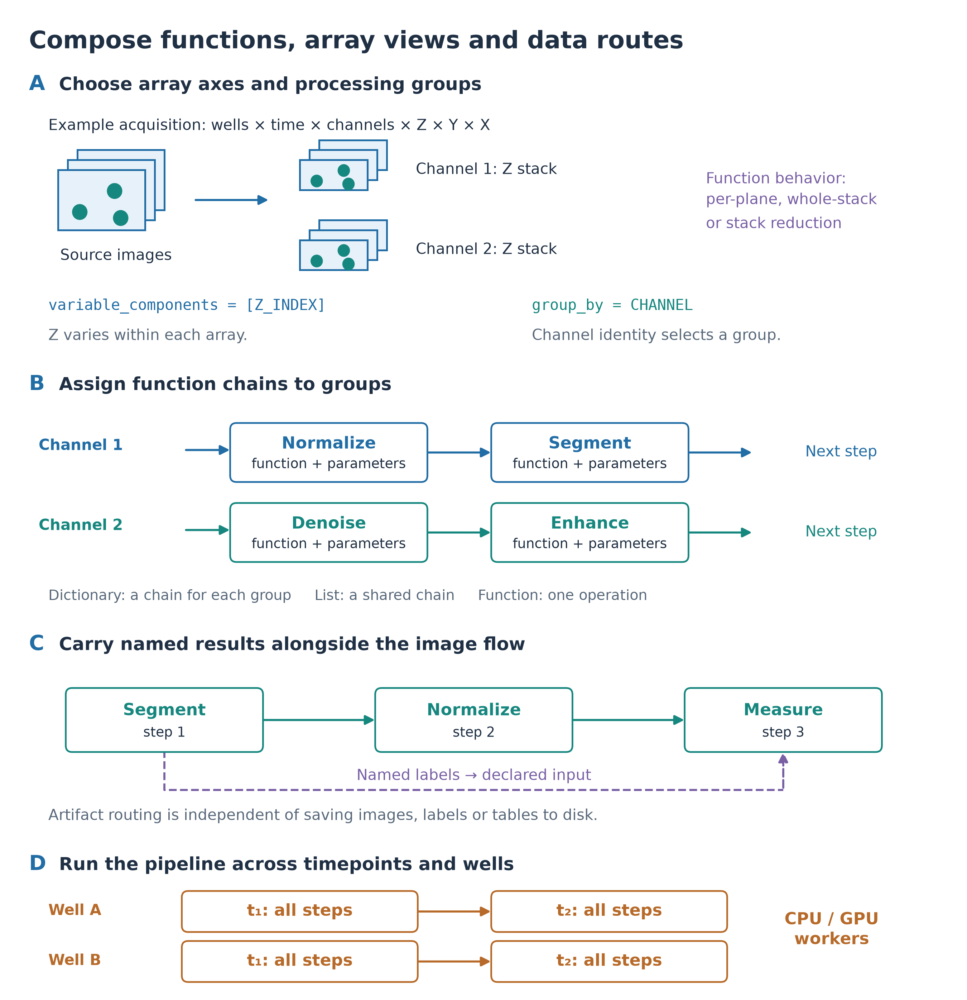{width=4.9in}

\(A) `variable_components` selects the axes within each array; `group_by` selects
the processing group. Each function declares per-plane, whole-stack or
stack-reduction behavior. (B) A dictionary assigns function chains to groups;
a list supplies an ordered chain. Entries are functions with their parameter
values. (C) A separate example routes named labels from segmentation to
measurement alongside the image flow, independently of saving to disk. (D) With
time configured as sequential, each timepoint completes the pipeline before the
next begins; wells can run in parallel. Selected functions determine CPU/GPU
array support.

```{=openxml}
<w:p><w:r><w:br w:type="page"/></w:r></w:p>
```

## Supplementary Figure 2. Separate UI, execution and viewer processes

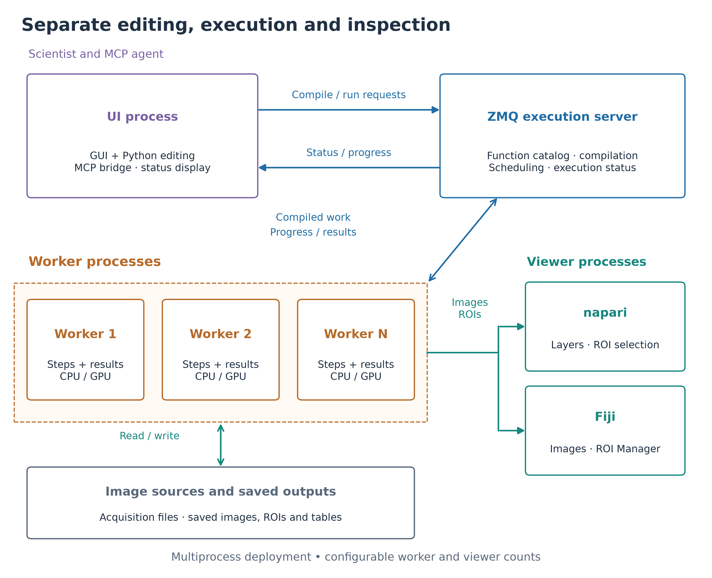{width=5.3in}

The illustrated deployment uses multiple processes. The UI process hosts the
editors and MCP bridge and submits requests to a separate ZMQ execution server.
The server prepares the function catalog, compiles workflows and coordinates
execution. Worker processes execute prepared tasks on compatible CPU/GPU array
backends and retain the named results produced during execution. Progress returns
through the server to the UI. Workers read image sources, save configured
outputs and stream selected images and ROIs to separate napari or Fiji processes.
Each viewer owns its interactive display. Arrows distinguish task/status traffic
(blue) from image/result flow (green). Worker and viewer counts are configurable;
single-worker inline and threaded execution are also supported.

```{=openxml}
<w:p><w:r><w:br w:type="page"/></w:r></w:p>
```

## Supplementary Figure 3. Compiler preparation

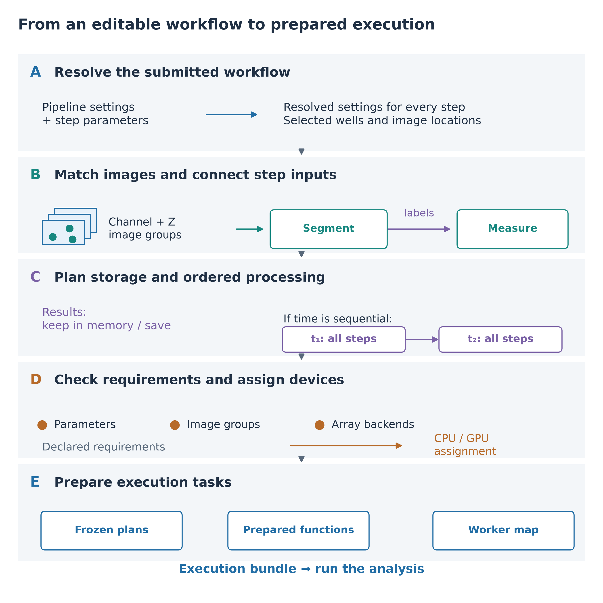{width=5.3in}

\(A) Inherited settings and step parameters are resolved for the submitted
pipeline. (B) Source metadata identifies image groups, and declared inputs link
functions to images and named results from earlier steps. (C) The compiler plans
which results remain in memory or are saved, and separates contexts for ordered
components such as time. (D) Function parameters, processing groups and
array-backend requirements are checked before compatible devices are assigned.
(E) Frozen contexts, prepared functions and worker assignments form the execution
bundle. The panels group related compiler responsibilities; analysis functions
run during execution.

```{=openxml}
<w:p><w:r><w:br w:type="page"/></w:r></w:p>
```

## Supplementary Figure 4. Connected outputs support saving and inspection

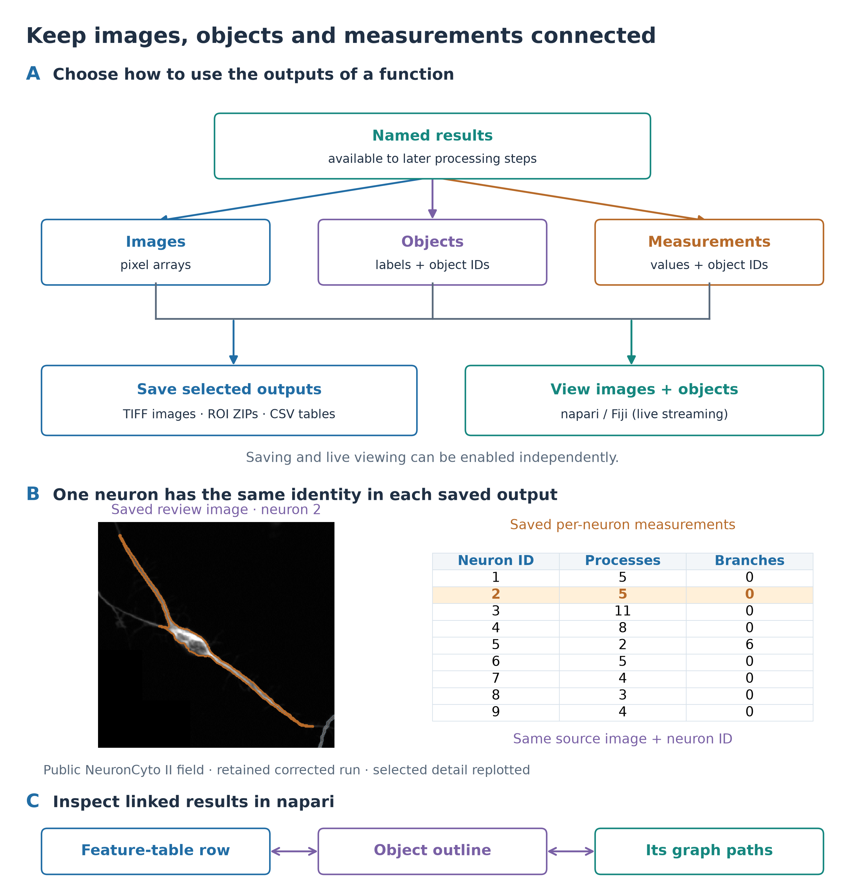{width=5.3in}

\(A) Functions produce named images, objects and measurements available to
subsequent steps. Saving selected outputs and live viewer streaming are
independent choices. (B) A saved image and ROI outline from the public NeuronCyto
II corrected demonstration are replotted beside the corresponding measurement
rows. Neuron 2 is highlighted in both; shared source and object identity link its
contour and measurements. (C) Native napari feature-row selection links an object
outline and its graph paths through the same neuron identity. CSV rows provide
saved measurements, while native feature rows support viewer selection.

```{=openxml}
<w:p><w:r><w:br w:type="page"/></w:r></w:p>
```

## Supplementary Figure 5. Custom functions enter the shared workflow

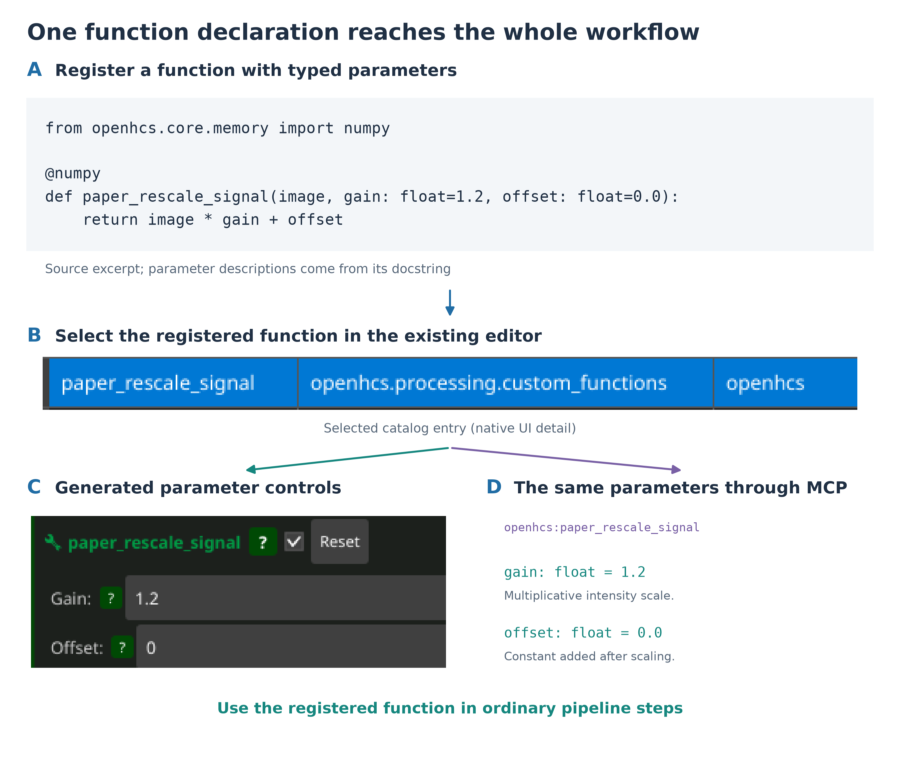{width=5.3in}

\(A) A custom intensity-scaling function declares its array backend and typed
parameters. (B) After registration through MCP, the function is selected in the
editor's existing function list. (C) The editor generates gain and offset controls
from the function signature. (D) Function discovery through MCP exposes the same
defaults and the parameter descriptions from its docstring. UI details are cropped from native screenshots;
the complete source and captures accompany the figure.

```{=openxml}
<w:p><w:r><w:br w:type="page"/></w:r></w:p>
```

## Supplementary Figure 6. Historical single-sample timing observations

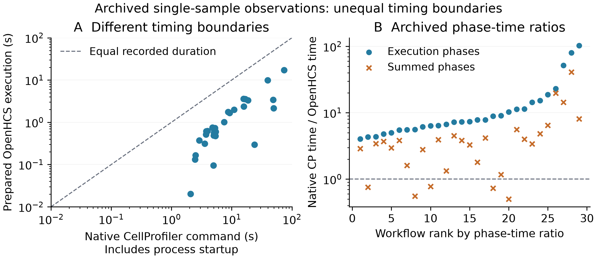{width=6in}

\(A) Native CellProfiler command duration, including subprocess startup, versus
OpenHCS execution after initialization and compilation. The dashed line marks
equal recorded duration. (B) Ratios of execution phases and summed phases,
ordered by execution-phase ratio. Summed phases also cover different work,
including benchmark validation and comparison on the OpenHCS path. Both panels
contain 29 workflows, with one comparison observation per workflow; the unresolved
native wound-healing duration is excluded. These observations do not measure
like-for-like speedup. Source tables and timer definitions follow in
Supplementary Data 1.

```{=openxml}
<w:p><w:r><w:br w:type="page"/></w:r></w:p>
```

## Supplementary Figure 7. Held-out results from prospectively authored workflows

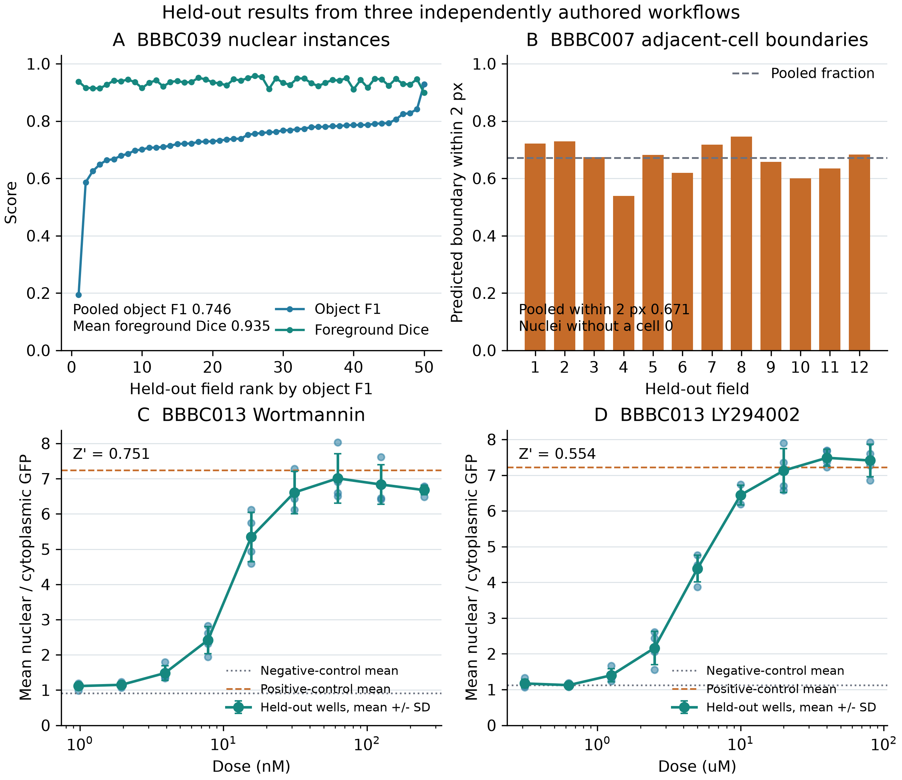{width=6in}

Four development fields or wells were available to each fresh agent before its
pipeline was frozen. \(A) BBBC039 object F1 and foreground Dice across 50
held-out fields, ordered by object F1. \(B) The fraction of predicted BBBC007
adjacent-cell boundary pixels within two pixels of a manual outline in each of
12 held-out fields. This directed measure does not establish object
correspondence. \(C, D) Held-out BBBC013 well means for cell-level nuclear to
cytoplasmic GFP ratios. Points are wells; the line and error bars show the mean
and sample standard deviation at each dose. Control means and Z-prime use four
independent wells per control condition. BBBC013 supplies treatment truth, not
manual segmentation truth.

```{=openxml}
<w:p><w:r><w:br w:type="page"/></w:r></w:p>
```

## Supplementary Figure 8. Per-workflow throughput and memory measurements

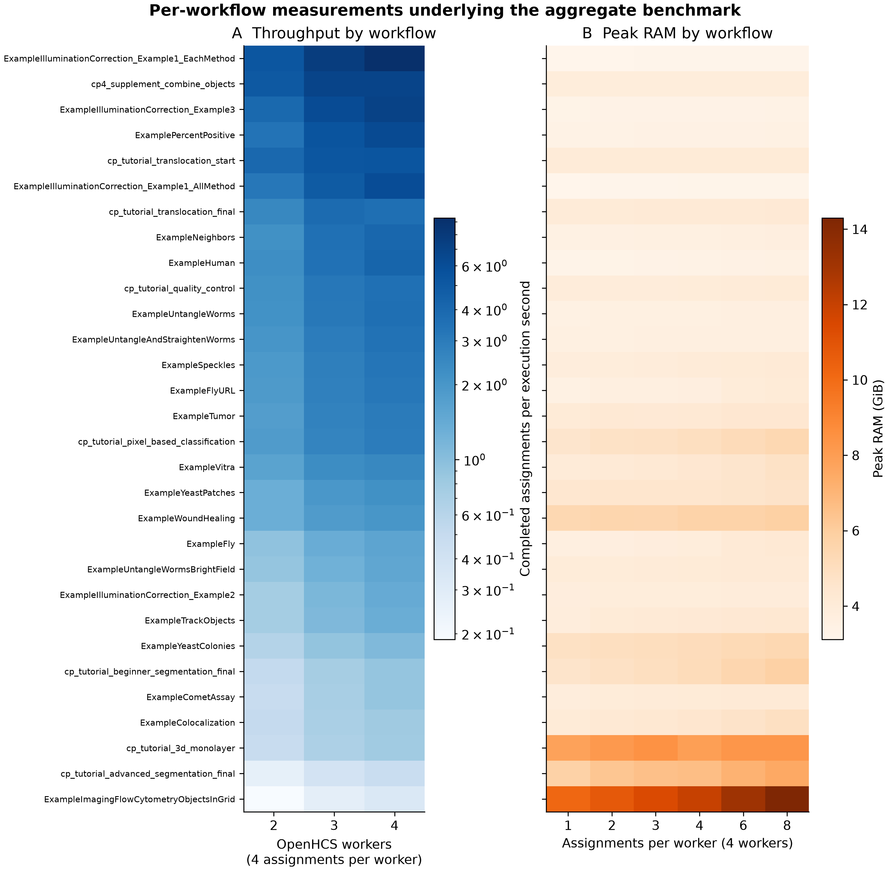{width=6in}

The rows are the 30 imported CellProfiler workflows, ordered by median measured
throughput. \(A) Completed repeated-image assignments per execution second for
two, three and four workers, with four assignments queued per worker. The color
scale is logarithmic. \(B) Peak process-tree RAM for one, two, three, four, six
and eight assignments per worker with four workers. Figure 5 summarizes these
same observations with individual points, interquartile ranges and medians.

```{=openxml}
<w:p><w:r><w:br w:type="page"/></w:r></w:p>
```

## Supplementary Figure 9. Native review of task-only repair and retained limits

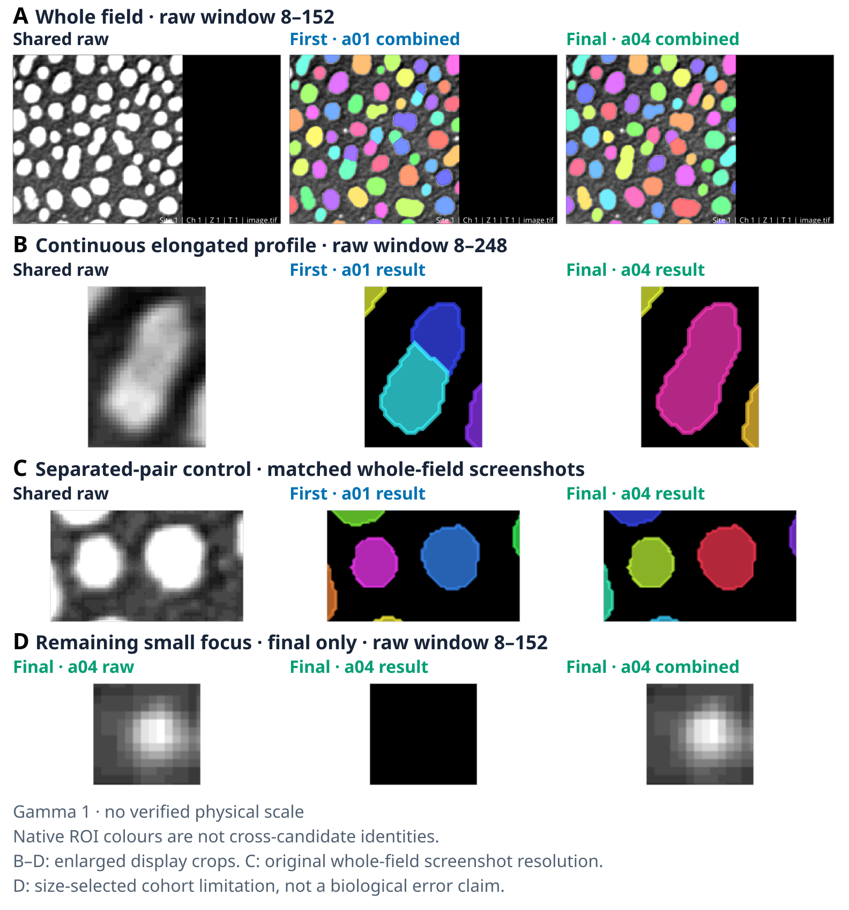{width=6in}

\(A) Whole-field raw image and first (a01) and final (a04) overlays at the same
camera and display window. (B) A continuous elongated signal has two first
partitions and one final partition. (C) A separated compact pair retains two
regions in both candidates; these crops use the original matched whole-field
screenshots, not a later enlarged first-candidate view. (D) Final-only raw,
result and combined crops show a small bright focus outside the size-selected
ROI cohort. This is a scope limitation, not a biological error claim against
that cohort. Raw limits are 8–152 in A, C and D and 8–248 in B; gamma is 1.
Colours distinguish regions within each view, not corresponding identities
across candidates. No physical calibration is inferred. These local witnesses
complement the separate whole-image computational-reference comparison in
Figure 7A; they do not establish exhaustive biological accuracy.

Source: Robert Haase and BioImageAnalysisNotebooks contributors,
[`blobs.tif` at the pinned notebook revision](https://github.com/haesleinhuepf/BioImageAnalysisNotebooks/blob/68845a1afaf53bf601958a3fa7d86f3cf8a43219/docs/29_algorithm_validation/blobs.tif),
[CC BY 4.0](https://creativecommons.org/licenses/by/4.0/). Adaptations are
OpenHCS-derived overlays, native display windows and screenshot cropping/scaling.
The [source proof](task_only_analysis/h001-native-source-proof.json) and
[render receipt](task_only_analysis/h001-native-render-receipt.json) retain
the unchanged source PNG identities and exact display crops.

```{=openxml}
<w:p><w:r><w:br w:type="page"/></w:r></w:p>
```

## Supplementary Figure 10. Matched views of volumetric centroid candidates

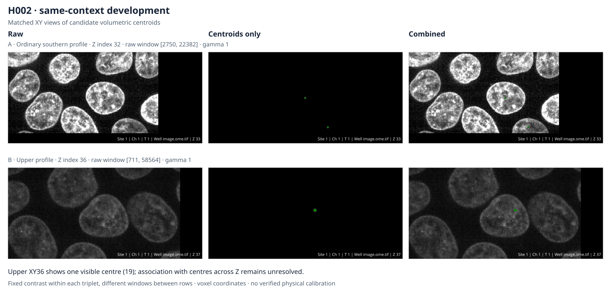{width=6in}

An ordinary southern profile (top) and an upper profile (bottom) are shown as
raw fluorescence, centroid points alone and combined views. The upper XY slice
displays one centre; association with centres on adjacent Z planes remains
unresolved in the archived three-dimensional review. Rows use zero-based Z
indices 32 and 36, with raw windows 2750–22382 and 711–58564, respectively;
gamma is 1. Contrast is fixed within each triplet. These are same-context
development examples, not a fresh autonomous pass or an accuracy evaluation.
No physical calibration or scale bar is inferred. The source is the Allen
Institute for Cell Science `cells3d` nuclear channel, via the pinned Haase
notebook collection; [CC0 distribution was confirmed by the Allen Institute](https://github.com/scikit-image/scikit-image/issues/6181#issuecomment-1012370105).

The [source receipt](task_only_analysis/h002-development-source-receipt.json)
retains the six original capture payloads and supporting multi-plane views.
The [render receipt](task_only_analysis/h002-development-render-receipt.json)
records unchanged PNG embedding and the identical full-canvas clip used for
each panel. The [CSV comparison](task_only_analysis/h002-development-csv-comparison.json)
shows that prominence trials removed boundary rows while retained centroid
and volume measurements were unchanged; it does not prove voxelwise mask
equality or one centre per biological nucleus (Supplementary Data 8).

```{=openxml}
<w:p><w:r><w:br w:type="page"/></w:r></w:p>
```

## Supplementary Figure 11. Retinal soma candidates during assisted development

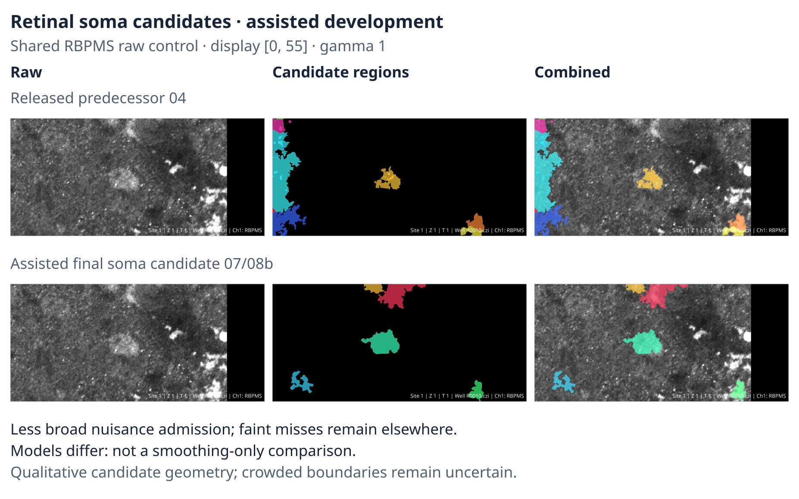{width=6in}

A shared RBPMS raw view accompanies the released predecessor (top) and the later
soma model (bottom), at the same southeastern native coordinates. Raw display
limits are 0–55 with gamma 1. The later model reduces broad background admission
while retaining useful body footprints. Faint profiles remain missed elsewhere
and crowded boundaries remain uncertain. This comparison spans admission-model
choices; it is not an isolated smoothing effect, autonomous accuracy assessment
or validated biological cell count. Native ROI colours are not cross-candidate
identities. The [source receipt](task_only_analysis/retinal-development-source-receipt.json)
retains matched capture identities and distributed controls; the
[render receipt](task_only_analysis/retinal-development-render-receipt.json)
records unchanged PNG embedding and the shared full-canvas crop. The acquisition
and analysis remain in the original frozen study bundle (Supplementary Data 8).

```{=openxml}
<w:p><w:r><w:br w:type="page"/></w:r></w:p>
```

## Supplementary Figure 12. Local nuclear repair and compartment limitations

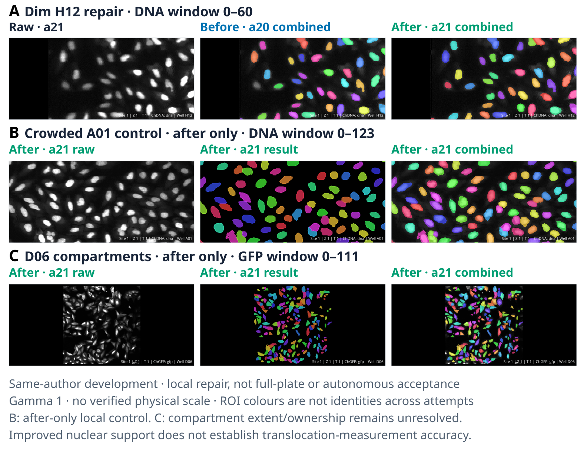{width=6in}

\(A) Matched H12 views before and after a foreground-admission adjustment show
recovery of a dim broad profile and retained separation of nearby regions. The
minimum-size rule was unchanged; retained intermediate measurements support
threshold-shrunken support as the earlier loss mechanism. (B) An after-only
bright crowded A01 control shows separate supported regions at the reviewed
position, with touching or lobed identities still uncertain. (C) Corrected D06
GFP views show unresolved propagated-compartment extent and ownership. Numeric
raw windows are 0–60, 0–123 and 0–111 in A, B and C, respectively; gamma is 1.
Colours are not cross-candidate identities. Physical calibration is unverified.
These same-author development witnesses support a local nuclear repair, not
exhaustive accuracy, validated translocation measurements, complete plate
execution or fresh autonomous success. The full-plate continuation remained
interrupted. The [source proof](task_only_analysis/bbbc013-development-source-proof.json)
and [render receipt](task_only_analysis/bbbc013-development-render-receipt.json)
retain the original capture, source, presentation and unchanged embed identities.
Source: Ilya Ravkin, [Broad Bioimage Benchmark Collection BBBC013v1](https://bbbc.broadinstitute.org/BBBC013),
[CC BY 3.0](https://creativecommons.org/licenses/by/3.0/). Adaptations comprise
OpenHCS-derived overlays, native display windows and screenshot cropping/scaling.

```{=openxml}
<w:p><w:r><w:br w:type="page"/></w:r></w:p>
```

## Supplementary Figure 13. Final local evidence from autonomous core/boundary repair

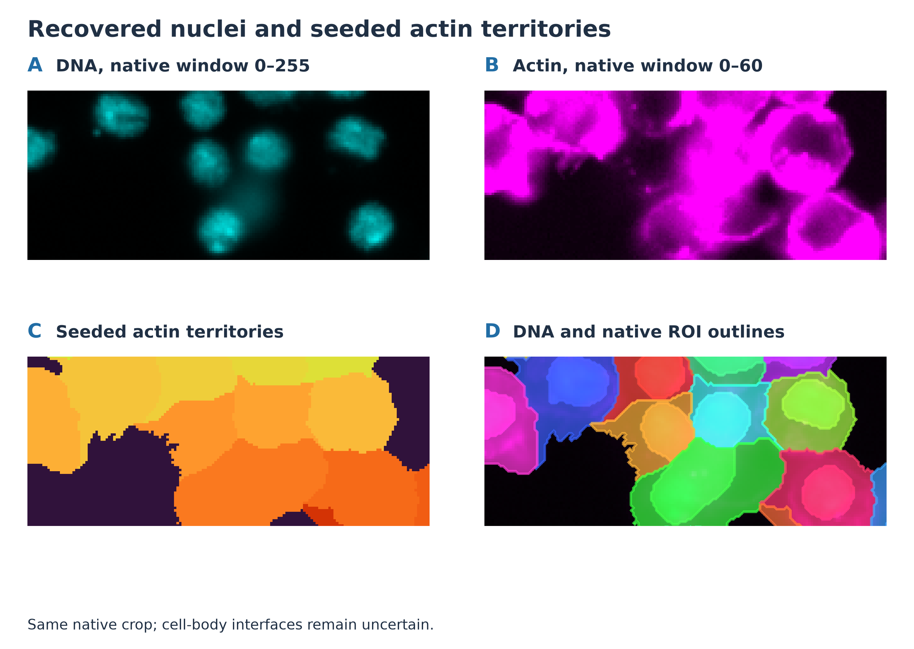{width=6in}

Matched final views from the fresh, uncoached H003 repeat show DNA (A), actin
(B), seeded territories (C), and DNA with nuclear and territory outlines (D).
The crop includes three nuclei recovered by separating core detection from
boundary growth; their preceding loss is recorded in Supplementary Data 8.
Nuclear recovery is useful despite uncertain crowded territory interfaces.
Raw panels remain separate because filled overlays obscure fluorescence.
Windows are 0–255 for DNA and 0–60 for actin, gamma 1; label colours are not
fluorescence. Original captures were cropped/scaled without pixel retouching,
and physical calibration is unverified. The
[source proof](../figures/slas/h003_fresh656_sources/source-proof.json) and
[outcome record](task_only_analysis/h003-fresh656-local-repair.json) retain
capture identities, the frozen pipeline and distributed review beyond this crop.

Source: BBBC007v1 A02, Sabatini laboratory, Whitehead Institute; CC0.

```{=openxml}
<w:p><w:r><w:br w:type="page"/></w:r></w:p>
```

## Supplementary Figure 14. Remaining crowded-region uncertainty in the retinal result

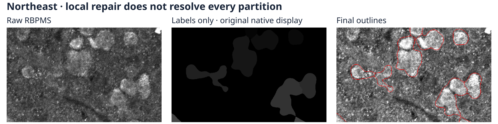{width=6in}

The same final candidate shown in main Figure 7 retains uncertain object
partitions in a different region. The upper elongated footprint spans vertically
adjacent fluorescence bodies; the lower-right lobed region has uncertain
identity and boundary extent. These local observations separate useful
body detection from a complete cell census. The three panels retain the same
native camera and crop. Grayscale labels are dark in the original native
display; darkness does not indicate absent numerical labels. Raw RBPMS uses
window 0–63, gamma 1. The outline background uses the frozen pipeline's
intensity stretch and display range 0–63/255, as in main Figure 7. Original
screenshots were clipped/scaled without pixel retouching. This is regional
visual evidence, not a manual-reference error rate. Source: user-provided
retinal whole mount R0010. The [shared native source proof](task_only_analysis/retinal-fresh09-native-source-proof.json)
retains capture hashes, display choices and crop coordinates for both figures;
Supplementary Data 8 records the independently checked tables and final scope.

```{=openxml}
<w:p><w:r><w:br w:type="page"/></w:r></w:p>
```

## Supplementary Figure 15. A familiar CellProfiler pipeline expressed as OpenHCS steps

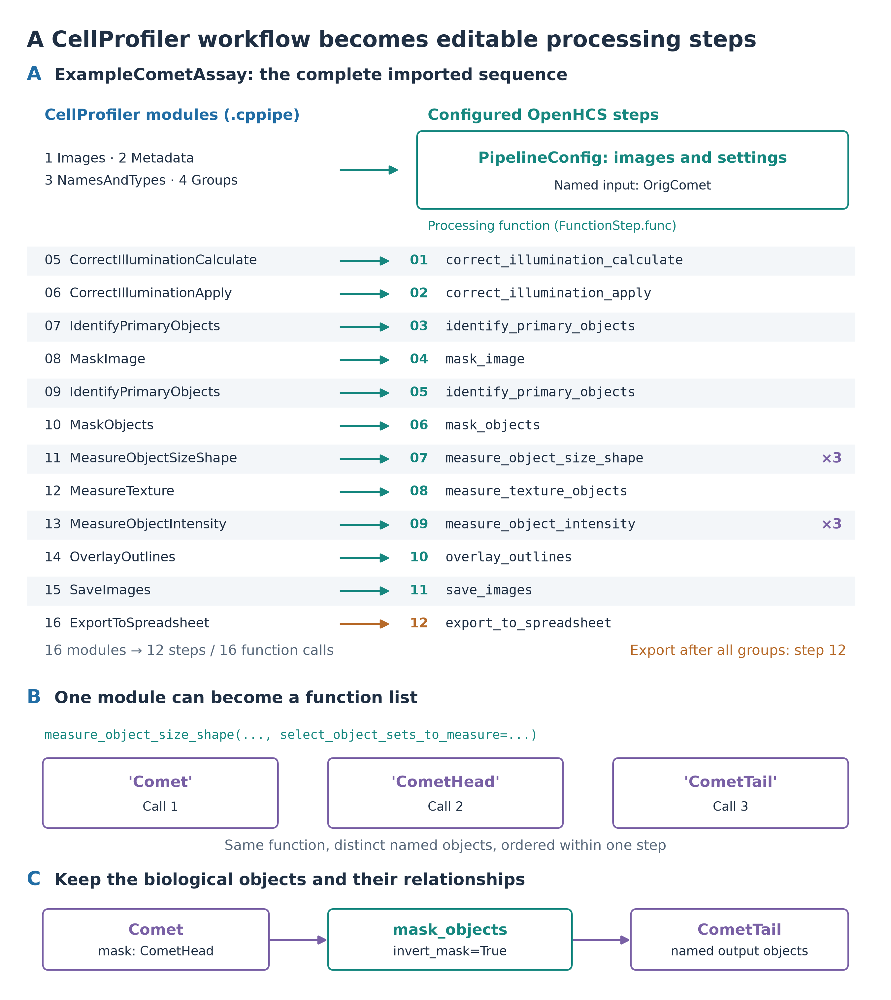{width=5.3in}

\(A) The public ExampleCometAssay pipeline maps image loading to source bindings and processing to 12 function steps. Rows align original modules and imported functions; multiplicity marks repeated calls. Spreadsheet export runs plate-wide. (B) MeasureObjectSizeShape applies the same function to Comet, CometHead and CometTail within one step. (C) Masking the comet with its head, with inversion enabled, defines CometTail. The diagram is derived from the source pipeline and importer; function identities, parameters and counts are checked against its retained mapping.

```{=openxml}
<w:p><w:r><w:br w:type="page"/></w:r></w:p>
```

## Supplementary Figure 16. Image and object inspection in Fiji and napari

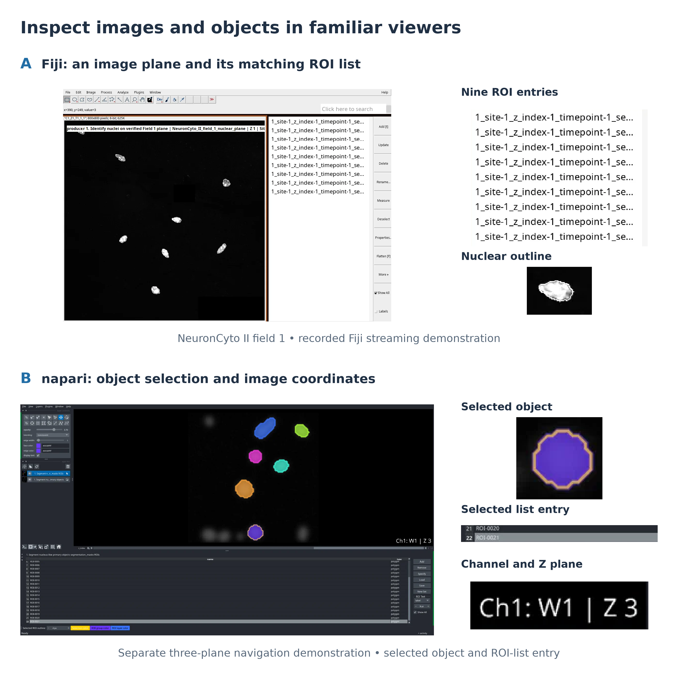{width=5.5in}

\(A) Fiji displays a single NeuronCyto II field 1 nuclear plane with nine corresponding native ROI Manager entries. (B) A separate three-plane napari demonstration shows segmented objects, a selected ROI-list entry and the displayed channel/Z coordinates. Its accompanying recording shows selection navigating between planes. These are retained viewer demonstrations, separate from the unattended analysis in Figure 3; their segmentation outputs are not compared with each other. Details enlarge the ROI entries and a nuclear outline in A, and the selected object, highlighted list entry and coordinates in B. The full captures and checksum records are retained in the gallery archive.

```{=openxml}
<w:p><w:r><w:br w:type="page"/></w:r></w:p>
```

## Supplementary Figure 17. Native volume review distinguishes body support from unresolved identity

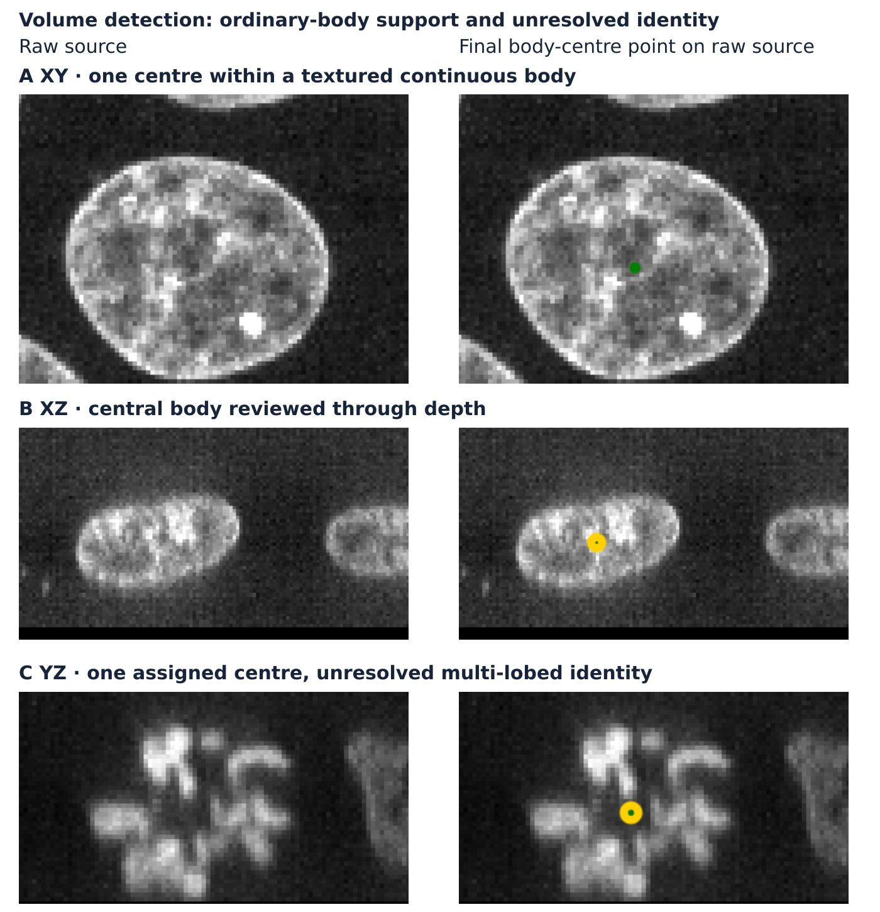{width=5.2in}

\(A) One centre in a textured continuous body, native XY. (B) Central body,
genuine XZ. (C) One centre in a multi-lobed cluster of unresolved identity,
genuine YZ. This independent task-only author's 22 provisional centres are
an algorithmic output, not a biological census or reference score. These
final-only views do not show the repair chronology. Points have fractional
coordinates and slice-local visibility; yellow rings are native selection
highlights. Matched cameras, axes and windows are retained: 901–27267 (A),
711–27219 (B), and 901–53727 (C), gamma 1. Screenshots are clipped/scaled
without retouching; physical calibration is unverified. The [native source proof](task_only_analysis/h002-fresh10-native-source-proof.json)
binds original captures and the pipeline. Supplementary Data 8 retains
ordinary-body repairs and the unresolved global count separately.

```{=openxml}
<w:p><w:r><w:br w:type="page"/></w:r></w:p>
```

## Supplementary Figure 18. Native H001 repair from the scored task-only run

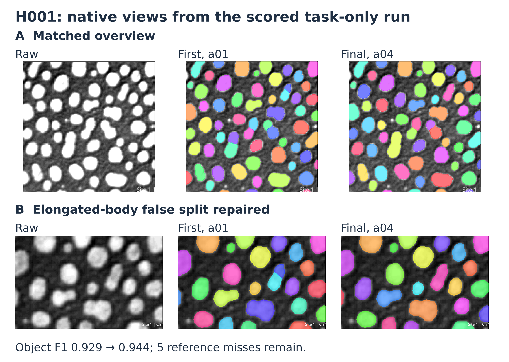{width=5.3in}

\(A) Overview of the same bright-object field scored in Figure 5B. (B) An elongated
body represented by two first-attempt labels becomes one in the final candidate.
Both rows show raw, first and final views from the same unguided author, not the
separate assisted H001 development example. Raw display windows are 8–152 (A)
and 8–248 (B), gamma 1; filled ROI opacity is 0.7. Colours are not stable
cross-candidate identities. Object F1 against the notebook-derived computational
reference rises from 0.929 to 0.944, with five missed reference objects unchanged.
A possible merge and ambiguous small foci remain; the reference is not manual
biological annotation. Original native screenshots are clipped/scaled without
retouching; physical calibration is unverified. Source: Robert Haase and
BioImageAnalysisNotebooks contributors, algorithm-validation collection.
Supplementary Data 8 retains the score and source review.

```{=openxml}
<w:p><w:r><w:br w:type="page"/></w:r></w:p>
```

## Supplementary Figure 19. Raw-supported junction repair with remaining gaps

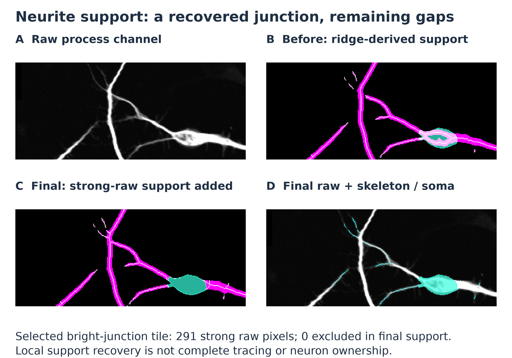{width=5.3in}

\(A) Raw process channel. (B) Ridge-derived candidate support before the final
repair. (C) Final support adds a separate strong-raw mask. (D) Raw channel with
final skeleton and soma display. These same-coordinate views come from one
unguided author of an 800 x 800-pixel public neurite field. In a selected
30 x 40-pixel junction tile, 19 of 291 raw pixels at intensity at least 20 were
absent from the earlier candidate; none were absent from the final candidate.
The 31 x 31-pixel quiet control retained zero candidate pixels. These selected
checks measure raw-support agreement, not ground-truth recall. Soma exclusion
was added separately between the two attempts and removes interior skeleton
loops; that change is not attributed to the strong-raw union. Weak branches
still have gaps, bright puncta remain a nuisance, and crossings do not determine
cell ownership. Per-neuron outgrowth lengths and anatomical branch counts were
not accepted. Raw window 0–80, gamma 1; camera centre y365,x370, zoom 3.
Original screenshots are clipped/scaled without retouching. Physical calibration,
stain identities and biological cell identity are unverified. Supplementary
Data 8 links the retained pipelines and independent source review.

```{=openxml}
<w:p><w:r><w:br w:type="page"/></w:r></w:p>
```

## Supplementary Figure 20. Independent BBBC039 authors on the same 200 fields

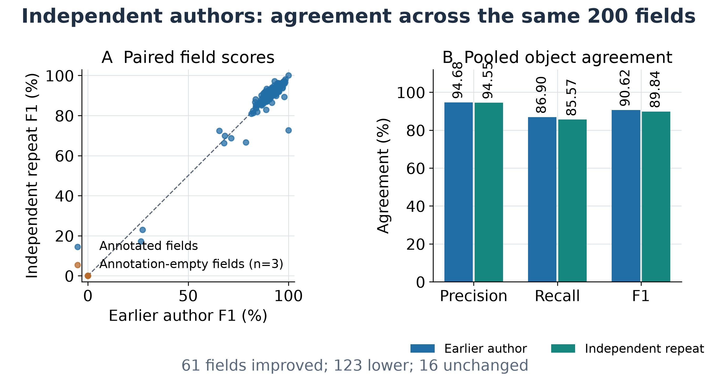{width=6in}

\(A) Each point compares final object F1 on the same field for the earlier
author and an independent repeat. The dashed line marks equal scores. All
200 fields are included: blue points are annotated fields, and the three orange
annotation-empty fields coincide at the origin. (B) Pooled precision, recall
and F1 against the same 23,615 reference
instances, using intersection over union at least 0.5. The repeat matched
20,207 objects with 1,164 excess predictions and 3,408 misses; the earlier
author matched 20,521 with 1,153 excess predictions and 3,094 misses.
The repeat's F1 was 0.898 versus 0.906 earlier. Its field F1 reached at least
0.90 in 133 fields, while eleven remained below 0.80. Each author used its own
method and settings; this is not a controlled test of a skill change, a paired
first/final repair, or unseen-image generalization. Reference answers were used
only for postfreeze scoring and were not supplied to either author. Exact
field scores, reference hashes and original lifecycle records are retained in
the [repeat evaluation](../../figure-collection-20261004/bbbc039-fresh10coverage-postfreeze-evaluation.json)
and Supplementary Data 8.

```{=openxml}
<w:p><w:r><w:br w:type="page"/></w:r></w:p>
```

## Supplementary Figure 21. Personal neurite mosaic during retained-context development

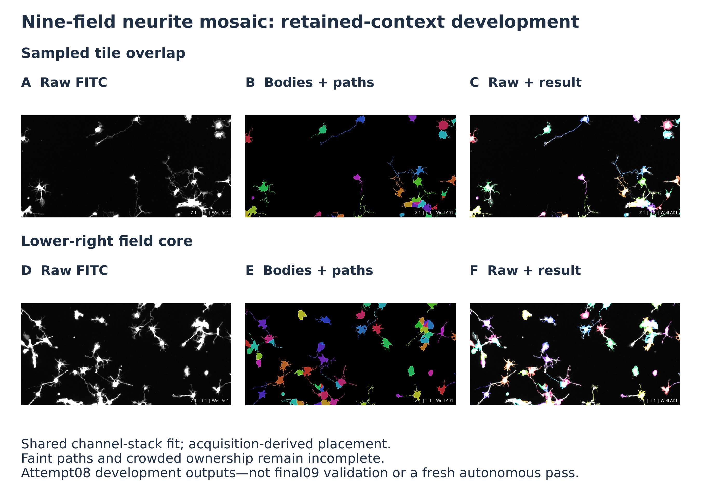{width=6in}

(A–C) Sampled overlap region; (D–F) lower-right field core in an acquisition-placed
nine-field mosaic. Each triplet uses the same native crop, with raw FITC,
body envelopes plus process paths, and their combination. The analysis fits
one pooled percentile pair per complete nine-field channel stack before
assembly, rather than fitting fields separately. Supported long paths remain
visible, but faint segments and crowded ownership are incomplete. These are
saved attempt08 development outputs; its terminal viewer settlement failed.
The author subsequently completed attempt09 after changing streaming and
destination. This figure does not establish bytewise equivalence of those
attempts or final09 biological validation. It is same-author development,
not a fresh autonomous pass. Original captures and the independent review
are retained in the [stitched-development record](../../figure-collection-20261004/P001-STITCHED-DEV13-INDEPENDENT-REVIEW.rst).

```{=openxml}
<w:p><w:r><w:br w:type="page"/></w:r></w:p>
```

## Supplementary Figure 22. Matched retinal views before and after repair

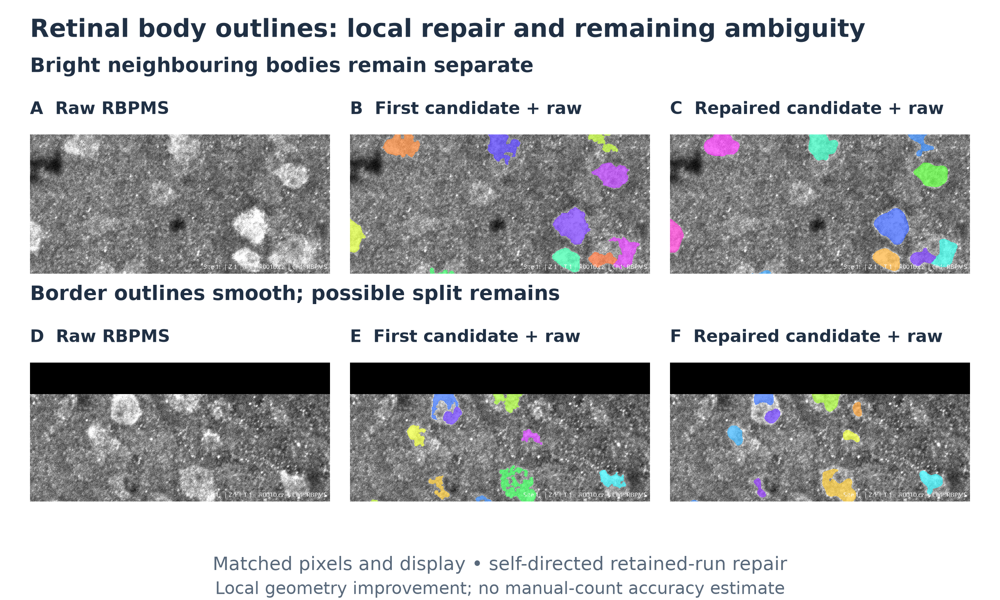{width=6in}

(A–C) Bright neighbouring bodies in the northwest region; (D–F) the source
border region. The raw PNGs are byte-identical between the first and final
capture sets. All panels retain the same native crop and raw display window
(0–42, gamma 1); colours identify instances, not biological classes.
The author increased threshold smoothing from 4 to 12 pixels. The repaired
outlines are smoother, and the prominent neighbouring bodies remain separate.
At the border, two adjacent footprints within a ring-like raw envelope retain
possible instance-splitting uncertainty. This is a self-directed repair of a
retained interrupted run, rather than a new fresh autonomous trial or a
manual-count comparison. The independent review and original capture hashes
are retained in the [retinal comparison](../../figure-collection-20261004/R0010-FRESH16-INDEPENDENT-FIRST-REVIEW.rst).

```{=openxml}
<w:p><w:r><w:br w:type="page"/></w:r></w:p>
```

## Supplementary Figure 23. Paired-channel support and a seed-only exception

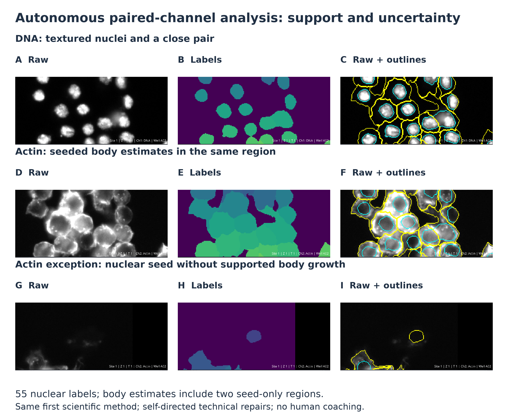{width=6in}

(A–C) DNA raw signal, nuclear labels and combined outlines. (D–F) Actin and
seeded body estimates at the same native coordinates. (G–I) Body ID 11 contains
only its nuclear seed, without supported actin growth. Cyan/yellow outlines
mark nuclei/body estimates; label colours identify instances, not intensity or
class. Each triplet retains the camera, crop and window: DNA 0–151, actin 0–104,
gamma 1, with equivalent normalized RGB limits for combined views. Editorial
crops remove controls without changing analytical pixels. The uncoached author
retained its first scientific method through technical repairs. These views
support nuclear separation and provisional body geometry, not complete
boundaries or a numerical accuracy score. Original capture checks are in the
[independent review](../../figure-collection-20261004/H003-FRESH19-INDEPENDENT-REVIEW.rst)
and the figure receipt records source hashes and crops.

```{=openxml}
<w:p><w:r><w:br w:type="page"/></w:r></w:p>
```

## Supplementary Figure 24. Faint-path recovery and graph sensitivity

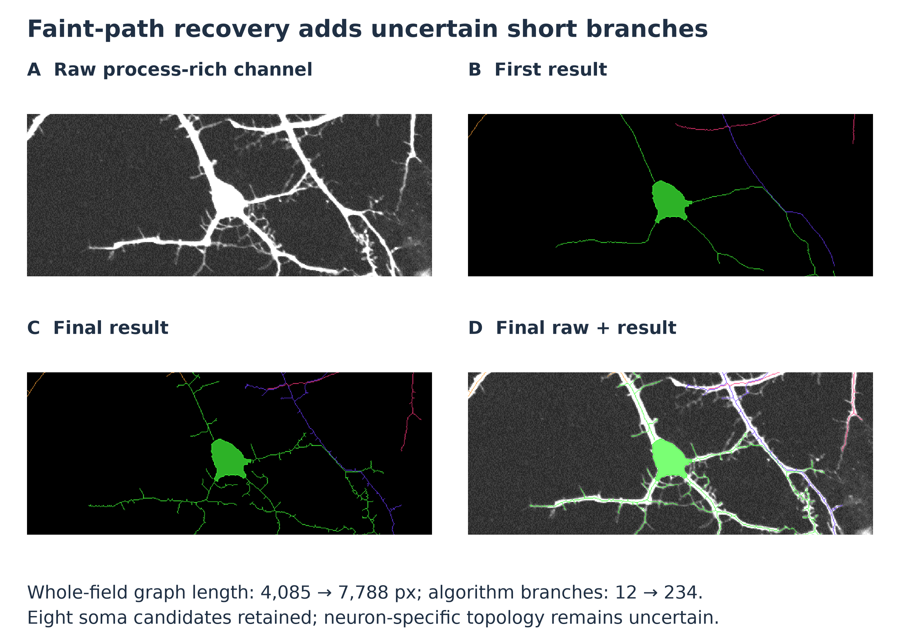{width=5.3in}

\(A) Process-rich raw channel, with its bright trunks saturated to expose faint
signal. (B) First result. (C) Final result after three self-directed threshold
revisions. (D) Final result over raw signal. All four panels show the same
lower-field region from an independent task-only author of the paired public
neurite field. The final result recovers faint side paths, while additional
short twigs and crossing assignments remain uncertain. Eight soma candidates
and their summed approximate area of 8,692 pixels squared remained unchanged.
Whole-field computed graph length increased from 4,085 to 7,788 pixels and
algorithm-defined branch counts from 12 to 234; these are sensitivity measures,
not validated biological totals. A separately measured local faint-path witness
retained support through all 20 sampled rows in the final attempt. Raw window
0–12, gamma 1; declared camera centre y680,x365, zoom 2. Original captures are
cropped identically and scaled without pixel retouching. Physical calibration
and neuron-specific ownership are unverified. Supplementary Data 8 retains
the complete four-candidate table and pipeline freeze; the figure receipt
records the original capture hashes and editorial crop.

```{=openxml}
<w:p><w:r><w:br w:type="page"/></w:r></w:p>
```

## Supplementary Figure 25. Autonomous repair of an internal body split

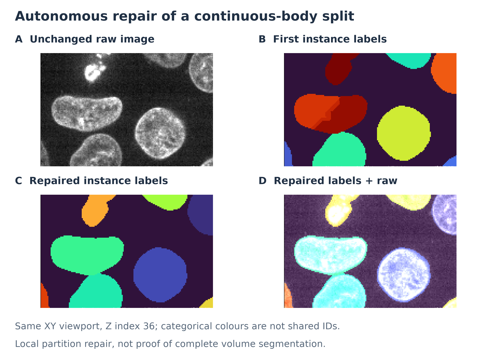{width=5.3in}

\(A) Raw image. (B) First categorical instance labels divide the continuous
elongated body into two visible partitions. (C) Component-local seed suppression
retains one partition in that body, while the round neighbouring body remains
separate. (D) Repaired labels over raw. The four panels come from the same XY
viewport at zero-based Z index 36 in the frozen independent H002 fresh22 trial.
First and repaired raw screenshots are byte-identical. The visible colour map
is categorical; colours are not stable object identities across candidates.
Panels use identical editorial crops, with no pixel retouching. The repaired
candidate's label volume is byte-identical to its final technical delivery
retry. This is a local partition witness, not complete volume segmentation.
Post-freeze comparison recovered all 15 manual centres within 20 voxels,
while 11 predictions were unmatched to annotations of unestablished coverage.
The [completion record](task_only_analysis/h002-fresh22-postfreeze-localisation.rst)
retains that comparison and the original technical failures; the figure
provenance records source hashes and crops.

```{=openxml}
<w:p><w:r><w:br w:type="page"/></w:r></w:p>
```

## Supplementary Table 1. Reusable libraries and their roles

| Library | Role in OpenHCS |
| --- | --- |
| [metaclass-registry](https://github.com/OpenHCSDev/metaclass-registry) | Discovers classes implementing a shared interface and makes them available for selection. |
| [python-introspect](https://github.com/OpenHCSDev/python-introspect) | Reads a function's parameters, types, defaults and documentation. |
| [ObjectState](https://github.com/OpenHCSDev/objectstate) | Tracks editable settings and resolves shared defaults and local overrides. |
| [pyqt-reactive](https://github.com/OpenHCSDev/pyqt-reactive) | Generates parameter controls and updates them as settings change. |
| [pycodify](https://github.com/OpenHCSDev/pycodify) | Generates editable Python representations and manages their imports. |
| [ArrayBridge](https://github.com/OpenHCSDev/arraybridge) | Converts arrays between supported libraries and manages their computational resources. |
| [PolyStore](https://github.com/OpenHCSDev/PolyStore) | Reads, writes and streams data through supported storage interfaces. |
| [ZMQRuntime](https://github.com/OpenHCSDev/zmqruntime) | Coordinates communication, startup, shutdown and progress between processes. |

```{=openxml}
<w:p><w:r><w:br w:type="page"/></w:r></w:p>
```

## Supplementary Data 1. CellProfiler workflow comparison

This supplement indexes source tables and evaluation records. Figure scripts
derive panels and plotted-row exports from the linked files; paths are relative
to this file.

The acquisition scripts pin the official CellProfiler examples to
`4972b59e670a4ae96c3d453803c92eeff378d054`, the official tutorials to
`264a8155da21a2d468051f78211bed2e580a8934`, and the CellProfiler 4 benchmark
supplement to `40abc2e600fd46b74c213999dd25c5245048dc92`.

### OpenHCS 0.8.5 release comparison

The release CI run executed all 30 workflows and supplied 25 reference-bearing
comparisons. A later unified current-source run, described below, supplied
reference-value comparisons for all 30 workflows in one execution.

The [preserved CI evidence](ci_official30_085/README.md) contains the observations,
summary, phase timings and suite metadata from the hosted Official30 job at
release commit `e867013a8eb188edcc63b5b0cdfd06f42a99b409`.
[The successful job](https://github.com/OpenHCSDev/openhcs/actions/runs/34445574926/job/102769520329)
built candidate packages and executed all 30 imported workflows through ZMQ on
Linux with Python 3.12.14. Every OpenHCS execution was uncached; native
CellProfiler outputs came from the committed references.

The [per-workflow observations](ci_official30_085/observations.csv) report
successful execution and zero comparison differences for all 30 cases. The
[reference inventory](ci_official30_085/reference_inventory.csv) identifies
which cases contain values to compare:

| Selected native reference class | Workflows | Value comparisons |
| --- | ---: | --- |
| CSV measurements | 21 | Measurement tables |
| SQLite and CellProfiler Analyst properties | 3 | Database tables and properties; one also has an overlay image |
| NPY-only illumination output | 1 | Image pixels |
| No retained value files | 5 | Execution checks only |

Image comparison selects output directories containing images and no CSV files.
This selects two workflows: the AllMethod illumination array and the completed
translocation tutorial's overlay alongside SQLite measurements. The advanced
segmentation tutorial's five illumination arrays are source inputs outside its
reference-output directory. Images saved alongside CSV measurements in 14
profiles are outside image comparison. Numeric comparisons use absolute and
relative tolerances of `1e-6`, with no pixels allowed outside tolerance.

The records retain per-case comparison outcomes and timing, rather than raw
candidate output trees or individual pixel-difference reports. The native
references' original dependency environments were not recorded. The evidence
index supplies source and test permalinks, checksums and the separate
14 September 2026 reference-inventory audit provenance.

### Unified 30-workflow value comparison

The [unified evidence directory](../../benchmark/results/official30_unified_value_comparison_20260916/README.md)
preserves one immutable run in which all 30 workflows were compiled and executed
afresh through isolated ZMQ execution endpoints. All 30 selected reference-value
comparisons were equivalent and reported zero differences. Its fresh
[reference inventory](../../benchmark/results/official30_unified_value_comparison_20260916/reference_inventory.csv)
contains 21 CSV profiles, three SQLite profiles and six image- or array-only
profiles. Image comparison executed for seven workflows, including the completed
translocation overlay compared alongside its SQLite values.

The [observations](../../benchmark/results/official30_unified_value_comparison_20260916/observations.csv),
[phase timings](../../benchmark/results/official30_unified_value_comparison_20260916/phase_timing.csv),
and [summary](../../benchmark/results/official30_unified_value_comparison_20260916/summary.csv)
retain the comparison results. The original observations identify the candidate
as OpenHCS 0.8.5 and retain endpoint, executable and submitted-pipeline provenance.
The full run-environment and suite-metadata records were not retained in this
archive; its exact candidate source commit and Python, NumPy and SciPy versions
cannot be established from those observations. The selected native references'
original dependency environments are likewise not established by this bundle.
Environment identities from later matched runs do not supply this missing
historical provenance.

### Five-workflow image and object-label exports

Five source workflows compute images or objects without exporting files. The
[export-extension manifest](../../benchmark/manifests/official30_value_completion_20260914.json)
selects versions of those workflows with terminal exports added. Its generated
pipelines retain the original processing modules and settings. Native CellProfiler
produced the exported references; OpenHCS processed the same scoped inputs.

| Workflow | Exported values compared | Result |
| --- | --- | --- |
| Combine objects | Combined-object labels | Exact label agreement |
| Translocation starter | Nuclear labels | Exact label agreement |
| Illumination Example 1, EachMethod | Corrected green image | Float-tolerance agreement |
| Illumination Example 2 | Uncorrected, small-block-corrected and large-block-corrected nuclear labels | Exact agreement for all three label images |
| Illumination Example 3 | Polynomial-corrected and convex-hull-corrected images | Float-tolerance agreement for both images |

The [per-artifact comparison table](../../benchmark/results/official30_value_completion_20260914/label_aware_exact_commit_run/artifact_comparisons.csv)
records eight passing artifacts. All five integer label images agree exactly
after normalization of singleton dimensions. The three numerical images have
zero pixels outside the absolute and relative tolerances of `1e-6`; their
maximum absolute difference is `2.9802322387695312e-8`. The
[per-workflow observations](../../benchmark/results/official30_value_completion_20260914/label_aware_exact_commit_run/observations.jsonl)
link these comparisons to fresh candidate executions and the retained native
outputs.

The [run environment](../../benchmark/results/official30_value_completion_20260914/label_aware_exact_commit_run/run_environment.json)
identifies OpenHCS execution source `7ca8ecb8e73a882ef0f15616d57b00f0dabf73e0`,
Python 3.12.3, NumPy 2.1.3 and SciPy 1.18.0. Native references were generated
with CellProfiler 4.2.8.1 on Python 3.9.25, NumPy 1.24.4 and SciPy 1.9.0.
Each candidate ran through a fresh matching OpenHCS endpoint. Source revisions,
native-reference origin and endpoint identities are retained with the results.
These exported references are incorporated into the unified 30-workflow run;
the earlier five-workflow audit and release records retain their own protocols
and identities.

### Retained single-sample timing records

The separate [May single-process table](../../benchmark/results/labmeeting_20260513/official30_well_throughput/data/single_process_summary.csv)
contains one observation and one passing status flag per workflow, execution and
total-phase timings, ratios and the legacy accuracy field. Its native
ExampleWoundHealing timing is 900 s without a native completion flag, so that
row is excluded from timing comparisons. Empty fields remain as recorded.

The field `min_parity_accuracy` is 1.0 in all rows. It is the minimum Boolean
pass flag across a workflow's observations, including the five workflows without
reference values, rather than the fraction of matching measurements or pixels.
Times below are in seconds, rounded to five significant figures from the source
CSV. The full-precision values remain in that file. Native command and prepared
OpenHCS execution have different timing boundaries, described below. The other
columns sum each system's recorded benchmark phases. The ExampleWoundHealing
native values equal the timeout ceiling and are shown for source completeness;
that row is excluded from timing comparisons.

| Workflow | Native command | Prepared execution | Native phase sum | OpenHCS phase sum |
|----------------------------------------|-----------:|-----------:|-----------:|-----------:|
| ExampleColocalization | 48.936 | 3.4135 | 48.957 | 14.439 |
| ExampleCometAssay | 15.65 | 3.588 | 15.729 | 4.6023 |
| ExampleFly | 9.2186 | 1.6629 | 9.2536 | 5.7264 |
| ExampleFlyURL | 5.4078 | 0.59741 | 5.4323 | 4.6231 |
| ExampleHuman | 5.0468 | 0.56671 | 5.111 | 6.9859 |
| ExampleIlluminationCorrection_Example1_AllMethod | 23.846 | 0.2981 | 23.875 | 0.58255 |
| ExampleIlluminationCorrection_Example1_EachMethod | 4.9526 | 0.095801 | 4.9629 | 0.34526 |
| ExampleIlluminationCorrection_Example2 | 49.621 | 2.1512 | 49.632 | 2.5107 |
| ExampleIlluminationCorrection_Example3 | 2.5101 | 0.1649 | 2.5214 | 0.52152 |
| ExampleImagingFlowCytometryObjectsInGrid | 74.157 | 17.18 | 74.417 | 98.545 |
| ExampleNeighbors | 4.9983 | 0.48576 | 5.0753 | 10.148 |
| ExamplePercentPositive | 2.902 | 0.37111 | 2.917 | 1.6261 |
| ExampleSpeckles | 3.7868 | 0.61381 | 3.7957 | 1.3598 |
| ExampleTrackObjects | 10.919 | 1.9784 | 11.15 | 2.9135 |
| ExampleTumor | 5.2672 | 0.7298 | 5.3182 | 1.183 |
| ExampleUntangleAndStraightenWorms | 3.9757 | 0.61834 | 3.9825 | 1.0111 |
| ExampleUntangleWorms | 3.7546 | 0.51335 | 3.7662 | 0.98515 |
| ExampleUntangleWormsBrightField | 8.755 | 1.7514 | 8.764 | 2.947 |
| ExampleVitra | 4.7962 | 0.75417 | 4.87 | 6.2844 |
| ExampleWoundHealing | 900 | 1.0723 | 900 | 1.4437 |
| ExampleYeastColonies | 15.848 | 2.3553 | 15.943 | 11.971 |
| ExampleYeastPatches | 7.4914 | 1.0139 | 7.5774 | 2.3141 |
| cp4_supplement_combine_objects | 2.0789 | 0.020116 | 2.0855 | 0.25762 |
| cp_tutorial_3d_monolayer | 16.866 | 3.5231 | 16.929 | 4.5869 |
| cp_tutorial_advanced_segmentation_final | 39.617 | 9.8382 | 40.19 | 13.865 |
| cp_tutorial_beginner_segmentation_final | 18.625 | 3.3373 | 18.831 | 33.811 |
| cp_tutorial_pixel_based_classification | 5.1064 | 0.65263 | 5.1965 | 1.2405 |
| cp_tutorial_quality_control | 5.3916 | 0.4757 | 5.7724 | 1.0273 |
| cp_tutorial_translocation_final | 3.5821 | 0.31336 | 3.6072 | 0.9035 |
| cp_tutorial_translocation_start | 2.4696 | 0.13163 | 2.4866 | 0.38448 |

The 29 workflows retained after the wound-healing exclusion have a median native
command duration of 5.39 s and median prepared OpenHCS execution of 0.653 s.
The per-workflow execution-phase ratios have a minimum of 4.03 and median of
7.39. Summed-phase ratios have a median of 3.42; five workflows have a larger
OpenHCS phase sum. These summaries use the unequal intervals defined below.

### Timing boundaries in the archived harness

The results table first entered Git in commit `f58bca4e9` on 13 May 2026.
In that source tree, the native adapter's execution timer surrounds the complete
CellProfiler subprocess. OpenHCS initialization and compilation are timed
separately, before its prepared-execution call. The native-command/OpenHCS-
execution ratio therefore combines startup and execution on one side with
prepared execution on the other.

The collector computes total-phase time by summing the recorded phases. The
OpenHCS path also records benchmark validation and output-comparison work.
These sums are not equivalent cold-start or end-to-end analysis intervals.
The many-well projection multiplies the native command duration, including its
startup, by well count; it does not measure native persistent-worker throughput.
Original CSV field names, including `median_speedup`, remain unchanged as
historical record labels. Supplementary Figure 6 presents them as phase-time ratios.

The collector also supports cached reference results and can substitute the
configured timeout when a successful cached native reference lacks execution
timing. The summary's `n=1` counts comparison observations, not necessarily fresh
timed executions. This policy could account for a timeout-valued row, but the
retained summary alone does not establish which path produced it.

The committed source establishes these timer definitions. The separate timing
source audit document is not retained in this archive; the original run
environment and per-run phase traces still need recovery to establish the
executed snapshot. The subsequent matched comparison in Figure 4 uses separately
declared execution and total intervals with three measured observations per
engine; it does not reconstruct the missing historical timing provenance.

## Supplementary Data 2. Archived CellProfiler coverage

- [Module names and associated workflows](../../benchmark/results/labmeeting_20260513/official30_well_throughput/figures/module_coverage_cppipe_modules.csv).
- [Individual settings and recorded handling categories](../../benchmark/results/labmeeting_20260513/official30_well_throughput/figures/module_coverage_cppipe_settings.csv).
- [Processing registration and corpus membership](../../benchmark/results/labmeeting_20260513/official30_well_throughput/figures/module_coverage_absorbed_modules.csv).

These files describe the archived coverage report. Setting categories distinguish
bound parameters, artifact contracts, infrastructure, and intentionally ignored
settings. Registration or a handling category is not itself an output-equivalence
test. Module aliases and source/export roles differ between the tables, so their
category totals must not be added as mutually exclusive classes. They are not a
current-version compatibility matrix.

## Supplementary Data 3. Worker and memory measurements

- [Core-count sweep](../../benchmark/results/labmeeting_20260513/official30_well_throughput/data/core_scaling_well_throughput.csv).
- [Two-, three- and four-worker queue-depth conditions](../../benchmark/results/labmeeting_20260513/official30_well_throughput/data/wells_per_core_2c3c4c.csv).
- [Four-worker conditions with six and eight wells per worker](../../benchmark/results/labmeeting_20260513/official30_well_throughput/data/wells_per_core_4c_6wpc_8wpc.csv).

Figure 5A uses the measured two-, three- and four-worker rows, with four repeated-image
assignments per worker, for all 30 workflows. The runtime schedules each assignment
as a well; these are repeated inputs, not independent biological replicates.
Each row reports completion of every assignment. Throughput is completed
assignments divided by execution seconds; the derived
values match the source `wells_per_second` field. The one-worker condition used
one well and is not included in this fixed-queue-depth panel.

The co-committed sweep source sets `materialize_runtime_artifacts=False` and
`runtime_observation_mode=OMIT`, and requests pruning of unused unsaved-output
steps. These conditions measure the configured execution workload; they do not
establish throughput for every output-saving policy. The historical rows do not
retain the exact executed source revision, compiled plans, output inventories or
worker-process event traces. At the May presentation-source commit
`f58bca4e9`, `ExportToDatabase` was explicitly a pass-through stub rather than
the later SQLite exporter. It is therefore not defensible to read Figure 5 as
current output-complete throughput or to infer actual worker-process counts
solely from the configured worker labels.

The separate [current-API four-mode readiness probe](../../benchmark/results/paper_config_new_api_probe_20260923/translocation_four_modes_fork/README.md)
ran one Translocation workflow with its explicit TIFF, SQLite and CPA properties
outputs and verified one, two, three and four active worker PIDs from progress
events. It is not pooled into Figure 5: it covers only one workflow, includes
different output work, and uses the ordinary completed-server timing boundary.

The separate [matched genuine-well Translocation pilot](../../benchmark/results/matched_batch_concurrency_fork_20260923/README.md)
used two native CellProfiler jobs and two observed OpenHCS worker processes on
the same eight source wells. Three timed observations each had no TIFF or SQLite
value differences. Native invocation-to-completion makespans were 5.27--5.59 s;
OpenHCS completed-server jobs were 16.08--16.75 s, including 11.33--11.65 s
of plate-scoped SQLite export. The native processes persisted across observations,
while OpenHCS created workers per job. This one-workflow, different-lifecycle
pilot is not pooled into Figure 5 and does not establish general comparative
throughput.

A second [matched BBBC022 advanced-segmentation pilot](../../benchmark/results/matched_bbbc022_20260923_rc5/README.md)
used eight distinct wells (16 image sets), two native CellProfiler jobs and
two observed OpenHCS worker processes. One warm-up and one timed repetition
each emitted one SQLite database and seven CellProfiler Analyst properties
files on both sides. Native shards reconstructed their whole-batch outputs;
the OpenHCS value comparisons reported no SQLite or normalized-properties
differences, and no images were saved. The timed native two-job invocation
makespan was 206.459 s, versus a 189.933 s OpenHCS completed-server job. The
native process startup and OpenHCS compilation were excluded, but the job
boundaries and process lifecycles still differ. This single timed repetition
is retained as a matched-concurrency diagnostic, not a cross-system speedup
claim or a Figure 5 input.

Each row retains its workflow, worker count, assignment count, completed-assignment
count, execution and total time, memory, status and serial CellProfiler projection.
The source CSV uses well terminology for the virtual-well assignment fields.
The projection multiplies the native single-sample command duration, including
startup, by well count; it does not represent a measured persistent or parallel
CellProfiler run. The source memory
column is named `peak_memory_mb`; the collector expresses MiB, converted to GiB
for the manuscript figure. Historical collector-version confirmation remains
listed in the author-review record.

[Benchmark figure provenance](../figures/slas/figure2_provenance.json) records source and
output hashes. Exact plotted observations accompany the figure as separate CSVs.
Run `python paper/figures/build_slas_benchmark.py` in the project environment to
regenerate them without rerunning the experiments.

The benchmark is Figure 5 in the expanded manuscript. Existing artifact
filenames retain their original identifiers so links do not depend on editorial
renumbering.

## Figure assembly and interface records

Supplementary diagram receipts identify the source declarations and generated
output hashes: [runtime composition](../figures/slas/runtime_composition_provenance.json),
[process architecture](../figures/slas/process_architecture_provenance.json),
[compiler preparation](../figures/slas/compiler_preparation_provenance.json),
[connected outputs](../figures/slas/outputs_and_inspection_provenance.json), and
[custom-function integration](../figures/slas/custom_function_extension_provenance.json).
Their generators are retained in `paper/figures/` alongside editable SVG and PDF
versions. The output figure also records the saved image, ROI and CSV identities.
Its corrected demonstration is distinct from the original recording in Figure 3.

The [custom-function capture record](../figures/slas/custom_extension_evidence.json)
retains registration and selection receipts, source identities and full native
screenshots from an isolated development session. The session includes the
catalog-refresh and selector-lifetime fixes recorded there. It demonstrates
registration and editor integration; the example function was not run on the
analysis dataset.

The separate visual storyboard is not retained in this archive. The
[gallery capture record](../../website/assets/gallery/release-media-record.json)
owns the source identities, published hashes and demonstration descriptions for
the retained Fiji/napari panels. Figure 2 instead uses fresh matching captures
from one development-checkout session. Its
[native interaction record](../figures/slas/authoring_verified_roundtrip_provenance.json)
contains the code/field round trip, widget observations and screenshot receipts.
Both sets of captures are distinct from the original unattended agent run.

`paper/figures/build_slas_visual_story.py` checks the published media hashes and
records any UI-detail crop rectangles before assembling Figures 1, 2 and 6.
`paper/figures/build_slas_agent.py` additionally derives the two displayed step
labels from the original saved pipeline, without importing or executing it.

Figure 4 aligns the public ExampleCometAssay pipeline with its imported OpenHCS
steps. `paper/figures/build_slas_cellprofiler.py` derives the module sequence,
function names, repetitions and named-object parameters from the source pipeline
and current importer. The [translation receipt](../figures/slas/cellprofiler_translation_provenance.json)
records the source and generated workflow, including a Python round-trip check.

## Supplementary Data 4. Recorded agent workflow

The [original evaluation record](../../website/assets/agent/cold-start-workflow-record.json)
contains the client and model identity, software commits, two-channel input
manifest, exact prompt, authorization, tool-trace counts, timings, completion
checks, output summary, and viewer checks. Evidence paths in that record resolve
relative to `website/assets/agent/`; original absolute runtime paths describe
the recorded machine and are not portable download locations.

The record separately identifies post-run software corrections and a later
viewer replay. Figure 3 uses the original input pixels and uncut recording, with
checksums in [its provenance record](../figures/slas/figure3_provenance.json).
The run evaluates workflow completion and inspection; it contains no manually
annotated segmentation-accuracy score.

### Errors and recovery in the original agent run

Of 140 attempted MCP calls, one failed at the tool-call level and 139 returned
completed responses. Thirty of those responses reported an operation error.
The table counts calls, including repeated attempts, rather than distinct bugs.
It is checked against the original event log and its recorded SHA256 by
`paper/review/slas-panel-20260910/audit_agent_trace.py`.

| Operation | Calls | Reported issue |
|----------------------------|---------:|--------------------------------------------------------------|
| Code-document validation | 17 | Preset imports/construction, document structure or configuration types |
| Configuration-schema discovery | 5 | Requested schema name was not exposed |
| Internal-symbol discovery | 1 | Requested symbol was outside the curated namespace |
| Result-file query | 3 | Invalid query target |
| Code-document retrieval | 1 | Requested window had no registered code-document reader |
| UI state query | 1 | Bridge timeout |
| UI action | 1 | Another mutating operation was running |
| Apply-operation receipt | 1 | Confirmation was required; change not applied |

Thirteen of the 17 code-validation calls attempted to construct a preset through
unavailable names or attributes. The agent then authored the two steps using
registered functions. Subsequent validation exposed incorrect document structure
and configuration types; event `item_81` records successful validation.
The separate failed tool call requested `init` instead of the accepted
`init_plate` operation. Compilation, execution, viewer inspection and final
pipeline retrieval are identified by their event IDs in the evaluation record.

### Original and later result summaries

These are the separately recorded original analysis and later corrected
demonstration on the same public field. The original outputs and video retain
their original identity; the later record identifies its own pipeline and
execution hashes.

| Recorded output | Original OpenHCS 0.7.13 | Later OpenHCS 0.7.14 |
|----------------------------------------|-----------------------------:|-----------------------------:|
| Neurons | 9 | 9 |
| Nuclei | 10 | 10 |
| Branches | 8 | 6 |
| Graph paths | 25 | 24 |
| Total outgrowth pixels | 1,982 | 1,865 |

Visual review identified a clustered neurite crossover classified as branching.
The later record reports one resolved crossover after the graph-extraction
correction. Inspection of the retained ROI files also found two cell-body
objects at the bottom soma and three nuclear objects in the same region.
The table above preserves the separately recorded run summaries.

### Current-source replay after algorithm development

A separate OpenHCS 0.8.5 replay used the same two public images with
nuclear-supported soma detection and soma-rooted path assignment. It produced
eight neuronal cell bodies, eight nuclei, 18 processes, two branch events,
one resolved crossover and 24 graph paths. The eight per-cell table totals
agree with the graph distance features and sum to 2556.137 pixels under unit
spacing. The [current replay summary](current_neurite_replay_summary.md)
identifies its execution, saved source and native receipts separately from
the original demonstration and the OpenHCS 0.7.14 correction.

### Published manual-tracing references

The [NeuronCyto II publication](https://doi.org/10.1002/cyto.a.22872) supplies independent measurements
for image 1 in its supplementary files 8–10. The two input TIFFs used here are
byte-identical to `CrossOvers_Images/1_w1.tif` and `1_w2.tif` in the public
`Testing image.zip` archive. The checksums are listed in the original run record.

| Published reference | Image 1 entry | Source file |
| --- | --- | --- |
| Manually traced neurons | Eight per-cell entries | Supplement 9 |
| Neurite length by branch order | Primary 3,633.672; secondary 198.929; tertiary 0; total 3,832.601 | Supplement 8 |
| Crossover count | Three crossovers; NeuronCyto II resolved two | Supplement 10 |

Lengths above retain the numerical units of the source tables. The eight
per-cell reference lengths are 426.82, 172.375, 751.962, 395.04, 669.783,
343.629, 587.841 and 485.152. These entries give a reference against which to
investigate the nine reported neurons. Spatial cell matching, measurement-unit
alignment and agreement on the definition of neurite length are needed before
computing per-cell accuracy. The public testing archive contains the images;
downloadable manual trace coordinates have not been located. The published
crossover count and the OpenHCS branch count measure different quantities.

The [reference audit](neuroncyto_reference_audit.md) records the source links,
file checksums and ROI identifiers. These measurements were examined after the
recorded agent run and were not supplied to the agent during authoring.

### Intermediate correction recorded on 15 September 2026

Before the current-source replay, a separate GUI/MCP rerun (execution
`b2a64589-6fc1-4ac2-8b2b-551818f6273b`) used the same field and pipeline
settings. Width-scale nuclear peak suppression preserved the bottom nucleus
as one object, and the filled neuron artifact was derived from final rooted
trace ownership rather than earlier secondary propagation. The run produced
eight nuclei and eight cell bodies, including one body at the bottom soma.
Native viewer captures showed matching filled and thin-trace ownership at the
two reviewed crossings, and total measured outgrowth was 1860 pixels. The audit
records the execution identity, ROI locations, capture checksums and test
results. This retained intermediate result preserves the development sequence;
the current-source replay above supplies the current findings.

### Exact task prompt

The following text is taken from the original evaluation record. Absolute paths
identify that recorded session's input and output locations.

> The folder /home/ts/code/projects/openhcs/mcp_outputs/website-agent-demo/candidate-20260804-13/plate contains field 1 from the public NeuronCyto II crossover neurite-outgrowth assay. The W1 plane is the neuronal cell-and-neurite signal, and the W2 plane is the soma/nuclear signal. Treat both planes as biological well/image id 1.
>
> Using only the OpenHCS MCP and the connected OpenHCS desktop, build a compact but biologically meaningful pipeline that normalizes the raw channels, enhances dim neurites, segments nuclei and neuronal cell bodies, assigns neurite outgrowth to individual neurons, and measures per-neuron morphology and topology. Save reviewable images, object ROIs, spatial-graph paths, SWC morphology, and measurement tables under /home/ts/code/projects/openhcs/mcp_outputs/website-agent-demo/candidate-20260804-13/outputs, and open the results in Napari on port 5613.
>
> Start by inspecting the folder and confirming its axes and channel identities. These exported TIFF containers each expose their own native channel coordinate, so declare the authoritative Source Bindings projection from the start: keep both planes in biological well/image id 1 and preserve their physical filename provenance, while projecting W1 and W2 as distinct biological channels 1 and 2. Use registered OpenHCS functions or presets, not repository/source inspection or a new custom function. Leave the finished workflow visible and editable in the desktop UI. Keep the ZMQ Server Manager and its granular execution progress visible while the pipeline runs. Validate and compile before running, inspect the structured measurements and persistent outputs, and verify the settled Napari viewer state.
>
> Make the final viewer scientifically legible rather than showing every intermediate mask at once: retain an enhanced neuronal signal as context, show the unified neuron labels in which each cell body and its assigned neurites share one identity, show the spatial-graph path layer, hide redundant intermediate label layers, select the graph layer, and expose its feature table so branch identity, neuron assignment, distance, and tortuosity can be inspected. Return the editable generated Python plus a concise evidence summary. If validation, execution, or presentation fails, diagnose and repair it through MCP.
>
> This prompt authorizes writes under the stated output directory, changes to this isolated OpenHCS desktop session, pipeline execution, and launching Napari. Do not use shell commands or inspect repository files.

## Supplementary Data 5. Complex CellProfiler workflow imports

The [derived workflow report](complex_cellprofiler_workflows.md) lists every
imported step, its function names and call count for the advanced segmentation
and 3D monolayer tutorials. It links the source pipelines and generated editable
Python. The generator checks function identities and parameters after reloading
each document and records the hashes of the source pipelines, importer and
function implementations.

These are import and code-round-trip checks. Supplementary Data 1 separately
records the release CI executions and selected output comparisons for both
workflows.

## Supplementary Data 6. Workflow regression tests

The tests exercise representative authoring and validation cases alongside the
recorded UI demonstration. The following source files are pinned to commit
`7a7d21fee726905b87b9020cebf0bdfc350631f4`; these three test files are unchanged
from the OpenHCS 0.8.5 release commit.

| Tested behavior | Source tests |
| --- | --- |
| Nested and inherited configuration, parameter order, enum identity and function-step reconstruction | [Python generation tests](https://github.com/OpenHCSDev/openhcs/blob/7a7d21fee726905b87b9020cebf0bdfc350631f4/tests/unit/test_pycodify_formatters.py) |
| Rejection of incompatible memory types, grouping, required axes and stack configuration | [Compiled-function validation tests](https://github.com/OpenHCSDev/openhcs/blob/7a7d21fee726905b87b9020cebf0bdfc350631f4/tests/unit/test_funcstep_contract_validator.py) |
| Rejection of a function-detail request using a stale catalog revision | [Function-catalog tests](https://github.com/OpenHCSDev/openhcs/blob/7a7d21fee726905b87b9020cebf0bdfc350631f4/tests/unit/test_function_catalog_zmq.py) |

The [unit-test job](https://github.com/OpenHCSDev/openhcs/actions/runs/34870874969/job/104066142788)
passed while selecting `tests/unit` and `tests/core`. These focused tests include
controlled fixtures and isolate the stated behavior. The real-corpus execution
and value comparisons are provided by the separate Official30 job in
Supplementary Data 1.

## Supplementary Data 7. Prospective agent-authored assay validation

The [validation report](independent_agent_validation.md) records the prospective
design, quantitative results, limitations, prediction-manifest hashes and
infrastructure findings for BBBC039, BBBC007 and BBBC013. Each trial used a
fresh gpt-5.6-sol author through the connected OpenHCS desktop and MCP surface.
Four development fields or wells were visible before the scientific pipeline
was frozen; held-out references and treatment metadata were then scored by the
typed evaluator in
[`benchmark/annotated_validation.py`](../../benchmark/annotated_validation.py).

The tracked [evidence index](independent_validation/README.md) links each exact
frozen pipeline and held-out score receipt. Prediction arrays and source-image
archives remain outside the paper package because the BBBC013 held-out result
tree alone contains 1,472 artifacts and 672 MB. The score receipts bind their
prediction manifests and the common corpus manifest by SHA-256. The
[preparation record](../../benchmark/annotated_validation_20260915.md) explains
the deterministic partitions, image normalization and evaluation definitions;
the preparation manifest records the downloaded source identities.

Supplementary Figure 7 is regenerated by
[`build_slas_independent_validation.py`](../figures/build_slas_independent_validation.py)
from the three score receipts. Its
[plot data](../figures/slas/independent_agent_validation_plot_data.csv) and
[provenance receipt](../figures/slas/independent_agent_validation_provenance.json)
retain the plotted rows and source/output hashes.

## Supplementary Data 8. Task-only authoring and independent repair

The [fresh23 paired volume-localization comparison](task_only_analysis/h002-fresh23-paired-localisation.rst)
evaluates the author's frozen FIRST and final choices without reference feedback.
Both match all 15 annotations within 20 voxels; mean error decreases from 5.37
to 4.86 voxels and unmatched predictions from 16 to 11. Annotation coverage is
not established as exhaustive, so those unmatched predictions are not biological
false-cell counts.

The [task-only evaluation report](task_only_analysis.md) distinguishes first
completed scientific predictions from final independent repairs on the same
inputs. H001 compares notebook-derived computational partitions, whereas
BBBC039 uses independent nuclear annotations. The report also retains the
BBBC039 full-200-field distribution, operational qualifications and the limits
of cross-author comparisons. Exact post-freeze evaluation receipts accompany
the report; original acquisitions, prediction arrays and tool journals remain
in their frozen study bundles. No reference-score feedback was supplied to
the authors, and consulted development images are not described as unseen data.

The report separately records a same-author three-dimensional development
continuation, not a fresh autonomous trial. Seed-prominence increases reduced
29 centres to 26 by removing boundary fragments while leaving suspect interior
partitions unchanged. Matched multi-plane review therefore did not accept an
unqualified biological count. This case has no reference-agreement score and
does not contribute to the two scored task-only comparisons.

A later independent H001 repeat matched 62 of 64 notebook-reference objects
on its first attempt, with six excess predictions and two misses (object F1
0.939; foreground IoU 0.985). Its self-directed repair added one excess
partition without recovering a miss, lowering F1 to 0.932. The author rejected
the false split before coordinator scoring. The [repeat evaluation receipt](task_only_analysis/h001-fresh19-postfreeze-evaluation.json)
preserves both scores and their distinct frozen predictions. The
[independent native review](../../figure-collection-20261004/H001-FRESH19-REGRESSION-WITNESS.rst)
retains the stale capture-state extraction qualification, original viewport
acknowledgements and checked artifact hashes. This computational comparison
does not establish manual biological accuracy or an isolated skill effect.

A further fresh H001 author retained its first method after rejecting an
intensity-marker alternative. First and final matched 58 of 64 reference
partitions (object F1 0.906; foreground IoU 0.980), whereas the rejected
alternative matched the same 58 with fewer excess partitions (F1 0.928).
This difference between visual selection and computational-reference ranking
is retained in the [post-freeze comparison](task_only_analysis/h001-fresh22-postfreeze-comparison.rst),
along with all candidate scores, source hashes, independently reconciled
areas and terminal evidence. The repeat is not an accuracy gain over the
earlier best result.

A subsequent fresh H001 author recovered two size-rejected bright foci through
its own stage diagnosis. Its independently selected final result matched 62 of
64 notebook-reference objects, versus 60 initially (object F1 0.939 versus
0.923). The [paired comparison and custody record](task_only_analysis/h001-fresh25-postfreeze-comparison.rst)
retains both scores, distributed native review, exact source/output hashes and
successful scientific execution separately from the recorded client exit2.

A separate public translocation trial, `BBBC013_REPEAT94`, compiled the full
plate but was terminated at its configured 4.5 GiB scope limit. Complete masks
survived for 42 of 96 wells; final plate tables and distributed biological review
were not completed. This operationally interrupted trial supplies neither an
accuracy score nor evidence of host-wide RAM exhaustion. Its
[outcome record](task_only_analysis/bbbc013-repeat94-outcome.json) identifies
the unchanged freeze, partial inventory and termination receipts. It is distinct
from the prospective BBBC013 result in Supplementary Data 7.

A later retained-context translocation continuation completed all 96 sources
and 17,340 cell rows. A measured cytoplasm-admission repair reduced zero growth
in three diagnostic wells without changing nuclear instances. The full result
retains 13,359 defined non-edge ratios, 690 defined edge-excluded ratios and
3,291 undefined zero-growth cases. Compartment validity remains qualified;
registered plate statistics and dose-response outputs are absent. This is
same-author recovery, not a fresh autonomous pass. Its
[development coverage record](task_only_analysis/bbbc013-dev89-outcome.json)
identifies the independently verified freeze and diagnostic comparison.

A separate fresh15 translocation author completed 96 wells before a CLI
interruption, then finished native review in a recorded same-author continuation.
The parent independently summed the 96 well tables: 18,331 seed rows, 14,496
defined ratios and 3,835 undefined zero-cytoplasm ratios. Matched native images
show useful prominent detections together with a clear miss and incomplete
compartment extent. This is a qualified exploratory result, not a fresh
autonomous pass supplied by the continuation or an improvement over the earlier
fresh13 repeat. The [coverage and review record](task_only_analysis/bbbc013-fresh15-qualified-repeat.rst)
identifies the frozen artifacts, independent checks and evidence boundaries.

A subsequent self-directed development phase completed all 96 wells with
18,073 nuclear seed rows, 16,589 defined ratios and 1,484 zero-cytoplasm rows.
Settings froze before five additional pixel-review fields were opened; earlier
whole-plate tables had already been seen. Independent recalculation reproduced
all 24 four-well dose/control summaries, with Z-prime 0.700/0.513 and V-factor
0.710/0.597 for the Wortmannin/LY294002 blocks. Matched raw, result and combined
views showed broad GFP-supported bodies, a faint nuclear miss, a plausible
merged pair and incomplete dim compartments. These selected-mask responses
are useful exploratory assay results, not complete cell-boundary validation
or a fresh autonomous pass. The
[independent development review](../../figure-collection-20261004/BBBC013-SELFDEV96-INDEPENDENT-FINAL-REVIEW.rst)
records original capture identities, display windows, table recalculation and
terminal artifact checks without changing the scientific outputs.

A further independent paired-channel analysis completed all 16 DNA/actin fields,
using 12 for development and four for review after pipeline freeze. Its 1,413
nuclear detections retained corresponding seeded regions. A self-directed
repair recovered a faint pair without splitting a textured single nucleus.
Independent native-image review found broad ordinary-nucleus localization and
cell-region growth, with a remaining apparent nuclear merge and uncertain
boundaries in diffuse actin support. These outputs support exploratory
detected-object measurements; reference-relative accuracy remains unmeasured.
The [completion record](task_only_analysis/bbbc007-fresh19-qualified-completion.rst)
identifies the immutable artifacts and verification scope.

The report also records a same-author retinal continuation with 100 inspectable
RBPMS soma-detector instances. Matched views show useful local improvements,
but residual dim-body misses and uncertain dense partitions prevent treating
the detector count as a validated RGC total. A measurement-only grouping repair
restored original-channel tables without changing the soma masks. This case is
assisted development, not a fresh autonomous success; its packaging overrun and
nonzero client teardown status remain recorded.

A later fresh BBBC039 repeat retained complete labels, projections and tables
for 156 of 200 fields; cleanup cancelled the remaining coverage. Post-freeze
matching at IoU at least 0.5 found 14,999 matches, 920 excess predictions and
2,902 missed reference objects, giving precision 0.9422, recall 0.8379 and
pooled F1 0.8870. The earlier complete run, restricted to these same fields,
scored 0.9089. On the 81 fields shared by the later run's first and repaired
expansions, excess predictions fell from 449 to 421 while matches and misses
were unchanged. This supports a local specificity improvement, not improved
task-wide sensitivity. The
[partial nuclei evaluation record](task_only_analysis/bbbc039-fresh656-partial-outcome.json)
identifies the immutable source, terminal journals and original scorer. The
incomplete subset is not random or unseen validation; missing fields are not
silently treated as correct predictions.

A subsequent independent BBBC039 author completed all 200 fields and reached
pooled F1 0.9036, precision 0.9444 and recall 0.8663: 20,457 matched annotated
nuclei, 1,205 unmatched predictions and 3,158 missed annotations. On its same
six development fields, F1 increased from 0.8262 to 0.8405. All three
annotation-empty fields had no detections. The
[detailed outcome](task_only_analysis.md#bbbc039-fresh13-full-corpus-agreement-and-six-field-repair)
and [complete evaluation receipt](task_only_analysis/bbbc039-fresh13-postfreeze-evaluation.json)
retain every field, the six-field comparison and original scorer identities.
This is repeatability near the earlier full-corpus F1 of 0.9062, not improved
overall accuracy or a first-attempt evaluation across 200 fields.

Another fresh-context BBBC039 repeat retained 182 completed fields. A separate
same-author continuation subsequently completed the missing 18 fields without
changing the scientific parameter file. Independent checks found all 18 label
and table families, comprising 2,136 object rows with consistent per-field
detector counts and unique object labels. The combined 200-field coverage is
reported as two phases, not retroactive success of the interrupted job or a
new autonomous trial. No reference accuracy was measured for this repeat;
the [completion record](task_only_analysis/bbbc039-fresh08-completion18.rst)
and detailed report retain the distinction between coverage and mask quality.

A separate fresh retinal author completed a measured smoothing/background
subtraction pipeline and retained 109 reconciled detector objects, including
8 border objects. Local nuisance admission improved, while faint-body extent
and ring-shaped splits remained uncertain. A saved response localized one
plausible miss before watershed. This completed uncoached attempt supplies
useful candidate output and autonomous diagnosis, not a manual-reference
accuracy estimate or exact RGC total. The
[fresh retinal outcome record](task_only_analysis/retinal-staged96-outcome.json)
identifies the independently verified 21 source and 119 payload entries;
corrected regional captures, exact process closure and client exit 2 remain
distinct from scientific completion.

A later independent retinal repeat retained 118 detector instances and 119
exported contours. It preserved a conspicuous bright pair and repaired an
additional body split through increased marker smoothing. Distributed review
still found questionable partitions, irregular body extents and uncertain
weak-body admission. These local gains are useful partial autonomous results,
not evidence of a complete cell census or a manual-reference accuracy score.
The [retinal repeat outcome record](task_only_analysis/retinal-fresh656-outcome.json)
binds the final pipeline and independently checked 215 manifest entries and
82 saved PNGs. Three recorded journal prefixes were checked; this does not
claim a sealed outer author journal. Exact owned-process closure and client
exit 2 are recorded separately. Figure 9 depicts the earlier 109-object run,
not this repeat; the [detailed account](task_only_analysis.md) retains its
parameter changes and limits of interpretation.

A fresh whole-volume centre author matched all 15 manual reference annotations
at the predeclared 30-voxel distance, with 10 unmatched predictions; at 10
voxels it matched 14 of 15. First/final centres and scores were identical,
and the author caught its unsuccessful condensed-mass repair. The reference
is not established as exhaustive, so this is annotated-centre agreement,
not a verified cell census. The separate native Points interaction gap remains.
The [fresh volumetric evaluation receipt](task_only_analysis/h002-fresh95-postfreeze-evaluation.json)
retains all distance sensitivities and sealed input/scorer identities.

A later independent whole-volume author froze 26 provisional fractional ZYX
centres after two 28-centre candidates. Increasing marker prominence left the
first geometry unchanged and was rejected. A measured contact-saddle repair
then represented the continuous-body split with one centre, preserving the
named positive control. The second basin association remained biologically
uncertain; 18 of 26 centres carried a six-face border flag, which does not
mean 18 separate XY-edge cells. Valid final crop and corrected orthogonal
views supported the local repair, but selected-point highlighting obscured
some final field views. The author declined a validated whole-volume count.
The [frozen volumetric repair record](task_only_analysis/h002-fresh656-local-repair.json)
identifies the pipeline, custom function and independently checked 2,165
source, payload and closed-inner-journal entries. No reference accuracy score
was calculated for this repeat. Both owned processes were absent after their
typed closure; client exit 2 and a four-second cleanup-handoff overrun remain
recorded separately from scientific completion.

A further fresh volume author selected its method from measured nuclear
dimensions, background and neighbour separation, producing 26 candidate
centres with one scientific method. Independent XY/XZ/YZ raw/Points/combined
review supported ordinary-body centre placement while retaining uncertainty
around a lobed chromatin complex and partial border supports. The
[independent review](../../figure-collection-20261004/H002-FRESH15-INDEPENDENT-CENTRES-REVIEW.rst)
identifies all twelve reviewed captures. The [detailed outcome](task_only_analysis.md#h002-fresh15-measurement-first-volumetric-centres)
retains the final pipeline and custom-callable hashes, the 208-file payload
verification and technical rerun history. Postfreeze one-to-one comparison
matched all 15 manual centres within the predeclared 30-voxel distance, with
mean localisation error 4.80 voxels; 14 matched within 10 voxels. Eleven of
the 26 predictions were unmatched to the annotations, whose coverage was not
established as exhaustive. This measures annotated-centre localisation rather
than a whole-volume census or boundary accuracy. The
[evaluation receipt](task_only_analysis/h002-fresh15-postfreeze-evaluation.json)
retains all four distance thresholds and exact input identities.

A later independent retinal trial retained 145 candidate soma instances after
self-directed interior, edge and marker repairs. Independent full-field,
central, northeast and southwest raw/result/combined review supports bright-body
localisation, a separated neighbouring pair and intact isolated-body controls.
Open rims, a lobed body and crowded divisions remain uncertain. The
[independent final review](../../figure-collection-20261004/R0010-FRESH18-INDEPENDENT-FINAL-REVIEW.rst)
records twelve personally opened original captures, all 154 verified payload
entries, and the final pipeline and registered-callable hashes. The saved dense
labels and linked measurement table each contain 145 instances. These are
detector outputs, with clipped and class-uncertain objects retained; there is no
manual-reference accuracy estimate for this field.

A fresh-context paired DNA/actin author also retained 55 nuclei and 55
source-linked actin territories after repairing a local nuclear merge. A
faint-neighbour merge, clipped objects and one no-growth territory remained
explicitly identified. These outputs support qualified exploratory measurements,
not an exact census or validated cell boundaries. The
[paired-channel outcome record](task_only_analysis/h003-postpause-outcome.json)
identifies the independently verified 148-artifact freeze and consumed sources.

A subsequent independent author recovered three missed nuclei in the same
released field, then restored a dim nucleus and clipped border object lost
during the initial repair. Separating core detection from boundary growth
produced 54 nuclear instances and 54 associated actin territories. One territory
had no extra-nuclear growth; crowded body divisions remained uncertain.
The [paired-field repair record](task_only_analysis/h003-fresh656-local-repair.json)
retains the exact pipeline, custom audit, source provenance and independently
checked 83 artifact entries, including one journal prefix. These support useful
local nuclear recovery, not a manual-reference accuracy score or a complete
biological cell census. Both owned processes were independently absent after
typed closure; client exit 2 is retained separately. Original failed attempts
and the operational staging deviation remain in the author's report.

A later independent paired-field author retained its first scientific method:
55 nuclear candidates, 53 expanded actin-associated regions and two seed-only
regions. Independent matched-channel review supports useful ordinary-body
localisation and selective region growth, while crowded boundaries and an
elongated nuclear identity remain uncertain. Transport and source-binding
repairs did not change the segmentation masks. The
[final image review](../../figure-collection-20261004/H003-FRESH16-INDEPENDENT-FINAL-REVIEW.rst)
retains twelve original raw/result/combined captures and the independently
verified 1,083-file freeze. This is a first-method result after technical repair,
with image review and later reference scoring retained separately.

```{=openxml}
<w:p><w:r><w:br w:type="page"/></w:r></w:p>
```

After both paired-field authors froze their results, their unchanged masks were
compared with the matching BBBC007 manual outlines. Pixel identity establishes
the curated field as official f9620/POS0005, rather than matching its renamed
filename. One-to-one assignment accepts intersection over union at least 0.5.
The earlier method and the repeat's final candidate give:

| Result | Channel | Predictions | Matches | Closed regions | Object F1 |
| --- | --- | ---: | ---: | ---: | ---: |
| Earlier | DNA | 55 | 42 | 47 | 0.824 |
| Repeat | DNA | 53 | 37 | 47 | 0.740 |
| Earlier | Actin | 55 | 38 | 54 | 0.697 |
| Repeat | Actin | 53 | 36 | 54 | 0.673 |

The directed fraction of adjacent-cell boundary pixels within two pixels of an
original manual stroke was 0.695 and 0.715. The repeat improved that boundary
measure but matched fewer closed regions. Reference interiors exclude open or
frame-connected components without repairing gaps or assigning shared strokes;
two nuclear and seven actin interiors have only one or two pixels and remain
included. Predicted clipped objects are retained. These region diagnostics are
not an exhaustive biological cell census, and nearest-outline boundary agreement
can reward incomplete segmentation. No reference results reached the authors.
The [postfreeze comparison](task_only_analysis/h003-fresh16-postfreeze-reference-comparison.json)
retains exact input/reference identity, original freeze and scored-mask hashes,
merged scorer identity and all metrics. The earlier reversed-polarity diagnostic
was invalidated before publication; the historical held-out scores in
Supplementary Data 7 used the already-correct outline interpretation.

The fresh BBBC007 repeat covered all 16 DNA/actin pairs.
Its final 1,335 primary and secondary label identities reconcile, but dense
bright nuclei remain undetected. The author rejected population-level use;
independent post-freeze image review confirmed the missed cluster. This is
autonomous failure detection, not successful repair or an instance-accuracy
estimate. The [independent review](../../docs/validation/bbbc007-fresh651-independent-review-20261004.rst)
retains the original evidence identities and qualified verification scope.

A later independent full-field repeat diagnosed broad admitted haze and
size-filtered merged basins, then recovered several missing nuclear anchors
without losing the inspected faint and textured controls. Crowded-region misses
remained. Its 1,363 paired label identities and 81 seed-sized secondary areas
are candidate-output properties, not biological accuracy. The
[outcome record](task_only_analysis/bbbc007-fresh08-outcome.json) retains the
815 independently checked artifact entries, five journal prefixes, pipeline
identity and qualified local gains. No reference score was used in this repeat.

A separate fresh paired-field trial separated a crowded cluster and a genuine
pair, but its last marker-smoothing change retained a dim-neighbour merge and
introduced an apparent isolated-body split. The author caught the regression
without reference feedback. Its final 56 nuclear and 56 seeded cell labels are
algorithmic counts, not an accepted biological census. The
[fresh paired-field outcome record](task_only_analysis/h003-fresh96-outcome.json)
binds the independently verified 244-payload freeze, final source and review.

A fresh public neurite-field repeat corrected nuclear false splits, retaining
eight compact nuclear objects and a supported 51.56-pixel neurite segment censored
at the field boundary. Faint-path discontinuities, near-process fragments and
uncertain crossing ownership prevented acceptance of whole-field outgrowth.
The final 143 branches and 6,795.71-pixel outgrowth sum remain model outputs,
not accepted biological measurements; relative spacing does not establish
micrometre calibration. The
[fresh neurite outcome record](task_only_analysis/h004-fresh95-outcome.json)
binds the frozen source and independently checked 283 scientific files, 112
control files, three completed MCP journals and two retained journal prefixes.
No reference answers were opened for this review.

A separate fresh public-field author recovered a missed faint process after
measuring the actual enhanced response and sampled background controls. Eight
nuclear objects and bounded perinuclear regions remained useful; a raw-pixel
check exposed wrong-channel photometry, corrected with separate source-bound
steps. Fragmented weak paths and ambiguous crossings still prevented complete
outgrowth measurement. Supplementary Data 8 retains this distinct trial and its
independently checked files, rather than replacing the earlier neurite repeat.

A later fresh paired-field author retained eight soma-like detections while
recovering a measured faint path through self-directed candidate-gate repairs.
Major-trunk geometry remained useful, but algorithm branch counts rose from
12 to 234 as uncertain short twigs accumulated. Those totals are not accepted
neuron-specific endpoints. The
[qualified completion record](task_only_analysis/h004-fresh20-qualified-completion.rst)
preserves all four candidates, local acceptance scope and independently verified
181 payload files, 61 indexed screenshots and six post-exit journal seals.

An independent repeat retained eight body/nuclear regions after rejecting a
smoothing revision that lost distributed positives. It recovered a measured
faint-path witness at the ridge-admission stage, while other gaps and spurs
remained and algorithm branch counts rose from 15 to 247. The
[repeat completion record](task_only_analysis/h004-fresh22-qualified-completion.rst)
preserves these separate findings, independently checked label areas, 1,040
science/evidence hashes and 22 terminal hashes. Stable soma support is not
promoted to complete neuron-specific outgrowth.

The [personal-neurite field and assembly checkpoint](task_only_analysis/p001-input-repaired22-qualified-completion.rst)
records completed processing of nine overlapping paired fields and two raw
2868-square acquisition-coordinate mosaics after an operational input repair.
All 513 payload hashes were independently checked. A failed viewer-control
route prevented result and seam review; this is an operationally blocked
checkpoint, neither a biological failure nor an autonomous scientific pass.
The frozen outputs remain available for separately recorded development.

The later [saved-result review](task_only_analysis/p001-saved-review23-qualified-completion.rst)
reopened those immutable outputs and inspected field, object and raw-mosaic
junction views. It found useful local bodies and paths but a clear zero-outgrowth
miss already present in the candidate mask. Acquisition-based raw joins were
qualitatively useful; complete per-cell outgrowth was rejected. All 70 review
files and eight terminal files were independently hash-checked. The operational
review blocker was resolved for this phase without replaying the earlier UNKNOWN
or claiming a new autonomous success; retained-context development continues.

A later independent full-plate translocation author retained all 19,732 nuclear
rows, with 8,655 contributing ratios and 9,661 rows lacking supported cytoplasm.
The [qualified completion record](task_only_analysis/bbbc013-fresh20-qualified-completion.rst)
reports independent all-well/object-table checks and conditional assay statistics,
including the weaker LY294002 control separation. It distinguishes complete
measurement coverage from GFP-dependent population selection and does not claim
exhaustive biological segmentation or fully sealed runtime closure.

An independent volume repeat repaired internal-peak duplicates before freezing
26 candidate centres. The existing post-freeze matcher recovered all 15 manual
centres within 20 and 30 voxels, with mean error 4.82 voxels, and 14 within
10 voxels. Eleven predictions remain unmatched to a reference of unestablished
completeness. The [repeat completion and comparison](task_only_analysis/h002-fresh22-postfreeze-localisation.rst)
records all distance thresholds, source identities and technical delivery
failures without interpreting unmatched predictions as false biological cells.

A fresh paired-channel author recovered three missed nuclear cores and a
genuine pair by distinguishing intensity marker extraction from the dividing
landscape, while retaining textured-single controls. The final 55-instance
candidate retains seed-only actin regions and ambiguous nuclear identity.
The [qualified scientific completion record](task_only_analysis/h003-fresh23-development-checkpoint.rst)
reports the author's 108 matched final captures, independent frozen-file checks
and byte-identical label/table exports after a technical integrity audit.
The separate [postfreeze comparison](task_only_analysis/h003-fresh23-postfreeze-reference-comparison.json)
found essentially unchanged nuclear object F1 and modestly better actin-region
F1, with worse directed nuclear contact-boundary agreement. No reference
feedback reached the authors; runtime retirement is a separate handoff.

The [subsequent fresh paired-channel repeat](task_only_analysis/h003-fresh25-postfreeze-comparison.rst)
retains a rejected final 51-instance candidate. Its self-directed marker repairs
reduced nuclear reference F1 from 0.745 to 0.735 and cell-region F1 from 0.679
to 0.629. All 493 frozen artifact hashes and the final journals were independently
checked before reference scoring. These results retain the failed repair and
supported ordinary-object coverage rather than selecting a different candidate
after seeing the reference.

A fresh retinal author replaced grain-scale foreground admission with
body-scale contrast after rejecting nuisance flooding and dim-body losses.
The final 141-instance candidate preserves a clear neighbouring pair, while
weak bodies still have incomplete support. A separately corrected raw-fluorescence
binding leaves the label array unchanged. The
[qualified completion record](task_only_analysis/retinal-fresh22-qualified-completion.rst)
retains all four attempts, the independently checked 903-file freeze and the
distinction between useful localisation and unmeasured manual-reference accuracy.

Another fresh retinal repeat corrected fragmented foreground while preserving
a genuine pair, retaining 110 algorithm-defined regions, including nine
border-censored objects. Its separate source-binding correction left labels
unchanged. The [qualified repeat record](task_only_analysis/retinal-fresh23-qualified-completion.rst)
reports independent saved-array/CSV reconciliation, all 313 declared file hashes
and exact runtime disposition. Weak-object sensitivity and boundary accuracy
remain unmeasured; this is useful detection coverage, not an exact cell census.

A retained personal-neurite development continuation also analysed a reused
nine-field mosaic with pooled channel fits. A fixed-DN clipping repair corrected
unexpected rescaling, but dense nuclear misses and soma underfill prevented
complete counting and morphology. Its 1,429 body IDs and native outgrowth sum
remain descriptive algorithm outputs, not accepted biological totals. This is
same-author development, not a fresh autonomous success. The
[stitched-development outcome record](task_only_analysis/p001-stitched94-outcome.json)
identifies the independently verified freeze and original report.

A later same-author personal-neurite development phase completed all nine
fields separately and retained masks, per-object/per-field tables and graph
artifacts. Independent review of thirteen original captures at sites 1, 5 and
9 found supported bodies and process geometry, but faint continuity gaps and
incomplete body association in dense support remained. The field outputs are
diagnostic algorithm measurements, not unique-cell totals or complete per-cell
lengths. This fieldwise checkpoint does not establish stitched-analysis success.
The [nine-field development review](../../figure-collection-20261004/P001-DEV89-NINE-FIELD-INDEPENDENT-REVIEW.rst)
records the frozen pipeline, per-field row counts, original capture identities
and the scope of independent checks. No reference answers were used.

A subsequent same-author phase reused the pooled-normalized 2,858 x 2,858-pixel
DAPI/FITC mosaic and one shared placement artifact. The selected checkpoint
retained 1,567 body labels and an assigned outgrowth sum of 161,590 micrometres,
using the declared 1.3556-micrometre pixel spacing. Independent recalculation
from all 1,567 per-cell rows reproduced that length, 824,576 square micrometres
of body area, 9,457 processes and 4,548 branches. These are algorithm-defined
measurements on a single canvas, not independently validated neuron counts,
complete arbor lengths or nine replicate observations. Matched source-only,
result-only and combined views supported bright geometry while exposing faint
gaps. A lower local-response threshold increased the length to 190,454
micrometres but introduced an unsupported near-track branch; that final trial
was rejected and retained separately. The
[independent mosaic review](../../figure-collection-20261004/P001-MOSAIC89-INDEPENDENT-REVIEW.rst)
records original table identities, reconciliation and twelve personally opened
native captures. This is retained-context development, not a fresh autonomous
evaluation.

## Software snapshots and evidence

| Evidence | Software identity | What the record establishes |
|------------------------------|------------------------------|----------------------------------------|
| May CellProfiler benchmark | Co-committed source `f58bca4e9`; executed environment still to be recovered | Retained comparison and timing summaries, worker and memory observations |
| Release Official30 comparison | OpenHCS 0.8.5, `e867013a8`; Linux, Python 3.12.14 | 30 fresh candidate executions; 25 retained-value comparisons; two selected image cases |
| Unified Official30 comparison | OpenHCS 0.8.5 current source based on `b2f3cf83b`; Python 3.12.3, NumPy 2.1.3, SciPy 1.18.1 | 30 fresh candidate executions; 30 equivalent selected-value comparisons; seven workflows with image comparison; zero differences |
| Five-workflow export extension | OpenHCS source `7ca8ecb8e`; Python 3.12.3, NumPy 2.1.3, SciPy 1.18.0 | Five fresh candidate executions; eight passing image or object-label comparisons; native and candidate environments retained |
| Workflow regression tests | `7a7d21fee`; named test files unchanged from 0.8.5 | Successful unit-test job; representative authoring and validation cases |
| Original unattended neurite run; Figure 3 | OpenHCS 0.7.13, `f1c1d9b670`; Codex 0.146.0, gpt-5.6-sol | Recorded construction, execution, saved outputs and viewer checks |
| Later corrected neurite demonstration; Supplementary Figure 4 | OpenHCS 0.7.14; correction `0eb5f77c02` | Separately recorded corrected outputs and object-to-measurement links |
| Parameter/code round trip; Figure 2 | OpenHCS 0.8.5 release commit `e867013a8` | Same-session code/field edits and matching native controls |
| Comet Assay translation; Figure 4 | Mapping retained from the 0.8.5 figure; regenerated with source hashes in the translation receipt | Unchanged module-to-step mapping, function parameters and generated-code round trip |
| Custom-function registration; Supplementary Figure 5 | 0.8.5 development checkout with root patch `89ef46cb05` and generic patch `c5aeee2413` | Registration, selection, controls and MCP descriptions |
| Prospective agent-authored assays; Supplementary Figure 7 | OpenHCS 0.8.5 current-source trials on 15-16 September 2026; frozen source and score receipts retained | Three single-attempt pipelines frozen before held-out scoring; BBBC039/007 annotations and BBBC013 treatment response |
| Task-only authoring; Supplementary Data 8 | Separately qualified OpenHCS bundles; gpt-6.1-sol trials on 4 October 2026; original source, freeze and scorer identities in evaluation receipts | H001 first/final computational reference agreement; BBBC039 paired three-field repair and separate final full-200 reference agreement; no reference-score feedback |

The full figure receipts retain source hashes and capture-specific changes.
The custom-function example was registered and selected but not executed on
the analysis dataset. Viewer demonstrations in Figure 6 are identified by the
gallery record and remain separate from the original unattended evaluation.
