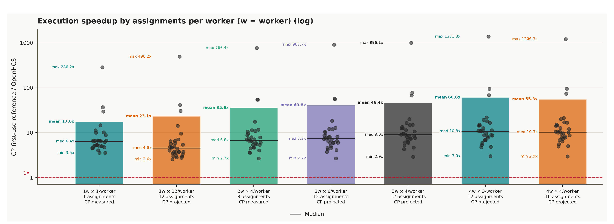
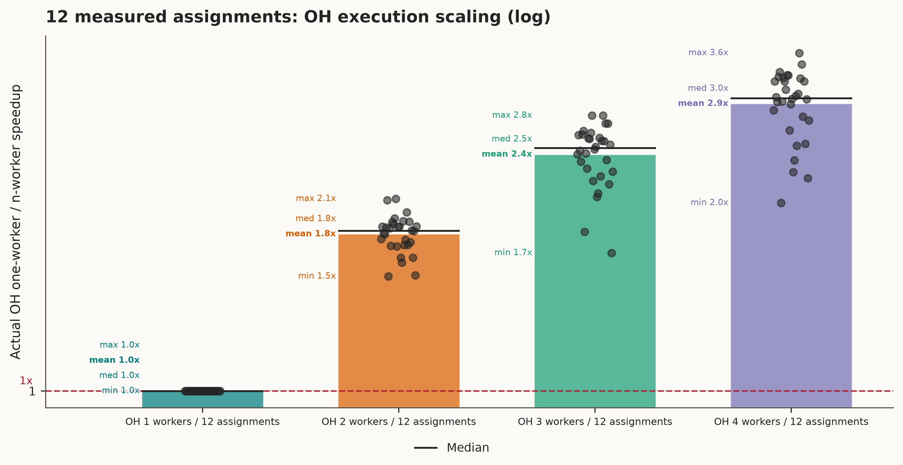

# OpenHCS supplementary material

Development history and full instructions are kept in the [archived supplementary source](editorial_history_20261007.md). Measurement tables, pipelines and input evidence remain linked below.

## Supplementary Figure 1. Runtime composition and preparation

{width=4.8in}

::: {custom-style="ImageCaption"}
(I, A–D) Array axes and groups supply image views to per-plane, stack or stack-reduction functions. Named labels remain available to later measurements; sequential timepoints complete in order while wells can run in parallel. (II) Compiled plans, prepared functions and a worker map form the execution bundle. The [figure assembly and interface records](#figure-assembly-and-interface-records) link the source artwork; main Figures 1–2 show the native workflow and process topology.
:::

## Supplementary Figure 2. Translocation response and compartment eligibility

{width=5.7in}

::: {custom-style="ImageCaption"}
(A–B) Eligible-nucleus fractions in 96 BBBC013 wells, including four development wells. Dots show four wells per dose; marks and whiskers show their mean and sample SD. Main Figure 4E shows the response curves. (C–D) An earlier independent held-out trial used mean cell-level GFP ratios, with four wells per control condition. The two trials used different well summaries: mean GFP ratio and median log2 ratio. Supplementary Data 7–8 give the methods and source data.
:::

## Supplementary Figure 3. Nuclear-instance evaluation and object separation

{width=5.7in}

::: {custom-style="ImageCaption"}
(I, A–B) Final BBBC039 segmentations from two independent authors on 200 fields, with pooled object F1 of 0.898 and 0.906 at intersection over union ≥ 0.5. (II, A–B) Earlier prospective BBBC039 F1/Dice on 50 held-out fields and BBBC007 boundary support on 12. Each trial used four development fields. Boundary support is the fraction of predicted boundary pixels within two pixels of a manual outline. Supplementary Data 7–8 provide counts and per-field scores.
:::

## Supplementary Figure 4. Independent morphology checks and remaining ambiguities

{width=5.4in}

::: {custom-style="ImageCaption"}
(A–C) Nuclear centres from an independent volume analysis in XY, XZ and YZ. (D–F) Retinal border region shown raw, with first and final outlines; a possible split remains at display window 0–42, gamma 1. (G–I) A faint DNA pair remains merged at window 0–151. (J–L) A nuclear seed lacks actin-supported body growth at window 0–104, gamma 1. The panels show separate trials; colours identify objects within each image. Supplementary Data 8 links the source captures and matching records.
:::

## Supplementary Figure 5. Laboratory treatment responses compared with MetaXpress

{width=5in}

::: {custom-style="ImageCaption"}
(A–B) Detected cells; (C–D) total outgrowth; (E–F) branches per cell; (G–H) mean cell process length; (I–J) mean cell median process length. Twenty matched wells were analysed after assisted repair. Each curve is normalized to its own DMSO mean; dots show two technical wells per dose and whiskers their sample SD. Mean outgrowth per detected cell is included in the linked six-endpoint sheet.
:::

### Treatment evaluation and endpoint definitions

For the laboratory neurite comparison, we applied the frozen recipe settings
to nine fields in each of 20 FC-A and Y27632 wells using the current production
backend. An evaluation-only source key linked coded inputs to physical wells.
Each well's endpoint was the unweighted mean of nine field-level measurements:
outgrowth per detected cell, cell count, total outgrowth, branches per cell,
and mean and median process length. For the last two endpoints, we first
averaged the corresponding per-cell values within each field, including
zero-growth cells. Overlapping fields were not deduplicated; total outgrowth
therefore denotes a mean field total, not unique whole-well length.
Existing MetaXpress well exports supplied the
comparison response, not manual tracing truth. This fixed-recipe transfer was
separate from autonomous pipeline authoring.

We retained these predictions when subsequent visual inspection identified
shafts included in soma masks, spurious soma-edge branches and supported paths
lost during tracing. Repairs informed by those external observations were
evaluated separately as assisted development, not autonomous authoring. The
comparison retained the same channels, pixel calibration, field sampling and
well aggregation. Matched raw-image, soma-mask and path views were used to
check recovered shafts and genuine branches alongside unsupported routes;
agreement with MetaXpress fold changes was not a tuning criterion.

The commercial export contains 120 well summaries from two plates. The repaired run used DAPI w1 and calcein w2, declared XY spacing 1.3556 µm per pixel, neurite response 30 and candidate admission 0.03. The completed 180-field evaluation used repaired ownership propagation and branch counting; detected-cell counts were unchanged in every field relative to the preceding assisted checkpoint. That comparison concerns the latest ownership/junction fix.

Each FC-A and Y27632 concentration has two technical wells. Y27632 is labelled Y27 in the export. The [six-endpoint sheet](../figures/slas/personal_neurite_effects_repaired.png) includes mean outgrowth per detected cell and the endpoints in Supplementary Figure 5.

Every endpoint is divided by the same drug
curve's zero-dose DMSO mean. Dots show the two technical
wells at each concentration. Marks and whiskers show their mean and sample
standard deviation after division by the observed control mean; they do not
propagate uncertainty in that denominator or represent confidence intervals.
Dose positions are equally spaced for display, not a fitted concentration–response
model. Paired treatment panels use the same vertical scale. The plot and
numerical tables are generated from the same well measurements.

The commercial endpoint is an existing well export whose exact site weighting
and software settings are not retained. The
[MetaXpress 6 Neurite Outgrowth guide](https://www.moleculardevices.com/sites/default/files/en/assets/training-material/dd/img/metaxpress-6-software-application-modules-neurite-outgrowth.pdf)
defines total outgrowth in micrometres with diagonal-length correction, primary
processes as outgrowths attached to cell bodies, and branches as branching
junctions rather than daughter-process counts. It does not specify how the
module distinguishes crossings from branches. These documented definitions
do not establish identical segmentation or topology for the retained export;
absolute lengths and counts are not treated as equivalent.
Within-method ratios avoid a constant unit conversion but do not remove those
measurement differences. Neither method is manual ground truth, and two
technical wells do not establish biological replication or significance.

OpenHCS process lengths describe the connected paths assigned to a
soma-adjacent root, including daughter branches, rather than individual
segments between graph junctions. Branches require at least three same-neuron paths and distinct
admitted image arms around the junction. Paths sharing one image corridor
and graph stars confined within a foreground cap do not add branch events;
resolved crossings are not automatically branches. These
definitions specify the OpenHCS measurements without asserting that the
commercial algorithm uses identical topology or aggregation.

The [joined physical-well table](personal_neurite_repaired_morphometry/joined_wells.csv)
and [treatment-effect table](personal_neurite_repaired_morphometry/treatment_effects.csv)
retain well identities, means, sample standard deviations, counts, raw deltas,
fold changes and fractional-change differences. Cell-count changes accompany
outgrowth to expose denominator changes without inferring toxicity. The
[source hashes](personal_neurite_repaired_morphometry/source_evidence.json) identify the
exact submitted pipeline, source key, commercial export and all 180 native
summaries. The comparison script processes tables only and does not tune images.
Like total outgrowth, averaged field counts do not denote unique whole-well
neurons. Unselected wells are not filled with zero.
The [original frozen comparison](personal_neurite_baseline_morphometry/treatment_effects.csv)
is retained separately for before/after evaluation; it was not overwritten.

Additional [branch and primary-process totals](personal_neurite_branch_diagnostics/joined_wells.csv)
and their [treatment responses](personal_neurite_branch_diagnostics/treatment_effects.csv)
test whether smaller estimated branching fold changes are explained by the cell denominator.
At 40 µM, total-branch fold changes are 1.65 versus 3.01 for FC-A and 1.73
versus 3.03 for Y27632 (OpenHCS versus MetaXpress). Branches per primary
process likewise give smaller estimated fold changes: 1.31 versus 2.48 and 1.29 versus
2.23, respectively. The difference therefore persists without a cell-count
denominator. OpenHCS totals are means of field totals, and its branch/process
endpoint is the mean of the nine field ratios. The commercial comparison
uses ratios of exported well totals; its internal site weighting and primary
process definition remain unspecified. These diagnostic ratios are not proof
of equivalent topology or of which method is more accurate. Their
[source record](personal_neurite_branch_diagnostics/source_evidence.json)
identifies the same completed assisted evaluation, not an additional autonomous trial.

### Assisted transfer results

Following externally informed repairs, analysis of all 180 fields in 20 matched
wells recovered increasing outgrowth-per-cell responses to FC-A and Y27632
(Figure 5; Supplementary Figure 5). At 40 µM, OpenHCS fold changes were
1.77 and 1.76, respectively, versus MetaXpress's 1.98 and 2.05. Total-outgrowth
estimated fold changes were also smaller. Branches-per-cell fold changes were 1.65 versus
3.00 for FC-A and 1.82 versus 3.26 for Y27632. OpenHCS control branch counts
per cell were approximately 10–11% higher, but treated counts were 38–39%
lower. Cell counts were unchanged in all 180 fields across the latest
ownership/junction fix relative to the preceding assisted checkpoint;
the difference persisted in total branches and branches per primary process.
Control excess alone therefore does not explain the smaller estimated branching fold changes. Remaining
branch recall, assignment and measurement-definition differences cannot be
separated without spatial ground truth. Both methods recovered concordant
positive outgrowth responses with different measured magnitudes. This is an
assisted-development evaluation, separate from autonomous authoring.

## Supplementary Figure 6. Single-sample execution and total speedups

{width=6in}

::: {custom-style="ImageCaption"}
Execution and compile-plus-run total speedups for thirty workflows, with one assignment, one worker and one numerical thread. Points are workflows; bars show arithmetic means, black lines medians and the dashed line equal runtime. Each ratio uses one measured CellProfiler first-use-inclusive batch divided by the median of three OpenHCS repetitions after warmup. Native internal initialization is included; external process and server startup are excluded. Supplementary Data 3 links linear views, paired clocks, efficiency tables and native projection calibration.
:::

## Supplementary Figure 6, continued. Assignments per worker

{width=6.5in}

::: {custom-style="ImageCaption"}
Each configuration contains thirty workflow points; bars show arithmetic means and black lines medians. The labels give workers (w), assignments per worker and total assignments. CellProfiler 1- and 8-assignment first-use-inclusive batches were measured; 12- and 16-assignment references were projected from the measured 8-assignment batch and warmed per-assignment rate. OpenHCS times are medians of three repetitions after warmup. The dashed line marks equal runtime. Repeated assignments are computational replicates, not independent biological samples. Main Figure 6A shows four configurations from this sweep; this view includes all seven and makes assignments per worker explicit.
:::

## Supplementary Figure 6, continued. Fixed-workload scaling

{width=6in}

::: {custom-style="ImageCaption"}
Execution scaling for thirty workflows: measured one-worker time divided by measured time at each worker count, with twelve assignments held fixed. Each time is the median of three repetitions after warmup. Points are workflows, bars means and black lines medians. These ratios use only measured OpenHCS times. The corresponding total-time and efficiency plots are linked in Supplementary Data 3.
:::

## Supplementary Table 1. Reusable libraries and their roles

| Library | Role in OpenHCS |
| --- | --- |
| [metaclass-registry](https://github.com/OpenHCSDev/metaclass-registry) | Discovers classes implementing a shared interface and makes them available for selection. |
| [python-introspect](https://github.com/OpenHCSDev/python-introspect) | Reads a function's parameters, types, defaults and documentation. |
| [ObjectState](https://github.com/OpenHCSDev/objectstate) | Tracks editable settings and resolves shared defaults and local overrides. |
| [pyqt-reactive](https://github.com/OpenHCSDev/pyqt-reactive) | Generates parameter controls and updates them as settings change. |
| [pycodify](https://github.com/OpenHCSDev/pycodify) | Generates editable Python representations and manages their imports. |
| [ArrayBridge](https://github.com/OpenHCSDev/arraybridge) | Converts arrays between supported libraries and manages their computational resources. |
| [PolyStore](https://github.com/OpenHCSDev/PolyStore) | Reads, writes and streams data through supported storage interfaces. |
| [ZMQRuntime](https://github.com/OpenHCSDev/zmqruntime) | Coordinates communication, startup, shutdown and progress between processes. |

## Supplementary Data 1. CellProfiler workflow comparison

### Import, export and comparison methods

Imported `ExportToDatabase` modules run once per plate after image-group processing. They collect the selected images, objects, measurements, relationships, thumbnails and grouping information into CellProfiler Analyst tables [@Jones2008]. The export produces a self-contained SQLite database and matching `.properties` files. Non-SQLite databases, custom filter rows, `.workspace` generation and some historical aggregation settings remain unsupported; unsupported requests fail or are identified in the compatibility documentation.

The OpenHCS 0.8.5 [release test](ci_official30_085/README.md) preceded the unified 30-workflow value comparison below.

An earlier matched performance evaluation compared the declared table, database and image outputs for all 30 workflows in a warmup and three measured repetitions per engine. All 120 OpenHCS observations matched complete native CellProfiler runs. The [original matched benchmark](../../benchmark/results/matched_min3_integrated_main_20261007/README.md) gives its output inventories and timing boundaries. Supplementary Data 3 describes the subsequent first-use-inclusive worker sweep used in main Figure 6.

For the five workflows without file exports, terminal image or object-label exports were appended while preserving the original processing modules and settings. Native CellProfiler generated eight additional reference artifacts. A subsequent unified run compiled and executed all 30 workflows afresh and compared each candidate with its selected native reference values. Object labels were compared exactly after singleton-axis normalization; numerical images used the stated float tolerances. The following sections give the export definitions, reference inventory and per-workflow comparisons. The original unified-run environment was not recorded; the five-workflow export audit has its own recorded environment.

The corpus contains 22 workflows and associated image sets from the official CellProfiler 3 examples repository, seven workflows and image sets from the official CellProfiler tutorials repository, and one workflow from the supplement to the CellProfiler 4 performance study [@CellProfilerExamples; @CellProfilerTutorials; @Stirling2021]. The CellProfiler project and the cited dataset contributors retain authorship and provenance for these materials. The retained manifest maps workflow names to pipeline and image locations; Supplementary Data 1-3 provide the corresponding comparison, coverage and throughput tables.

This supplement indexes source tables and evaluation records. Figure scripts
derive panels and plotted-row exports from the linked files; paths are relative
to this file.

The acquisition scripts pin the official CellProfiler examples to
`4972b59e670a4ae96c3d453803c92eeff378d054`, the official tutorials to
`264a8155da21a2d468051f78211bed2e580a8934`, and the CellProfiler 4 benchmark
supplement to `40abc2e600fd46b74c213999dd25c5245048dc92`.

### Declared exported-file coverage

The matched run checked every declared exported file in each workflow: a
file-level fraction of 1.00. Counts below come from the original
[matched-run reports](../../benchmark/results/matched_min3_integrated_main_20261007/README.md),
with one warmup and three measured repetitions. All four observations per
workflow had complete output inventories and zero image, CSV or database
differences. The original comparator rejects files without a value-comparison
route. This fraction describes exported files; internal intermediates and
individual measurement columns are not its denominator.

| Workflow | Declared files checked / declared files |
| --- | --- |
| [ExampleColocalization](../../benchmark/results/matched_min3_integrated_main_20261007/reports/singlewell/ExampleColocalization/candidate_report.json) | 1 / 1 |
| [ExampleCometAssay](../../benchmark/results/matched_min3_integrated_main_20261007/reports/singlewell/ExampleCometAssay/candidate_report.json) | 6 / 6 |
| [ExampleFly](../../benchmark/results/matched_min3_integrated_main_20261007/reports/singlewell/ExampleFly/candidate_report.json) | 7 / 7 |
| [ExampleFlyURL](../../benchmark/results/matched_min3_integrated_main_20261007/reports/singlewell/ExampleFlyURL/candidate_report.json) | 7 / 7 |
| [ExampleHuman](../../benchmark/results/matched_min3_integrated_main_20261007/reports/singlewell/ExampleHuman/candidate_report.json) | 7 / 7 |
| [ExampleIlluminationCorrection_Example1_AllMethod](../../benchmark/results/matched_min3_integrated_main_20261007/reports/singlewell/ExampleIlluminationCorrection_Example1_AllMethod/candidate_report.json) | 1 / 1 |
| [ExampleIlluminationCorrection_Example1_EachMethod](../../benchmark/results/matched_min3_integrated_main_20261007/reports/singlewell/ExampleIlluminationCorrection_Example1_EachMethod/candidate_report.json) | 1 / 1 |
| [ExampleIlluminationCorrection_Example2](../../benchmark/results/matched_min3_integrated_main_20261007/reports/singlewell/ExampleIlluminationCorrection_Example2/candidate_report.json) | 3 / 3 |
| [ExampleIlluminationCorrection_Example3](../../benchmark/results/matched_min3_integrated_main_20261007/reports/singlewell/ExampleIlluminationCorrection_Example3/candidate_report.json) | 2 / 2 |
| [ExampleImagingFlowCytometryObjectsInGrid](../../benchmark/results/matched_min3_integrated_main_20261007/reports/singlewell/ExampleImagingFlowCytometryObjectsInGrid/candidate_report.json) | 1 / 1 |
| [ExampleNeighbors](../../benchmark/results/matched_min3_integrated_main_20261007/reports/singlewell/ExampleNeighbors/candidate_report.json) | 4 / 4 |
| [ExamplePercentPositive](../../benchmark/results/matched_min3_integrated_main_20261007/reports/singlewell/ExamplePercentPositive/candidate_report.json) | 5 / 5 |
| [ExampleSpeckles](../../benchmark/results/matched_min3_integrated_main_20261007/reports/singlewell/ExampleSpeckles/candidate_report.json) | 3 / 3 |
| [ExampleTrackObjects](../../benchmark/results/matched_min3_integrated_main_20261007/reports/singlewell/ExampleTrackObjects/candidate_report.json) | 23 / 23 |
| [ExampleTumor](../../benchmark/results/matched_min3_integrated_main_20261007/reports/singlewell/ExampleTumor/candidate_report.json) | 3 / 3 |
| [ExampleUntangleAndStraightenWorms](../../benchmark/results/matched_min3_integrated_main_20261007/reports/singlewell/ExampleUntangleAndStraightenWorms/candidate_report.json) | 1 / 1 |
| [ExampleUntangleWorms](../../benchmark/results/matched_min3_integrated_main_20261007/reports/singlewell/ExampleUntangleWorms/candidate_report.json) | 4 / 4 |
| [ExampleUntangleWormsBrightField](../../benchmark/results/matched_min3_integrated_main_20261007/reports/singlewell/ExampleUntangleWormsBrightField/candidate_report.json) | 1 / 1 |
| [ExampleVitra](../../benchmark/results/matched_min3_integrated_main_20261007/reports/singlewell/ExampleVitra/candidate_report.json) | 5 / 5 |
| [ExampleWoundHealing](../../benchmark/results/matched_min3_integrated_main_20261007/reports/singlewell/ExampleWoundHealing/candidate_report.json) | 1 / 1 |
| [ExampleYeastColonies](../../benchmark/results/matched_min3_integrated_main_20261007/reports/singlewell/ExampleYeastColonies/candidate_report.json) | 3 / 3 |
| [ExampleYeastPatches](../../benchmark/results/matched_min3_integrated_main_20261007/reports/singlewell/ExampleYeastPatches/candidate_report.json) | 7 / 7 |
| [cp4_supplement_combine_objects](../../benchmark/results/matched_min3_integrated_main_20261007/reports/singlewell/cp4_supplement_combine_objects/candidate_report.json) | 1 / 1 |
| [cp_tutorial_3d_monolayer](../../benchmark/results/matched_min3_integrated_main_20261007/reports/singlewell/cp_tutorial_3d_monolayer/candidate_report.json) | 8 / 8 |
| [cp_tutorial_advanced_segmentation_final](../../benchmark/results/matched_min3_integrated_main_20261007/reports/singlewell/cp_tutorial_advanced_segmentation_final/candidate_report.json) | 8 / 8 |
| [cp_tutorial_beginner_segmentation_final](../../benchmark/results/matched_min3_integrated_main_20261007/reports/singlewell/cp_tutorial_beginner_segmentation_final/candidate_report.json) | 9 / 9 |
| [cp_tutorial_pixel_based_classification](../../benchmark/results/matched_min3_integrated_main_20261007/reports/singlewell/cp_tutorial_pixel_based_classification/candidate_report.json) | 3 / 3 |
| [cp_tutorial_quality_control](../../benchmark/results/matched_min3_integrated_main_20261007/reports/singlewell/cp_tutorial_quality_control/candidate_report.json) | 3 / 3 |
| [cp_tutorial_translocation_final](../../benchmark/results/matched_min3_integrated_main_20261007/reports/singlewell/cp_tutorial_translocation_final/candidate_report.json) | 3 / 3 |
| [cp_tutorial_translocation_start](../../benchmark/results/matched_min3_integrated_main_20261007/reports/singlewell/cp_tutorial_translocation_start/candidate_report.json) | 1 / 1 |

### Unified 30-workflow value comparison

The [unified evidence directory](../../benchmark/results/official30_unified_value_comparison_20260916/README.md)
preserves one immutable run in which all 30 workflows were compiled and executed
afresh through isolated ZMQ execution endpoints. All 30 selected reference-value
comparisons were equivalent and reported zero differences. Its fresh
[reference inventory](../../benchmark/results/official30_unified_value_comparison_20260916/reference_inventory.csv)
contains 21 CSV profiles, three SQLite profiles and six image- or array-only
profiles. Image comparison executed for seven workflows, including the completed
translocation overlay compared alongside its SQLite values.

The [observations](../../benchmark/results/official30_unified_value_comparison_20260916/observations.csv),
[phase timings](../../benchmark/results/official30_unified_value_comparison_20260916/phase_timing.csv),
and [summary](../../benchmark/results/official30_unified_value_comparison_20260916/summary.csv)
retain the comparison results. The original observations identify the candidate
as OpenHCS 0.8.5 and retain endpoint, executable and submitted-pipeline provenance.
The original run environment was not recorded in this bundle; versions from later runs cannot supply it.

### Five-workflow image and object-label exports

Five source workflows compute images or objects without exporting files. The
[export-extension manifest](../../benchmark/manifests/official30_value_completion_20260914.json)
selects versions of those workflows with terminal exports added. Its generated
pipelines retain the original processing modules and settings. Native CellProfiler
produced the exported references; OpenHCS processed the same scoped inputs.

| Workflow | Exported values compared | Result |
| --- | --- | --- |
| Combine objects | Combined-object labels | Exact label agreement |
| Translocation starter | Nuclear labels | Exact label agreement |
| Illumination Example 1, EachMethod | Corrected green image | Float-tolerance agreement |
| Illumination Example 2 | Uncorrected, small-block-corrected and large-block-corrected nuclear labels | Exact agreement for all three label images |
| Illumination Example 3 | Polynomial-corrected and convex-hull-corrected images | Float-tolerance agreement for both images |

The [per-artifact comparison table](../../benchmark/results/official30_value_completion_20260914/label_aware_exact_commit_run/artifact_comparisons.csv)
records eight passing artifacts. All five integer label images agree exactly
after normalization of singleton dimensions. The three numerical images have
zero pixels outside the absolute and relative tolerances of `1e-6`; their
maximum absolute difference is `2.9802322387695312e-8`. The
[per-workflow observations](../../benchmark/results/official30_value_completion_20260914/label_aware_exact_commit_run/observations.jsonl)
link these comparisons to fresh candidate executions and the retained native
outputs.

The [run environment](../../benchmark/results/official30_value_completion_20260914/label_aware_exact_commit_run/run_environment.json)
identifies OpenHCS execution source `7ca8ecb8e73a882ef0f15616d57b00f0dabf73e0`,
Python 3.12.3, NumPy 2.1.3 and SciPy 1.18.0. Native references were generated
with CellProfiler 4.2.8.1 on Python 3.9.25, NumPy 1.24.4 and SciPy 1.9.0.
Each candidate ran through a fresh matching OpenHCS endpoint. Source revisions,
native-reference origin and endpoint identities are retained with the results.
These exported references are incorporated into the unified 30-workflow run;
the earlier five-workflow audit and release records retain their own protocols
and identities.

## Supplementary Data 2. Archived CellProfiler coverage

- [Module names and associated workflows](../../benchmark/results/labmeeting_20260513/official30_well_throughput/figures/module_coverage_cppipe_modules.csv).
- [Individual settings and recorded handling categories](../../benchmark/results/labmeeting_20260513/official30_well_throughput/figures/module_coverage_cppipe_settings.csv).
- [Processing registration and corpus membership](../../benchmark/results/labmeeting_20260513/official30_well_throughput/figures/module_coverage_absorbed_modules.csv).

These files describe the archived coverage report. Setting categories distinguish
bound parameters, artifact contracts, infrastructure, and intentionally ignored
settings. Registration or a handling category is not itself an output-equivalence
test. Module aliases and source/export roles differ between the tables, so their
category totals must not be added as mutually exclusive classes. They are not a
current-version compatibility matrix.

## Supplementary Data 3. Worker measurements

### Current matched thirty-workflow sweep

- [Qualified full record and clock policy](../../benchmark/results/matched_worker_sweep_20261007_exportfixed/README.md), with the [seven-configuration protocol](../../benchmark/results/matched_worker_sweep_20261007_exportfixed/protocol/v6/protocol-manifest.json).
- [Single-sample execution and total, linear](../figures/slas/benchmark-publication/measured_benchmark_publication.png) and [logarithmic](../figures/slas/benchmark-publication/measured_benchmark_publication_log.png), with [manuscript numerical claims](../figures/slas/benchmark-publication/benchmark_claims.json).
- Rebuilt reference chart forms: [per-workflow speedups](../figures/slas/benchmark-publication/reference-layout/reference_pipeline_speedup_log.svg), [worker summary](../figures/slas/benchmark-publication/reference-layout/reference_core_summary_log.svg), [assignment summary](../figures/slas/benchmark-publication/reference-layout/reference_assignments_summary_log.svg), [output agreement](../figures/slas/benchmark-publication/reference-layout/reference_parity.svg), and [graded module coverage](../figures/slas/benchmark-publication/reference-layout/reference_module_coverage.svg), with the [per-module behavior and test attribution](../figures/slas/benchmark-publication/reference-layout/reference_module_coverage.csv).
- May execution speedups: [linear](../figures/slas/benchmark-publication/may/execution/may_execution_mean_workflow_points.png), [logarithmic](../figures/slas/benchmark-publication/may/execution/may_execution_mean_workflow_points_log.png), and [all paired clocks and ratios](../figures/slas/benchmark-publication/may/execution/first_use_workflow_metrics.csv).
- May total speedups: [linear](../figures/slas/benchmark-publication/may/total/may_total_mean_workflow_points.png), [logarithmic](../figures/slas/benchmark-publication/may/total/may_total_mean_workflow_points_log.png), and [all paired clocks and ratios](../figures/slas/benchmark-publication/may/total/first_use_workflow_metrics.csv).
- Actual fixed-twelve execution scaling: [linear](../figures/slas/benchmark-publication/fixed12/execution/scaling/fixed12_execution_scaling.png), [logarithmic](../figures/slas/benchmark-publication/fixed12/execution/scaling/fixed12_execution_scaling_log.png), [scaling table](../figures/slas/benchmark-publication/fixed12/execution/scaling/derived_workflow_metrics.csv), and [parallel efficiency](../figures/slas/benchmark-publication/fixed12/execution/efficiency/derived_workflow_metrics.csv).
- Actual fixed-twelve total scaling: [linear](../figures/slas/benchmark-publication/fixed12/total/scaling/fixed12_total_scaling.png), [logarithmic](../figures/slas/benchmark-publication/fixed12/total/scaling/fixed12_total_scaling_log.png), [scaling table](../figures/slas/benchmark-publication/fixed12/total/scaling/derived_workflow_metrics.csv), and [parallel efficiency](../figures/slas/benchmark-publication/fixed12/total/efficiency/derived_workflow_metrics.csv).
- [Actual one/eight-assignment native calibration](../../benchmark/results/matched_worker_sweep_20261007_exportfixed/diagnostics/native-full30-calibration/README.md), [calibration table](../figures/slas/benchmark-publication/native_actual1_actual8_calibration/actual_native_batch_calibration.csv), and [projection validation](../../benchmark/results/matched_worker_sweep_20261007_exportfixed/calibration/cold_first/cold-first-model-validation.json).

All thirty workflows pass output parity. CP1/CP8 references remain actual
first-batch observations; CP12/CP16 remain explicitly projected and retain zero
actual target native observations. Native calibration differs in allowed CPU
counts between the one- and eight-assignment captures; the projection check
covers three workflows and is not full-cohort measured validation. The record
preserves signed within-session and cross-session errors. All OpenHCS scaling
ratios use actual, same-workload medians. No historical RAM values fill the
unavailable process-tree RAM field.

Historical timing panels and scaling protocols are in the archived supplementary source linked above.

## Figure assembly and interface records

The [supplement generator](../figures/build_slas_supplement.py) combines existing artwork and saves editable SVG, PDF and PNG outputs. It changes layout only; measurements, segmentation and display contrast are unchanged.

Source illustrations show [array grouping and scheduling](../figures/slas/runtime_composition.png), [function preparation](../figures/slas/compiler_preparation.png), [connected images and measurements](../figures/slas/outputs_and_inspection.png), [custom-function registration](../figures/slas/custom_function_extension.png), [CellProfiler translation](../figures/slas/cellprofiler_translation.png), and [Fiji/napari inspection](../figures/slas/inspectable_results.png).

The [native code/field interaction record](../figures/slas/authoring_verified_roundtrip_provenance.json) documents the parameter-edit round trip. Main Figure 1 uses the [two-plate capture](../figures/slas/figure1_two_plate_native_20261007/capture_evidence.json), with ExampleHuman's nine-step recipe displayed, and the native [custom-function form](../figures/slas/custom_extension_live_parameters_capture_provenance.json) and [code capture](../figures/slas/custom_extension_live_code_capture_provenance.json). The [capture-source record](../figures/slas/custom_extension_live_evidence.json) identifies the source state at capture. The custom function has gain 1.2 and offset 0.0; the [code readback](../figures/slas/custom_extension_live_code_document.json) identifies the same function. These captures show authoring controls; the function was not executed on an assay.

The [translation source](../figures/slas/cellprofiler_translation_provenance.json) maps ExampleCometAssay to 12 OpenHCS steps and checks the generated Python round trip. Image and ROI inspection examples are attributed in the [gallery source record](../../website/assets/gallery/release-media-record.json).

## Supplementary Data 4. Method-directed NeuronCyto demonstration

A gpt-5.6-sol agent analysed NeuronCyto II image 1 through MCP using a method-directed brief. The brief specified channel roles, normalization, neurite enhancement, nucleus and soma segmentation, rooted neurite assignment, and morphology outputs. The original run produced nine neurons, ten nuclei, eight branches, 25 graph paths and 1,982 pixels of total outgrowth. It demonstrates authoring, execution and inspection; no manual segmentation score was supplied.

The [original evaluation](../../website/assets/agent/cold-start-workflow-record.json) contains the prompt, input hashes, software/model versions, tool calls, outputs and viewer checks. The [figure source](../figures/slas/figure3_provenance.json) identifies the original recording. Later corrections and replays used the same images with their own pipelines and outputs.

Figure artwork uses unmodified Lucide icons under the [licence](../figures/assets/lucide/LICENSE); the [source record](../figures/assets/lucide/SOURCE.txt) identifies their revision.

### Current-source replay after algorithm development

A separate OpenHCS 0.8.5 replay used the same two public images with
nuclear-supported soma detection and soma-rooted path assignment. It produced
eight neuronal cell bodies, eight nuclei, 18 processes, two branch events,
one resolved crossover and 24 graph paths. The eight per-cell table totals
agree with the graph distance features and sum to 2556.137 pixels under unit
spacing. The [current replay summary](current_neurite_replay_summary.md)
identifies its execution, saved source and native receipts separately from
the original demonstration and the OpenHCS 0.7.14 correction.

### Published manual-tracing references

The [NeuronCyto II publication](https://doi.org/10.1002/cyto.a.22872) supplies independent measurements
for image 1 in its supplementary files 8–10. The two input TIFFs used here are
byte-identical to `CrossOvers_Images/1_w1.tif` and `1_w2.tif` in the public
`Testing image.zip` archive. The checksums are listed in the original run record.

| Published reference | Image 1 entry | Source file |
| --- | --- | --- |
| Manually traced neurons | Eight per-cell entries | Supplement 9 |
| Neurite length by branch order | Primary 3,633.672; secondary 198.929; tertiary 0; total 3,832.601 | Supplement 8 |
| Crossover count | Three crossovers; NeuronCyto II resolved two | Supplement 10 |

Lengths above retain the numerical units of the source tables. The eight
per-cell reference lengths are 426.82, 172.375, 751.962, 395.04, 669.783,
343.629, 587.841 and 485.152. These entries give a reference against which to
investigate the nine reported neurons. Spatial cell matching, measurement-unit
alignment and agreement on the definition of neurite length are needed before
computing per-cell accuracy. The public testing archive contains the images;
downloadable manual trace coordinates have not been located. The published
crossover count and the OpenHCS branch count measure different quantities.

Main Figure 5A/B and D–F are full-resolution presentations of the frozen raw
arrays, body-label planes and graph-path archives, rather than reduced native
viewer screenshots. The [source manifest](../figures/slas/frozen_neurite_views.json)
records the six original file hashes and the recorded raw display windows.
Dark label colours and vector strokes are display choices only; no analysis
was rerun or coordinates changed. Figure 5C uses an unmodified embedded JPEG
from page 4 of the published article PDF, giving a 450-pixel panel crop instead
of the earlier 225-pixel web crop. Its source, extraction and attribution are
recorded in the [published-reference record](../figures/slas/neuroncyto_published_reference/source.json).

The [reference audit](neuroncyto_reference_audit.md) records the source links,
file checksums and ROI identifiers. These measurements were examined after the
recorded agent run and were not supplied to the agent during authoring.

## Supplementary Data 5. Complex CellProfiler workflow imports

The [derived workflow report](complex_cellprofiler_workflows.md) lists every
imported step, its function names and call count for the advanced segmentation
and 3D monolayer tutorials. It links the source pipelines and generated editable
Python. The generator checks function identities and parameters after reloading
each document and records the hashes of the source pipelines, importer and
function implementations.

These are import and code-round-trip checks. Supplementary Data 1 separately
records the release CI executions and selected output comparisons for both
workflows.

## Supplementary Data 6. Workflow regression tests

The tests exercise representative authoring and validation cases alongside the
recorded UI demonstration. The following source files are pinned to commit
`7a7d21fee726905b87b9020cebf0bdfc350631f4`; these three test files are unchanged
from the OpenHCS 0.8.5 release commit.

| Tested behavior | Source tests |
| --- | --- |
| Nested and inherited configuration, parameter order, enum identity and function-step reconstruction | [Python generation tests](https://github.com/OpenHCSDev/openhcs/blob/7a7d21fee726905b87b9020cebf0bdfc350631f4/tests/unit/test_pycodify_formatters.py) |
| Rejection of incompatible memory types, grouping, required axes and stack configuration | [Compiled-function validation tests](https://github.com/OpenHCSDev/openhcs/blob/7a7d21fee726905b87b9020cebf0bdfc350631f4/tests/unit/test_funcstep_contract_validator.py) |
| Rejection of a function-detail request using a stale catalog revision | [Function-catalog tests](https://github.com/OpenHCSDev/openhcs/blob/7a7d21fee726905b87b9020cebf0bdfc350631f4/tests/unit/test_function_catalog_zmq.py) |

The [unit-test job](https://github.com/OpenHCSDev/openhcs/actions/runs/34870874969/job/104066142788)
passed while selecting `tests/unit` and `tests/core`. These focused tests include
controlled fixtures and isolate the stated behavior. The real-corpus execution
and value comparisons are provided by the separate Official30 job in
Supplementary Data 1.

## Supplementary Data 7. Prospective agent-authored assay validation

### Earlier prospective held-out results

The three prospectively authored workflows were applied without scientific parameter changes after their held-out partitions were disclosed (Supplementary Figures 2–3). On the 50 BBBC039 fields, 4,733 of 5,720 reference nuclei matched at intersection over union at least 0.5. Pooled precision was 0.680, recall was 0.827 and object F1 was 0.746; mean field foreground Dice was 0.935. The workflow predicted 6,964 nuclei, 1,244 more than the reference, and the overlap diagnostic identified more split reference instances than merged predictions. The first blind pipeline therefore recovered nuclear foreground well while over-segmenting instances.

On the 12 BBBC007 fields, 29,450 of 43,875 relevant predicted adjacent-cell boundary pixels were within two pixels of a manual outline, a pooled fraction of 0.671. The workflow predicted 1,274 nuclei and 1,273 cells; every predicted nucleus overlapped a cell and one cell shared two nuclei. The manual outlines enclosed 1,082 closed nuclear interiors, while 12 open or frame-connected regions were excluded. Because the boundary score is directed from predictions to the outline union, it can reward an incomplete segmentation and does not establish object correspondence.

The BBBC013 run produced matched nuclear and cytoplasmic measurements for 14,262 cells across all 92 held-out wells. Wortmannin controls separated with Z-prime 0.751 and mean nuclear-to-cytoplasmic GFP ratios of 7.235 and 0.915 for positive and negative controls. LY294002 controls gave Z-prime 0.554 and means of 7.219 and 1.127. Both held-out dose series showed the expected increase in nuclear translocation. This result evaluates recovery of the assay response; BBBC013 does not supply manual masks with which to score segmentation.

The [validation report](independent_agent_validation.md) gives the prospective
design and results for BBBC039, BBBC007 and BBBC013. Each trial used a
fresh gpt-5.6-sol author through the connected OpenHCS desktop and MCP surface.
Four development fields or wells were visible before the scientific pipeline
was frozen; held-out references and treatment metadata were then scored by the
typed evaluator in
[`benchmark/annotated_validation.py`](../../benchmark/annotated_validation.py).

The [evidence index](independent_validation/README.md) links final pipelines and
held-out scores. The [preparation record](../../benchmark/annotated_validation_20260915.md)
describes deterministic partitions, image normalization and evaluation definitions.
Prediction arrays, source images and file inventories are indexed in the linked
archive records.

The prospective held-out panels in Supplementary Figures 2–3 are generated by
[`build_slas_independent_validation.py`](../figures/build_slas_independent_validation.py)
from the three held-out scores. Its
[plot data](../figures/slas/independent_agent_validation_plot_data.csv) and
[source record](../figures/slas/independent_agent_validation_provenance.json)
link the plotted values to the original evaluations.

## Supplementary Data 8. Autonomous analysis evidence

### Source artwork and assisted mosaic review

Main Figure 5 shows public shafts, autonomous laboratory-field analysis and
assisted treatment responses.
The separate [assisted nine-field mosaic artwork](../figures/slas/p001_stitched_dev13_native.png)
and [overlap/core layout](../figures/slas/supp_neurite_morphology.png)
show stitching at the acquisition coordinates.
One pooled percentile pair was fitted per complete nine-field channel stack
before assembly. Some faint segments were missed, and ownership was unresolved
in crowded regions.
The [completed all-channel continuation](task_only_analysis/p001-allchannel25-qualified-completion.rst)
reported 1,740 soma candidates and 123,054 micrometres of computed outgrowth
at the declared spacing. These computed totals describe the continuation;
the earlier panels show sampled regions. Overlapping fields and uncertain
ownership prevent their interpretation as a unique biological census, and no
spatial reference validates the lengths.

The independent BBBC039 repeat matched 20,207 of 23,615 reference instances,
with 1,164 excess predictions and 3,408 misses. The earlier author matched
20,521, with 1,153 excess predictions and 3,094 misses. Pooled F1 values are
0.898 and 0.906, respectively, at intersection over union ≥ 0.5. The
[independent-author sheet](../figures/slas/bbbc039_independent_repeat.png)
shows this comparison; annotation-empty fields coincide
at the scatter origin.

The original artwork shows wider image regions and additional comparisons:
[process architecture](../figures/slas/process_architecture.png),
[runtime composition](../figures/slas/runtime_composition.png),
[compiler preparation](../figures/slas/compiler_preparation.png),
[typed extension](../figures/slas/custom_function_extension.png),
[full-plate translocation](../figures/slas/translocation_fresh23.png),
[translocation development](../figures/slas/bbbc013_development_repair.png),
[H001 scored review](../figures/slas/h001_scored_native.png),
[volume repair](../figures/slas/h002_fresh22_split_repair.png),
[orthogonal localisation](../figures/slas/h002_fresh10_native.png),
[retinal review](../figures/slas/retina_fresh16_repair.png),
[retinal development](../figures/slas/retinal_development_repair.png),
[paired DNA repair](../figures/slas/h003_native_repair.png),
[actin support checks](../figures/slas/h003_fresh19_matched.png),
[public shaft/junction review](../figures/slas/h004_assay_review.png) and
[public main shafts](../figures/slas/h004_main_shafts.png).
Retinal source: user-provided R0010 RBPMS images; physical calibration unverified.
DNA/actin source: BBBC007v1 A02, Sabatini laboratory, Whitehead Institute; CC0.

### Scientific instructions supplied to authors

The [instruction archive](task_only_analysis/original_task_briefs.json) links each trial to its original brief. The table summarizes scientific instructions and omits the dataset prefix from trial labels. Session details and operational instructions are available in the archive. The thick-shaft-only target was clarified after the neurite run and was absent from its original brief.

| Brief | Trial labels | Scientific instruction |
| --- | --- | --- |
| 1: BBBC007 nuclei and cells | `FRESH651_88`; `FRESH08_96`; `FRESH10_ROTATION_89`; `RETAINED_DEV13_94`; `FRESH19_95`; `FRESH26_96` | Segment nuclei and seeded cells from paired DNA/actin images across 16 source sets, with labels and object tables. Source bindings and optional custom-function tracks were supplied. |
| 2: Paired DNA and actin: full released sixteen-source collection | `FRESH19_95` | Analyse all sixteen paired DNA/actin fields, choosing the method from image measurements and packaged guidance. Inspect separated regions before selecting the final pipeline. |
| 3: BBBC013 GFP translocation | `REPEAT94`; `DEV02_94`; `DEV89`; `REMEDIATION02_89`; `FRESH13_88`; `FRESH15_96 (session)`; `FRESH15_96 (session)`; `FRESH20_88`; `FRESH23_96` | Measure nuclear and cytoplasmic GFP in 96 paired source sets and produce cell/well response tables. Source bindings, catalogue tracks and optional statistics extensions were supplied. |
| 4: BBBC039 nuclei | `FRESH594_88`; `FRESH612_96`; `FRESH656_88`; `FRESH08_88`; `FRESH10_COVERAGE_96`; `FRESH13_88` | Segment nuclear instances in 200 source sets and save label images and object measurements. The brief supplied source bindings and catalogue-only authoring. |
| 5: H001: bright-object segmentation | `FRESH10_96`; `FRESH586_96`; `FRESH19_89`; `FRESH22_96`; `FRESH25_FOURTH_95`; `FRESH25_ROTATION_94` | Segment bright objects in one two-dimensional image and report pixel areas and count. Review raw images and labels across positions and intensity windows. |
| 6: H002: 3-D centre detection | `CAPACITY_DEV94`; `FRESH651_95`; `FRESH656_96`; `FRESH10_89`; `FRESH10_ROTATION_96`; `FRESH13_89`; `FRESH15_89`; `FRESH22_89`; `FRESH23_ROTATION_89` | Detect nuclear centres in a three-dimensional volume and report z/y/x voxel coordinates and count. Inspect separated slices and orthogonal views; physical spacing was unverified. |
| 7: Paired nucleus and cell segmentation | `POSTPAUSE_88`; `FRESH656_96`; `FRESH656_88`; `FRESH09_95`; `FRESH10_96`; `FRESH15_96`; `FRESH16_94`; `FRESH23_89`; `FRESH25_89`; `FRESH26_89` | Segment nuclei and actin-supported cells in one paired field, preserving w1/w2 identity. Explicit source pairing and distributed multi-window review were required. |
| 8: H004 blind neurite-outgrowth analysis | `FRESH08_95`; `FRESH10_89`; `FRESH20_95`; `FRESH22_94`; `FRESH25_ROTATION_89` | Infer channel roles in one paired neurite field and measure supported somata and outgrowth. Review faint paths, background connections and crossing ownership before evaluation. |
| 9: Paired-field soma and neurite-outgrowth analysis | `FRESH20_95` | Analyse paired soma/neurite images, infer channel roles and save object/path measurements in pixel units. Keep the first attempt and later self-directed repairs. |
| 10: Blind neurite-outgrowth development task | `STITCH_DEV94`; `FRESH13_96`; `STITCH_DEV13_94`; `INPUT_REPAIRED22_88` | Analyse nine paired fields from one coded well, with w1 DAPI, w2 FITC and declared spacing 1.3556 µm per pixel. Choose the method independently and report uncertain crossing ownership. |
| 11: Personal nine-field neurite analysis | `INPUT_REPAIRED22_88`; `ALLCHANNEL_RETAINED_DEV25_88` | Analyse nine paired DAPI/calcein fields and their acquisition layout, including authorized mosaic work. Report fieldwise geometry without counting overlapping fields as unique cells. |
| 12: Personal nine-field neurite analysis: retained development | `RETAINED_REPAIR23_88` | Continue a saved nine-field analysis and assembled mosaics, reviewing misses, bridges and ownership. This is a retained-development continuation. |
| 13: Unavailable pooled-stack scientific brief | `POOLED_STACK_DEV25_88` | The brief for this trial was not kept. |
| 14: R0010 independent-author development trial | `REPAIR10_94`; `STAGED_96`; `FRESH656_95`; `FRESH09_96`; `FRESH13_89`; `FRESH22_96`; `FRESH23_94`; `FRESH25_94`; `FRESH26_94` | Segment RBPMS-positive retinal somata in one development CZI and report labels, measurements and count. RBPMS/Hoechst hints and distributed review were supplied. Its historical inherited-context statement does not describe the audited fresh09/fresh26 launches. |
| 15: Retinal whole-mount RBPMS analysis | `STAGED_96`; `FRESH656_95`; `FRESH09_96`; `FRESH13_89`; `FRESH22_96`; `FRESH23_94`; `FRESH25_94`; `FRESH26_94` | Segment RBPMS-positive somata in the retinal development field, confirming channels from raw images. Preserve the first attempt, self-directed repairs and matched regional review. |
| 16: Retinal whole-mount RBPMS analysis | `FRESH22_96`; `FRESH23_94`; `FRESH25_94` | Analyse the authorized retinal development input with RBPMS/Hoechst hints and packaged MCP guidance. Report uncertain soma identity, extent and boundaries. |

The three earlier prospective trials have no recoverable original instruction file. Their design and data partitions are described in Supplementary Data 7. The historical Brief 14 records inherited conversation. Original launch records for R0010_FRESH09_96 and R0010_FRESH26_94 identify new execution sessions, with memory disabled and no parent thread, resume or fork. The historical context statement therefore does not classify these two trials. Their launch-source references are indexed by the [trial resource CSV](task_only_analysis/trial_resources.csv) and [accounting reference](task_only_analysis/trial_resources.rst). Other trials mapped to Brief 14 have not been audited for launch context.

The current skill describes inspection and repair practice, including additions made after earlier trials. Main Figure 3 shows that procedure alongside the H001 author's actual decisions. Wall times come from the trial resource catalogue, and the candidate sequence comes from the author's report; screenshot counts were not used to estimate review rounds.

Supplementary Figures 2–5 group additional evidence by assay. Main Figure 4 shows
translocation and volume localisation; main Figure 5 shows public and laboratory
field-by-field neurite analysis and assisted treatment responses. The assisted
mosaic is linked below as a development example. Reference evaluation follows
pipeline selection; examples lacking exhaustive annotations do not receive an
accuracy percentage.

- [Bright-object analysis](task_only_analysis/h001-fresh25-qualified-review.rst).
- [Volume localisation](task_only_analysis/h002-fresh23-paired-localisation.rst).
- [Paired-channel analysis](task_only_analysis/h003-fresh26-qualified-completion.rst).
- [Retinal soma localisation](task_only_analysis/retinal-fresh26-qualified-completion.rst).
- [Personal nine-field mosaic](task_only_analysis/p001-allchannel25-qualified-completion.rst).
- [Independent field-by-field laboratory neurite analysis](../../figure-collection-20261004/P001-FRESH13-NINE-FIELD-REVIEW.rst), with frozen pipeline and output identities, sampled raw/path review and remaining limitations.
- [Public translocation assay](task_only_analysis/bbbc013-fresh23-qualified-completion.rst).
- [Public neurite analysis](task_only_analysis/h004-fresh20-qualified-completion.rst).
- [BBBC039 frozen predictions on image-uninspected fields](task_only_analysis/bbbc039-uninspected-fields.rst),
  with the [field-level scores and exposure flags](task_only_analysis/bbbc039-uninspected-fields.csv)
  and [source and image-opening evidence](task_only_analysis/bbbc039-uninspected-fields.json).
- [BBBC013 endpoint selection and development-well inclusion](task_only_analysis/bbbc013-fresh23-endpoint-provenance.rst).
- [Trial wall times, usage and dated model/software identities](task_only_analysis/trial_resources.rst),
  with the [complete resource catalogue](task_only_analysis/trial_resources.csv).

Two additional final-pipeline repeats appear in main Table 2. H001 fresh25
rotation selected 62 labels after matched image review; no computational-reference
score was reported for that repeat. H002 fresh23 rotation matched all 15 annotated
centres within 30 voxels, with mean error 4.8580507660 voxels and eleven unmatched
predictions. The original records linked above give their selected candidates and
review scope. These repeats are separate from the H001 fresh586 and H002 fresh15
trials plotted in main Figures 3–4.

The [final nine-field pipeline](task_only_analysis/pipelines/p001-fresh13.py)
is supplied unchanged. To reproduce it, relocate input/output destinations and
the viewer endpoint, then validate, compile and execute through MCP with the
recorded installation. The linked review gives the input manifest and review scope.

The following source files are also supplied byte-for-byte from the authors'
selected frozen attempts. Their run identities and original hashes remain in
the linked analysis records; no candidate was reselected using reference scores.

| Analysis and run | Selected attempt | Frozen pipeline |
|---|---|---|
| Bright objects, fresh25 | REPAIR02 | [Source](task_only_analysis/pipelines/h001-fresh25.py) |
| Volume localisation, fresh23 | REPAIR05 | [Source](task_only_analysis/pipelines/h002-fresh23.py) |
| DNA/actin, fresh26 | REPAIR03 | [Source](task_only_analysis/pipelines/h003-fresh26.py) |
| Retinal somata, fresh26 | repair03 | [Source](task_only_analysis/pipelines/retina-fresh26.py) |
| Public neurites, fresh20 | repair03 | [Source](task_only_analysis/pipelines/h004-fresh20.py) |
| Translocation, fresh23 | FULL_S08 | [Source](task_only_analysis/pipelines/bbbc013-fresh23.py) |
| BBBC039, fresh612 | final_full200 | [Source](task_only_analysis/pipelines/bbbc039-fresh612.py) |
| BBBC039, fresh10 coverage | FULL200 | [Source](task_only_analysis/pipelines/bbbc039-fresh10.py) |
| BBBC007, fresh26 | REPAIR05 | [Source](task_only_analysis/pipelines/bbbc007-fresh26.py) |

The two BBBC039 sources correspond to the plotted full-200 result (pooled
F1 0.906) and the independent coverage repeat (0.898), respectively. Both
require the original [image metadata table](task_only_analysis/pipelines/bbbc039/source_manifest.csv);
fresh10 also imports the supplied [source binding](task_only_analysis/pipelines/bbbc039/source_bindings.py).
Relocate its original import directory and metadata location to these supplied
files when reproducing the workflow. The binding matches fresh10's original
source record and fresh612's final manifest; fresh10's final manifest does not
list the binding directly.
The BBBC007 source is the final REPAIR05 analysis of all 16 paired fields,
not an earlier candidate; its relative `source_sets.csv` location refers to the
supplied [paired-field metadata](task_only_analysis/pipelines/bbbc007/source_sets.csv).

The volume pipeline also requires the original [centre-detection custom function](task_only_analysis/pipelines/h002-fresh23/custom_function.py).
The translocation pipeline requires its original [compartment measurements](task_only_analysis/pipelines/bbbc013-fresh23/bbbc013_compartment_qc_v4.py),
[assay statistics](task_only_analysis/pipelines/bbbc013-fresh23/bbbc013_assay_statistics_v1.py)
and [dose-response summary](task_only_analysis/pipelines/bbbc013-fresh23/bbbc013_dose_response_v2.py)
functions. Register these sources through MCP under their recorded function
names before validating the corresponding pipeline. Reproduction also requires
the recorded inputs, metadata and software version. Preserve scientific
settings while relocating destinations and use an isolated viewer endpoint.
These are frozen analysis artifacts, not additions to the processing library.
The retinal and volume sources in this table correspond to Data 8's named
trials, not the different retinal trial in Supplementary Figure 4 or the
volume trial in main Figure 4.

The personal mosaic and explicitly labelled development examples retain assisted
provenance; they are not counted as fresh unguided trials. Recovery of principal
neurite shafts is the relevant illustrated result, not exhaustive filopodial
tracing or definitive neuron ownership at crossings.

Original attempts, unsuccessful candidates and delivery history remain in the
linked records and the [archived evidence inventory](https://github.com/OpenHCSDev/openhcs/blob/7f318f36969cae281964a31f4f43899a45a9a8f3/paper/supplementary/README.md#supplementary-data-8-task-only-authoring-and-independent-repair).
They are not additional experimental replicates.

For NeuronCyto II image 1, the published manual-reference table contains eight
traced-cell entries, without spatial identifiers or an exhaustive-coverage
statement. The official testing archive contains the two source images but no
manual spatial tracing files. Aggregate agreement therefore does not establish
shaft recall, neuron ownership or calibrated length accuracy. The
[reference audit](neuroncyto_reference_audit.md) retains the source-table
checksums, image correspondence and interpretation. The manual-reference
construction is described by [Ong et al. (2016)](https://doi.org/10.1002/cyto.a.22872).

The [image-1 length comparison](neuroncyto_length_evaluation/conclusion.rst)
verifies that the H004 first prediction used the same source field. It reports
4,085.1925 pixels of rooted outgrowth; the published manual total is 3,832.601
in unspecified units. These values are descriptive, not an accuracy ratio:
the length definitions and units have not been aligned, and the retained
reference has no spatial traces or cell correspondences. The
[aggregate table](neuroncyto_length_evaluation/aggregate_lengths.csv) keeps the
first prediction separate from the overextended final attempted repair. Main
Figure 5 illustrates the initial shaft candidate, not that repair. The intended
thick-shaft endpoint was clarified after the run; the original brief and all
predictions remain unchanged. This clarification is not evidence that the
original author received that more specific target.
The [primary-source follow-through](neuroncyto_length_evaluation/unit_followthrough.rst)
records the article and user-guide checks and the remaining unit requirement.

## Additional paired-channel results

A further BBBC007 author analysed sixteen paired fields after self-directed repair, producing 1,428 nuclear and seeded-cell IDs. Saved masks reconcile reported areas and same-ID nucleus containment. The [final-candidate analysis](task_only_analysis/bbbc007-fresh26-final-candidate.rst) describes a possible remaining merge and crowded-boundary uncertainty.

An independent paired DNA/actin author recovered three crowded nuclear omissions and removed two candidates with no actin-supported growth beyond their nuclear seeds. Its final 56 nuclei and 54 cell regions have reconciled labels, areas and parent relationships. The [completed analysis](task_only_analysis/h003-fresh26-qualified-completion.rst) contains matched raw/label review and own-nucleus containment checks.
